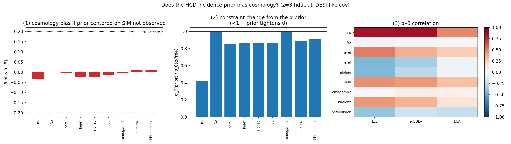
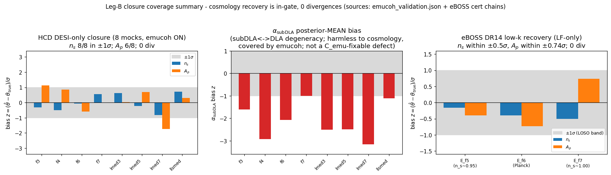

# hcd_priya — measuring cosmology from the Lyman-α forest, with the contaminants marginalised


This repository implements an end-to-end pipeline that measures two cosmological
parameters, the forest power amplitude A_p and the tilt n_s, from the
one-dimensional flux power spectrum (P1D) of the Lyman-α (Lyα) forest, while
accounting for the high-column-density (HCD) absorbers that contaminate it. It is
built on the PRIYA suite of cosmological hydrodynamic simulations.

This document describes what the project does, how to set up the two software
environments it requires, how to run the smallest useful piece, and what each
stage of the pipeline produces. Each stage is illustrated with the figure it
generates.

---

## What this is

The Lyα forest is the series of absorption lines seen blueward of a distant
quasar's Lyα emission, each produced by intergalactic hydrogen along the line of
sight. The statistics of that absorption, and in particular its one-dimensional
power spectrum P1D(k), trace the small-scale clustering of matter, which in turn
constrains the primordial power spectrum (A_p, n_s) together with the nature of
dark matter and neutrinos.

A fraction of sightlines, however, intersect dense gas systems. These are the
Lyman-limit systems (LLS), the sub-damped and damped Lyα absorbers (subDLA and
DLA), known collectively as HCDs. They imprint broad damped wings on the
spectrum and bias the measured P1D if they are not modelled. We split the three
classes by neutral-hydrogen column density N_HI (`hcd_analysis/catalog.py`):
LLS at 10^17.2–10^19, subDLA at 10^19–10^20.3, and DLA at N_HI ≥ 10^20.3 cm⁻².
The pipeline measures P1D from the PRIYA simulations, trains a fast
differentiable emulator that carries an explicit free-amplitude model of the HCD
contamination, and feeds that emulator into a gradient-based likelihood, so that
(A_p, n_s) can be inferred while marginalising over the HCD incidence. Treating
the HCDs correctly is what allows a forest P1D analysis to remain unbiased at the
sub-percent precision that DESI now delivers.

PRIYA: Bird, Fernandez, Ho et al. 2023, JCAP 10 037
([arXiv:2306.05471](https://arxiv.org/abs/2306.05471)); extended box from
Fernandez, Bird & Ho 2024, JCAP 07 029
([arXiv:2309.03943](https://arxiv.org/abs/2309.03943)).

---

## Install / environment

The repository has two halves, each with its own environment.

The first is the catalog, P1D and CDDF pipeline, the simulation-side code that
turns raw spectra into per-class P1D and absorber catalogs. It installs with:

```bash
# Great Lakes / cluster — the supported one-shot installer:
bash scripts/install_greatlakes.sh

# Generic / laptop:
conda create -n hcd_env python=3.11 -y && conda activate hcd_env
pip install -r requirements.txt
pip install -e .
```

Verify it imported:

```bash
python -c "import hcd_analysis; print(hcd_analysis.__file__)"
```

The second is the emulator and likelihood, written in JAX/Equinox. It lives in a
dedicated float64 conda environment, `emu-jax`, and must be run with the exact
environment string below. Double precision is required because several
structural identities in the model hold only to bit-level accuracy and break
under JAX's default float32:

```bash
PYTHONNOUSERSITE=1 PYTHONPATH=/home/mfho/hcd_priya JAX_PLATFORMS=cpu \
    /home/mfho/.conda/envs/emu-jax/bin/python3  <your_script.py>
```

- `PYTHONNOUSERSITE=1` keeps stray user-site packages out of the import path.
- `JAX_PLATFORMS=cpu` runs on CPU (this pipeline is CPU-only).
- `import hcd_analysis.emulator` enables x64 on import; the environment string
  above is still required so JAX picks up the right interpreter and path.

---

## Data and checkpoints

The repository ships the code, not the data or the trained models. To set
expectations before the Quickstart:

- **The raw catalogs and skewers are not distributed here.** The PRIYA τ skewers
  and the per-(sim, snap) absorber catalogs are large and live on the cluster;
  they are gitignored (`outputs/`, `*.h5`). Building them is a Great Lakes job.
- **The full τ₀ training cache is not distributed here.** The v3.3 LF cache,
  `hcd_analysis/_emulator_data/observables_tau0_lf.h5`, is 1.1 GB and gitignored.
- **The trained checkpoints are not distributed here.** A checkpoint bundle is
  only ~6 MB, but its binary leaves (`checkpoints/*.eqx`, `*.norm.pkl`,
  `*.meta.json`) are gitignored, so a usable checkpoint is not present in a fresh
  clone either.

What you actually need to run the emulator or the likelihood yourself is modest:
a trained checkpoint bundle plus at least a slice of the τ₀ cache — one LOSO fold
is enough to exercise the forward model and the likelihood on real cache rows.
You do not need the full 1.1 GB cache or a cluster for that.

A data and model release is planned but not yet available (work in progress). The
natural home for the one-fold cache slice and a checkpoint is a dedicated data
repository, which the PI (M. Ho) will create; it is deferred for now. Until then,
request the checkpoint and a cache slice from the PI (mfho@umich.edu) or open an
issue. Please do not commit any large data or model artefacts to this code
repository.

Throughout the rest of this README, each stage is marked with what it needs:
**requires the full data / Great Lakes (not in this repo)** for anything that
builds the catalogs, the full cache, or trains the emulator; and
**runnable anywhere with a checkpoint + a cache slice** for the portable pieces
(the forward-model API, reading the data structure).

---

## Quickstart

**Runnable anywhere with a checkpoint + a cache slice** (one LOSO fold of the
cache is sufficient; see [Data and checkpoints](#data-and-checkpoints)). It does
not require the full 1.1 GB cache or a cluster, but it does need the trained
checkpoint and at least the one cache row it reads, neither of which is in the
repository.

The smallest end-to-end example loads the trained emulator and calls the forward
model to predict a contaminated P1D. Run it with the `emu-jax` environment string
given above.

```python
import hcd_analysis.emulator                       # enables JAX float64 on import
import jax.numpy as jnp
from hcd_analysis.emulator import train as T
from hcd_analysis.emulator.data import load_cache
from hcd_analysis.emulator.predict import predict_P_obs, predict_P_filt

# 1. load a trained emulator checkpoint (the canonical stand-in default)
model, meta, norm = T.load_checkpoint("checkpoints/final_fold0")
pf = norm["P_filt"]                                 # structured P_filt norm dict

# 2. grab one example input row from the training cache
d   = load_cache("hcd_analysis/_emulator_data/observables_tau0_lf.h5")
row = 0
theta9   = jnp.asarray(d["params_unit"][row])       # (9,) cosmology+astro, UNIT cube
z_unit   = float(d["x"][row, 9])                    # (z - 2.0) / 3.4
tau0     = float(d["tau0"][row])                    # mean-flux optical depth = -ln(<F>)
alpha    = jnp.asarray(d["w_c_cache"][row, 1:])     # (3,) HCD incidence: LLS, subDLA, DLA
dla_core = jnp.asarray(d["delta"][row, 2])          # (K,) DLA-core add-back

# 3. predict
P_filt = predict_P_filt(model, theta9, z_unit, tau0, pf)                  # (4,K) per class
P_obs  = predict_P_obs(model, theta9, z_unit, tau0, alpha, pf, dla_core)  # (K,)  total, contaminated
print(P_obs.shape)
```

Every input to the emulator is mapped onto the unit cube `[0,1]`. The full input
contract, including parameter order, the z and τ₀ maps, and how to construct your
own inputs, is given in the emulator README linked below.

---

## HCD catalog construction (quickstart)

**Requires the full data / Great Lakes (not in this repo).** This step reads the
raw PRIYA τ skewers, which are large and not distributed here; it is a cluster
job. The structure of the products it describes can still be read for reference.

The HCD catalog is the foundation the rest of the pipeline rests on: it records,
for every PRIYA simulation and redshift, which sightlines intersect a dense
absorber and how much neutral hydrogen that absorber carries. From the catalog we
derive the column-density distribution function and the per-class P1D, and those
products are what the emulator is ultimately trained on.

The catalog is built directly from the optical-depth (τ) skewers produced by
`fake_spectra`. For each sightline, `hcd_analysis/catalog.py` locates connected
velocity regions where τ exceeds a detection threshold, merges regions separated
by less than a velocity gap, and estimates the column density N_HI of each system.
In production the column density is obtained by the sum-rule inversion (the fast
estimator, `absorber.fast_mode: true` in the config); a full Voigt fit with a
±2000 km/s wing window is available as an alternative. Each system is then placed
into one of three classes by its N_HI, with everything below the LLS threshold
discarded as forest:

- LLS:    10^17.2 ≤ N_HI < 10^19.0 cm⁻²
- subDLA: 10^19.0 ≤ N_HI < 10^20.3 cm⁻²
- DLA:    N_HI ≥ 10^20.3 cm⁻²

These boundaries are defined in `hcd_analysis/catalog.py` (`classify_system`), and
the detection and measurement parameters (τ threshold, merge gap, the N_HI floor)
live under `absorber:` in `config/default.yaml`.

Build the catalog as part of the per-simulation pipeline (`hcd_env`):

```bash
hcd run-sim --sim ns0.803Ap2.2e-09 --config config/default.yaml   # one sim, all snaps
hcd run-all --n-workers 36                                         # full 60-sim LF campaign
```

On Great Lakes the full campaign runs as a SLURM array, one task per simulation:

```bash
sbatch --array=0-59 scripts/batch_greatlakes.sh run-one-array
```

The input is the τ skewer HDF5 for each (sim, snap), read alongside the
`SimulationICs.json` that records the simulation's cosmology. The output is one
`catalog.npz` per (sim, snap) under `outputs/{sim}/snap_{NNN}/`, holding, for
every detected absorber, its sightline index, pixel range, N_HI, Doppler
parameter and class. The same run also writes the per-class P1D (`p1d.npz`) and
the per-snapshot CDDF (`cddf.npz`), which `cddf.py` stacks per redshift bin into
`cddf_stacked.npz`. Those per-class P1D and CDDF products, resampled across the
mean-flux ladder, are what `scripts/build_emulator_cache_tau0.py` assembles into
the τ₀ training cache described in Stage 1.

---

## The pipeline, stage by stage

The pipeline has four stages, described in order. Each stage notes the product it
yields, shows the figure it produces, and gives the command that generated or
exercises it. The emulator environment string is abbreviated to `<emu-env>`
below; expand it to the full string from
[Install / environment](#install--environment).

### Stage 1 — the simulation P1D, absorber catalog and τ₀ cache

**Requires the full data / Great Lakes (not in this repo).** This stage reads the
raw PRIYA spectra and builds the 1.1 GB τ₀ cache; neither the inputs nor the
assembled cache is distributed here (both are gitignored).

The first stage turns raw PRIYA spectra into the products everything downstream
depends on: the per-sightline P1D, the absorber catalog (which sightlines
intersect an LLS, subDLA or DLA, as described in the section above), the
column-density distribution function CDDF = f(N_HI, X), and the per-class P1D
split between the clean forest and each HCD class. We resample these measurements
across a ladder of mean-flux rescalings to form the τ₀ cache that trains the
emulator. Here τ₀ is the mean-flux optical depth, τ₀ = −ln⟨F⟩; scanning it on a
ladder lets the emulator learn the mean-flux dependence directly.

This stage yields an absorber catalog, the per-class P1D and a CDDF for each
(sim, z), along with the assembled τ₀ training cache. The figure below compares
PRIYA's CDDF with the Ho et al. 2021 observations, a check that the simulated HCD
population is realistic.


Run it (catalog/P1D side, `hcd_env`):

```bash
hcd run-sim --sim ns0.803Ap2.2e-09 --config config/default.yaml   # one sim, all snaps
hcd run-all --n-workers 36                                         # full campaign
```

Build the τ₀ cache for the emulator:

```bash
<emu-env> scripts/build_emulator_cache_tau0.py     # -> hcd_analysis/_emulator_data/observables_tau0_lf.h5
```

### Stage 2 — the HCD-marginalised emulator

**Training requires the full data / Great Lakes (not in this repo)** — the LOSO
sweep needs the full τ₀ cache. **Using a trained emulator is runnable anywhere
with a checkpoint + a cache slice** (the [Quickstart](#quickstart) above and the
emulator README's forward-model API), once a checkpoint and at least one cache
row are obtained from the PI.

A differentiable JAX/Equinox network learns the per-class P1D as a smooth
function of the cosmology θ, the redshift z and τ₀. The central design choice is
that the HCD contamination enters as a free per-class amplitude on top of the
clean forest, so that the inference can marginalise over the HCD incidence rather
than assuming the simulation reproduced it exactly. We validate the emulator with
leave-one-simulation-out (LOSO) cross-validation: for each fold we train on all
simulations but one and test on the held-out simulation, which is how we estimate
the emulator's own error budget.

This stage yields a fast, autodifferentiable forward model
`P_obs(θ, z, τ₀, α_HCD)` whose held-out per-fold cosmology bias sits well inside
the ±0.2σ inference gate. The figure below shows the per-fold A_p and n_s Fisher
bias across all eight LOSO folds. By Fisher bias we mean the emulator residual
projected onto the directions the data actually constrain (the Fisher-information
eigendirections) and read off as a cosmology shift in units of σ along those
directions; this is the cosmology-relevant bias rather than a raw spectral error.


Train it (the 8-fold LOSO sweep; `--smoke` for a fast shape check):

```bash
<emu-env> scripts/run_loso_sweep.py --out checkpoints/final --histdir checkpoints
```

The emulator has its own detailed README, covering the architecture, the τ₀
ladder, the forward model, the conventions and the input contract. It is the
reference for anything emulator-specific:
[`hcd_analysis/emulator/README.md`](hcd_analysis/emulator/README.md).

### Stage 3 — the differentiable likelihood

**Runnable anywhere with a checkpoint + a cache slice.** The likelihood is a pure
Python/JAX API that runs on top of a loaded checkpoint; it needs the DESI/KS data
bindings and a cache slice but not the full cache or a cluster.

The emulator's `P_obs` is wired into a Gaussian log-likelihood that compares the
prediction to the data (the DESI DR1 and KODIAQ-SQUAD P1D) through an
emulator-error covariance and physically motivated priors. The HCD incidence
prior is centred on the observed dN/dX rather than the simulation's, and it is
constructed so that an incorrect prior centre does not propagate into the
cosmology.

This stage yields a fully differentiable `log_posterior` suitable for a gradient
sampler, together with the HCD-incidence prior. The figure below verifies that
the HCD incidence prior does not bias the cosmology: the θ bias from a
mis-centred prior stays inside the 0.2σ gate, and the prior tightens θ rather
than shifting it.



The likelihood is a Python API rather than a one-shot script. The snippet below
shows the import only; it does not produce output on its own, and the full call
signature is given in the emulator README §8 and §5:

```python
from hcd_analysis.emulator.inference import log_lik_multiz, hcd_incidence_prior
# illustrative import only — full call signature in the emulator README §8 / §5
```

### Stage 4 — inference and closure

**Requires a checkpoint + a cache slice (not in this repo); not a cluster.** A
short closure or eBOSS chain runs on CPU once a checkpoint and a cache slice are
in place; the production all-sims ensemble is heavier and was run on the cluster.

The final stage samples the posterior with NUTS, the No-U-Turn Sampler, a
gradient-based MCMC method that exploits the differentiable likelihood, and
validates the pipeline with closure tests: we fit mock data drawn from a known
truth and confirm that it is recovered within the stated error bars. Closure on
mocks and on public archival data (eBOSS DR14, KODIAQ-SQUAD) may be committed;
the DESI cosmology result itself remains local and blinded.

This stage yields posterior constraints on (A_p, n_s) and a closure verdict: how
many of the held-out mocks recover the truth within ±1σ, with no sampler
divergences. The figure below is the Leg-B closure coverage summary, combining
the HCD mock closure, the subDLA degeneracy diagnostic and the eBOSS DR14 low-k
recovery.



*This is the Leg-B / closure coverage headline (the production-readiness summary
panel). It is distinct from the per-mock closure-coverage detail shown in the
emulator README's Demo A, even though the filenames are similar.*

What these closures do and do not certify is worth stating plainly. They validate
the architecture, that is the forward model, the covariance and the sampler, that
the production all-sims N=5 ensemble inherits. The ensemble-level production SBC
(rank-based simulation-based calibration on the production ensemble itself) is the
final inference-calibration gate, and it remains pending before the real fit (see
notes `2026-06-14-validation-likelihood-production.md` §6).

The SBC / closure machinery (PIT-ECDF bands, coverage, whitening tests) lives in
`hcd_analysis/emulator/closure_diagnostics.py`; the validation writeups are in
the notes repo (see below).

---

## Where to go next

- The emulator deep-dive covers the architecture, the τ₀ cache, the training
  recipe, the forward model, the input contract and the conventions:
  [`hcd_analysis/emulator/README.md`](hcd_analysis/emulator/README.md).
- The tutorials are five short notebooks that introduce the per-(sim, snap) HCD
  data products from the ground up, with a recommended reading order:
  [`notebooks/tutorials/README.md`](notebooks/tutorials/README.md).
- The science walkthrough and the record of bugs found on the catalog/P1D side
  are in [`docs/analysis.md`](docs/analysis.md),
  [`docs/bugs_found.md`](docs/bugs_found.md),
  [`docs/data_layout.md`](docs/data_layout.md) and
  [`docs/p1d_definition.md`](docs/p1d_definition.md).
- The validation results (held-out LOSO error, coverage, the closure gates and
  the Fisher checks) are kept in the private notes repository, indexed from
  `hcd_priya_notes/docs/superpowers/INDEX.md`. Begin with
  `docs/superpowers/2026-06-14-validation-loso-emulator-lf-mf.md` for the emulator
  validation and `docs/superpowers/2026-06-14-validation-likelihood-production.md`
  for the likelihood and closure.

---

## Tests / status

The catalog/P1D test suite locks the post-audit science claims: the τ sum rule,
N_HI recovery, Voigt normalisation, the absorption-distance formula, the Rogers
HCD template, the LF/HR z-matching and an end-to-end pipeline regression. Run it
with:

```bash
for t in tests/test_*.py; do python3 "$t"; done
```

Status (2026-06-14): the catalog/P1D pipeline is merged and audited, with the
PRIYA CDDF tracking Prochaska et al. 2014 to within 0.1–0.3 dex. The Phase-2
emulator (the τ₀ cache and the Equinox emulator, validated over eight LOSO folds)
is merged to `main`. The current branch `phase2c-likelihood` carries the
differentiable likelihood and the inference and closure work; these closures
validate the architecture that the production N=5 ensemble inherits, but the
ensemble-level production SBC is the final inference-calibration gate and remains
pending before the real fit. See `docs/SESSION_HANDOVER_2026_06_05.md` for the
live process-level state.

---

## Repository map

```
hcd_analysis/            catalog/P1D/CDDF pipeline (catalog.py, p1d.py, cddf.py, hcd_template.py, ...)
hcd_analysis/emulator/   the JAX/Equinox emulator + likelihood + inference (see its own README)
cli/run.py               the `hcd` command-line entry point
config/default.yaml      default pipeline config
scripts/                 install, SLURM batch, cache build, LOSO sweep, plotting
notebooks/tutorials/     five starter notebooks for new students
tests/                   science-claim regression tests
docs/                    analysis.md, bugs_found.md, data_layout.md, handover, ...
figures/analysis/        all analysis + validation figures
checkpoints/             trained emulator bundles (final_fold0.*) + error_vector.npz — gitignored, not in this repo (see Data and checkpoints)
hcd_analysis/_emulator_data/  the 1.1 GB τ₀ cache — gitignored, not in this repo (see Data and checkpoints)
```
