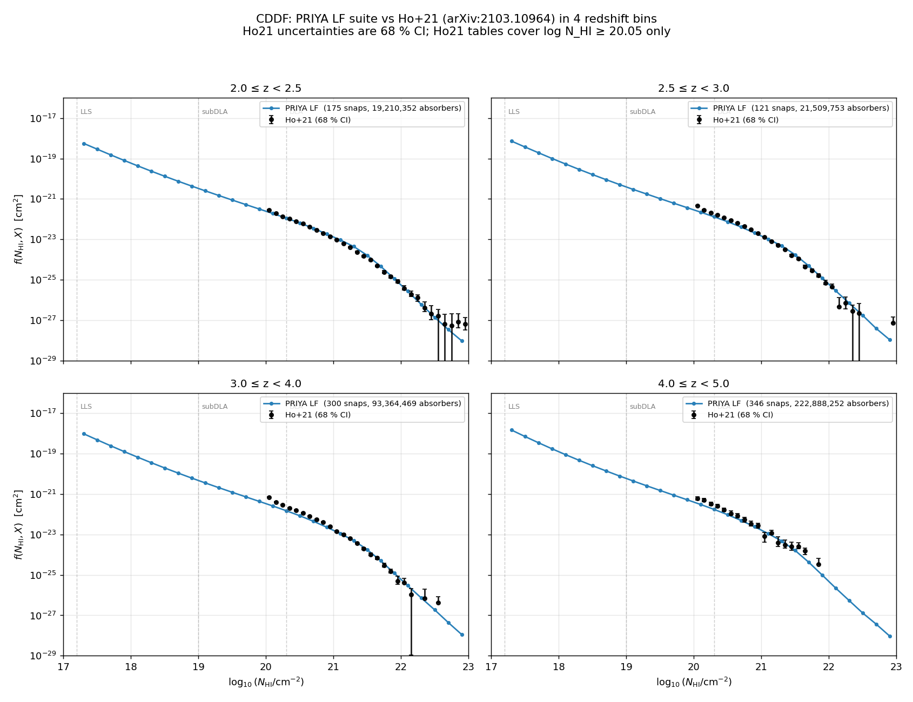
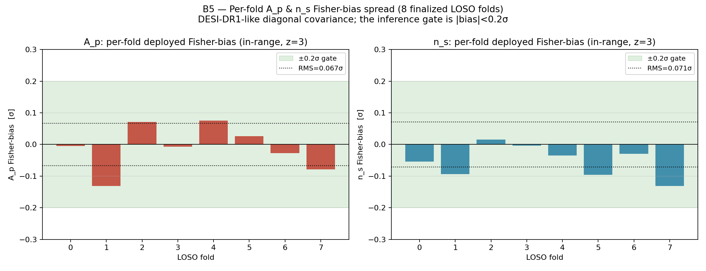
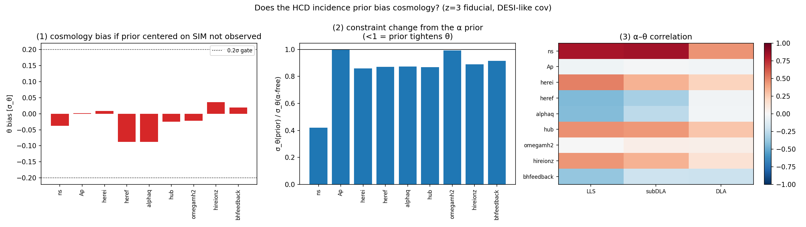

# hcd_priya — measuring cosmology from the Lyman-α forest, with the contaminants marginalized


Welcome. This repository is an end-to-end pipeline that measures two cosmological
parameters — the forest power amplitude **A_p** and tilt **n_s** — from the **1D
flux power spectrum (P1D)** of the **Lyman-α (Lyα) forest**, while honestly
accounting for the **high-column-density (HCD) absorbers** that contaminate it.
It is built on the **PRIYA** cosmological hydrodynamic simulation suite (our
group's simulation suite).

If you are a new grad student, this README is your front door: it tells you what
the project is, how to set up the environment, how to run the smallest useful
thing, and what each stage of the pipeline does (with a picture). Read it top to
bottom and you will know where everything lives.

---

## What this is

The Lyα forest is the dense thicket of absorption lines blueward of a distant
quasar's Lyα emission — each line is intergalactic hydrogen gas absorbing the
quasar's light. The *statistics* of that absorption (specifically its 1D power
spectrum along the line of sight, **P1D(k)**) are an exquisite ruler for the
small-scale clustering of matter, which in turn pins down the primordial power
spectrum (A_p, n_s) and the nature of dark matter and neutrinos.

The catch: a fraction of sightlines pass through dense gas clouds — Lyman-limit
systems (LLS), sub-damped and damped Lyα absorbers (subDLA, DLA), collectively
**HCDs** — that imprint broad damped wings on the spectrum and *bias* the
measured P1D if you ignore them. The three classes are split by neutral-hydrogen
column density N_HI (`hcd_analysis/catalog.py`): **LLS** 10^17.2–10^19, **subDLA**
10^19–10^20.3, **DLA** ≥ 10^20.3 cm⁻². This pipeline measures P1D from the **PRIYA**
simulations, builds a fast differentiable **emulator** of it that carries an
explicit, free-amplitude HCD contamination model, and feeds that into a
gradient-based likelihood so you can infer (A_p, n_s) while **marginalizing**
over how many HCDs there are. Getting the HCD treatment right is what lets a
forest P1D analysis stay unbiased at the sub-percent precision that DESI now
delivers — which is why it matters.

PRIYA: Bird, Fernandez, Ho et al. 2023, JCAP 10 037
([arXiv:2306.05471](https://arxiv.org/abs/2306.05471)); extended box from
Fernandez, Bird & Ho 2024, JCAP 07 029
([arXiv:2309.03943](https://arxiv.org/abs/2309.03943)).

---

## Install / environment

There are two halves to this repo, with two environments.

**(A) The catalog / P1D / CDDF pipeline** (the simulation-side code that turns
raw spectra into per-class P1D and absorber catalogs). Standard install:

```bash
# Great Lakes / cluster — the supported one-shot installer:
bash scripts/install_greatlakes.sh

# Generic / laptop:
conda create -n hcd_env python=3.11 -y && conda activate hcd_env
pip install -r requirements.txt
pip install -e .
```

Verify it imported:

```bash
python -c "import hcd_analysis; print(hcd_analysis.__file__)"
```

**(B) The emulator + likelihood** (the JAX/Equinox machine-learning side). This
lives in its own float64 conda env, `emu-jax`. **The emulator is float64 and you
must always run it with this exact environment string** — x64 is mandatory
because the structural identities in the model are bit-level and silently break
under JAX's default float32:

```bash
PYTHONNOUSERSITE=1 PYTHONPATH=/home/mfho/hcd_priya JAX_PLATFORMS=cpu \
    /home/mfho/.conda/envs/emu-jax/bin/python3  <your_script.py>
```

- `PYTHONNOUSERSITE=1` keeps stray user-site packages out of the import path.
- `JAX_PLATFORMS=cpu` runs on CPU (this pipeline is CPU-only).
- `import hcd_analysis.emulator` flips on x64 for you, but you still need the env
  string above so JAX picks up the right interpreter and path.

---

## Quickstart

The smallest end-to-end thing: load the trained emulator and call the forward
model to predict a contaminated P1D. Run it with the **emu-jax** env string from
above.

```python
import hcd_analysis.emulator                       # enables JAX float64 on import
import jax.numpy as jnp
from hcd_analysis.emulator import train as T
from hcd_analysis.emulator.data import load_cache
from hcd_analysis.emulator.predict import predict_P_obs, predict_P_filt

# 1. load a trained emulator checkpoint (the canonical stand-in default)
model, meta, norm = T.load_checkpoint("checkpoints/final_fold0")
pf = norm["P_filt"]                                 # structured P_filt norm dict

# 2. grab one example input row from the training cache
d   = load_cache("hcd_analysis/_emulator_data/observables_tau0_lf.h5")
row = 0
theta9   = jnp.asarray(d["params_unit"][row])       # (9,) cosmology+astro, UNIT cube
z_unit   = float(d["x"][row, 9])                    # (z - 2.0) / 3.4
tau0     = float(d["tau0"][row])                    # mean-flux optical depth = -ln(<F>)
alpha    = jnp.asarray(d["w_c_cache"][row, 1:])     # (3,) HCD incidence: LLS, subDLA, DLA
dla_core = jnp.asarray(d["delta"][row, 2])          # (K,) DLA-core add-back

# 3. predict
P_filt = predict_P_filt(model, theta9, z_unit, tau0, pf)                  # (4,K) per class
P_obs  = predict_P_obs(model, theta9, z_unit, tau0, alpha, pf, dla_core)  # (K,)  total, contaminated
print(P_obs.shape)
```

Everything fed to the emulator is on the **unit cube** `[0,1]`. The full input
contract (parameter order, the z and τ₀ maps, how to build your own inputs) is in
the emulator README, linked below.

---

## The pipeline at a glance

Four stages, in order. Each one has a "what you get" line, an inline demo
figure, and the command that produced (or exercises) it. The emulator env string
is abbreviated to `<emu-env>` below — expand it to the full string from
[Install / environment](#install--environment).

### Stage 1 — the simulation P1D + absorber catalog (and the τ₀ cache)

First we turn raw PRIYA spectra into the products everything downstream needs:
per-sightline P1D, an absorber catalog (which sightlines hit an LLS / subDLA /
DLA), the column-density distribution function **CDDF** = f(N_HI, X), and the
**per-class P1D** split (clean forest vs. each HCD class). Those measurements,
re-sampled across a ladder of mean-flux rescalings, become the **τ₀ cache** that
trains the emulator. **τ₀** is the mean-flux optical depth, τ₀ = −ln⟨F⟩; we
scan it on a ladder so the emulator learns the mean-flux dependence directly.

**What you get:** an absorber catalog + per-class P1D + a CDDF per (sim, z), and
the assembled τ₀ training cache. Below: PRIYA's CDDF compared to the Ho et al.
2021 observations — a sanity check that the simulated HCD population is realistic.



Run it (catalog/P1D side, `hcd_env`):

```bash
hcd run-sim --sim ns0.803Ap2.2e-09 --config config/default.yaml   # one sim, all snaps
hcd run-all --n-workers 36                                         # full campaign
```

Build the τ₀ cache for the emulator:

```bash
<emu-env> scripts/build_emulator_cache_tau0.py     # -> hcd_analysis/_emulator_data/observables_tau0_lf.h5
```

### Stage 2 — the HCD-marginalized emulator

A differentiable JAX/Equinox network learns the per-class P1D as a smooth
function of cosmology θ, redshift z, and τ₀. The key design choice is that the
HCD contamination enters as a **free per-class amplitude** on top of the clean
forest, so the inference can marginalize over "how many HCDs" rather than
assuming the simulation got the count exactly right. The emulator is validated
with **LOSO** (leave-one-simulation-out: train on all sims but one, test on the
held-out sim — this is how we estimate the emulator's own error budget).

**What you get:** a fast, autodiff forward model `P_obs(θ, z, τ₀, α_HCD)` whose
held-out per-fold cosmology bias sits comfortably inside the ±0.2σ inference
gate. Below: the per-fold A_p and n_s **Fisher-bias** across all 8 LOSO folds.
("Fisher direction/bias" means we project the emulator's residual onto the
directions the data actually constrain — the Fisher-information eigendirections —
and read off the cosmology shift, in σ, along those directions; it is the
cosmology-relevant bias, not a raw spectral error.)



Train it (the 8-fold LOSO sweep; `--smoke` for a fast shape check):

```bash
<emu-env> scripts/run_loso_sweep.py --out checkpoints/final --histdir checkpoints
```

The emulator has its own detailed README — architecture, the τ₀ ladder, the
forward model, conventions, the input contract. **Start there for anything
emulator-specific:** [`hcd_analysis/emulator/README.md`](hcd_analysis/emulator/README.md).

### Stage 3 — the differentiable likelihood

The emulator's `P_obs` is wired into a Gaussian log-likelihood that compares
prediction to data (the DESI DR1 and KODIAQ-SQUAD P1D), with an emulator-error
covariance and physically-motivated priors. The HCD incidence prior is centered
on the **observed** dN/dX (not the simulation's), and it is built so a wrong
prior center does not leak into cosmology.

**What you get:** a fully differentiable `log_posterior` you can hand to a
gradient sampler, plus the HCD-incidence prior. Below: the check that the HCD
incidence prior does not bias cosmology — the θ-bias from a mis-centered prior
stays inside the 0.2σ gate, and the prior tightens θ rather than shifting it.



Exercise the likelihood (it is a Python API, not a one-shot script). The snippet
below is **illustrative import only — it will not produce output as-is; the full
call signature is in the emulator README §8 / §5**:

```python
from hcd_analysis.emulator.inference import log_lik_multiz, hcd_incidence_prior
# illustrative import only — full call signature in the emulator README §8 / §5
```

### Stage 4 — inference and closure

Finally we sample the posterior with **NUTS** (the No-U-Turn Sampler, a
gradient-based MCMC method that exploits the differentiable likelihood) and check
the whole pipeline with **closure tests**: fit mock data drawn from a known
truth and confirm we recover it within the stated error bars. Closure on mocks
and on public archival data (eBOSS DR14, KODIAQ-SQUAD) is committable; the real
DESI cosmology headline stays local and blinded.

**What you get:** posterior constraints on (A_p, n_s) plus a closure verdict —
how many of the held-out mocks recover truth inside ±1σ, with zero sampler
divergences. Below: the Leg-B closure coverage summary (HCD mock closure, the
subDLA degeneracy diagnostic, and eBOSS DR14 low-k recovery).


*This is the **Leg-B / closure coverage headline** (the production-readiness summary
panel). It is distinct from the per-mock closure-coverage detail shown in the
emulator README's Demo A, even though the filenames are similar.*

**What these closures do and do not certify.** The closures above validate the
**architecture** — the forward model + covariance + sampler — that the production
all-sims **N=5 ensemble** inherits. The **ensemble-level production SBC** (rank-based
Simulation-Based Calibration on the production ensemble itself) is the final
inference-calibration gate, and it is **still PENDING** before the real fit (see
notes `2026-06-14-validation-likelihood-production.md` §6).

The SBC / closure machinery (PIT-ECDF bands, coverage, whitening tests) lives in
`hcd_analysis/emulator/closure_diagnostics.py`; the validation writeups are in
the notes repo (see below).

---

## Where to go next

- **Emulator deep-dive** — architecture, the τ₀ cache, training recipe, forward
  model, the input contract, conventions and gotchas:
  [`hcd_analysis/emulator/README.md`](hcd_analysis/emulator/README.md).
- **Tutorials** — five short notebooks that walk a new student through the
  per-(sim, snap) HCD data products from the ground up, with a recommended
  reading order: [`notebooks/tutorials/README.md`](notebooks/tutorials/README.md).
- **Science walkthrough + bug forensics** for the catalog/P1D side:
  [`docs/analysis.md`](docs/analysis.md), [`docs/bugs_found.md`](docs/bugs_found.md),
  [`docs/data_layout.md`](docs/data_layout.md), [`docs/p1d_definition.md`](docs/p1d_definition.md).
- **Validation results** (held-out LOSO error, coverage, the closure gates,
  Fisher checks) live in the private notes repo, indexed from
  `hcd_priya_notes/docs/superpowers/INDEX.md`. Start with
  `docs/superpowers/2026-06-14-validation-loso-emulator-lf-mf.md` (emulator
  validation) and `docs/superpowers/2026-06-14-validation-likelihood-production.md`
  (likelihood/closure).

---

## Tests / status

Run the catalog/P1D test suite (locks the post-audit science claims — τ sum rule,
N_HI recovery, Voigt normalization, absorption-distance formula, the Rogers HCD
template, LF/HR z-matching, and an end-to-end pipeline regression):

```bash
for t in tests/test_*.py; do python3 "$t"; done
```

**Status (2026-06-14):** the catalog/P1D pipeline is merged and audited (PRIYA
CDDF tracks Prochaska+14 within 0.1–0.3 dex). The Phase-2 emulator (τ₀ cache +
Equinox emulator, 8-fold LOSO validated) is merged to `main`. The current branch
`phase2c-likelihood` carries the differentiable likelihood and the
inference/closure work; these closures validate the **architecture** the
production N=5 ensemble inherits, but the **ensemble-level production SBC is the
final inference-calibration gate and is still PENDING** before the real fit. See
`docs/SESSION_HANDOVER_2026_06_05.md` for live process-level state.

---

## Repository map

```
hcd_analysis/            catalog/P1D/CDDF pipeline (catalog.py, p1d.py, cddf.py, hcd_template.py, ...)
hcd_analysis/emulator/   the JAX/Equinox emulator + likelihood + inference (see its own README)
cli/run.py               the `hcd` command-line entry point
config/default.yaml      default pipeline config
scripts/                 install, SLURM batch, cache build, LOSO sweep, plotting
notebooks/tutorials/     five starter notebooks for new students
tests/                   science-claim regression tests
docs/                    analysis.md, bugs_found.md, data_layout.md, handover, ...
figures/analysis/        all analysis + validation figures
checkpoints/             trained emulator bundles (final_fold0.*) + error_vector.npz
```
