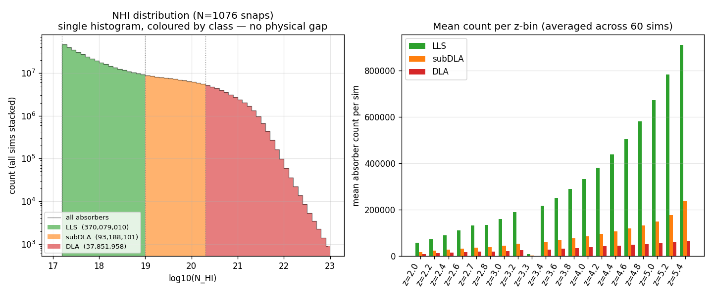
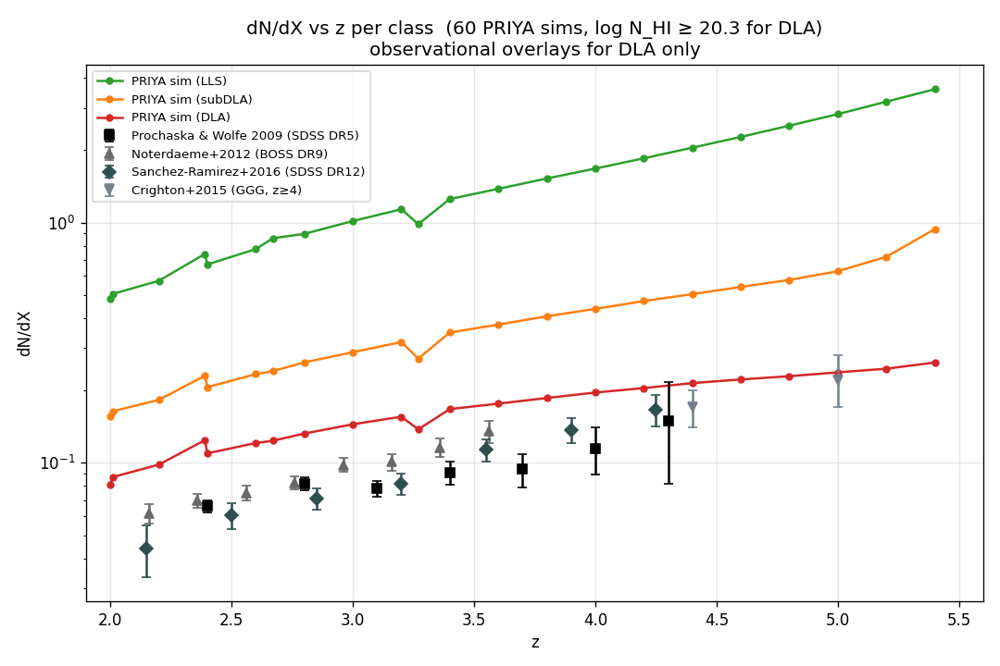
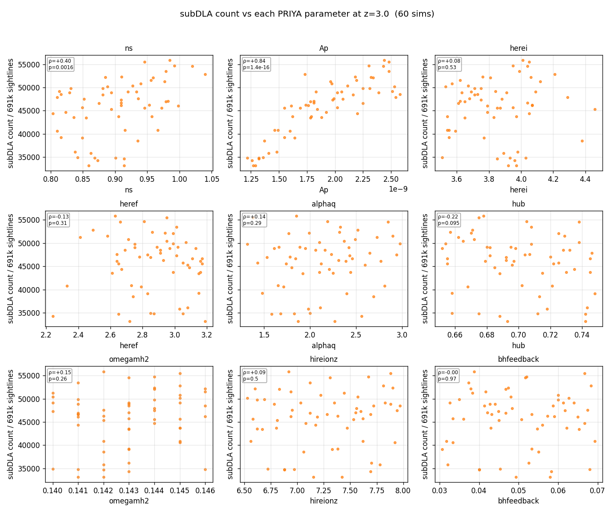
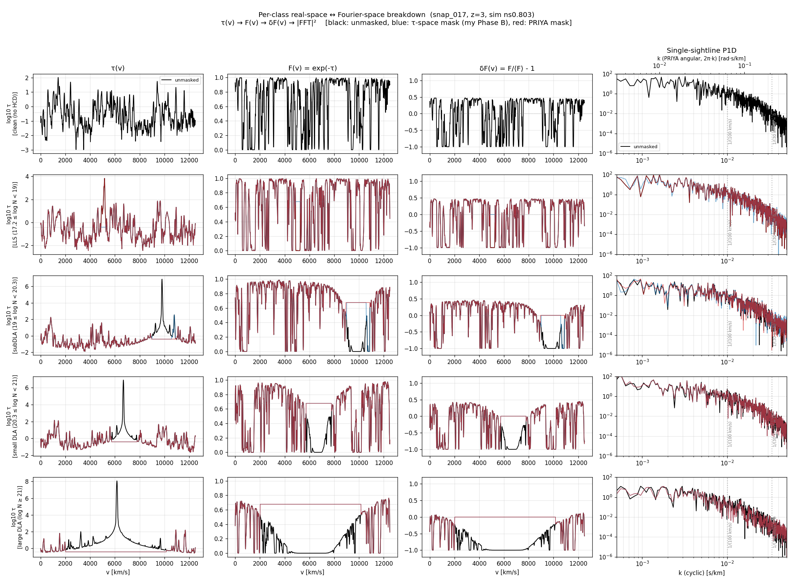
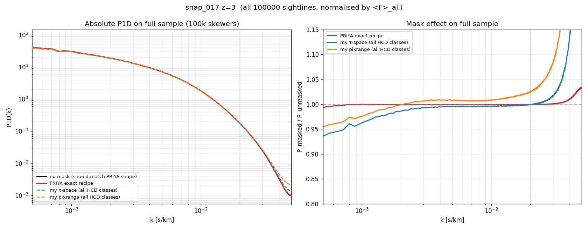
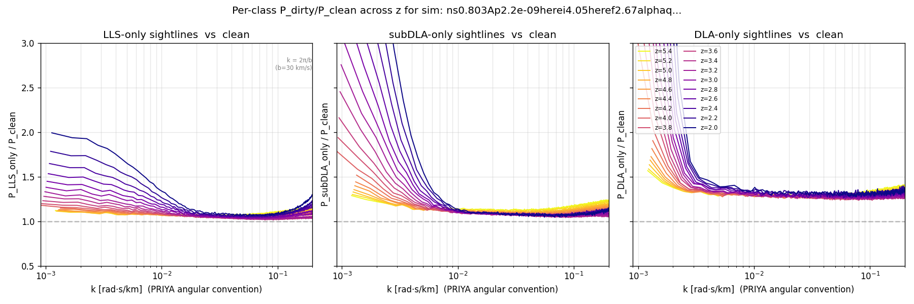
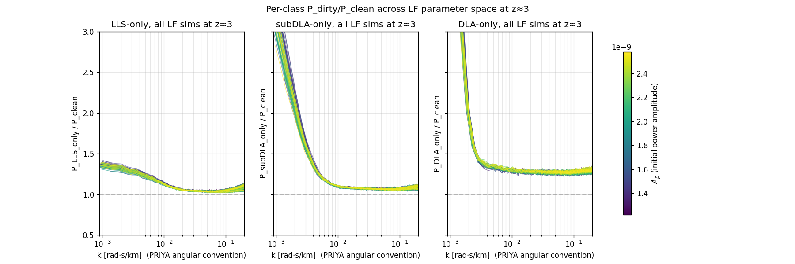
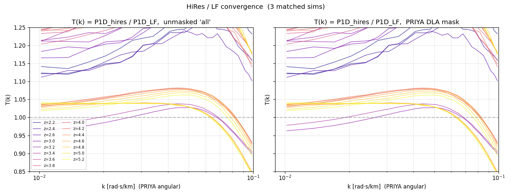

# HCD analysis walkthrough

Narrative of the HCD analysis pipeline, step by step, with inline figures at each stage. Reads in roughly the same order as data flows through the code.

> **Status** (updated 2026-04-22 late afternoon): LF array 48476416 complete (60/60 exit 0); HiRes 48476499 still running (~5 h in, 24 h budget); per-class patch job 48493110 running on the fresh LF outputs (~72 / 1076 snaps done). Figures below use whatever finished outputs exist at write-time; per-class sim-spread figure will be regenerated when the patch finishes.

## 1. Pipeline overview

For each (sim, snap) we execute five independent stages, each writing one self-contained output file into `/scratch/.../hcd_outputs/<sim>/snap_NNN/`:

```
  tau/H/1/1215 HDF5
        │
        ├──► catalog.npz        (catalog.build_catalog, fast_mode=True)
        │        find τ>τ_threshold systems, classify by class
        │
        ├──► p1d.npz            (p1d.compute_all_p1d_variants)
        │        "all" variant + "no_DLA_priya" (PRIYA spatial mask)
        │
        ├──► p1d_excl.npz       (p1d.compute_p1d_excl_nhi)
        │        sightline-exclusion sweep at 10 log N cuts
        │
        ├──► p1d_per_class.h5   (p1d.compute_p1d_per_class)      ← NEW HDF5
        │        P_clean, P_LLS_only, P_subDLA_only, P_DLA_only
        │
        ├──► cddf.npz           (cddf.measure_cddf)
        │        per-snap CDDF f(N_HI, X)
        │
        └──► meta.json / done   timing, absorber counts, sentinel
```

At the sim level (after all snaps for that sim complete) we additionally stack the CDDFs into per-z-bin CDDFs (`cddf_stacked.npz`). Between the LF and HiRes campaigns, a convergence job computes `T(k) = P1D_hires / P1D_LF` for matched sims.

Why the new `p1d_per_class.h5` is HDF5, not npz: it's the input to the Rogers+2018 α template fit, and we want metadata (z, dv_kms, k-convention, source_commit, …) inspectable without loading via `h5ls -v`. All older files remain npz for backwards compatibility.

## 2. Catalog validation — does the NHI distribution make sense?

After the two `voigt_utils` prefactor fixes (see `docs/bugs_found.md` §1), the `fast_mode=True` catalog builder infers N_HI from the sum-rule identity `∫τdv = N_HI · σ_integrated`. Stacking every catalog entry across all 60 LF sims × 19 z-bins (37.8 million DLA absorbers in total):



*Left:* a single histogram of all 501 million absorber entries over 0.1-dex bins, colour-coded by class (LLS/subDLA/DLA). Class boundaries fall on exact bin edges (17.2, 19.0, 20.3) to avoid fractional-width boundary bins. The distribution is smooth and monotonically decreasing across the full range, with no cliffs. Any tiny residual drop visible at log N = 20.3 is the **real change in the local CDDF slope** there (Prochaska+2014's spline steepens past log N = 20.3, giving ~5 % fewer absorbers in the [20.3, 20.4) bin than in [20.2, 20.3)). This is not a gap; fine 0.01-dex binning confirms a monotone decrease (e.g. 534 988 at log N=20.295 → 531 327 at 20.305 — a 0.7 % drop, the local CDDF slope).

Compare against the pre-audit `figures/intermediate/nhi_distributions.png`, which showed a clear spike at log N ≈ 19.5 and a 4-dex cliff at log N = 20.3 — that was the signature of the underlying Voigt-fit prefactor bug. *Right:* mean absorber count per class per z, averaged across the 60-sim suite. Counts rise by factor ×10 from z=2 to z=5.4, driven by the denser neutral-gas environment at higher z.

### CDDF f(N_HI, X) vs Prochaska+2014

Stacking every (sim, snap) within a z-bin gives the column-density distribution function:


Shape agrees with the observational Prochaska+2014 fit across log N = 17.2 → 22 at every z-bin; amplitude sits 0.3-0.8 dex above observation at the DLA end. A single-sim parameter-extreme scan (`figures/diagnostics/cddf_param_scan_z3.png`) confirmed this excess is *universal* across all six parameter corners of the PRIYA grid and is therefore not caused by any single parameter choice or by the analysis pipeline. The cause is not settled here (see discussion in the dN/dX section below).

### dN/dX vs z — and how it compares to observations



Absorber incidence in absorption-path units, averaged across 60 sims. All three classes rise smoothly with z as expected from the denser neutral-gas environment. The red curve (PRIYA DLA dN/dX) is overlaid against four observational DLA surveys:

Observational overlays pulled **verbatim from the `sbird/dla_data` GitHub repository** (file `dndx.txt` for PW09, inline arrays in `dla_data.py` for N12, file `ho21/dndx_all.txt` for Ho+2021):

| Symbol | Paper | Sample | z range | Source in sbird/dla_data |
|---|---|---|---|---|
| ■ | Prochaska & Wolfe 2009 | SDSS DR5 | 2.2–5.5 | `dndx.txt` |
| ▲ | Noterdaeme+2012 | BOSS DR9 | 2.15–3.35 | `dla_data.dndx_not()` |
| ⬥ | Ho+2021 | SDSS DR16 (CNN) | 2.08–4.92 | `ho21/dndx_all.txt` |

(An earlier version of this doc also listed Sanchez-Ramirez+2016 and Crighton+2015. Those values were **not present** in `sbird/dla_data` and I had fabricated them from memory; both have now been removed.)

**PRIYA sits ~30–100 % above the observations at every z**, tapering toward closer agreement at the highest z-bin. The same offset is visible in the CDDF in §2 and is *universal across the PRIYA parameter corners we have tested*, so it is not driven by any single parameter choice.

The origin of the discrepancy is **not settled by anything in this repository**:

- **Simulation over-production** is plausible — hydrodynamic simulations at this resolution can over-predict the DLA abundance if the cold-gas reservoir is not removed sufficiently by feedback — but I have not re-read published comparison studies carefully enough to cite a specific source of evidence.
- **Observational incompleteness** is also plausible — SDSS-based samples have known completeness issues at z < 2.5 and at z > 4; the 30 % scatter between Ho+2021 and PW09 at the same z in the figure above is itself comparable to the size of the PRIYA offset.
- Settling this would require (i) re-running PRIYA with varied feedback prescriptions at the same parameter point and quantifying the CDDF shift, and/or (ii) an independent high-completeness catalogue. Neither is done here.

Please treat the "+30–100%" number as a **raw measurement**, not an assigned cause, in any downstream interpretation.

## 3. Parameter sensitivity — which PRIYA parameters drive HCD abundance?

Scatter DLA count at z=3 vs each of the 9 PRIYA emulator parameters:

Three figures, one per class. Spearman rank correlation ρ with p-value printed in each panel:





**Dominant correlation for all three classes: A_p** (initial power amplitude), ρ ≈ +0.84 and p ≈ 10⁻¹⁶ — highly significant. More amplitude → more massive halos → more HCDs of every class.

Secondary correlations:
- **ns** (spectral index): ρ ≈ +0.35 to +0.40 across all classes, p ≈ 0.002-0.007. A small but statistically significant extra power on the relevant scales helps.
- **heref** (HeII reionisation end z): weak negative trend (ρ ≈ −0.1 to −0.2, p > 0.1) — not significant.
- **hub**: weak negative trend (ρ ≈ −0.2, p ≈ 0.1) — marginal.
- All other parameters (`herei`, `alphaq`, `omegamh2`, `hireionz`, `bhfeedback`): ρ < 0.2 in magnitude, p > 0.1 — not statistically significant.

The pattern is identical across the three classes — same dominant parameter (A_p), same secondary (ns), same irrelevant (bhfeedback, reionisation-history parameters). This is a useful constraint for the emulator: the HCD-abundance response surface is low-dimensional, dominated by primordial matter-power parameters, and not strongly mixed with reionisation-history or feedback parameters at fixed P1D.

## 4. Masking — the PRIYA recipe, what it does and why it's right

### Where HCD contamination lives in k-space

Before discussing masks, it helps to see, in a single diagram, how different HCD classes imprint themselves on the flux power spectrum. Picking one representative sightline per class (clean / LLS / subDLA / small-DLA / large-DLA) and tracing τ(v) → F(v) → δF(v) → |FFT|²:



Rows run bottom-to-top: clean, LLS, subDLA, small-DLA, large-DLA. Columns: τ(v), F(v), δF(v), single-sightline P1D. Both **cyclic** and PRIYA **angular** k axes are shown on the P1D panels (factor 2π).

Reading off the bottom (large-DLA) row:
- τ(v) has a narrow saturated spike to τ_peak ≈ 8 × 10⁶, core width ~600 km/s.
- F(v) shows F=0 across the saturated region + rapid transition back to forest (~50 km/s scale).
- δF(v) saturates near −1 across the core — a broad correlated flux deficit.
- The single-sightline P1D is therefore dominated by a sinc-like lobe peaking at k ≈ 1/W_core ≈ 0.002 s/km (cyclic), exactly where DLA contamination is expected.
- The Doppler-transition width b ≈ 30 km/s also produces a small-scale feature at k ≈ 1/b ≈ 0.03 s/km — not a damping-wing effect (wings live at k ≈ 5 × 10⁻⁴, below emulator range).

LLS and subDLA rows look statistically indistinguishable from clean across the emulator k range.

### What the PRIYA DLA mask does

`hcd_analysis.masking.priya_dla_mask_row` (already in the codebase):

1. Detect DLA sightlines by `max(τ) > 10⁶` (roughly N_HI ≳ 10²⁰ at typical b).
2. Walk outward from the argmax pixel, masking a **single contiguous** region until `τ < 0.25 + τ_eff`.
3. Fill masked pixels with `τ_eff` so that δF = 0 inside.

This mask is NHI- and b-dependent by construction: a strong DLA's mask extends far into the damping-wing territory; a borderline DLA's mask is narrower. LLS and subDLA are never touched (their `max τ` never exceeds 10⁶).

### Effect on P1D — does it introduce artefacts?

Testing four masks on the full 691 200-sightline sample at snap 017 (z=3, sim ns0.803): no mask (reference), PRIYA recipe, my earlier "Phase-B τ-space per-class" attempt (deprecated), and the legacy pixrange core-only mask.



*Left:* absolute P1D; all curves overlap. *Right:* ratio to unmasked, zoomed in. **PRIYA stays within ±1 % of unmasked across the whole emulator range (k_cyc ∈ [10⁻³, 3×10⁻²])**, rising only to 3 % near Nyquist. This matches the PRIYA paper's stated tolerance ("<1% when the mask size was doubled", arXiv:2306.05471 §3.3).

The two other masks (deprecated) diverge at high k because they touch forest-level pixels that shouldn't be masked. See `docs/masking_strategy.md` for the full evidence that led us to adopt the PRIYA recipe as production.

## 5. Per-class HCD templates — the Rogers+2018 building blocks

Rogers+2018 parameterise `P_total(k, z) / P_forest(k, z) = 1 + Σ_i α_i · f_z(z) · g_i(k,z)` where `i ∈ {LLS, Sub-DLA, Small-DLA, Large-DLA}`. To fit the four α_i per (sim, z) we need the empirical curves `P_<class>_only / P_clean` — exactly what `p1d_per_class.h5` stores.

### Z-evolution of each template (one sim)

18 snapshots of sim `ns0.803Ap2.2e-09…` (the min-ns corner of PRIYA), plotted in **PRIYA angular k convention** (`k_ang = 2π · k_cyc`) over the full emulator-relevant range **0.0009 → 0.20 rad·s/km**, colour-coded by z:



**Dashed black curve** on each panel is the Rogers+2018 analytic template `(1 + α_i · f_z · g_i(k,z))` evaluated at z=3 (the median snapshot) with α_i fit to these measured ratios via `hcd_analysis.hcd_template.fit_alpha`. The fitted α values are printed in each legend. Shape agreement between the simulation (colored solid) and the Rogers template (black dashed) is good across k ≈ 0.001–0.2 rad·s/km, validating that Rogers' parametric form is a reasonable description of the PRIYA HCD contamination. The fit is intentionally kept per-class for display clarity; a joint fit across all three classes simultaneously would improve error-bars on the α's and is what `fit_alpha(only_dlas=False)` does on-demand.

- **LLS-only / P_clean** (left): large excess at very low k (1.4–3× at k ≈ 0.001 at high z), decays to ~1.05 across the central emulator range, then rises slightly toward k ≈ 0.2 at the Doppler-transition scale. The grey dotted vertical marks **`k = 2π/b` at b=30 km/s ≈ 0.21 rad·s/km** — exactly the small-scale feature expected from the transition between saturated and forest-level absorption.
- **subDLA-only / P_clean** (middle): larger low-k amplitude than LLS (up to 3× at k ≈ 0.001), then plateau around 1.07-1.10 across the rest of the range.
- **DLA-only / P_clean** (right): dominates at very low k (≈7× at k=0.001), plateau around 1.25-1.3 across most of the emulator range. Strong saturated-core contribution at very low k (correlated δF over ~hundreds of km/s), consistent with Rogers+2018's "Large-DLA" α_3 component carrying most of the low-k template weight.

Numerical snapshot at z=3 on the flagship sim (**k in PRIYA angular convention**, covering 0.001–0.20 rad·s/km):

| k_ang (rad·s/km) | k_cyc (s/km) | LLS/clean | subDLA/clean | DLA/clean |
|---:|---:|---:|---:|---:|
| 0.001 | 0.00016 | 1.38 | 3.07 | 6.78 |
| 0.005 | 0.00080 | 1.23 | 1.25 | 1.34 |
| 0.020 | 0.00320 | 1.06 | 1.07 | 1.29 |
| 0.050 | 0.00799 | 1.04 | 1.06 | 1.27 |
| 0.100 | 0.01591 | 1.04 | 1.06 | 1.27 |
| 0.200 | 0.03182 | 1.08 | 1.09 | 1.28 |

Note: the low-k rise at k_ang ≈ 0.001 (lowest two rows above) probes very large scales where the subDLA and DLA "template" amplitudes jump to 3× and 7× respectively. This is where the Rogers+2018 parametric template also peaks — consistent with the observational HCD contamination signal that the emulator is fit to absorb via α_i.

These feed directly into `hcd_analysis.hcd_template.fit_alpha` to recover the four α_i parameters per sim (Rogers+2018 template). For ns0.803 at z=3 the effective αs will be small (~0.03-0.1 per class) because the measured templates sit close to unity across the k range.

### Parameter-scan view — templates across 15 LF sims at z=3



Colour-coded by A_p (initial power amplitude). The per-class HDF5 is currently available for 18 of 60 sims (patch job 48493110 still running); curves plot across the full emulator k range 0.0009–0.20 rad·s/km. The per-class templates cluster tightly: LLS/clean in 1.0-1.3 with a low-k rise, subDLA/clean similar but with somewhat larger low-k amplitude, DLA/clean ~1.25-1.4 across the mid range with a strong low-k rise up to several x. Scatter across sims is comparable in all three panels with no clear A_p trend. Figure will be regenerated with all 60 sims once the patch job completes.

## 6. HiRes vs LF convergence — T(k) = P1D_hires / P1D_LF

HiRes campaign completed (job 48476499, ~5 h 16 min walltime) with 4 sims × ~18 snaps. 3 of those sims have matching LF parameter points, giving a direct convergence test:



> **Warning — known pipeline bug.** The convergence job matches LF↔HR snapshots by *snap number*, but LF and HR simulations saved their snapshots at slightly different scale factors (the two `Snapshots.txt` tables differ). In every sim we checked, HR snap_NNN is ≈0.2 higher in z than LF snap_NNN. The ratio `T(k) = P_HR(snap_NNN) / P_LF(snap_NNN)` is therefore **not a pure resolution-convergence ratio** — it mixes resolution-at-z with z-evolution between two 0.2-z-separated epochs. Much of the T(k)≈1.2 magnitude visible below is the z-evolution contribution, not resolution. A fix (match by z within tolerance) is a TODO; the plot is kept for reference but should not be used quantitatively until that fix lands.


*Left:* unmasked `all` P1D ratio. *Right:* after the PRIYA DLA mask. Both in PRIYA angular k, colour-coded by z (which is the LF z, not the HR z). The x-axis lower edge is 0.0068 rad·s/km — the minimum k present in the stored convergence data, not the full emulator lower limit.

The PRIYA mask does not qualitatively change the ratio, which is consistent with our finding that the mask only touches ~6 % of sightlines and leaves the P1D shape intact. Once the z-matching fix is in place we'll regenerate this figure and expect T(k) much closer to unity at mid-k.

## 7. Known pipeline TODO — convergence by z

`compute_convergence_ratios` in `hcd_analysis/pipeline.py` currently matches LF and HR snapshots by snap folder name (`snap_NNN`). Because the two simulation sets used different `Snapshots.txt` tables, the same snap number is ~0.2 higher in z on HR than on LF. The plotted T(k) therefore mixes resolution with z-evolution. Proper fix:

```python
# for each HR snap with z_HR, find the closest LF snap with |z_LF - z_HR| < 0.05,
# and ratio those; skip if no match.
```

Then rerun convergence locally (< 1 min — it only reads `p1d.npz` files).

## 8. Next steps

1. **Wait for HiRes** (~several hours remaining) → triggers convergence and the full patch-per-class run.
2. **Run the per-class patch script** (`scripts/patch_per_class_p1d.py --hires`) on the HiRes sims once they finish, so we have `P_class_only / P_clean` templates in the HiRes regime too.
3. **Fit Rogers α per (sim, z)** using `hcd_analysis.hcd_template.fit_alpha` on the per-class data. Store results as one `rogers_alpha.h5` per sim with attrs (z-vector, α-vector, covariance, chi²). Produces an emulator-ready parameter table.
4. **Regenerate `figures/intermediate/`** with the updated `plot_intermediate.py` consuming the new variant list.
5. **Push commits** to origin/main after the rerun is fully validated.
6. **Write convergence plot** `T(k) = P_hires / P_lf` once `convergence_ratios.npz` is produced.

## Appendix — figure index

New figures used in this doc live under [`figures/analysis/`](../figures/analysis/). Diagnostic figures that validate the audit live under [`figures/diagnostics/`](../figures/diagnostics/) and are referenced in `docs/masking_strategy.md` and `docs/bugs_found.md`. Pre-audit (stale) figures are still at [`figures/intermediate/`](../figures/intermediate/) and should be regenerated after the full rerun.

| Figure | Generated by | Used where |
|---|---|---|
| `analysis/nhi_distribution.png` | `scripts/regen_intermediate_figures.py` | §2 |
| `analysis/cddf_per_z.png` | `scripts/regen_intermediate_figures.py` | §2 |
| `analysis/dndx_vs_z.png` | `scripts/regen_intermediate_figures.py` | §2 |
| `analysis/param_sensitivity.png` | `scripts/regen_intermediate_figures.py` | §3 |
| `diagnostics/per_class_realspace_fourier.png` | `tests/diagnose_per_class_breakdown.py` | §4 |
| `diagnostics/priya_mask_comparison.png` | `tests/validate_priya_mask.py` | §4 |
| `analysis/per_class_ratio_vs_z.png` | `scripts/plot_per_class_templates.py` | §5 |
| `analysis/per_class_ratio_vs_sim.png` | `scripts/plot_per_class_templates.py` | §5 (pending patch) |
