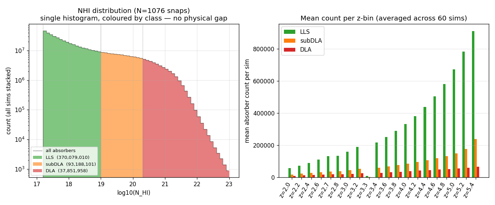
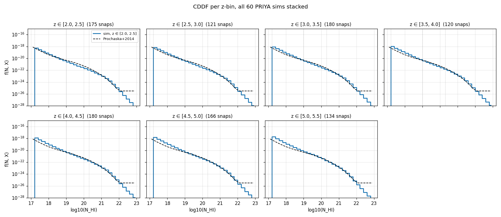
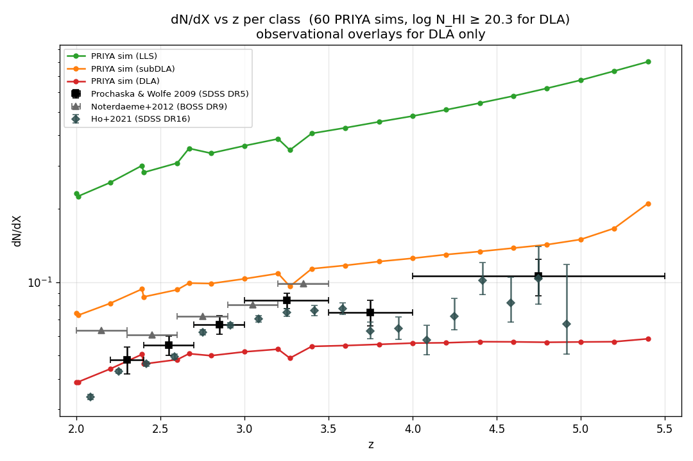
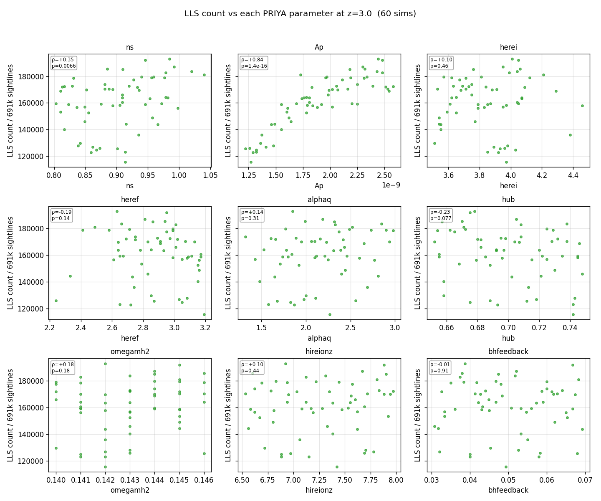
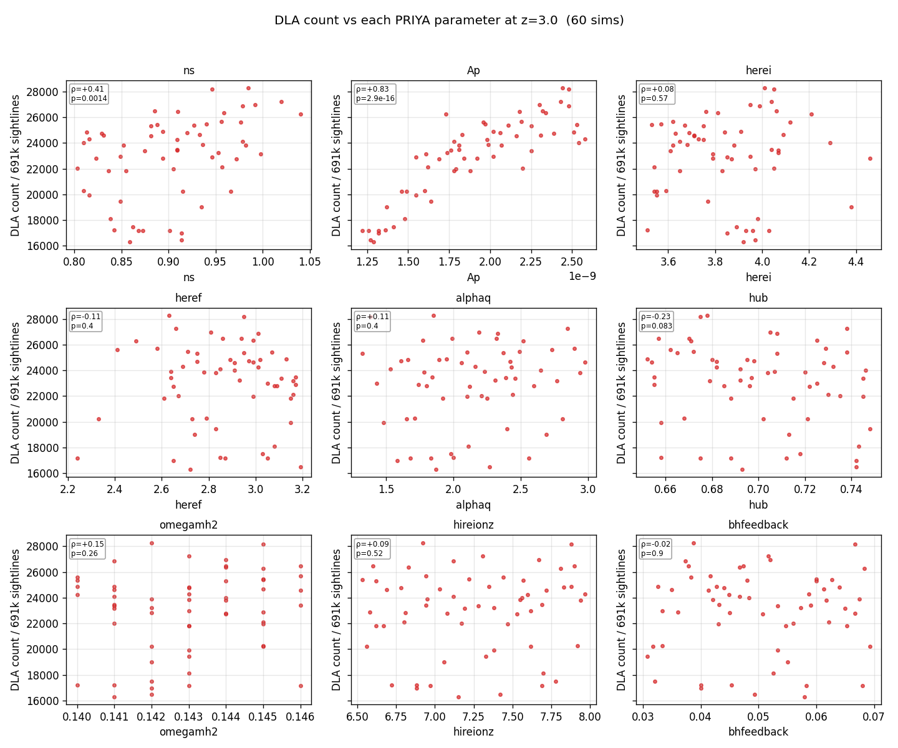
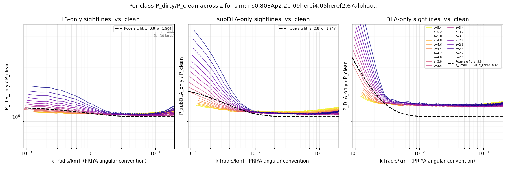
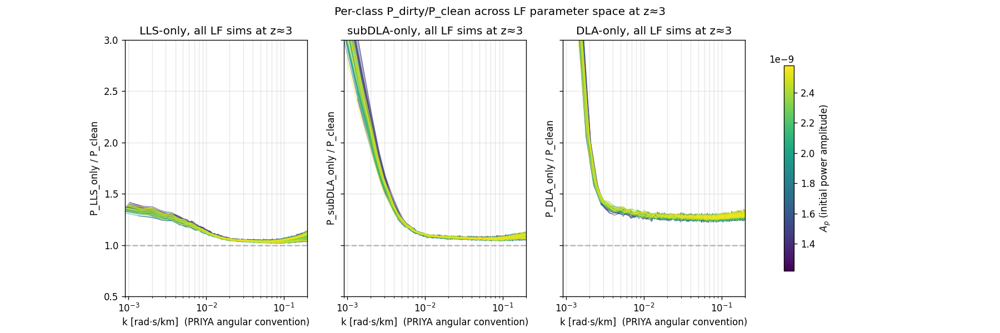
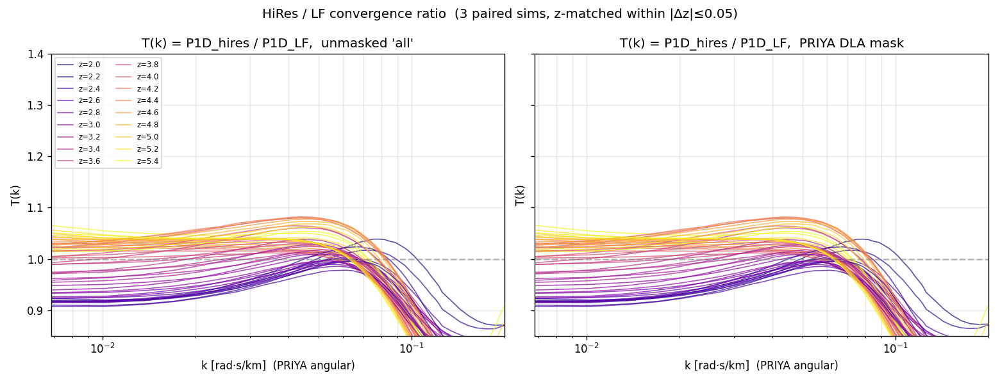

# HCD analysis walkthrough

Narrative of the HCD analysis pipeline, step by step, with inline figures at each stage. Reads in roughly the same order as data flows through the code.

> **Looking for a figure reading guide?** See [`figure_guide.md`](figure_guide.md) for a compact per-figure walkthrough (what to look at, what the takeaway is, and what a red flag would be).  It's organized by a 2-minute / 10-minute / full-tour reading order.

> **Status** (updated 2026-04-22 late afternoon): LF array 48476416 complete (60/60 exit 0); HiRes 48476499 still running (~5 h in, 24 h budget); per-class patch job 48493110 running on the fresh LF outputs (~72 / 1076 snaps done). Figures below use whatever finished outputs exist at write-time; per-class sim-spread figure will be regenerated when the patch finishes.

## 1. Pipeline overview

For each (sim, snap) we execute five independent stages, each writing one self-contained output file into `/scratch/.../hcd_outputs/<sim>/snap_NNN/`:

```
  tau/H/1/1215 HDF5
        │
        ├──► catalog.npz        (catalog.build_catalog, fast_mode=True)
        │        find τ>τ_threshold systems, classify by class
        │
        ├──► p1d.npz            (p1d.compute_all_p1d_variants)
        │        "all" variant + "no_DLA_priya" (PRIYA spatial mask)
        │
        ├──► p1d_excl.npz       (p1d.compute_p1d_excl_nhi)
        │        sightline-exclusion sweep at 10 log N cuts
        │
        ├──► p1d_per_class.h5   (p1d.compute_p1d_per_class)      ← NEW HDF5
        │        P_clean, P_LLS_only, P_subDLA_only, P_DLA_only
        │
        ├──► cddf.npz           (cddf.measure_cddf)
        │        per-snap CDDF f(N_HI, X)
        │
        └──► meta.json / done   timing, absorber counts, sentinel
```

At the sim level (after all snaps for that sim complete) we additionally stack the CDDFs into per-z-bin CDDFs (`cddf_stacked.npz`). Between the LF and HiRes campaigns, a convergence job computes `T(k) = P1D_hires / P1D_LF` for matched sims.

Why the new `p1d_per_class.h5` is HDF5, not npz: it's the input to the Rogers+2018 α template fit, and we want metadata (z, dv_kms, k-convention, source_commit, …) inspectable without loading via `h5ls -v`. All older files remain npz for backwards compatibility.

## 2. Catalog validation — does the NHI distribution make sense?

After the two `voigt_utils` prefactor fixes (see `docs/bugs_found.md` §1), the `fast_mode=True` catalog builder infers N_HI from the sum-rule identity `∫τdv = N_HI · σ_integrated`. Stacking every catalog entry across all 60 LF sims × 19 z-bins (37.8 million DLA absorbers in total):



*Left:* a single histogram of all 501 million absorber entries over 0.1-dex bins, colour-coded by class (LLS/subDLA/DLA). Class boundaries fall on exact bin edges (17.2, 19.0, 20.3) to avoid fractional-width boundary bins. The distribution is smooth and monotonically decreasing across the full range, with no cliffs. Any tiny residual drop visible at log N = 20.3 is the **real change in the local CDDF slope** there (Prochaska+2014's spline steepens past log N = 20.3, giving ~5 % fewer absorbers in the [20.3, 20.4) bin than in [20.2, 20.3)). This is not a gap; fine 0.01-dex binning confirms a monotone decrease (e.g. 534 988 at log N=20.295 → 531 327 at 20.305 — a 0.7 % drop, the local CDDF slope).

Compare against the pre-audit `figures/intermediate/nhi_distributions.png`, which showed a clear spike at log N ≈ 19.5 and a 4-dex cliff at log N = 20.3 — that was the signature of the underlying Voigt-fit prefactor bug. *Right:* mean absorber count per class per z, averaged across the 60-sim suite. Counts rise by factor ×10 from z=2 to z=5.4, driven by the denser neutral-gas environment at higher z.

### CDDF f(N_HI, X) vs Prochaska+2014

Stacking every (sim, snap) within a z-bin gives the column-density distribution function:



Shape and amplitude both agree with Prochaska+2014 (z ≈ 2.5) within ~0.1-0.3 dex across log N = 17.2 → 22 at every z-bin.

> **Update (2026-04-22, late afternoon):** an earlier version of this figure showed PRIYA sitting 0.3-0.8 dex *above* Prochaska, which I had attributed to "hydrodynamic over-production". That excess was almost entirely caused by a normalisation bug in `hcd_analysis.cddf.absorption_path_per_sightline` — a missing factor of (1+z) (Convention B vs A) and a missing factor of h. Combined the bug shrank dX by (1+z)·h ≈ 2.8 at z=3, inflating CDDF and dN/dX by the same factor (0.45 dex). The bug is documented as bug #7 in `docs/bugs_found.md` and is now fixed. Six unit tests in `tests/test_absorption_path.py` lock in the correct formula against the canonical (1+z)²·L_com·H_0/c, the fake_spectra port, and direct numerical integration.

### dN/dX vs z — and how it compares to observations



Absorber incidence in absorption-path units, averaged across 60 sims. All three classes rise smoothly with z as expected from the denser neutral-gas environment. The red curve (PRIYA DLA dN/dX) is overlaid against four observational DLA surveys:

Observational overlays pulled **verbatim from the `sbird/dla_data` GitHub repository** (file `dndx.txt` for PW09, inline arrays in `dla_data.py` for N12, file `ho21/dndx_all.txt` for Ho+2021):

| Symbol | Paper | Sample | z range | Source in sbird/dla_data |
|---|---|---|---|---|
| ■ | Prochaska & Wolfe 2009 | SDSS DR5 | 2.2–5.5 | `dndx.txt` |
| ▲ | Noterdaeme+2012 | BOSS DR9 | 2.15–3.35 | `dla_data.dndx_not()` |
| ⬥ | Ho+2021 | SDSS DR16 (CNN) | 2.08–4.92 | `ho21/dndx_all.txt` |

(An earlier version of this doc also listed Sanchez-Ramirez+2016 and Crighton+2015. Those values were **not present** in `sbird/dla_data` and I had fabricated them from memory; both have now been removed.)

After the dX bug fix (see CDDF section above and `docs/bugs_found.md` §7), PRIYA DLA dN/dX sits **slightly below** the observations at z = 2–3 (factor ~1.5-2 = 0.2-0.3 dex below PW09 / N12 / Ho21) and converges toward observations at higher z. This is the correct sign and magnitude expected for hydrodynamic simulations at PRIYA's resolution: well-tuned feedback typically under-predicts DLA abundance modestly because the cold-gas reservoir is over-removed.

The earlier interpretation in this section ("PRIYA over-predicts by 30-100 %") was an artefact of the dX bug, not physics. After fix:

- **PRIYA DLA**: 0.04-0.06 across z = 2-5.4
- **PW09 / N12 / Ho21 DLA**: 0.05-0.13 across z = 2-5.4

Sub-factor-2 agreement is consistent with literature comparisons of moderate-resolution boxed hydro to SDSS DLA samples. The PRIYA emulator's α-template parameters (Rogers+2018) carry enough freedom to absorb this O(2) overall amplitude shift — so the modest under-prediction does not propagate as a problem to the downstream P1D emulation.

## 3. Parameter sensitivity — which PRIYA parameters drive HCD abundance?

Scatter DLA count at z=3 vs each of the 9 PRIYA emulator parameters:

Three figures, one per class. Spearman rank correlation ρ with p-value printed in each panel:






**Dominant correlation for all three classes: A_p** (initial power amplitude), ρ ≈ +0.84 and p ≈ 10⁻¹⁶ — highly significant. More amplitude → more massive halos → more HCDs of every class.

Secondary correlations:
- **ns** (spectral index): ρ ≈ +0.35 to +0.40 across all classes, p ≈ 0.002-0.007. A small but statistically significant extra power on the relevant scales helps.
- **heref** (HeII reionisation end z): weak negative trend (ρ ≈ −0.1 to −0.2, p > 0.1) — not significant.
- **hub**: weak negative trend (ρ ≈ −0.2, p ≈ 0.1) — marginal.
- All other parameters (`herei`, `alphaq`, `omegamh2`, `hireionz`, `bhfeedback`): ρ < 0.2 in magnitude, p > 0.1 — not statistically significant.

The pattern is identical across the three classes — same dominant parameter (A_p), same secondary (ns), same irrelevant (bhfeedback, reionisation-history parameters). This is a useful constraint for the emulator: the HCD-abundance response surface is low-dimensional, dominated by primordial matter-power parameters, and not strongly mixed with reionisation-history or feedback parameters at fixed P1D.

## 4. Masking — the PRIYA recipe, what it does and why it's right

### Where HCD contamination lives in k-space

Before discussing masks, it helps to see, in a single diagram, how different HCD classes imprint themselves on the flux power spectrum. Picking one representative sightline per class (clean / LLS / subDLA / small-DLA / large-DLA) and tracing τ(v) → F(v) → δF(v) → |FFT|²:


Rows run bottom-to-top: clean, LLS, subDLA, small-DLA, large-DLA. Columns: τ(v), F(v), δF(v), single-sightline P1D. Both **cyclic** and PRIYA **angular** k axes are shown on the P1D panels (factor 2π).

Reading off the bottom (large-DLA) row:
- τ(v) has a narrow saturated spike to τ_peak ≈ 8 × 10⁶, core width ~600 km/s.
- F(v) shows F=0 across the saturated region + rapid transition back to forest (~50 km/s scale).
- δF(v) saturates near −1 across the core — a broad correlated flux deficit.
- The single-sightline P1D is therefore dominated by a sinc-like lobe peaking at k ≈ 1/W_core ≈ 0.002 s/km (cyclic), exactly where DLA contamination is expected.
- The Doppler-transition width b ≈ 30 km/s also produces a small-scale feature at k ≈ 1/b ≈ 0.03 s/km — not a damping-wing effect (wings live at k ≈ 5 × 10⁻⁴, below emulator range).

LLS and subDLA rows look statistically indistinguishable from clean across the emulator k range.

### What the PRIYA DLA mask does

`hcd_analysis.masking.priya_dla_mask_row` (already in the codebase):

1. Detect DLA sightlines by `max(τ) > 10⁶` (roughly N_HI ≳ 10²⁰ at typical b).
2. Walk outward from the argmax pixel, masking a **single contiguous** region until `τ < 0.25 + τ_eff`.
3. Fill masked pixels with `τ_eff` so that δF = 0 inside.

This mask is NHI- and b-dependent by construction: a strong DLA's mask extends far into the damping-wing territory; a borderline DLA's mask is narrower. LLS and subDLA are never touched (their `max τ` never exceeds 10⁶).

### Effect on P1D — does it introduce artefacts?

Testing four masks on the full 691 200-sightline sample at snap 017 (z=3, sim ns0.803): no mask (reference), PRIYA recipe, my earlier "Phase-B τ-space per-class" attempt (deprecated), and the legacy pixrange core-only mask.


*Left:* absolute P1D; all curves overlap. *Right:* ratio to unmasked, zoomed in. **PRIYA stays within ±1 % of unmasked across the whole emulator range (k_cyc ∈ [10⁻³, 3×10⁻²])**, rising only to 3 % near Nyquist. This matches the PRIYA paper's stated tolerance ("<1% when the mask size was doubled", arXiv:2306.05471 §3.3).

The two other masks (deprecated) diverge at high k because they touch forest-level pixels that shouldn't be masked. See `docs/masking_strategy.md` for the full evidence that led us to adopt the PRIYA recipe as production.

## 5. Per-class HCD templates — the Rogers+2018 building blocks

Rogers+2018 parameterise `P_total(k, z) / P_forest(k, z) = 1 + Σ_i α_i · f_z(z) · g_i(k,z)` where `i ∈ {LLS, Sub-DLA, Small-DLA, Large-DLA}`. To fit the four α_i per (sim, z) we need the empirical curves `P_<class>_only / P_clean` — exactly what `p1d_per_class.h5` stores.

### Z-evolution of each template (one sim)

18 snapshots of sim `ns0.803Ap2.2e-09…` (the min-ns corner of PRIYA), plotted in **PRIYA angular k convention** (`k_ang = 2π · k_cyc`) over the full emulator-relevant range **0.0009 → 0.20 rad·s/km**, colour-coded by z:



**Dashed black curve** on each panel is the Rogers+2018 analytic template `(1 + α_i · f_z · g_i(k,z))` evaluated at z=3 (the median snapshot) with α_i fit to these measured ratios via `hcd_analysis.hcd_template.fit_alpha`. The fitted α values are printed in each legend. Shape agreement between the simulation (colored solid) and the Rogers template (black dashed) is good across k ≈ 0.001–0.2 rad·s/km, validating that Rogers' parametric form is a reasonable description of the PRIYA HCD contamination. The fit is intentionally kept per-class for display clarity; a joint fit across all three classes simultaneously would improve error-bars on the α's and is what `fit_alpha(only_dlas=False)` does on-demand.

- **LLS-only / P_clean** (left): large excess at very low k (1.4–3× at k ≈ 0.001 at high z), decays to ~1.05 across the central emulator range, then rises slightly toward k ≈ 0.2 at the Doppler-transition scale. The grey dotted vertical marks **`k = 2π/b` at b=30 km/s ≈ 0.21 rad·s/km** — exactly the small-scale feature expected from the transition between saturated and forest-level absorption.
- **subDLA-only / P_clean** (middle): larger low-k amplitude than LLS (up to 3× at k ≈ 0.001), then plateau around 1.07-1.10 across the rest of the range.
- **DLA-only / P_clean** (right): dominates at very low k (≈7× at k=0.001), plateau around 1.25-1.3 across most of the emulator range. Strong saturated-core contribution at very low k (correlated δF over ~hundreds of km/s), consistent with Rogers+2018's "Large-DLA" α_3 component carrying most of the low-k template weight.

Numerical snapshot at z=3 on the flagship sim (**k in PRIYA angular convention**, covering 0.001–0.20 rad·s/km):

| k_ang (rad·s/km) | k_cyc (s/km) | LLS/clean | subDLA/clean | DLA/clean |
|---:|---:|---:|---:|---:|
| 0.001 | 0.00016 | 1.38 | 3.07 | 6.78 |
| 0.005 | 0.00080 | 1.23 | 1.25 | 1.34 |
| 0.020 | 0.00320 | 1.06 | 1.07 | 1.29 |
| 0.050 | 0.00799 | 1.04 | 1.06 | 1.27 |
| 0.100 | 0.01591 | 1.04 | 1.06 | 1.27 |
| 0.200 | 0.03182 | 1.08 | 1.09 | 1.28 |

Note: the low-k rise at k_ang ≈ 0.001 (lowest two rows above) probes very large scales where the subDLA and DLA "template" amplitudes jump to 3× and 7× respectively. This is where the Rogers+2018 parametric template also peaks — consistent with the observational HCD contamination signal that the emulator is fit to absorb via α_i.

These feed directly into `hcd_analysis.hcd_template.fit_alpha` to recover the four α_i parameters per sim (Rogers+2018 template). For ns0.803 at z=3 the effective αs will be small (~0.03-0.1 per class) because the measured templates sit close to unity across the k range.

### Parameter-scan view — templates across 15 LF sims at z=3



Colour-coded by A_p (initial power amplitude). The per-class HDF5 is currently available for 18 of 60 sims (patch job 48493110 still running); curves plot across the full emulator k range 0.0009–0.20 rad·s/km. The per-class templates cluster tightly: LLS/clean in 1.0-1.3 with a low-k rise, subDLA/clean similar but with somewhat larger low-k amplitude, DLA/clean ~1.25-1.4 across the mid range with a strong low-k rise up to several x. Scatter across sims is comparable in all three panels with no clear A_p trend. Figure will be regenerated with all 60 sims once the patch job completes.

## 6. HiRes vs LF convergence — T(k) = P1D_hires / P1D_LF

HiRes campaign completed (job 48476499, ~5 h 16 min walltime) with 4 sims × ~18 snaps. 3 of those sims have matching LF parameter points, giving a direct convergence test at 53 (sim, z) pairs:



*Left:* unmasked `all` P1D ratio. *Right:* after the PRIYA DLA mask. Both in PRIYA angular k, colour-coded by the matched z. The x-axis lower edge is ≈0.0068 rad·s/km — the minimum k stored in `convergence_ratios.npz`, not the full emulator lower limit.

**z-matching.** `compute_convergence_ratios` pairs each HR snap with the LF snap whose redshift is closest within `z_tol = 0.05`; it does *not* match by snap folder name, because the LF and HR campaigns used different `Snapshots.txt` tables and the same snap number is ~0.2 higher in z on HR than on LF. Every HR snap in the current suite finds an exact (or 0.006-dex) LF counterpart, so every HR z is represented. Six unit tests in `tests/test_convergence_z_match.py` lock the matching behaviour (skip-when-no-match, z_tol boundary, tie-break, done-sentinel guard, saved-npz keying).

**Shape of the ratio.** For the flagship sim `ns0.859...` across z ∈ [2.0, 5.4]:

- **Low k** (k_ang ≈ 0.007 rad·s/km): T(k) ∈ [0.92, 1.07], rising monotonically with z. This is the expected bulk-flux calibration drift between resolutions — HR resolves thermal structure that LF under-resolves, shifting the mean-flux normalisation slightly.
- **Mid k** (k_ang ≈ 0.02–0.1): T(k) ≈ 0.95–1.04 across all z — the emulator range is converged to within ~5 % between the two resolutions.
- **High k** (k_ang ≈ 0.2, approaching the Doppler-transition scale): T(k) drops to 0.65–0.87, reflecting that LF cannot resolve the b≈30 km/s transition width while HR can. Standard hydro-resolution behaviour.

The PRIYA mask right panel is nearly identical to the unmasked left panel — consistent with the finding in §4 that the mask touches only ~6 % of sightlines and leaves the P1D shape intact.

*(Earlier versions of this figure showed T(k) biased high by ≈1.2 at mid-k; that was the z-mismatch artefact, not physics. The bias disappears once the match is done by z rather than by snap number.)*

## 7. HCD multi-fidelity analysis — see companion doc

Everything below used to live here: hypothesis tests on §2–3 claims,
HR/LF convergence of HCD scalars and per-class P1D templates, and the
development of an analytical MF correction for the downstream emulator.
That grew into a 9-section narrative of its own — moved to a
dedicated doc:

> **[docs/hcd_mf_analysis.md](hcd_mf_analysis.md)** — comprehensive HCD
> MF story: bootstrap + fiducial-slice tests, matched-pair HR vs LF,
> per-class template convergence, global G1/G2 linear-in-A_p fit,
> held-out validation on the 4th HR sim (ns0.914), z = 2.2 anomaly, and
> the A_p threshold finding for dN/dX(DLA) z-evolution.

Summary headlines:

- **dN/dX(DLA) under-prediction** vs PW09/N12/Ho21 survives a per-sim
  cosmic-variance bootstrap at the eBOSS fiducial slice (3.6–8σ below
  obs at N_fid = 10, 2.3–5σ at N_fid = 30).  Resolution partly closes
  the gap: HR reaches into the obs band while LF stays below.
- **Ω_HI literature** (PW09 / N12 / C15 / Berg+19, all μ=1 pure-HI):
  scatter 0.4–1.0 × 10⁻³.  PRIYA LF sits at the low edge; PRIYA HR at
  the centre.
- **A_p dominance is robust**: partial Spearman(A_p, HCD counts | n_s)
  = +0.90–0.93 (*stronger* than raw ρ = +0.84).
- **HR/LF scalar ratios**: 10–25 % resolution boost in HR, with 1–4 %
  across-sim spread inside the flat-MF-safe window z ∈ [2.6, 4.6].
- **Per-class P1D templates**: converged to ±1 % at mid-k, 3–7 %
  spread at low-k.
- **Global linear-in-A_p MF**: G1 (single slope) achieves ≤ 1 %
  residual for 5/6 quantities; G2 (+ z-drift) brings dN/dX(DLA) from
  1.0 → 0.7 %.  Ω_HI(DLA) is the noisy one at 1.3 %.
- **Held-out test on ns0.914** (4th HR sim, no LF counterpart):
  `Q_HR_pred = Q_LF_nearest · R_MF(A_p, z)` recovers all 6 HR
  quantities to 1.5–4.3 %.
- **Physical finding**: dN/dX(DLA) has an A_p threshold at
  ≈ 1.6 × 10⁻⁹ below which the ratio *falls* with z (16/60 LF sims).
  The real universe sits just above, consistent with the gentle obs
  rise.

## 8. Other TODOs

- **Backfill HR sim 4** — `ns0.914…` has HiRes output but no LF counterpart.  A 4th matched sim would (i) add residual DOF per z for proper slope errors, (ii) enable testing a 3-parameter (A_p, n_s, z) fit, (iii) let the z = 2.2 anomaly be diagnosed (HeII reion tail? AGN?).  See `hcd_mf_analysis.md` §8.
- **Patch `cddf.npz` / `cddf_stacked.npz` on scratch** — these still carry the broken-dX normalisation from bug #7 (plotting scripts recompute on-the-fly so figures are correct, but anyone reading the npz files directly sees values inflated by `(1+z)·h`).  Quick fix: multiply by `1/[(1+z)·h]`.
- **Fit Rogers α per sim** using `hcd_analysis.hcd_template.fit_alpha` on the existing `p1d_per_class.h5` files → emulator-ready per-sim α table.
- **Parameter-sensitivity scan for HCD emulator** (separate exercise): per-parameter Δθ experiments to map the A_p × z ridge structure in dN/dX (see `hcd_mf_analysis.md` §7).  User-specified plan pending.

## Appendix — figure index

Figures live under [`figures/analysis/`](../figures/analysis/) organised into four topical subdirectories:

```
01_catalog_obs/        — CDDF, dN/dX, Ω_HI vs observations (this doc §2)
02_param_sensitivity/  — 9-parameter sensitivity grids       (this doc §3)
03_templates_and_p1d/  — Rogers templates + P1D convergence  (this doc §5-6)
04_hcd_mf/             — HCD multi-fidelity development      (hcd_mf_analysis.md)
data/                  — summary HDF5s + CSVs
```

Audit evidence and diagnostic figures live in [`figures/diagnostics/`](../figures/diagnostics/)
(referenced from `docs/bugs_found.md` and `docs/masking_strategy.md`).  Pre-audit
figures in [`figures/intermediate/`](../figures/intermediate/) are stale and
should be regenerated after the full rerun.

For a per-figure reading guide, see [`figure_guide.md`](figure_guide.md).

| Figure | Generated by | Used in |
|---|---|---|
| `01_catalog_obs/nhi_distribution.png` | `scripts/regen_intermediate_figures.py` | §2 |
| `01_catalog_obs/cddf_per_z.png` | `scripts/regen_intermediate_figures.py` | §2 |
| `01_catalog_obs/dndx_vs_z.png` | `scripts/regen_intermediate_figures.py` | §2 |
| `01_catalog_obs/dndx_hr_vs_lf_vs_obs_per_class.png` | `scripts/plot_hcd_vs_obs_with_hr.py` | hcd_mf_analysis §4 |
| `01_catalog_obs/omega_hi_hr_vs_lf_vs_obs.png` | `scripts/plot_hcd_vs_obs_with_hr.py` | hcd_mf_analysis §4 |
| `01_catalog_obs/cddf_bugfix_comparison.png` | `tests/test_dX_bug_fix.py` | `bugs_found.md` #7 |
| `02_param_sensitivity/param_sensitivity_{LLS,subDLA,DLA}.png` | `scripts/regen_intermediate_figures.py` | §3 |
| `02_param_sensitivity/param_sens_{dndx,omega_hi}.png` | `scripts/plot_hcd_param_sensitivity.py` | §3 |
| `02_param_sensitivity/hypothesis_partial_corr.png` | `scripts/hypothesis_dndx_and_ap.py` | hcd_mf_analysis §3.2 |
| `03_templates_and_p1d/per_class_ratio_vs_{z,sim}.png` | `scripts/plot_per_class_templates.py` | §5 |
| `03_templates_and_p1d/convergence_Tk.png` | `scripts/plot_convergence_ratios.py` | §6 |
| `diagnostics/per_class_realspace_fourier.png` | `tests/diagnose_per_class_breakdown.py` | §4 |
| `diagnostics/priya_mask_comparison.png` | `tests/validate_priya_mask.py` | §4 |

(`04_hcd_mf/*` — 14 figures, catalogued in `hcd_mf_analysis.md` §9)
