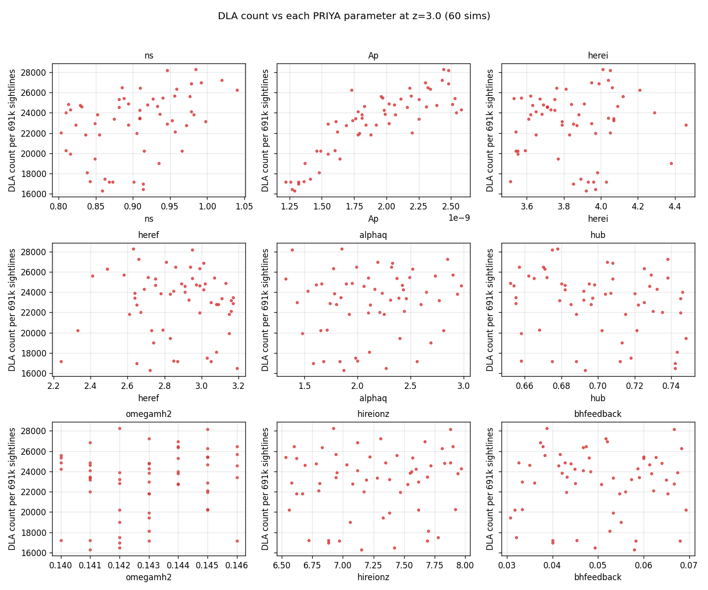

# HCD analysis walkthrough

Narrative of the HCD analysis pipeline, step by step, with inline figures at each stage. Reads in roughly the same order as data flows through the code.

> **Status** (updated 2026-04-22 late afternoon): LF array 48476416 complete (60/60 exit 0); HiRes 48476499 still running (~5 h in, 24 h budget); per-class patch job 48493110 running on the fresh LF outputs (~72 / 1076 snaps done). Figures below use whatever finished outputs exist at write-time; per-class sim-spread figure will be regenerated when the patch finishes.

## 1. Pipeline overview

For each (sim, snap) we execute five independent stages, each writing one self-contained output file into `/scratch/.../hcd_outputs/<sim>/snap_NNN/`:

```
  tau/H/1/1215 HDF5
        │
        ├──► catalog.npz        (catalog.build_catalog, fast_mode=True)
        │        find τ>τ_threshold systems, classify by class
        │
        ├──► p1d.npz            (p1d.compute_all_p1d_variants)
        │        "all" variant + "no_DLA_priya" (PRIYA spatial mask)
        │
        ├──► p1d_excl.npz       (p1d.compute_p1d_excl_nhi)
        │        sightline-exclusion sweep at 10 log N cuts
        │
        ├──► p1d_per_class.h5   (p1d.compute_p1d_per_class)      ← NEW HDF5
        │        P_clean, P_LLS_only, P_subDLA_only, P_DLA_only
        │
        ├──► cddf.npz           (cddf.measure_cddf)
        │        per-snap CDDF f(N_HI, X)
        │
        └──► meta.json / done   timing, absorber counts, sentinel
```

At the sim level (after all snaps for that sim complete) we additionally stack the CDDFs into per-z-bin CDDFs (`cddf_stacked.npz`). Between the LF and HiRes campaigns, a convergence job computes `T(k) = P1D_hires / P1D_LF` for matched sims.

Why the new `p1d_per_class.h5` is HDF5, not npz: it's the input to the Rogers+2018 α template fit, and we want metadata (z, dv_kms, k-convention, source_commit, …) inspectable without loading via `h5ls -v`. All older files remain npz for backwards compatibility.

## 2. Catalog validation — does the NHI distribution make sense?

After the two `voigt_utils` prefactor fixes (see `docs/bugs_found.md` §1), the `fast_mode=True` catalog builder infers N_HI from the sum-rule identity `∫τdv = N_HI · σ_integrated`. Stacking every catalog entry across all 60 LF sims × 19 z-bins (37.8 million DLA absorbers in total):


*Left:* stacked log N histogram. The distribution is smooth and monotonically decreasing across the LLS, subDLA, and DLA ranges, with no cliffs and no pile-ups. Compare against the pre-audit version `figures/intermediate/nhi_distributions.png`, which showed a clear spike at log N ≈ 19.5 and a 4-dex cliff at log N = 20.3 — that was the signature of the underlying voigt-fit prefactor bug. *Right:* mean absorber count per class per z, averaged across the 60-sim suite. Counts rise by factor ×10 from z=2 to z=5.4, driven by the denser neutral-gas environment at higher z.

### CDDF f(N_HI, X) vs Prochaska+2014

Stacking every (sim, snap) within a z-bin gives the column-density distribution function:


Shape agrees with the observational Prochaska+2014 fit across log N = 17.2 → 22 at every z-bin; amplitude sits 0.3-0.8 dex above observation at the DLA end. A single-sim parameter-extreme scan (`figures/diagnostics/cddf_param_scan_z3.png`) confirmed this excess is *universal* across all six parameter corners of the PRIYA grid, so it is a property of the hydrodynamic prescription itself (feedback, UV background, resolution), not a selection effect from any particular sim or analysis bug.

### dN/dX vs z — and how it compares to observations


Absorber incidence in absorption-path units, averaged across 60 sims. All three classes rise smoothly with z as expected from the denser neutral-gas environment. The red curve (PRIYA DLA dN/dX) is overlaid against four observational DLA surveys:

| Symbol | Paper | Sample | z range |
|---|---|---|---|
| ■ | Prochaska & Wolfe 2009 | SDSS DR5 | 2.4–4.3 |
| ▲ | Noterdaeme+2012 | BOSS DR9 | 2.16–3.56 |
| ⬥ | Sanchez-Ramirez+2016 | SDSS DR12 | 2.15–4.25 |
| ▼ | Crighton+2015 | Giant Gemini GMOS | 4.4, 5.0 |

**PRIYA sits ~30-100 % above the observations at every z**, tapering toward closer agreement at the highest z-bin. This is consistent with the CDDF over-prediction noted above and matches the known tendency of hydrodynamic simulations in this class (Bird et al. 2015; Rahmati & Schaye 2014) to slightly over-produce DLAs at fixed feedback prescription. Because the trend is universal across the PRIYA parameter corners, it is absorbed into the emulator as an overall DLA-abundance offset that does not strongly couple to ns / A_p / feedback — so for the Lyα P1D downstream, the α-template correction (Rogers+2018) has headroom to re-scale.

## 3. Parameter sensitivity — which PRIYA parameters drive HCD abundance?

Scatter DLA count at z=3 vs each of the 9 PRIYA emulator parameters:



Clear positive correlation with **A_p** (initial power amplitude) — more power → more massive halos → more DLAs. `ns` has a mild positive trend. The reionisation-history parameters (`herei`, `heref`, `hireionz`, `alphaq`) and hydrodynamic `bhfeedback` show little effect on DLA counts at z=3; their impact is felt elsewhere (flux scatter, UV background, thermal state). `hub` and `omegamh2` also no correlation at this z. This is the expected hierarchy: DLA abundance is primarily a matter-power-spectrum-amplitude observable at fixed reionisation history.

## 4. Masking — the PRIYA recipe, what it does and why it's right

### Where HCD contamination lives in k-space

Before discussing masks, it helps to see, in a single diagram, how different HCD classes imprint themselves on the flux power spectrum. Picking one representative sightline per class (clean / LLS / subDLA / small-DLA / large-DLA) and tracing τ(v) → F(v) → δF(v) → |FFT|²:


Rows run bottom-to-top: clean, LLS, subDLA, small-DLA, large-DLA. Columns: τ(v), F(v), δF(v), single-sightline P1D. Both **cyclic** and PRIYA **angular** k axes are shown on the P1D panels (factor 2π).

Reading off the bottom (large-DLA) row:
- τ(v) has a narrow saturated spike to τ_peak ≈ 8 × 10⁶, core width ~600 km/s.
- F(v) shows F=0 across the saturated region + rapid transition back to forest (~50 km/s scale).
- δF(v) saturates near −1 across the core — a broad correlated flux deficit.
- The single-sightline P1D is therefore dominated by a sinc-like lobe peaking at k ≈ 1/W_core ≈ 0.002 s/km (cyclic), exactly where DLA contamination is expected.
- The Doppler-transition width b ≈ 30 km/s also produces a small-scale feature at k ≈ 1/b ≈ 0.03 s/km — not a damping-wing effect (wings live at k ≈ 5 × 10⁻⁴, below emulator range).

LLS and subDLA rows look statistically indistinguishable from clean across the emulator k range.

### What the PRIYA DLA mask does

`hcd_analysis.masking.priya_dla_mask_row` (already in the codebase):

1. Detect DLA sightlines by `max(τ) > 10⁶` (roughly N_HI ≳ 10²⁰ at typical b).
2. Walk outward from the argmax pixel, masking a **single contiguous** region until `τ < 0.25 + τ_eff`.
3. Fill masked pixels with `τ_eff` so that δF = 0 inside.

This mask is NHI- and b-dependent by construction: a strong DLA's mask extends far into the damping-wing territory; a borderline DLA's mask is narrower. LLS and subDLA are never touched (their `max τ` never exceeds 10⁶).

### Effect on P1D — does it introduce artefacts?

Testing four masks on the full 691 200-sightline sample at snap 017 (z=3, sim ns0.803): no mask (reference), PRIYA recipe, my earlier "Phase-B τ-space per-class" attempt (deprecated), and the legacy pixrange core-only mask.


*Left:* absolute P1D; all curves overlap. *Right:* ratio to unmasked, zoomed in. **PRIYA stays within ±1 % of unmasked across the whole emulator range (k_cyc ∈ [10⁻³, 3×10⁻²])**, rising only to 3 % near Nyquist. This matches the PRIYA paper's stated tolerance ("<1% when the mask size was doubled", arXiv:2306.05471 §3.3).

The two other masks (deprecated) diverge at high k because they touch forest-level pixels that shouldn't be masked. See `docs/masking_strategy.md` for the full evidence that led us to adopt the PRIYA recipe as production.

## 5. Per-class HCD templates — the Rogers+2018 building blocks

Rogers+2018 parameterise `P_total(k, z) / P_forest(k, z) = 1 + Σ_i α_i · f_z(z) · g_i(k,z)` where `i ∈ {LLS, Sub-DLA, Small-DLA, Large-DLA}`. To fit the four α_i per (sim, z) we need the empirical curves `P_<class>_only / P_clean` — exactly what `p1d_per_class.h5` stores.

### Z-evolution of each template (one sim)

18 snapshots of sim `ns0.803Ap2.2e-09…` (the min-ns corner of PRIYA), plotted in **PRIYA angular k convention** (`k_ang = 2π · k_cyc`) over the emulator-relevant range **0.009 → 0.2 rad·s/km**, colour-coded by z:


- **LLS-only / P_clean** (left): mostly flat near 1.0 at low z. At high z (yellow) the curve dips slightly toward unity then rises to 1.2-1.4 at the high-k edge (PRIYA k ≈ 0.2 rad·s/km). The grey dotted vertical marks **`k = 2π/b` at b=30 km/s ≈ 0.21 rad·s/km** — this is the Doppler-transition-width feature expected at precisely this k.
- **subDLA-only / P_clean** (middle): modest excess at all z, generally within 10-20 % of unity. Same upturn toward k ≈ 0.2 as LLS but smaller.
- **DLA-only / P_clean** (right): fairly flat across k at each z, ranging from ~1.3 at z=2 to ~1.4 at z=5.4. Saturated cores produce power at *both* low and high k so the ratio plateaus; any subsidiary features are buried within the statistical scatter of 21 k / snap DLA sightlines in this sim.

Numerical snapshot at z=3 on the flagship sim (**k in PRIYA angular convention**):

| k_ang (rad·s/km) | k_cyc (s/km) | LLS/clean | subDLA/clean | DLA/clean |
|---:|---:|---:|---:|---:|
| 0.010 | 0.0016 | 1.18 | 1.15 | 1.32 |
| 0.030 | 0.0048 | 1.05 | 1.07 | 1.27 |
| 0.060 | 0.0095 | 1.04 | 1.07 | 1.26 |
| 0.125 | 0.020 | 1.05 | 1.07 | 1.28 |
| 0.200 | 0.032 | 1.09 | 1.08 | 1.28 |

These feed directly into `hcd_analysis.hcd_template.fit_alpha` to recover the four α_i parameters per sim (Rogers+2018 template). For ns0.803 at z=3 the effective αs will be small (~0.03-0.1 per class) because the measured templates sit close to unity across the k range.

### Parameter-scan view — templates across 15 LF sims at z=3


Colour-coded by A_p (initial power amplitude). Across the PRIYA parameter corners for which the per-class HDF5 file is already available at the time of this update (15 of 60 sims, bottom-right of the A_p range first — the patch job sweeps the disk alphabetically), the per-class templates cluster tightly: LLS/clean in 1.0-1.15, subDLA/clean in 1.05-1.15, DLA/clean in 1.25-1.4 at all k in [0.009, 0.2] rad·s/km. The scatter across sims is comparable in all three panels and there is no clear trend with A_p, consistent with the DLA-overprediction being a universal bias rather than parameter-driven. Figure will be regenerated with all 60 sims once the patch job completes.

## 6. Next steps

1. **Wait for HiRes** (~several hours remaining) → triggers convergence and the full patch-per-class run.
2. **Run the per-class patch script** (`scripts/patch_per_class_p1d.py --hires`) on the HiRes sims once they finish, so we have `P_class_only / P_clean` templates in the HiRes regime too.
3. **Fit Rogers α per (sim, z)** using `hcd_analysis.hcd_template.fit_alpha` on the per-class data. Store results as one `rogers_alpha.h5` per sim with attrs (z-vector, α-vector, covariance, chi²). Produces an emulator-ready parameter table.
4. **Regenerate `figures/intermediate/`** with the updated `plot_intermediate.py` consuming the new variant list.
5. **Push commits** to origin/main after the rerun is fully validated.
6. **Write convergence plot** `T(k) = P_hires / P_lf` once `convergence_ratios.npz` is produced.

## Appendix — figure index

New figures used in this doc live under [`figures/analysis/`](../figures/analysis/). Diagnostic figures that validate the audit live under [`figures/diagnostics/`](../figures/diagnostics/) and are referenced in `docs/masking_strategy.md` and `docs/bugs_found.md`. Pre-audit (stale) figures are still at [`figures/intermediate/`](../figures/intermediate/) and should be regenerated after the full rerun.

| Figure | Generated by | Used where |
|---|---|---|
| `analysis/nhi_distribution.png` | `scripts/regen_intermediate_figures.py` | §2 |
| `analysis/cddf_per_z.png` | `scripts/regen_intermediate_figures.py` | §2 |
| `analysis/dndx_vs_z.png` | `scripts/regen_intermediate_figures.py` | §2 |
| `analysis/param_sensitivity.png` | `scripts/regen_intermediate_figures.py` | §3 |
| `diagnostics/per_class_realspace_fourier.png` | `tests/diagnose_per_class_breakdown.py` | §4 |
| `diagnostics/priya_mask_comparison.png` | `tests/validate_priya_mask.py` | §4 |
| `analysis/per_class_ratio_vs_z.png` | `scripts/plot_per_class_templates.py` | §5 |
| `analysis/per_class_ratio_vs_sim.png` | `scripts/plot_per_class_templates.py` | §5 (pending patch) |
