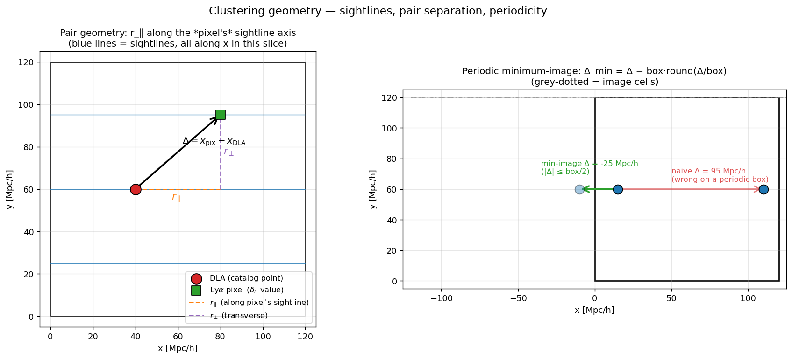
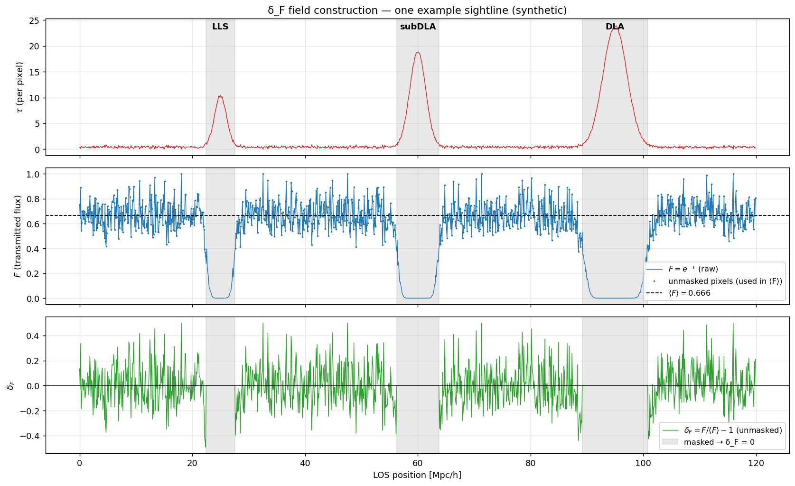

# HCD clustering — definitions, conventions, validation

Authoritative spec for the DLA × Lyα cross-correlation and the DLA × DLA
3D auto-correlation. Written 2026-04-27 ahead of implementation; **read
this and the unit-test list (`tests/test_clustering.py`) before
trusting any number from `hcd_analysis/clustering.py`**.

References
----------

- **Font-Ribera et al. 2012** ([arXiv:1209.4596](https://arxiv.org/abs/1209.4596)) — first measurement of DLA × Lyα ξ(r_∥, r_⊥) on BOSS DR9, recovers `b_DLA = 2.17 ± 0.20` at z ≈ 2.3. **Estimator: a discrete DLA point catalog × the continuous Lyα flux field δ_F(x).** Lyα absorption lines are NOT used as a discrete tracer; each Lyα pixel is a sample of the continuous field.
- **Bird et al. 2014** ([arXiv:1405.3994](https://arxiv.org/abs/1405.3994), Illustris) — measures the same observable in a fully-hydrodynamic galaxy-formation simulation. Bird+14's full Illustris run (gas dynamics, cooling, SF, AGN feedback) puts DLAs in halos via galaxy formation; they then compute the **large-scale-asymptotic bias** of those DLAs against the matter field. The terminology "linear theory bias" in their paper means "the bias measured at scales where the underlying *matter* field is linear," **not** "bias from a linear-theory calculation alone." On those large scales they recover `b_DLA = 1.7` at z = 2.3, with scale-dependent enhancement to 2.3 at `k ≈ 1 Mpc/h` (non-linear matter clustering). This is the sim-validation pattern we follow. (The doc previously misattributed this paper to Pérez-Ràfols.)
- **Pérez-Ràfols et al. 2018** ([arXiv:1709.00889](https://arxiv.org/abs/1709.00889), BOSS DR12) — `b_DLA = 1.99 ± 0.11` with no z-dependence across z ∈ [2, 4]; tighter than FR+2012 and a useful tension benchmark.
- **Farr et al. 2020 — LyaCoLoRe** ([arXiv:1912.02763](https://arxiv.org/abs/1912.02763), code https://github.com/igmhub/LyaCoLoRe) — lognormal Lyα-forest mock generator; we follow their pattern for test 8 (synthetic mock with input b, β) and use their Lyα × Lyα auto-correlation result as a sanity reference for test 11.

## 1. Coordinate system

PRIYA stores per-sim 691 200 sightlines on a regular 480 × 480 lateral
grid replicated along three orthogonal LOS axes (x, y, z). The HDF5
schema (verified 2026-04-27 against `ns0.803…/output/SPECTRA_017/lya_forest_spectra_grid_480.hdf5`) is:

| Group / dataset | Shape | Meaning |
|---|---|---|
| `Header.box` | scalar | comoving box side in **kpc/h** (= 120 000 in production) |
| `Header.hubble` | scalar | dimensionless `h` |
| `Header.redshift` | scalar | `z_snap` |
| `Header.Hz` | scalar | `H(z)` in km/s/Mpc |
| `spectra/axis` | (691 200,) int32 | LOS axis ∈ {1, 2, 3}; **1-indexed** (per fake_spectra) |
| `spectra/cofm` | (691 200, 3) float64 | sightline anchor (x, y, z) in **kpc/h** |
| `tau/H/1/1215` | (691 200, 1250) float32 | τ per (sightline, pixel) |

The pixel pitch along the LOS is

```
dx_pix = box_kpch / nbins                   # 120000 / 1250 = 96 kpc/h
dv_pix = dx_pix · H(z) / (a · 1000)          # ≈ 10 km/s at z=3
```

so the LOS runs the full box (12 510 km/s at z = 3) and the periodic
box is closed exactly.

For a sightline `i` with `axis = a` (1-indexed), pixel `j ∈ [0, 1249]`,
the comoving 3D position is

```
x[k] = cofm[i, k]                 if k ≠ a − 1
x[a−1] = (cofm[i, a−1] + j · dx_pix) mod box
```

(`mod box` because PRIYA writes `cofm[i, a−1] = 0` and the pixel index
runs from 0 to box).

All distances below are in **comoving Mpc/h**. We convert from kpc/h
inside the loader.



**Left:** how a (DLA, Lyα-pixel) pair gets decomposed.  Sightlines
(blue lines) run along the LOS axis — three are shown along x in
this 2-D slice.  A DLA on one sightline (red circle) and a Lyα
pixel on a *different* sightline (green square) form a pair with
separation `Δ = x_pix − x_DLA`.  The decomposition `r_∥` (orange)
takes the component along the **pixel's** sightline axis, NOT
the DLA's; `r_⊥` (purple) is the orthogonal residual.  Picking
the pixel's axis (not the DLA's) is the design choice in
`hcd_analysis.clustering` and matches FR+2012.

**Right:** periodic minimum-image.  Naive `Δ = 95 Mpc/h` (red)
exceeds box/2 = 60 Mpc/h, which is wrong on a periodic box; the
correct minimum-image `Δ = −25 Mpc/h` (green) points to the
image of the right point in the cell to the left.  The pair
counter applies `Δ_min = Δ − box · round(Δ / box)` element-wise.

## 2. The Lyman-α flux field — all HCDs masked

Per pixel, after **masking every absorber in the catalog** (LLS + subDLA + DLA):

```
mask_ij = True  if pixel j on sightline i lies in [pix_start, pix_end]
                of ANY catalog row whose NHI ≥ 10^17.2

F_ij    = exp(−τ_ij)             on unmasked pixels
        = ⟨F⟩                     on masked pixels       # fill so δ_F = 0
⟨F⟩     = mean of F over UNMASKED pixels in the snap
δ_F_ij  = F_ij / ⟨F⟩ − 1
```

This is the production "all-HCD-masked" δ_F. We construct it at
analysis time directly from `tau/H/1/1215` + `catalog.npz`, **without
requiring a new saved variant** (`p1d.npz` only has `all` and
`no_DLA_priya`; neither matches our spec).

The motivation is that LLS / subDLA pixels carry their own clustering
signal which would otherwise contaminate the DLA × Lyα cross-corr at
small r. Masking all HCDs gives a "pure forest" δ_F whose only
remaining bias is the underlying intergalactic Lyα bias `b_Lyα`. The
PRIYA-style `no_DLA_priya` mask is **not enough** for this purpose
because it leaves LLS / subDLA pixels in place.

We do **not** rescale τ to a target `⟨F⟩_obs` — PRIYA's native UVB
mean flux is used. (See `docs/assumptions.md` item 11.)



Concrete example on one synthetic sightline.  Three planted
absorbers (LLS at log NHI = 18, subDLA at 19.7, DLA at 20.7) raise
the τ profile (top) to amplitudes that drive `F = exp(−τ)` (middle)
to nearly zero inside their pixel windows.  The grey bands are the
HCD masks — pixels inside any LLS/subDLA/DLA `[pix_start, pix_end]`.
`⟨F⟩` is computed from the **unmasked** pixels only (dotted line in
the middle panel); masked pixels are filled with `⟨F⟩` so they
contribute exactly 0 to `δ_F = F/⟨F⟩ − 1` (bottom).  This is the
"all-HCD-masked" definition the cross-correlation pipeline
consumes.

## 3. The DLA point catalog

For each absorber row in `catalog.npz` with `NHI ≥ 10^20.3`:

* lateral 3D position: `cofm[skewer_idx]` projected onto the two axes
  perpendicular to `axis`;
* LOS coordinate: pixel-flux-weighted centre of `[pix_start, pix_end]`
  along `axis`, then `(cofm[…, a-1] + j_centre · dx_pix) mod box`.

Each DLA is therefore a single 3D point in the box. We do **not**
deconvolve the 100 km/s `merge_dv_kms` window; the merged-system
centre is the catalog's reported pixel range.

The position is in **redshift space** because PRIYA τ already includes
peculiar velocities (assumption 19). This is the right thing — FR+2012
also measure in redshift space.

## 4. The cross-correlation ξ(r_∥, r_⊥)

For each (DLA d, Lyα-pixel ℓ) pair we form

```
Δ⃗   = x_d − x_ℓ                        (apply minimum-image periodic wrap)
r_∥ = | Δ⃗ · ê_LOS,ℓ |                   (along ℓ's sightline axis)
r_⊥ = √(|Δ⃗|² − r_∥²)                    (transverse to that axis)
```

**Sign convention.** The pair counter tracks **signed** `r_∥`
internally (sign of the dot product `Δ⃗ · ê_LOS,ℓ`). For the science
panel and the bias fit we fold to `|r_∥|`. The signed version is
preserved so we can run a symmetry test
`ξ(+r_∥, r_⊥) = ξ(−r_∥, r_⊥)` — any deviation flags a systematic
(light-cone evolution across the box, asymmetric mask leakage, or a
bug in the pair coding). This goes in `tests/test_clustering.py`
(test 7b).

Estimator (continuous-field × point-set):

```
ξ_×(r_∥, r_⊥) =  ⟨ δ_F · 𝟙_DLA-near ⟩  /  ⟨ 𝟙_DLA-near ⟩

              =  Σ_{(d, ℓ) ∈ bin} δ_F_ℓ
                 ──────────────────────
                  N_pairs in bin
```

(no random catalog needed because ⟨δ_F⟩ = 0 by construction). This is
the form FR+2012 use (their eq. 5).

**Binning**

* `r_⊥` ∈ [0, 50] Mpc/h, 25 linear bins of width 2 Mpc/h
* `r_∥` ∈ [0, 50] Mpc/h, 25 linear bins of width 2 Mpc/h

Linear-bias fitting window: `r_⊥ ∈ [10, 40]`, `r_∥ ∈ [10, 40]` Mpc/h
(see §6).

## 5. The DLA × DLA auto-correlation ξ_DD(r_∥, r_⊥)

On a periodic sim box the natural estimator is the
**no-randoms-needed** form

```
ξ_DD(r_∥, r_⊥) = DD(r_∥, r_⊥) / RR_analytic(r_∥, r_⊥)  −  1

RR_analytic   =  N_DLA · (N_DLA − 1) · V_bin / V_box
              ≈  N_DLA² · V_bin / V_box                   (large N)
```

`V_bin` is the volume of the (r_∥, r_⊥) cell. Because the box is
periodic and complete, `RR` has no Monte-Carlo noise — using the
analytic count is **exact**. We do **not** carry a finite-randoms
fallback: in the periodic-box regime the analytic form has zero error.

We bin in the same (r_∥, r_⊥) grid as the cross.

## 5b. The Lyα × Lyα flux auto ξ_FF(r_∥, r_⊥)

Same machinery as the cross, but with the field on both sides:

```
ξ_FF(r_∥, r_⊥) =  Σ_{(ℓ, ℓ') ∈ bin} δ_F_ℓ · δ_F_ℓ'
                  ─────────────────────────────────
                         N_pairs in bin
```

Pixels are paired only between **distinct sightlines** (or with
themselves at zero separation, which we exclude); same `(r_∥, r_⊥)`
binning as the cross. This is the most-measured statistic in Lyα
clustering surveys (Slosar+2011, du Mas des Bourboux+2020) and gives
us a clean validation target with well-known literature values
(`b_F ≈ −0.18`, `β_F ≈ 1.5` at z ≈ 2.3).

`ξ_FF` is computationally heavier than ξ_× because both legs of the
pair are pixels (~10⁹ × 10⁹ candidate pairs in our box). We mitigate
with the same sightline pre-filter as the cross — only pixel pairs
whose lateral sightline-pair is within `r_⊥ ≤ r_⊥_max` contribute.

## 6. Linear bias extraction

Both estimators reduce to the linear-theory prediction at large r:

```
ξ_×  (r) ≈ b_DLA · b_Lyα · (1 + (β_DLA + β_Lyα) μ² + β_DLA β_Lyα μ⁴) · ξ_lin(r)
ξ_DD (r) ≈ b_DLA²        · (1 + 2 β_DLA μ² + β_DLA² μ⁴)              · ξ_lin(r)
```

where `μ = r_∥ / r`. For the **monopole** (μ-averaged):

```
ξ_×^(0)  ≈ b_DLA · b_Lyα · (1 + ⅓(β_×) + ⅕(β_×')) · ξ_lin^(0)
ξ_DD^(0) ≈ b_DLA²        · (1 + ⅔ β_DLA + ⅕ β_DLA²) · ξ_lin^(0)
```

For the **first-pass validation** we fit the monopole only (ignoring
β by absorbing it into an effective bias `b_eff`); then we redo with
the full Kaiser model.

`ξ_lin(r)` is the linear matter correlation function at the snap's
redshift. We compute it from CAMB power spectra, which are saved per
sim in
`/nfs/turbo/umor-yueyingn/mfho/emu_full/<sim>/output/powerspectrum-<a>.txt`
(see `_class_params.ini`).

## 7. Cross-validation: the auto–cross consistency check

The acid test is

```
b_DLA from auto    =    b_DLA from cross
```

If those numbers disagree at the > 1σ level, *something is wrong with
one of the pipelines* (likely the `b_Lyα` we plug in for the cross,
or peculiar-velocity contamination in the auto). PR+2014 do this
exact comparison.

For the cross we need an independent `b_Lyα`. We compute it
**in-house** from the same snap, in `hcd_analysis/lya_bias.py`, by
fitting linear theory to the **all-HCD-masked P1D** that we
reconstruct on the fly (same masking as in §2 — not the saved
`no_DLA_priya` variant, which leaves LLS / subDLA pixels in place).
The fit is on linear scales (`k_angular ∈ [0.001, 0.005] rad·s/km` at
z = 2.3, scaling with H(z)) using a McDonald 2003-style template
`P1D(k) = b_F² · D(k, β_F) · P_lin(k)`.

The fit comes with its own unit tests + hypothesis tests
(`tests/test_lya_bias.py`):
* recovery of an injected `b_Lyα` from a simulated linear forest at
  the 2 % level;
* sanity of the recovered number against the literature reference
  `b_F(z=2.3) ≈ −0.18 ± 0.02` (Slosar et al. 2011, McDonald 2003) —
  must agree to within factor 2 or we abort and investigate.

## 8. Validation plan (must all pass before the production run)

`tests/test_clustering.py` will lock these claims **before** any
science number is published. Pattern follows
`tests/test_absorption_path.py`.

| # | Test | Pass criterion |
|---|---|---|
| 1 | Coordinate round-trip | `(skewer, axis, pixel) → (x,y,z) → nearest sightline & pixel` recovers input on a 1-pixel grid |
| 2 | Periodic minimum-image | random `Δx` in `[−box, box]` returns `|Δx| ≤ box/2` after wrap |
| 3 | r_∥ + r_⊥ identity | `r_∥² + r_⊥² = |Δ⃗|²` to FP for 10 000 random pairs |
| 4 | Random Poisson DLAs vs random Lyα → ξ_× = 0 | mean over (r_∥, r_⊥) bins consistent with 0 within Poisson error |
| 5 | Random Poisson DLAs auto → ξ_DD = 0 | same, after subtracting Poisson shot noise |
| 6 | Periodic-box closure | sum of `RR_analytic` over all bins equals total point pairs in box |
| 7a | Coordinate symmetry | swapping x and y axes leaves ξ unchanged on a uniform field |
| 7b | LOS symmetry | `ξ(+r_∥, r_⊥) − ξ(−r_∥, r_⊥)` consistent with 0 across all bins (signed pair counter check) |
| 8 | Bias recovery on lognormal mock | London 2019-style mock (Gaussian field → exponentiate → Poisson-sample tracers with input b_DLA, β_DLA, b_F, β_F → impose Kaiser RSDs) recovers `b_DLA = 2.0 ± 0.1` from cross monopole. **Fallback** if lognormal proves too brittle: GRF mock (no Poisson, just `δ_g = b·δ_m` on a grid) — same recovery target, simpler stochastics. |
| 9 | Auto–cross consistency on the same mock | `b_DLA(auto) − b_DLA(cross)` consistent with 0 at 1σ |
| 10 | FR+2012 sanity on real PRIYA | one snap at z ≈ 2.3 gives `b_DLA ∈ [1.7, 2.5]` (FR+2012's central value ± 1.5 σ) |
| 11 | **Lyα × Lyα auto sanity** (the primary external check on the pair-counter machinery — passes BEFORE we trust ξ_× / ξ_DD) | one PRIYA snap at z ≈ 2.3: ξ_FF on linear scales recovers `b_F ∈ [−0.25, −0.12]` and `β_F ∈ [1.0, 2.0]` (Slosar+11 / du Mas des Bourboux+20 / LyaCoLoRe), AND the recovered `b_F` agrees with the same-snap `b_Lyα` from the P1D fit (§7) within 1σ |

Tests 4, 5, 6, 7 are deterministic and run in CI. Tests 8, 9 are
seeded-stochastic and must be reproducible. Test 10 runs against
`/scratch/.../hcd_outputs` data and is not a CI gate but is required
before the 60-sim production sweep.

## 9. Conventions and gotchas to remember

* **`spectra/axis` is 1-indexed** (1 = x, 2 = y, 3 = z). Every loader
  must subtract 1 before using as a NumPy index.
* **`cofm` is in kpc/h, not Mpc/h.** Convert immediately on load.
* **Mean flux uses the masked field**, not the raw τ-derived flux.
  Forgetting this introduces a spurious DLA bias.
* **`r_∥` is computed against the *Lyα pixel's* sightline axis**, not
  the DLA's sightline axis. They are usually different (the DLA can be
  far from the pixel laterally).
* **Periodic minimum-image always.** The box is small (120 Mpc/h);
  ignoring periodicity at r ≳ 60 Mpc/h gives wrong ξ.
* **The 100 km/s `merge_dv_kms`** in the absorber finder means two
  closely-spaced systems become one DLA — so the catalog systematically
  under-counts DLA pairs at small r_∥. We do not correct this; we just
  exclude r_∥ < 10 Mpc/h from the bias fit.

## 10. Implementation plan

This document gates the implementation. After user approval:

1. `hcd_analysis/clustering.py` — coordinate conversion (DONE), ξ_× / ξ_DD / ξ_FF pair counters, bias fitter.
2. `hcd_analysis/lya_bias.py` — `b_Lyα` calibrator from the all-HCD-masked P1D (constructed on the fly from τ + catalog, since `p1d.npz` only saves `all` and `no_DLA_priya`).
3. `tests/test_clustering.py` — tests 1–11 (test 10 + 11 part B are in `tests/validate_*.py`).
4. `scripts/run_clustering_one_snap.py` — one-snap driver.
5. `scripts/plot_clustering_validation.py` — produces `figures/analysis/04_clustering/{xi_cross_2d.png, xi_auto_2d.png, xi_ff_2d.png, bias_recovery.png, fr2012_sanity.png}`.

**Validation order (no skipping):**

  * tests 1–3 (coordinate / minimum-image / par-perp decomposition) — **DONE.**
  * tests 4–7 (deterministic estimator checks on synthetic/random fields).
  * **test 11 first** (Lyα × Lyα auto on real PRIYA — the most-measured Lyα statistic; if `b_F` lands outside [−0.25, −0.12] something is wrong with the pair counter, mean-flux convention, or coordinate handling).
  * test 8 (lognormal mock with input b_DLA, β_DLA, b_F, β_F → recover all four).
  * test 9 (auto–cross consistency on the same mock).
  * test 10 (FR+2012 sanity on real PRIYA at z ≈ 2.3).

Production (60 LF sims × all snaps) is **deferred** until tests 1–11
pass and tests 10 + 11 land within their literature windows.

---

## 11. What the production data actually looks like

Concrete examples that connect the math above to real PRIYA outputs:

* **`ξ_FF^(0)(r)` recovery, real data** — see
  [`docs/clustering_test11_results.md`](clustering_test11_results.md)
  with the test 11 fit figure inlined.  Shows both the failed P1D
  path and the successful ξ_FF path on the same z = 2.20 snap.

* **`ξ_×(r, |μ|)` heatmap + monopole + quadrupole, real data** — see
  [`docs/clustering_test10_results.md`](clustering_test10_results.md)
  with both the legacy and the rmu joint-fit figures inlined.  The
  rmu heatmap is a direct visualisation of the cross-correlation
  field that the math in §4 describes.

* **Multipole projection — bug & fix walkthrough** — see
  [`docs/multipole_jacobian_explained.md`](multipole_jacobian_explained.md)
  for four pedagogical figures showing why the legacy
  `(r_⊥, r_∥) + npairs-weighted` projection was biased (Hamilton-1992
  Jacobian leakage), and how the new `(r, |μ|) + uniform-μ Hamilton`
  estimator fixes it.

* **Coordinate / pair-decomposition diagram** — figure inlined at §1
  above; **δ_F construction example** — figure inlined at §2 above.
