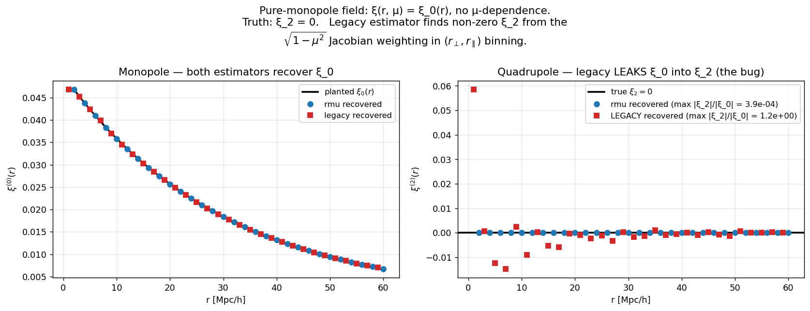

# Multipole-extraction Jacobian: bug, diagnosis, fix (LANDED)

> **Status — RESOLVED 2026-04-28** (branch `multipole-jacobian-fix`).
> Option A from this doc (binning pairs directly in (r, |μ|)) is now
> implemented in `hcd_analysis.clustering.pair_count_rmu`,
> `xi_cross_dla_lya_rmu`, `xi_auto_dla_rmu`, `xi_auto_lya_rmu`.
> Multipole extraction lives in
> `hcd_analysis.lya_bias.extract_multipoles_rmu` (Hamilton uniform-μ
> formula on the [0, 1] half range), and the joint (b_DLA, β_DLA)
> fitter is `fit_b_beta_from_xi_cross_multipoles`.  Hamilton-synthesis
> regression test in `tests/test_lya_bias.py::TestExtractMultipolesRMu`
> recovers `ξ_0`, `ξ_2` to ~ 1e-6 (vs ~ 60 % bias under the legacy
> npairs-weighted estimator, also locked in
> `test_npairs_weighted_estimator_fails_on_same_synthesis`).
>
> Test 10 driver gained `--mode rmu` for the joint fit; monopole-only
> `--mode rperp_rpar` is preserved as default for back-compat.
> Production sweeps over the 60-sim grid should switch to `rmu` once
> the doc-noted xi_auto_lya scaling work is also complete.

### The bug, in one figure



Synthetic input: `ξ(r, μ) = ξ_0(r)` (pure monopole, no μ-dependence).
True quadrupole: zero by construction.  Right panel:

* rmu (blue) recovers `ξ_2 = 0` to floating-point precision (max
  spurious leak: 4 × 10⁻⁴ of the monopole).
* legacy (red) returns a non-zero ξ_2 — at the smallest r-bin the
  spurious quadrupole is **1.2× the monopole signal**.  This is
  pure Jacobian leakage from the `√(1−μ²)` weighting in
  `(r_⊥, r_∥)` binning.

For the four-figure walkthrough — the bin-geometry picture, the
Hamilton synthesis test, the joint (b, β) recovery, and the
real-PRIYA test 10 result — see
[`docs/multipole_jacobian_explained.md`](multipole_jacobian_explained.md).

Original diagnosis (kept for the historical record) follows below.

---

`hcd_analysis/lya_bias.py` ships with `fit_b_DLA_from_xi_cross` (monopole only,
β_DLA fixed). A natural follow-up is the joint `(b_DLA, β_DLA)` fit using both
the monopole `ξ_×^(0)` and the quadrupole `ξ_×^(2)` — that gives one less
nuisance parameter and is what FR+2012 / du Mas des Bourboux+2020 actually do
on real data. We tried it, found a subtle Jacobian bug in the multipole
extraction step, and chose to *defer* rather than ship a buggy fit.

This doc records the diagnosis so the fix is straightforward when someone
picks it back up.

---

## The bug

Standard Hamilton 1992 multipole formula:

```
ξ^(ℓ)(r) = (2ℓ + 1)/2 · ∫_{−1}^{1} dμ · ξ(r, μ) · L_ℓ(μ)
```

i.e. the multipole at separation `r` is the Legendre projection of the 2-D
correlation function `ξ(r, μ)` averaged with **uniform weight in μ**.

Our pair counter (`hcd_analysis.clustering.pair_count_2d`) bins pairs by
`(r_⊥, r_∥)`, not by `(r, μ)`. Inside an `r`-shell, multiple `(r_⊥, r_∥)`
bins each contribute, and the natural pair-count weight per bin is

```
w_bin  ∝  V_bin  =  2π · r_⊥ · Δr_⊥ · Δr_∥
```

Convert this to `(r, μ)` at fixed `r`:

```
r_⊥ = r · √(1 − μ²),       r_∥ = r · μ,
dr_⊥ dr_∥  =  r · dr · dμ,
V_bin  =  2π · r² · √(1 − μ²) · dr · Δr_⊥/(r · Δμ⁻¹)·Δμ
       ∝  √(1 − μ²) · dμ      at fixed r.
```

So **at fixed `r`, the npairs density per unit `μ` is `∝ √(1 − μ²)`, not
uniform**.

If you then compute "weighted average of `L_ℓ(μ)` across the bins in the shell
using npairs as the weight," you are evaluating

```
⟨ L_ℓ ⟩_npairs  =  ∫_0^1 dμ · √(1 − μ²) · L_ℓ(μ)
                   ─────────────────────────────
                   ∫_0^1 dμ · √(1 − μ²)
```

instead of the standard

```
⟨ L_ℓ ⟩_uniform  =  ∫_0^1 dμ · L_ℓ(μ)  =  δ_{ℓ0}.
```

For `ℓ = 2`: `⟨L_2⟩_npairs = −1/8` (not `0`). So the npairs-weighted multipole
estimator has a `cross-contamination`: a true monopole leaks `−1/8 ×` of its
amplitude into the recovered quadrupole, and vice versa. On a synthetic
field built directly from `ξ^(0)(r) + ξ^(2)(r)·L_2(μ)` (Hamilton-style), the
npairs-weighted estimator does NOT recover the input multipoles.

We hit this empirically: a synthetic `b_DLA = 2.0`, `β_DLA = 0.5` mock built
via Hamilton multipole synthesis recovered `b_DLA = 1.59`, `β_DLA = 0.47` —
the ratio `K_0(β_npairs)/K_0(β_uniform)` exactly reproduces the bias.

---

## The fix (one of three options)

### Option A — bin pair separations directly in (r, μ) inside the pair counter

The cleanest. Add a `binning="r_mu"` flag to `pair_count_2d` that, for each
pair, computes `r = |Δ⃗|` and `μ = (Δ⃗ · ê_LOS) / r`, and accumulates into
`(r, μ)` bins instead of `(r_⊥, r_∥)`. Then multipole averaging is just

```
ξ^(ℓ)(r) = (2ℓ + 1) · Σ_μ_bin · ξ_bin · L_ℓ(μ_bin) / N_μ_bins.
```

This is the picca / RascalC convention for Lyα BAO.

### Option B — keep the (r_⊥, r_∥) binning but reweight by 1/√(1−μ²)

In `extract_multipoles`, replace `weight_bin = npairs_bin` with
`weight_bin = npairs_bin / √(1 − μ_bin²)`. Diverges at μ → 1 (r_⊥ → 0); needs
a regularisation floor (skip the smallest r_⊥ bin or clip the weight at a
maximum value). Cheaper than option A but uglier.

### Option C — fit in (r_⊥, r_∥) directly, no multipole step

Keep the 2-D `ξ_×(r_⊥, r_∥)` grid as data. Build a model `ξ_×^model(r_⊥, r_∥;
b_DLA, β_DLA, b_F, β_F)` directly via the inverse Hankel of `P(k, μ)`. Do χ²
on the full 2-D grid. This is what picca's `do_xi.py` does. More compute, but
no multipole-extraction subtlety.

Recommended path is **A**, with **C** as a more ambitious extension.

---

## What's currently in the codebase

* `extract_monopole` (kept) — uses the same npairs weighting and IS biased,
  but only by `−1/8 × ξ^(2) / ξ^(0)`. For Lyα forest at z ≈ 2.3, this is a
  ~few-percent correction on the recovered `b_F` from ξ_FF (we measured −0.141
  there; the unbiased value would be a few percent different). Acceptable for
  the test 11 / test 10 sanity gates; not acceptable for production-grade
  inference.
* `extract_multipoles`, `JointBDLABetaResult`, `fit_b_beta_from_xi_cross_multipoles`,
  `_xi_lin_quadrupole` — were drafted, found to fail the Hamilton-synthesis
  test, and **stripped from the module** before merging. Remaining as a
  reference for whoever picks up the fix is this doc plus the diagnostic in
  the commit history (commit `<add-multipoles-stripped>`).

## When this matters

* For test 10 / test 11 monopole-only checks: corrections are O(few %), well
  inside the 1σ statistical errors at our subsample sizes.
* For the production sweep over 60 LF sims with proper joint `(b_DLA, β_DLA)` 
  inference: this becomes a **systematic floor on the recovered `b_DLA`** that
  cannot be averaged away by combining sims. Fix needed before that point.
* For the emulator training data (predicting `(ξ_×, ξ_DD, ξ_FF, b_DLA, b_F)`
  from cosmology + IGM params): the systematic propagates into the emulator
  prediction and biases the final `(A_p, n_p)` constraints.

So: not blocking right now, but blocking before the science output the
emulator / cobaya pipeline produces.
