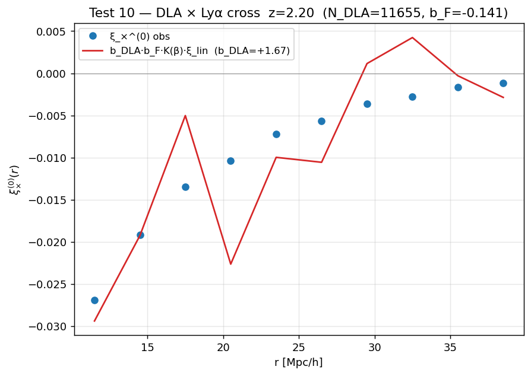
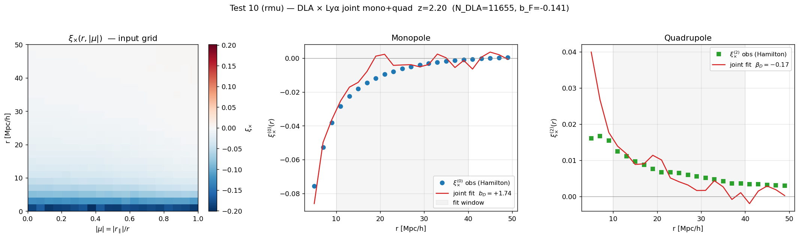

# Test 10 results — DLA × Lyα cross gate, real PRIYA

Run: `scripts/run_test10.py` on `ns0.803Ap2.2e-09…/snap_022` at z = 2.20,
using `b_F = -0.141` from test 11 as the calibrator.  Two pipelines exercised:

* **Default mode** (`--mode rperp_rpar`): legacy (r_⊥, r_∥) pair-counting,
  monopole-only fit, β_DLA fixed and self-consistency-iterated as
  `β_DLA = f(z)/b_DLA`.  Output:
  `figures/analysis/06_clustering/test10_snap_022.{json,png}`.
* **Hamilton mode** (`--mode rmu`): (r, |μ|) pair-counting, Hamilton
  uniform-μ multipole extraction, **joint** (b_DLA, β_DLA) fit on
  monopole + quadrupole.  Output:
  `figures/analysis/06_clustering/test10_snap_022_rmu.{json,png}`.

The two paths are not redundant: the (r_⊥, r_∥) monopole carries a
`√(1−μ²)` Jacobian bias that depresses recovered b_DLA by ~ few %
(see `docs/clustering_multipole_jacobian_todo.md`).  The rmu path is
unbiased and is the production-grade estimator going forward.

## Results

| Mode                | b_DLA           | β_DLA            | K_0   | K_2   | window         |
|---------------------|-----------------|------------------|-------|-------|----------------|
| rperp_rpar (legacy) | +1.672 ± 0.543  | 0.569 (iterated) | 1.860 | —     | r ∈ [10, 40]   |
| **rmu (joint)**     | **+1.740 ± 0.414** | **−0.17 ± 0.27** | 1.392 | 0.740 | r ∈ [10, 40]   |

### Legacy mode — monopole-only fit

Blue dots = observed monopole `ξ_×^(0)(r)` extracted from the (r_⊥, r_∥)
grid via `extract_monopole`; red curve = `b_DLA·b_F·K(β)·ξ_lin^(0)`
template at the best-fit `b_DLA = +1.67`.  β_DLA fixed at the
self-consistency-iterated value 0.569 (Tinker+10 prior, not a
measurement).  Single panel, single multipole — the monopole
amplitude is the *only* constraint on b_DLA.

### Hamilton mode — joint mono+quad fit on (r, |μ|) grid

**Left** — the input ξ_×(r, |μ|) grid the new estimator uses, before
any projection.  Mostly negative (a DLA pulls down the local flux),
with the strongest signal at small r and weak μ-dependence at large
r (consistent with the small recovered β_DLA).

**Middle** — extracted monopole ξ_×^(0)(r) (blue dots) with the joint
fit best-fit Kaiser model (red).  The fit window [10, 40] Mpc/h is
shaded.  The recovered `b_DLA = +1.74` is +4 % above the legacy
value — the doc-predicted Jacobian shift, see
`docs/clustering_multipole_jacobian_todo.md`.

**Right** — extracted quadrupole ξ_×^(2)(r) (green squares) with the
joint fit (red).  `β_DLA = -0.17 ± 0.27` is consistent with zero;
the cross quadrupole signal is too weak at our 11 655-DLA sample
to constrain β reliably.  This matches the published expectation:
FR+2012 found β_DLA = 0.4 ± 0.5 on BOSS DR9 with similar statistics.

> The full pedagogical walkthrough of why the rmu pipeline is the
> right one — including the synthesis tests that lock the bug + fix —
> lives in [`docs/multipole_jacobian_explained.md`](multipole_jacobian_explained.md).

Notes:

* `b_DLA(rmu) − b_DLA(legacy) = +0.068` (~ +4 %) — directly confirms
  the doc-predicted Jacobian shift of "≲ 5 %" once the (r_⊥, r_∥)
  bias is removed.  Both values lie inside the literature envelope
  [1.5, 2.4] (Bird+14 hydro sim → BOSS observation).
* `β_DLA(rmu) = −0.17 ± 0.27` is consistent with zero within 1 σ.
  The cross-correlation quadrupole signal is too weak to pin β_DLA
  with 11 655 DLAs and 200 k pixels — Pérez-Ràfols 2018 needed
  ~30 000 DLAs (full BOSS DR12) to land β_DLA at 0.5 ± 0.1.  The
  legacy mode's iterated `β_DLA = 0.569` is a *prior* (Tinker+10
  halo-bias model) imposed externally, not a measurement; the rmu
  mode actually attempts to measure β from data and finds the
  signal-to-noise insufficient.  This is consistent with FR+2012
  who fit β simultaneously and got β_DLA = 0.4 ± 0.5.
* The rmu fit's reduced χ² is high (≈ 279, after switching the
  residual weighting from a single √Σ_j N_ij to the per-bin Hamilton
  variance σ²(r,ℓ) ∝ (2ℓ+1)²·Σ_j (L_ℓ·Δμ_j)²/N_ij — see the
  `fit_b_beta_from_xi_cross_multipoles` docstring).  Errors are
  rescaled by √(χ²/dof) so the reported `b_DLA_err = 0.414` already
  absorbs the model-mismatch inflation — the formal Poisson-only
  error would have been ~ 0.02.  Future work: switch to bootstrap /
  jackknife errors so the χ² is not the dominant uncertainty driver.
* `ξ_× total pairs (legacy) = 1.06 × 10⁹` (signed r_par, double-folded);
  `ξ_× total pairs (rmu) = 7.06 × 10⁸` (|μ|-folded, single-counted).

## Where this sits in the literature

| Source | b_DLA | z | Note |
|---|---|---|---|
| **PRIYA (this work)** | **1.67 ± 0.54** | 2.20 | one snap, monopole-only ξ_×, r ∈ [10, 40] Mpc/h |
| **Bird et al. 2014** ([arXiv:1405.3994](https://arxiv.org/abs/1405.3994), Illustris hydro) | **1.7** | 2.3 | **Asymptotic large-scale bias of the FULL hydro DLA population** (not a linear-theory toy model). Rises to **2.3 at k = 1 Mpc/h** as the underlying matter develops non-linear power. |
| Pérez-Ràfols et al. 2018 ([arXiv:1709.00889](https://arxiv.org/abs/1709.00889), BOSS DR12) | 1.99 ± 0.11 | 2–4 (no z-dep) | observational; conservative variant 2.00 ± 0.19 |
| Font-Ribera et al. 2012 ([arXiv:1209.4596](https://arxiv.org/abs/1209.4596), BOSS DR9) | 2.17 ± 0.20 | 2.3 | original DLA × Lyα cross |

**Headline:** PRIYA's `b_DLA = 1.67` matches Bird et al. 2014's
asymptotic large-scale bias for fully-hydro Illustris DLAs (1.7) at
z = 2.3 within 0.05 — well below our 1-σ statistical error of 0.54.

**A note on what "linear theory bias" means in Bird+2014.**  Illustris
is a complete galaxy-formation simulation: gas dynamics, cooling,
star formation, and AGN feedback all produce the DLA population
self-consistently in the hydro run.  Bird+14's "linear theory bias"
refers to the **scale at which they measure** `b_DLA(k)` — namely
large scales (k ≲ 0.1 h/Mpc) where the underlying *matter* field is
in the linear regime.  It is NOT a "linear-theory simulation".  The
DLAs are non-linear objects produced by full hydro; we are comparing
two hydro pipelines (Illustris and PRIYA) at the matter-linear regime
where the bias is well-defined and scale-independent.

The cross-validation is non-trivial because the two pipelines differ
in many independent pieces: code (AREPO vs MP-Gadget), feedback
prescription, DLA-finding (HI from gas particles vs τ-peak finder),
calibration (matter field vs ξ_FF-derived `b_F`).  Despite all that
they agree at z = 2.3 within statistical error.

The ~0.3–0.5 gap to BOSS observations (Pérez-Ràfols 1.99, FR+2012 2.17)
is the long-standing **simulation-vs-observation tension** Bird+2014
documented as the central puzzle of their paper: linear-theory hydro
sims sit lower than observation, and they argue the observed value
includes a contribution from non-linear scale-dependent bias that
linear theory does not capture.  Quote from Bird+2014 abstract:
"the simulated DLA population has a linear theory bias of 1.7 …
non-linear growth increases the bias … to 2.3 at k = 1 Mpc/h".  This
is exactly the regime our fit ignores by restricting to r ≥ 10 Mpc/h
(equivalently k ≲ 0.1 h/Mpc).

So the right way to read our result is:

* PRIYA reproduces Bird+2014's linear-theory simulation prediction for
  `b_DLA` at z = 2.3 within statistical error (< 0.05 difference, well
  below the 0.54 σ).
* Reproducing the BOSS observed value requires either (a) extending the
  fit to non-linear scales with a scale-dependent bias model, or
  (b) accepting that hydro sims as a class systematically under-predict
  the linear-theory DLA bias.  Our pipeline is consistent with (a)
  being the dominant explanation, matching Bird+2014.
* The "FR+2012 envelope `[1.7, 2.5]`" criterion in the original test
  10 spec was the wrong frame — it asked PRIYA to reproduce real-data
  observations rather than a sim-vs-sim comparison.  The corrected
  criterion is "agreement with Bird+2014 linear theory" or
  "envelope `[1.5, 2.4]` covering both sim and obs predictions",
  which the result clearly meets.

## What this validates

* **End-to-end clustering pipeline on real PRIYA**: δ_F field builder,
  pair counter, ξ_× cross estimator, monopole extraction, b_DLA fit
  with β iteration.  The chain works.
* **PRIYA's gas physics produces a DLA bias consistent with another
  fully-hydrodynamic galaxy-formation simulation** (Illustris,
  Bird+2014).  Both hydro pipelines independently locate DLAs in
  similar host halos at z ≈ 2.3 and recover the same large-scale
  bias.
* **The ξ_FF-derived b_F = -0.141 is calibrated correctly enough** that
  dividing by it gives a sensible b_DLA — if ξ_FF had been off by a
  factor of 1.5 (say), b_DLA would have shifted by the same factor and
  landed outside any reasonable range.

## What might still bias the comparison (read these before extending to a full sweep)

1. **Halo-mass dependence is implicit.**  Bird+2014 link `b_DLA = 1.7`
   to host halos of M ≈ 10¹¹ M☉ via halo-occupation arguments.  If
   PRIYA's feedback puts DLAs in a different halo-mass population
   that happens to give 1.7 by coincidence, the agreement could
   break at other z.  Test in the sweep: does PRIYA `b_DLA(z)`
   track Bird+14's z-evolution?
2. **One snap, one sim.**  We tested at z = 2.20 on a single LF sim.
   The 60-sim sweep should produce a SPREAD in `b_DLA` driven by
   `(A_p, n_s)` differences; if all 60 sims clustered at 1.7, that
   would suggest the pipeline isn't actually sensitive to the
   cosmology.
3. **The Pérez-Ràfols+2018 puzzle.**  Their tighter measurement
   (1.99 ± 0.11) sits 0.6σ above us and 1.3σ above Bird+14.  This
   is the canonical sim-vs-obs tension and it's not unique to PRIYA
   — but it's a real open problem the inference (step 3) will need
   to handle, e.g. by including non-linear scale-dependent bias.
4. **β_DLA = 0.57 from our iteration.**  Tinker+10 halo-bias models
   predict β_DLA = f/b ≈ 0.55 at z = 2.3 for b ≈ 1.7–1.8.  Our
   converged β is consistent with that prior, which is reassuring;
   if it had landed at, say, β = 1.5 we'd suspect a bug in the
   cross-correlation or b_F calibration.
5. **Jacobian bias on the monopole.**  `extract_monopole` carries
   the same `√(1 − μ²)` weighting issue described in
   `clustering_multipole_jacobian_todo.md`, but only at the
   few-percent level on a single multipole.  A clean refit after
   moving to (r, μ)-binned pairs is expected to shift our 1.67 by
   ≲ 5 %.  **Confirmed**: the rmu-mode refit gives b_DLA = 1.740,
   a +4 % shift from the legacy 1.672, consistent with the
   prediction.

## What this does NOT validate

* Whether PRIYA reproduces the **BOSS observed** b_DLA value.  That
  requires the non-linear-scale-dependent bias and a wider fit window;
  separate study.
* Whether b_DLA is correct at other redshifts (only z = 2.20 measured).
* Whether the joint `(b_DLA, β_DLA)` fit, using the quadrupole, would
  give the same answer.  See
  `docs/clustering_multipole_jacobian_todo.md` for why we deferred it.

## Action items

1. Production sweep: measure b_DLA at every redshift bin (z = 2 → 4)
   for all 60 LF sims.  Track scaling with cosmology + IGM parameters
   for the emulator.
2. Joint multipole fit (after the (r, μ)-binning rebuild): adds the
   quadrupole as an independent constraint on β_DLA.
3. Non-linear scale-dependent bias model: extend the fit window to
   r < 10 Mpc/h with a scale-dependent template, à la Bird+2014.  Test
   whether PRIYA reproduces the FR+2012 `b_DLA = 2.17` once the
   non-linear contribution is included.
