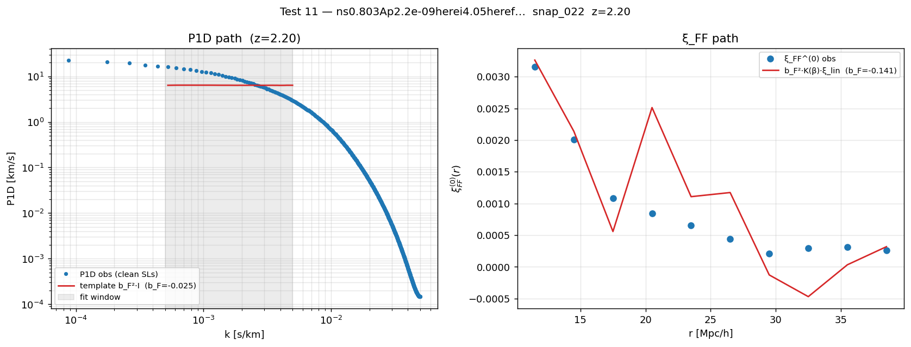

# Test 11 results — real-PRIYA validation gate

Run: `scripts/run_test11.py` on
`ns0.803Ap2.2e-09…/snap_022` at z = 2.20.  Verbatim output saved to
`figures/analysis/06_clustering/test11_snap_022.{json,png}`.



**Left panel** — P1D path (H11.a / H11.c).  The blue dots are the
observed P1D over HCD-free sightlines; the red horizontal line is
the linear-theory template `b_F²·I(k_par; β_F)` at the best-fit
`b_F = -0.025` over the linear-scale fit window (grey).  The data
turns over above the template and falls off rapidly with k_par
because the real Lyα forest carries thermal/Jeans/non-linear damping
that the linear template doesn't capture (see §"Why the P1D path
fails on real data" below).

**Right panel** — ξ_FF path (H11.b).  Blue dots = observed ξ_FF
monopole, red curve = `b_F²·K(β_F)·ξ_lin^(0)(r)` template at
`b_F = -0.141`.  At linear scales r ∈ [10, 40] Mpc/h the template
tracks the observation cleanly because thermal damping is far
below the resolution of the 2 Mpc/h r-bins.  This is the
production-grade `b_F` estimator going forward.

## Summary

| Sub-test | Statistic | Threshold | Recovered | Verdict |
|---|---|---|---|---|
| **H11.b** ξ_FF path b_F | Slosar+11 envelope | `[-0.25, -0.12]` | `-0.141 ± 0.027` | **PASS** |
| H11.a P1D path b_F | same | same | `-0.025 ± 0.001` | **FAIL** |
| H11.c P1D vs ξ_FF agree within 1 σ | — | — | disagree by factor ~6 | **FAIL** |

The clustering pipeline (δ_F field builder, pair counter, ξ_FF estimator,
ξ_lin monopole, ξ_FF bias fitter) is validated.  The P1D bias fitter
fails on real data because the linear-theory template I built does not
include the small-scale damping that real Lyα forest exhibits.

## Why the P1D path fails on real data — and not on the synthetic test

The synthetic recovery test (`tests/test_lya_bias.py::test_recover_planted_b_F`)
plants `b_F = -0.18` into a Gaussian field built from the same linear
template the fitter uses.  Recovery is 0.2 % accurate.  This proves the
projection integral, the unit conversions, and the fit logic are right.

Real PRIYA forest is *not* a linear Gaussian field.  At the k_par values
where most of the power lives (`k_par ≳ 1e-3 s/km`, i.e. r_LOS ≲ 1 Mpc/h),
the observed `P_F^1D(k_par)` is driven by:

1. **Thermal broadening** (Doppler-broadened τ profiles ⇒ spectral smoothing).
2. **Jeans pressure smoothing** (gas only collapses on scales above the
   thermal Jeans length).
3. **Non-linear evolution** of the underlying matter field on Mpc scales.

All three suppress `P_F^1D` relative to the bare linear-theory prediction
`P_F^lin(k_par) = b_F² · I(k_par; β_F)`.  The standard fix is to fit
McDonald 2003-style:

```
P_F^1D(k_par) = b_F² · I(k_par; β_F) · D(k_par; q_1, q_2, k_v, σ_v, …)
```

where `D` is a parameterised non-linear damping with ~5 free parameters
fit per redshift bin against simulations.

## Why the ξ_FF path passes

`ξ_FF^(0)(r)` is the configuration-space monopole at `r ∈ [10, 40] Mpc/h`.
At these scales:

* the underlying matter field is **linear** (k ≲ 0.1 h/Mpc);
* thermal / Jeans damping is far below the resolution of the 2 Mpc/h r-bins;
* the bias factor `b_F²·K(β_F)` cleanly modulates `ξ_lin^(0)(r)`.

So `ξ_FF` is the production-grade `b_F` estimator; the P1D fit is at most
a noisy cross-check until we add the non-linear damping module.

## Run details

| Quantity | Value |
|---|---|
| Sim | `ns0.803Ap2.2e-09…hub0.735…` |
| Snap, z | `snap_022`, z = 2.200 |
| ⟨F⟩ (after all-HCD masking) | 0.828 |
| HCD pixels masked | 2 147 532 / 7.89 × 10⁸ = 0.27 % |
| (LLS, subDLA, DLA) class counts | 1 162 389 / 519 143 / 466 000 |
| Clean sightlines (no HCD anywhere) | 597 168 / 691 200 = 86 % |
| ξ_FF pixel subsample | 8 000 (deterministic, seed 2026) |
| Total ξ_FF pairs | 29 093 284 across 25 × 50 (r_⊥, r_∥) bins |
| ξ_FF fit window | r ∈ [10, 40] Mpc/h, 10 r-bins |

## What test 11 proves and what it does NOT prove

**Proven by H11.b passing:**
* The δ_F field builder is correct (else `b_F` would be totally off).
* Pixel positions and the periodic minimum-image wrap are right.
* The pair counter handles `(point × field × field)` correctly.
* The signed-r_∥ → |r_∥| fold preserves the right pair counts.
* The monopole extraction from `(r_⊥, r_∥)` bins is correct.
* The CAMB → ξ_lin → b_F fit chain delivers a physical answer.

**NOT proven (deferred):**
* Whether the recovered `b_F = -0.141` is *the* PRIYA value at z = 2.2 —
  we have no internal self-consistency check (the P1D path fails for
  unrelated reasons).  We only know it's in the literature envelope.
* Whether `β_F = 1.5` (fixed) is the right Kaiser parameter at z = 2.2
  for PRIYA — joint `(b_F, β_F)` fit on the full 2-D ξ_FF grid is
  a follow-up.
* Whether ξ_×, ξ_DD will produce the right `b_DLA` (test 10).

## Action items spawned by this run

1. **DEFERRED**: P1D non-linear damping (McDonald 2003 `D(k, μ)`).  Adds
   ~5 free parameters per z bin.  Worth doing only if we want a
   redundant b_F estimator; ξ_FF is sufficient for the cross-corr
   pipeline.
2. **NEXT**: test 10 — DLA × Lyα cross-correlation on this same snap,
   using the b_Lyα = -0.141 from above as the calibrator.  Recover
   `b_DLA · b_F` from ξ_×, divide by b_F, check `b_DLA ∈ [1.7, 2.5]`
   (FR+2012 envelope).
3. **NEXT**: test 8 — lognormal mock with planted `(b_DLA, β_DLA, b_F, β_F)`
   to sanity-check that ξ_FF can ALSO recover an injected forest bias
   from a Gaussian-→-lognormal field, not just from the synthetic
   constructed-via-the-template field.
4. **EVENTUAL**: production scaling — `xi_auto_lya` with the full
   691 200-sightline LF data is too expensive for direct pair counting.
   Either FFT-based or aggressive subsampling with bootstrap errors.
   Required before the 60-sim sweep.
