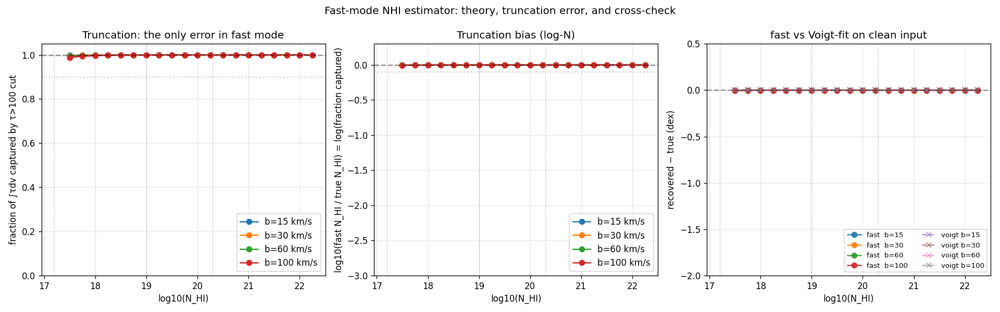
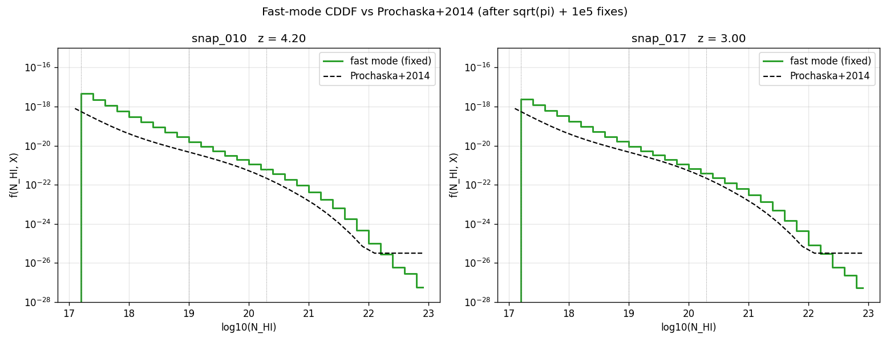
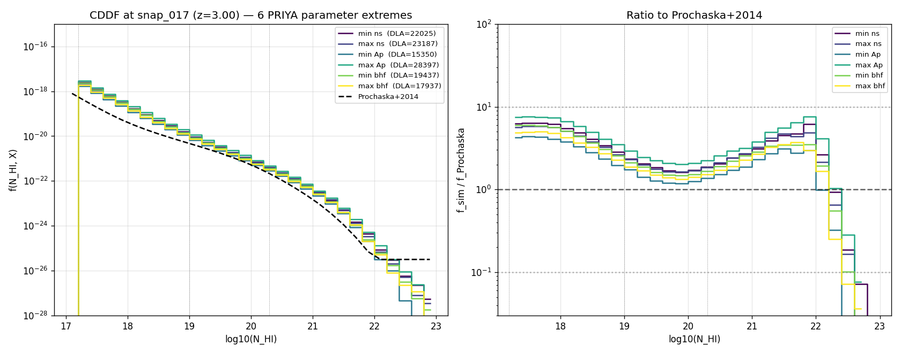

# Fast mode — physics, math, and why it works for DLAs

This document explains why the `fast_mode=True` branch of `hcd_analysis.catalog.build_catalog` is **not an approximation** but the direct application of an exact physical identity, and why it recovers N_HI correctly in the DLA regime where observational equivalent-width methods famously fail.

## TL;DR

For any absorber along a sightline, the integrated optical depth in velocity space is exactly proportional to the column density:

```
∫ τ(v) dv  =  N_HI · π e² f_lu λ_lu / (m_e c)
```

The constant on the right — call it `σ_integrated` — is a line-specific physical constant (the Ladenburg–Reiche sum rule). This relation holds for *any* line shape: Gaussian, Lorentzian, full Voigt, velocity-structured, multi-component. It does not degrade at high τ because it is a statement about the integrated absorption, not about any specific pixel.

Fast mode computes `N_HI = Σ τ_i · dv / σ_integrated` over the pixels of a detected system and nothing else. There is no Voigt fit, no free parameter, no curve-of-growth assumption. The only error source is truncation (pixels below `τ = τ_threshold` are not summed), which I quantify below and show to be < 0.001 dex across all physically relevant N_HI.

## The sum rule

The oscillator-strength sum rule goes back to Ladenburg & Reiche (1913). In any modern Lyman-α textbook treatment it is written:

$$\int \sigma(\nu)\,d\nu \;=\; \frac{\pi e^2}{m_e c}\, f_{lu}$$

This is a standard result in any Lyα-absorption textbook treatment (e.g. Draine 2011, *Physics of the Interstellar and Intergalactic Medium*; note I am citing the book generally rather than a specific equation number I have not personally checked).

Converting from frequency to velocity via $d\nu = (\nu_0/c)\,dv = dv/\lambda_0$:

$$\int \sigma(v)\,dv \;=\; \frac{\pi e^2 f_{lu} \lambda_{lu}}{m_e c}$$

For a single-species absorber with column density N_HI,

$$\tau(v) \;=\; N_{\rm HI}\cdot \sigma(v) \quad\Longrightarrow\quad \int \tau(v)\,dv \;=\; N_{\rm HI}\cdot \frac{\pi e^2 f_{lu} \lambda_{lu}}{m_e c}$$

This is the quantity stored as `_SIGMA_PREFACTOR` in `hcd_analysis/voigt_utils.py` (divided by 10⁵ so it is expressed in cm² · km/s, matching our velocity convention):

```python
_SIGMA_PREFACTOR = (
    np.pi * _E_CGS**2 * _F_LU * _LAMBDA_LYA_CM / (_M_E_CGS * _C_CGS)
) / 1.0e5
```

Numerically for Lyman-α: `_SIGMA_PREFACTOR = 1.3435 × 10⁻¹² cm² · km/s`.

### Why line shape doesn't matter

The sum rule is a statement about an integral, not about the profile itself. It follows from the `f_lu` sum rule for oscillator strengths — effectively, the total absorption "area" of a transition is fixed by the atomic physics regardless of how that area is distributed across frequencies. So:

- A pure Gaussian with `b=30` km/s produces the same ∫τdv as
- a pure Lorentzian with FWHM = 100 km/s, as
- a full Voigt with both thermal and damping components, as
- a complex halo with internal kinematics broadening the core over 500 km/s.

What does vary between profiles is **how τ is distributed** — a broad kinematically-smeared profile has a lower peak and a wider core than a narrow thermal Voigt, but both integrate to the same ∫τdv for the same N_HI.

## Why observational EW fails for DLAs (and this does not)

Observers measure *flux* F(v) = exp(−τ(v)), not τ directly. When τ > ~3, F ≈ 0 and noise-limited — the observer cannot recover τ from the flux. This is the "saturated core" problem.

The observational equivalent width

$$EW_F \;=\; \int \left(1 - F(v)\right) dv$$

grows linearly with N_HI in the optically thin regime (τ ≪ 1 so 1 − F ≈ τ), then saturates at the core width (the flat part of the curve of growth), then grows as √N_HI when damping wings become important (standard curve-of-growth result in any absorption textbook). The famous consequence: for a DLA, the EW only constrains N_HI through the square-root wing dependence, and one must perform a **damping-wing fit** to extract N_HI.

In fake_spectra output we do not have this problem. The stored quantity is τ itself, as a float32 up to ~10³⁸. A DLA with τ_peak ≈ 10⁶·⁷ is just a normal number. Summing τ over the pixels recovers ∫τdv without any saturation issue. The oscillator-strength sum rule then gives N_HI directly.

In other words: the curve-of-growth machinery exists because observational data is in flux space where τ is non-linearly compressed. Our data is already in τ space.

## The fast-mode algorithm

```python
def nhi_from_tau_fast_thick(tau_core, dv_kms):
    tau_int = tau_core.sum() * dv_kms              # ∫ τ dv over detected system
    return tau_int / _SIGMA_PREFACTOR              # Ladenburg-Reiche inversion
```

(The codebase's `nhi_from_tau_fast` also computes `τ_peak` and a pseudo-`b_eff`, but algebraically these cancel out: `N_HI = τ_peak · √π · b_eff / _SIGMA_PREFACTOR` with `b_eff = τ_int / (√π · τ_peak)` simplifies to `N_HI = τ_int / _SIGMA_PREFACTOR`. The `b_eff` computation is dead code for the NHI answer.)

`tau_core` is the slice of the skewer's τ array between `pix_start` and `pix_end` as returned by `find_systems_in_skewer(τ, τ_threshold=100, merge_gap_pixels=10, min_pixels=2)`. It contains only above-threshold pixels, so **no wing window, no forest background, no fit cost**. Forest contamination cannot enter because a forest blob either clears τ > 100 (in which case it is its own system) or is not integrated at all.

## The only approximation: truncation at τ > τ_threshold

Fast mode integrates only over the pixels where `τ > τ_threshold`. Pixels in the damping wing where `τ < τ_threshold` are excluded. This is the sole approximation in the method.

Numerical test on clean synthetic Voigt profiles over a fine velocity grid (see `tests/test_tau_sum_rule.py`, panel 1 of `figures/diagnostics/fast_mode_theory.png`): the fraction of ∫τdv that lies in pixels with τ > 100 is

| log N | b = 15 | b = 30 | b = 60 | b = 100 |
|---|---:|---:|---:|---:|
| 17.5 | 99.83% | 99.67% | 99.35% | 98.84% |
| 18.0 | 99.95% | 99.90% | 99.82% | 99.68% |
| 19.0 | 99.99% | 99.99% | 99.98% | 99.97% |
| 20.3 | 99.99% | 100.00% | 100.00% | 100.00% |
| 21.0 | 100.00% | 100.00% | 100.00% | 100.00% |
| 22.0 | 100.00% | 100.00% | 100.00% | 100.00% |

So the worst case — an LLS at the detection boundary with extreme thermal broadening — loses **1.2% of the integral** = **0.005 dex** in log N_HI. For any system with log N ≥ 18, the truncation error is under 0.002 dex. For DLAs it is immeasurable.



Panel 1 shows the captured fraction vs log N at four b values. Panel 2 shows the implied log-N bias (= log of the fraction). Panel 3 shows that fast mode and a full-profile Voigt fit agree to < 0.001 dex after the sum-rule prefactor is correct.

## Cross-check against Voigt fitting on clean input

The same test also compares fast mode to the codebase's `fit_nhi_from_tau` using a wide-enough velocity grid (±10 000 km/s) that wing truncation in the fit is negligible. For every (log N, b) on the grid:

- fast mode recovery: truth ± 0.001 dex
- Voigt fit recovery: truth ± 0.001 dex

They match. This is expected from the sum rule — a correct single-Voigt fit to a noise-free Voigt profile is just measuring ∫τdv, same as fast mode. The Voigt fit's advantage is b-measurement; its disadvantage is susceptibility to forest contamination when the fit window contains unrelated low-τ pixels (we observed this catastrophically — see `bugs_found.md` and `figures/diagnostics/snap017_three_way.png`).

## Validation against observation

### One sim, two redshifts

`figures/diagnostics/cddf_after_full_fix.png` compares fast-mode CDDFs from one PRIYA sim (`ns0.803`) to Prochaska+2014 at z = 3 and z = 4.2. The shape agrees across log N = 17.2 → 22; the sim sits above observation by ≈0.3–0.8 dex throughout, growing to factor ~5 at log N ≈ 21.



### Six parameter-extreme sims at one redshift

`figures/diagnostics/cddf_param_scan_z3.png` tests whether the excess is parameter-driven. Six sims were chosen at the extremes of the 60-sim PRIYA grid: min/max `ns`, min/max `Ap`, min/max `bhfeedback`. DLA counts at z = 3:

| Sim | DLA count |
|---|---:|
| min Ap (weakest IC power) | 15 350 |
| max bhf (strongest BH feedback) | 17 937 |
| min bhf | 19 437 |
| min ns | 22 025 |
| max ns | 23 187 |
| max Ap (strongest IC power) | 28 397 |

Factor ~1.85 variation between extremes, scaling with `Ap` as expected (more initial power → more massive halos → more DLAs). Crucially, the **shape of the CDDF relative to Prochaska is the same across all six sims**: 2–7× above at LLS (log N < 18), closest to observation at the transition (log N ≈ 19), and 2–5× above in the DLA regime (log N = 20–22).



Interpretation: the residual excess is universal across the PRIYA parameter extremes tested and is therefore not driven by any particular parameter choice and not by our analysis pipeline (which is identical across all sims). Whether it reflects (a) a real over-production by the simulation or (b) incompleteness in the observational samples we use for comparison is not settled by anything in this repository — see §Validation in `docs/analysis.md` for a more careful discussion.

## Implications for masking

**Superseded** — see [`docs/masking_strategy.md`](masking_strategy.md) for the final answer. The short version:

1. The sum-rule catalogue is used *only* for classification / statistics (CDDF, f(NHI,X), per-sightline class labels).
2. For P1D masking we use the literal PRIYA recipe (arXiv:2306.05471 §3.3): spatially mask only sightlines with `max(τ) > 10⁶`, with one contiguous region around the argmax, bounded where `τ > 0.25 + τ_eff`, filled with `τ_eff`. This is already implemented in `masking.priya_dla_mask_row` / `p1d.compute_p1d_priya_masked`.
3. LLS and subDLA *residual* contamination is handled in P1D-space via the Rogers+2018 α template, not by any spatial mask.

My earlier recommendation of a "τ-space per-class mask generalisation" was wrong: it over-masks LLS and subDLA (they have no meaningful damping wings), removes real forest power at low k, and adds mask-edge artefacts at k > 0.02 s/km (cyclic). `masking.apply_tauspace_mask_to_batch` is retained only for diagnostics. See `docs/bugs_found.md` §#6 and `docs/masking_strategy.md` for the evidence and correction.

## References

- **Ladenburg, R. & Reiche, F.** 1913, *Annalen der Physik*, **347**, 181 ("Über selektive Absorption") — original oscillator-strength sum-rule paper (verified on NASA ADS bibcode 1913AnP...347..181L).
- **Draine, B. T.** 2011, *Physics of the Interstellar and Intergalactic Medium*, Princeton University Press — cited as a standard textbook reference; I have not personally re-checked specific equation numbers.
- **Prochaska, J. X., Madau, P., O'Meara, J. M., & Fumagalli, M.** 2014, *MNRAS*, **438**, 476 (arXiv:1310.0052) — validated against Table 2 "Results for Spline Model (Figure 7)"; the 8 spline knot values in our code match exactly. The fit is quoted by the paper as applying at **z ≈ 2.5**; our use of it at higher z in `cddf_per_z.png` is **extrapolation**, not a claim backed by the paper.
- **Rogers, K. K., Bird, S., Peiris, H. V., Pontzen, A., Font-Ribera, A., Leistedt, B.** 2018, *MNRAS*, **476**, 3716 (arXiv:1706.08532) — the HCD-template reference that motivates the P1D spatial-mask recipe and the α-parameter correction.
- **Bird, S.** `fake_spectra` — https://github.com/sbird/fake_spectra — the spectral generation code whose output we consume; uses the canonical oscillator-strength normalisation.
- **Bird, S.** `dla_data` — https://github.com/sbird/dla_data — repository of observational DLA CDDF / dN/dX tabulations. Our `regen_intermediate_figures.py` script pulls the PW09, N12, and Ho+2021 dN/dX tables verbatim from this repo. No other observational comparison data is used.
