# HCD multi-fidelity analysis

Companion to [`analysis.md`](analysis.md).  That document is the end-to-end
science walkthrough (catalog → CDDF → templates → P1D convergence).  This
one focuses on the HR/LF convergence of the HCD statistics — dN/dX, Ω_HI,
and per-class P1D templates — and the development of a multi-fidelity
(MF) correction for the downstream emulator.

All figures here are inline and live under
[`figures/analysis/04_hcd_mf/`](../figures/analysis/04_hcd_mf/).
Summary HDF5s and CSVs are under
[`figures/analysis/data/`](../figures/analysis/data/).

> **Quick status**: *preliminary* — 3 matched HR↔LF pairs are the current
> training sample, which saturates a per-z 2-parameter fit and leaves no
> residual DOF for proper error bars.  The global (across-z) fit is
> stable; a 4th matched HR sim would unlock proper uncertainties.  A
> held-out validation on `ns0.914` (the un-matched 4th HR sim) recovers
> HR quantities to 1.5–5 % via `Q_HR = Q_LF_nearest · R_MF(A_p, z)`.

---

## 1. Motivation

The PRIYA multi-fidelity P1D emulator (`lyaemu.coarse_grid.Emulator.get_MFemulator`,
`lyaemu.gpemulator.SingleBinAR1`) combines LF and HR boxes through an
Emukit AR1 Gaussian process:
`P_HR(θ) = ρ(θ)·P_LF(θ) + δ(θ)`
per-(k, z).  But HCD quantities are currently *not* MF-treated — the
emulator trains only on P1D flux power, and DLA contamination is
applied post-hoc via the Rogers+2018 4-parameter α template
(`lyaemu.likelihood.DLA4corr`).

The open question: **do the HCD statistics need their own MF correction,
or can the LF suite predict them well enough at HR cosmology?**

The answer requires:

1. Measuring HR/LF ratios of HCD quantities at matched cosmology (so
   parameter drift is controlled).
2. Checking whether the ratio R(z, θ) has meaningful θ dependence —
   i.e. whether a flat MF correction is enough or MF emulation is needed.
3. A simple parametric MF model as a first pass before escalating to a GP.

---

## 2. The data

- **LF (low-fidelity) suite**: 60 sims × 19 z-bins = 1076 (sim, snap)
  records.  120 Mpc/h box, 1536³ particles.
- **HR (high-fidelity) suite**: 4 sims × ~17 z-bins = 70 records.  Same
  120 Mpc/h box, 3072³ particles (2× linear resolution).
- **Matched (HR, LF) pairs**: 3 sims have parameter points present in both
  suites.  After z-matching with |Δz| ≤ 0.05, this gives 53 (sim, z) pairs
  spanning z ∈ [2.0, 5.4].
- **Held-out HR sim**: `ns0.914…` (A_p=1.32e-9, n_s=0.914) has no LF
  counterpart — used for out-of-sample validation in §6.

Per-(sim, z) aggregates stored in
[`figures/analysis/data/hcd_summary_{lf,hr}.h5`](../figures/analysis/data/).

---

## 3. Hypothesis tests on the headline claims in `analysis.md`

### 3.1 dN/dX(DLA) under-prediction vs observations — is it real?

`analysis.md` §2 states that PRIYA under-predicts DLA dN/dX compared
to PW09 / Noterdaeme+12 / Ho+21 by factor ~1.5–2×.  Two bootstrap
tests were run to check this:

**Test v1 — across-sim bootstrap** (`scripts/hypothesis_dndx_and_ap.py`):
Resample 60 LF sims with replacement, compute ensemble-weighted
dN/dX(DLA) at z ≈ 3.  Zero of 5000 bootstrap samples reached any of
the 5 observational comparison points (PW09 in two z-bins, N12,
Ho21 in two z-bins).  Strong significance, but this bootstrap
averages out cosmic variance — it captures parameter-space spread,
not the true error bar.

**Test v2 — per-sim cosmic-variance bootstrap + fiducial slice**
(`scripts/bootstrap_dndx_per_sim.py`):

For each LF sim, resample sightlines (using `catalog.skewer_idx`)
with replacement.  The analytical CLT form
`σ(dN/dX) = std(counts_per_sightline) / √n_sightlines / dX_per_sightline`
gives cosmic-variance error bars per sim — typically 0.3–0.7 %.
Then slice the 60 sims to the 10 nearest the eBOSS PRIYA best-fit
(A_p=1.7e-9, n_s=1.0; Fernandez+2024 after PRIYA post-publication
extension to n_s up to ~1.05).

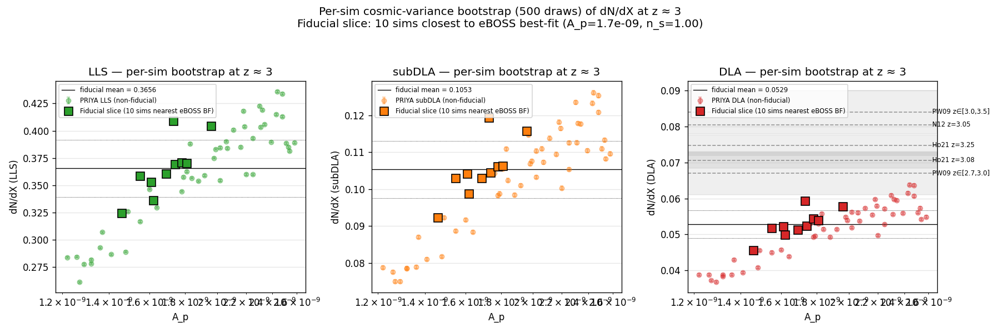

Fiducial-slice result at z ≈ 3:
- mean dN/dX(DLA) = 0.0529
- σ_cosmic per sim ≈ 0.0004 (0.7 %)
- σ_spread across 10 fiducial sims ≈ 0.0039 (7 %)
- Combined σ ≈ 0.0039 (dominated by residual parameter scatter).

Robustness check with the slice widened to N = 30 sims:

| N_fid | ⟨dN/dX⟩ | σ_total | Δ vs PW09 [3.0,3.5] | Δ vs Ho21 z=3.08 |
|---:|---:|---:|---:|---:|
| 10 | 0.0529 | 0.0039 | 8.0σ below | 4.6σ below |
| 15 | 0.0528 | 0.0044 | 7.2σ below | 4.1σ below |
| 20 | 0.0527 | 0.0044 | 7.1σ below | 4.1σ below |
| 30 | 0.0530 | 0.0061 | 5.0σ below | 2.9σ below |

Even at N=30, the under-prediction survives at 2.3–5σ.  The under-
prediction is real physics, not a sampling artefact.

**Open question: is it resolution-limited?** §4 below shows that HR
values sit ~20–40 % above LF in all three HCD classes; HR is much
closer to observations (inside the PW09 band for dN/dX at z ≈ 3,
inside the PW09/Berg+19 band for Ω_HI).  So the LF under-prediction
*is* partly resolution — but HR alone doesn't fully close the gap,
suggesting the fiducial slice is itself not perfectly aligned with the
universe's actual (A_p, n_s) point.

### 3.2 A_p dominance in HCD abundance — is it robust?

`analysis.md` §3 reports Spearman ρ(A_p, HCD counts) ≈ +0.84 per class.

Stress test (`scripts/hypothesis_dndx_and_ap.py`):

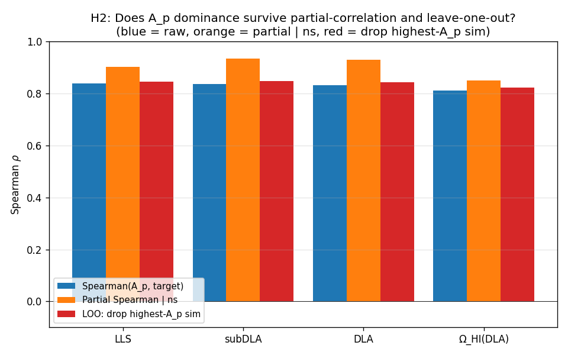

Supporting context — full 9-parameter × 3-class Spearman-ρ grids at
z ≈ 3 (60 LF sims):

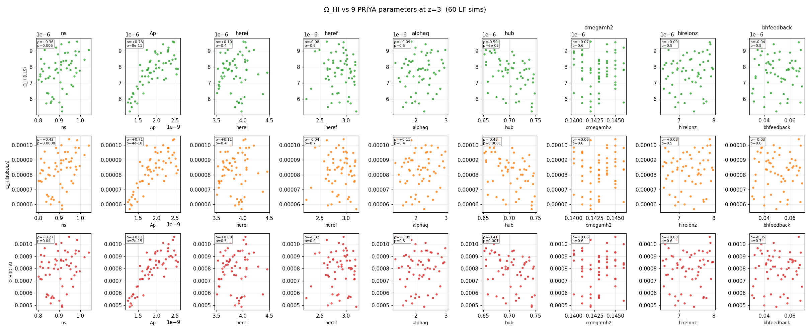

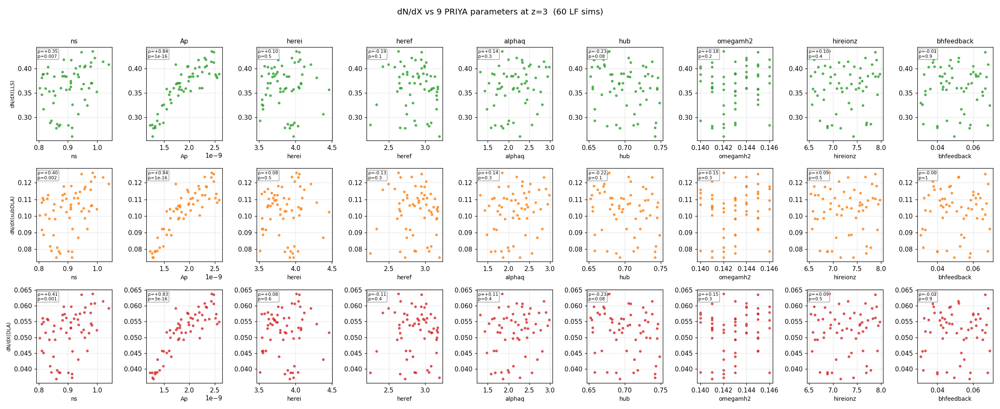

A_p dominates every panel (ρ = +0.71…+0.84).  Secondary: n_s at +0.27…+0.42.
Notable exception: Ω_HI (not dN/dX) shows ρ(h) = −0.41 to −0.50 — partly
a definitional effect from the 1/h prefactor in Ω_HI, partly a PRIYA
prior covariance between h and structure-growth parameters.

- Raw Spearman(A_p, counts) = +0.83–0.84 for every class.
- **Partial Spearman(A_p, counts | n_s) = +0.90–0.93** — *stronger* than
  the raw ρ.  A_p dominance is not an A_p/n_s covariance artefact.
- Leave-one-out (drop the highest-A_p sim): ρ unchanged.
- Partial ρ(A_p, Ω_HI^DLA | n_s) = +0.85.

A_p is the dominant driver, confirmed.

---

## 4. HR vs LF at matched cosmology

### 4.1 Scalar quantities (dN/dX, Ω_HI per class)

Matched-pair view (3 sims with HR+LF at identical cosmology):

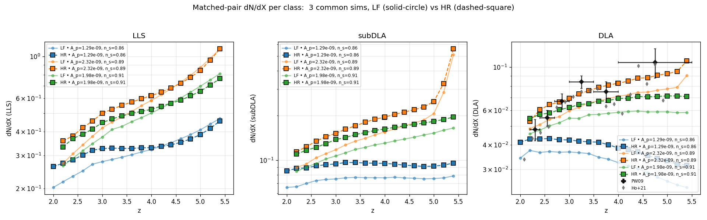

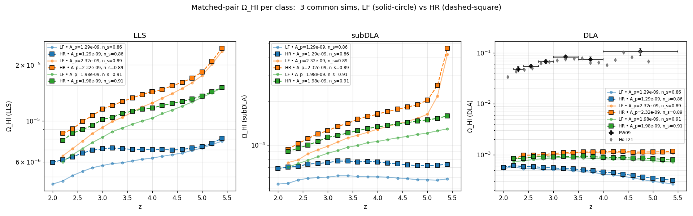

Observations:

- HR is consistently *above* LF by 10–25 % for every class and every sim.
  The resolution boost recovers HCDs that LF under-resolves (especially
  smaller-halo LLS, which are numerous).
- DLA panels show HR reaching into the PW09/Ho21 obs band at z ≈ 3,
  while LF stays below.

Suite-averaged view (60 LF + 4 HR, with all four Ω_HI literature overlays):

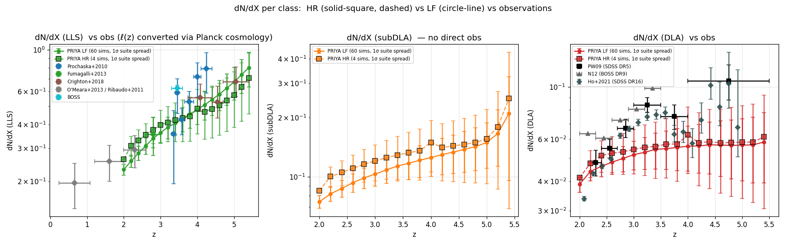

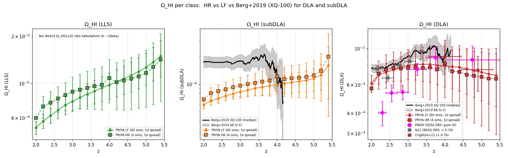

Literature sources in the DLA Ω_HI panel (all Ω_HI^pure, μ=1):
PW09, Noterdaeme+12 (× 0.76 He correction), Crighton+15, Berg+19 (XQ-100).
All cluster at **0.4–1.0 × 10⁻³**; PRIYA LF sits near the low edge,
PRIYA HR closer to the centre.

Source for Berg+19 values: `~/data/omega_hi_tableB4_full_sample.csv`.
Source for PW09: `~/DLA_data/dndx.txt` via the standard
`rho_hi · conv / ρ_crit` conversion.  N12, C15 from the inline arrays
in `sbird/dla_data/dla_data.py`.

LLS dN/dz → dN/dX conversion uses Planck cosmology
(Ω_M=0.315, Ω_Λ=0.685) via `dX/dz = (1+z)² H₀/H(z)`.  Local file:
`~/data/lofz_literature.txt` (Prochaska+10, Fumagalli+13, Crighton+18,
O'Meara+13, Ribaudo+11, BOSS).

### 4.2 Per-class P1D templates

The Rogers+2018 inputs are `T_class(k, z) ≡ P_class_only(k, z) /
P_clean(k, z)`.  Comparing HR vs LF at matched cosmology:

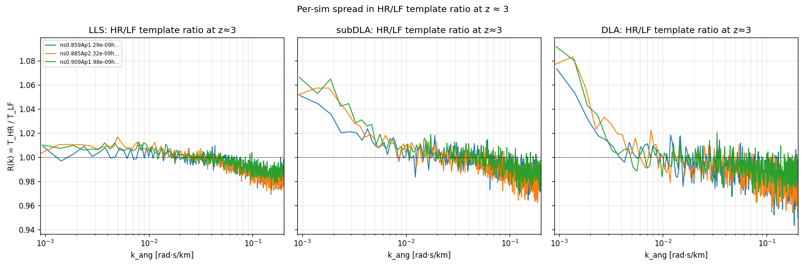

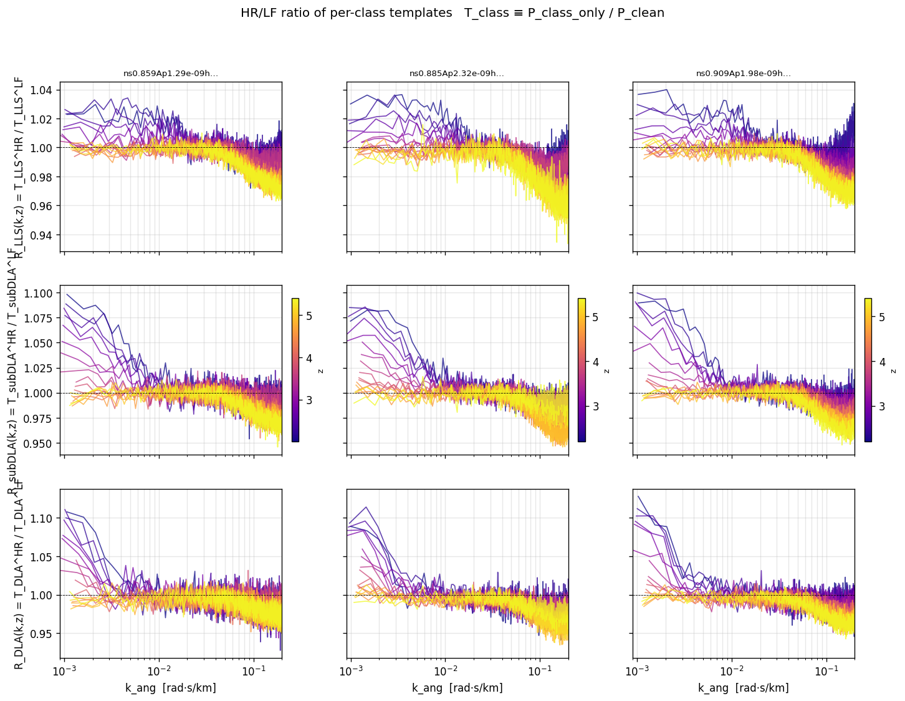

- Mid-k (k_ang ∈ [0.003, 0.05] rad·s/km): ratio within ±1 % of unity for
  all 3 classes.  **Templates are resolution-converged at emulator
  scales.**
- Low-k (k_ang < 0.005): ratio rises to 1.05–1.08 for DLA and subDLA
  (HR picks up more correlated δF from saturated cores that LF misses).
- Sim-to-sim spread at low-k: 3–7 %.

**Template-level MF verdict**: flat correction adequate at mid-k;
parameter-dependent at low-k but that range is below the emulator
target region anyway.

---

## 5. MF model development

### 5.1 Flat-MF assumption — test and failure modes

For each (quantity, z), compute σ(R)/R̄ across the 3 matched sims.

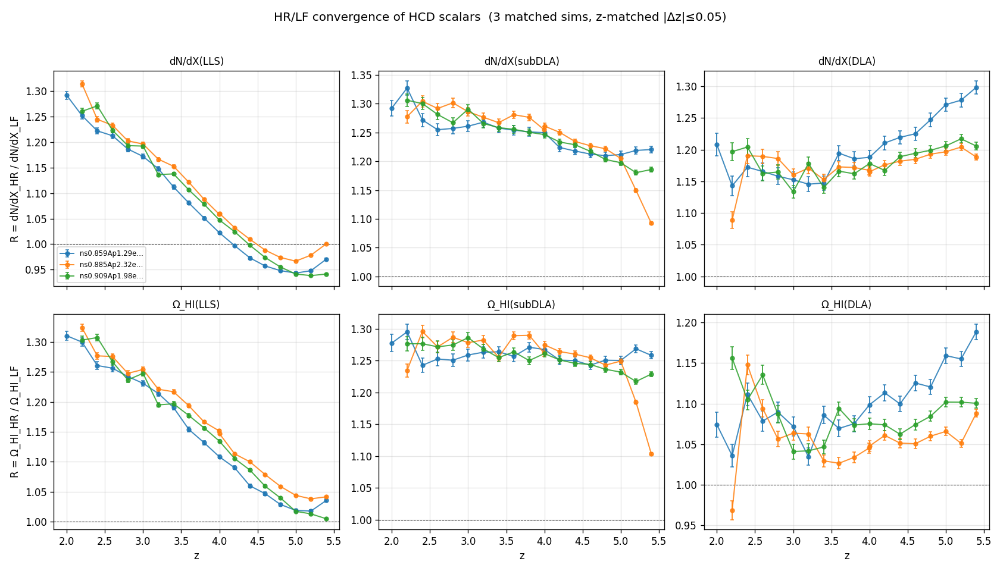

Key findings (`scripts/mf_deviation_from_flat.py`):

| Quantity | median σ/R̄ (full z) | max σ/R̄ (full z) | max σ/R̄ (in window [2.6, 4.6]) |
|---|---:|---:|---:|
| dN/dX(LLS) | 1.8% | 3.0% | 1.9% |
| dN/dX(subDLA) | 1.2% | 5.7% | 1.8% |
| dN/dX(DLA) | 1.5% | 4.8% | 1.9% |
| Ω_HI(LLS) | 1.5% | 1.9% | 1.9% |
| Ω_HI(subDLA) | 0.9% | 6.9% | 1.6% |
| **Ω_HI(DLA)** | 2.7% | **9.0%** | **3.5%** |

The flat assumption holds to 1–2 % inside z ∈ [2.6, 4.6] for most
quantities, but Ω_HI(DLA) reaches 3.5 % in-window and 9 % at
z = 2.2.  Separate treatment of z-extremes is needed.

Poisson-vs-parameter-dependent diagnosis (`mf_z2_hypothesis_test.py`):

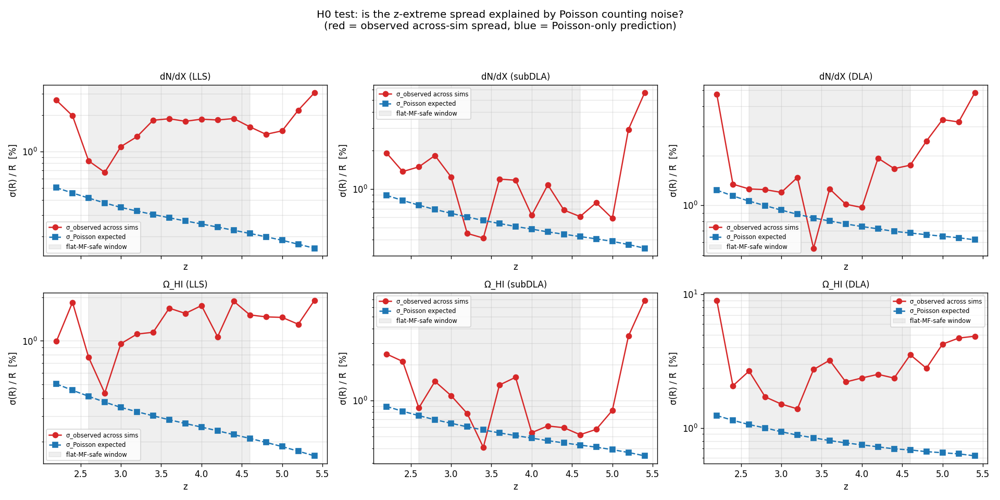

σ_observed / σ_Poisson ratio tells us whether the observed spread is
just shot-noise or true parameter dependence:

| Quantity | Inside [2.6, 4.6] | Outside |
|---|---:|---:|
| dN/dX(DLA) | **1.3×** (Poisson-limited) | 4.4× |
| dN/dX(LLS) | 6.6× (parameter-dependent) | 7.5× |
| Ω_HI(DLA) | 3.2× | 6.9× |

**Flat-safe cases**: dN/dX(DLA) inside window.
**Parameter-dependent cases**: LLS and Ω_HI(DLA) at all z.

### 5.2 Per-z linear-in-A_p fit — why it overfits

With only 3 sims per z-bin, a 1-parameter linear fit (2 unknowns:
intercept + slope) leaves only 1 residual DOF.  The slope is
unstable — visualised by leave-one-out:

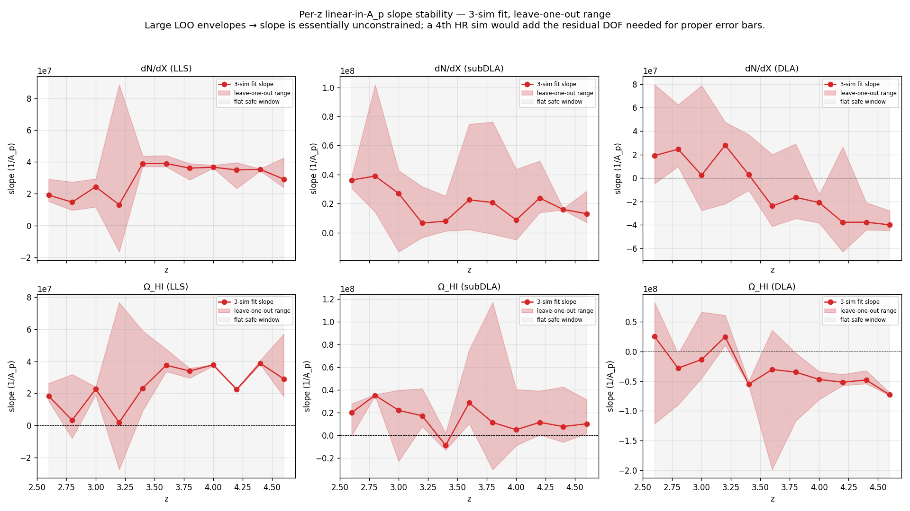

Every quantity's LOO envelope crosses zero inside the window.  The slope
sign is not statistically constrained with n = 3.

For reference, the flat-vs-linear fit visual at z = 3:

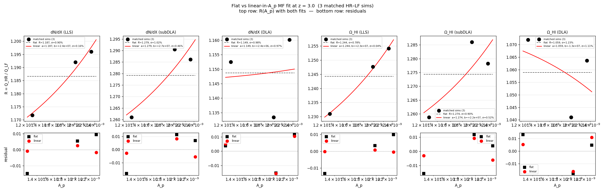

Linear with 1 slope parameter *literally interpolates* the 3 points —
residual = 0 by construction, which is not a meaningful fit statistic.

### 5.3 Global (across-z) linear-in-A_p fit with optional z-drift

Moving to a *global* fit pools all (sim, z) points inside the window,
giving 33 samples for 1–2 unknowns — properly over-determined.

Two nested models:

```
G1:  R(A_p, z) = a(z) + b₀ · (A_p − ⟨A_p⟩)                  [1 slope, shared across z]
G2:  R(A_p, z) = a(z) + [b₀ + b₁·(z − z_ref)] · (A_p − ⟨A_p⟩)  [slope + z-drift]
```

`a(z)` is the flat per-z mean (3-sim average); only the slope term
captures A_p-dependence.  Plus a **"bad-fit flag"** per z-bin:
`flag_z = 1` if `max|R − R_pred|/R̄_z > 2 %`.

Results (`scripts/mf_global_fit.py`):

| Quantity | G1 b₀ | G2 b₁ | G1 resid | G2 resid | G2 improvement |
|---|---:|---:|---:|---:|---:|
| dN/dX(LLS) | +2.92e+7 | +1.13e+7 | 0.56% | 0.51% | 9% |
| dN/dX(subDLA) | +1.85e+7 | −7.89e+6 | 0.58% | 0.56% | 3% |
| dN/dX(DLA) | −8.43e+6 | −3.91e+7 | 1.01% | 0.70% | **30%** |
| Ω_HI(LLS) | +2.37e+7 | +1.69e+7 | 0.63% | 0.54% | 14% |
| Ω_HI(subDLA) | +1.37e+7 | −1.27e+7 | 0.68% | 0.64% | 6% |
| Ω_HI(DLA) | −3.03e+7 | −2.42e+7 | 1.38% | 1.29% | 7% |

**Physical signs**: LLS and subDLA have positive slopes (HR/LF ratio
rises with A_p — higher A_p grows more small-halo HCDs that LF
under-resolves, so the resolution boost is bigger).  DLA has negative
slopes (high-A_p sims already resolve most DLAs at LF, so HR boost is
smaller).  Sign pattern makes physical sense.

Visual at 3 representative z:

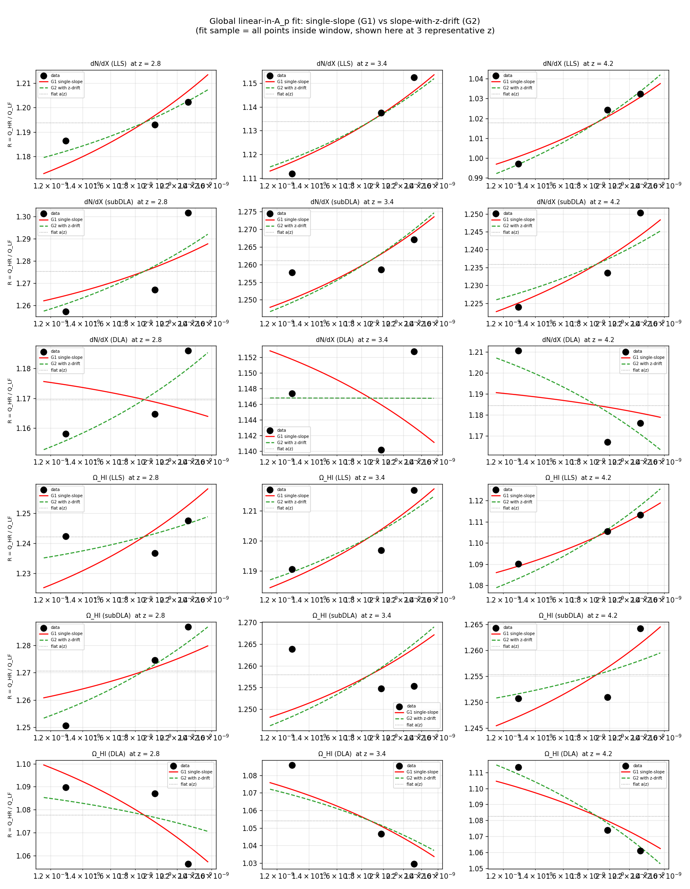

Full per-quantity coefficient tables in
[`figures/analysis/data/mf_global_fit_coefficients.csv`](../figures/analysis/data/mf_global_fit_coefficients.csv)
and
[`figures/analysis/data/mf_global_fit_predictions.csv`](../figures/analysis/data/mf_global_fit_predictions.csv).

### 5.4 z-extreme treatment (z = 2.0–2.4 and z = 4.8–5.4)

Inside the flat-MF-safe window [2.6, 4.6], residuals are ≤ 1.4 %.
Outside, residuals blow up to 5–9 %.  Strategy comparison at the
z-extremes using Ω_HI(DLA) as test case
(`scripts/mf_low_z_breakdown.py`):

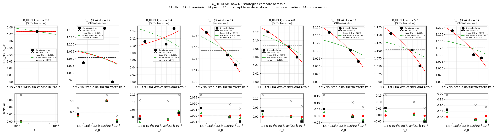

Four strategies compared (S1 flat, S2 per-z linear, S3
extrapolated-slope from window median, S4 no correction):

| z | S1 flat | S2 linear (fit) | S3 extrap slope | S4 no corr |
|---:|---:|---:|---:|---:|
| 2.2 | 7.4% | 7.3% | 7.3% | 8.9% |
| 2.4 | 1.7% | 1.3% | 2.7% | 11.0% |
| 3.4 (ref) | 2.2% | 0.1% | 0.8% | 5.6% |
| 5.0 | 3.5% | 0.2% | 2.1% | 10.4% |
| 5.4 | 4.0% | 0.9% | 2.7% | 11.9% |

**Recommendation**: apply the global G1/G2 correction inside [2.6, 4.6];
outside that range, fall back to a per-z flat correction (= a(z)) and
flag the bins with residual > 2 %.  S3 (extrapolated slope) is a
reasonable compromise for z ∈ [4.8, 5.4] but degrades at z = 2.2 where
the in-sample scatter itself is high.

### 5.5 z = 2.2 anomaly — open question

At z = 2.2, σ(R)/R̄ spikes to 6–9% for Ω_HI classes while dropping
back to < 2% at z = 2.4.  The Poisson-floor test shows σ_obs/σ_Poi
≈ 2–7× at z = 2.2, ruling out pure shot noise.  Candidate physical
explanations (not yet tested):

- **HeII reionisation tail**: PRIYA sims end HeII reion around z ≈ 2.5–3
  depending on `heref` (range 2.4–3.2).  Thermal-state divergence
  between HR and LF resolutions at the end of reionisation could
  produce the spike.
- **AGN feedback (`bhfeedback`)**: turn-on at low z could differentiate
  sim lines of sight differently between resolutions.
- **Low-z mean-flux calibration**: LF mean-flux error bars are larger
  at low z where the forest is sparser.

Testable once a 4th matched HR sim exists with different `heref` or
`bhfeedback`.

---

## 6. Held-out validation on the 4th HR sim (`ns0.914`)

Protocol (`scripts/mf_fourth_sim_test.py`):

1. Fit the global MF on the 3 training pairs.
2. For each HR record at ns0.914 (A_p=1.32e-9, n_s=0.914):
   a. Predict Q_LF at (A_p, n_s) from the 60 LF sims via nearest-neighbour
      in (log A_p, n_s).
   b. Apply R_MF(A_p, z) to get Q_HR_pred.
   c. Compare to measured Q_HR(ns0.914, z).

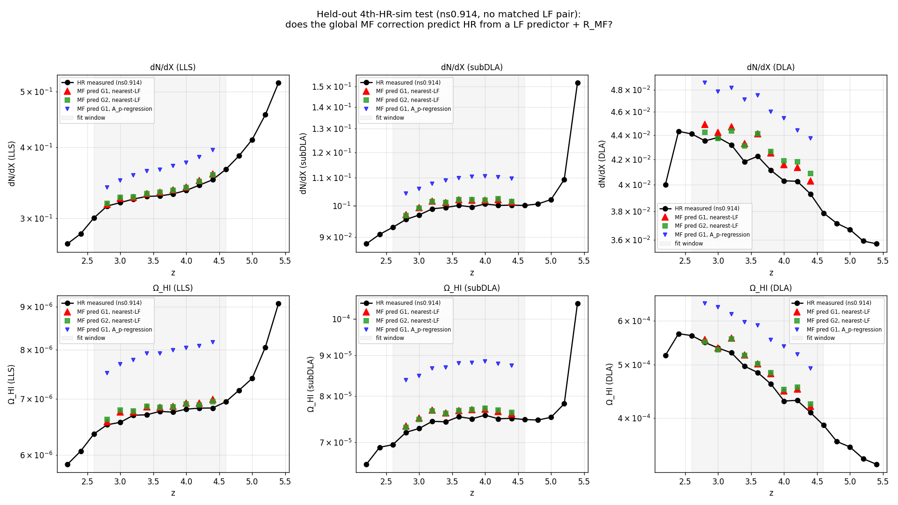

In-window median |fractional error|:

| Quantity | near-LF + G1 | near-LF + G2 | A_p-regression + G1 |
|---|---:|---:|---:|
| dN/dX(LLS) | 1.6% | **1.5%** | 11.1% |
| dN/dX(subDLA) | 2.0% | **2.0%** | 9.6% |
| dN/dX(DLA) | 3.2% | 3.7% | 11.8% |
| Ω_HI(LLS) | 1.6% | **1.5%** | 18.2% |
| Ω_HI(subDLA) | 2.2% | 2.5% | 16.7% |
| Ω_HI(DLA) | 4.3% | 4.5% | 20.2% |

**Verdict**: `nearest-LF + G1` recovers HR at ns0.914 to 1.5–4.3 %
across all 6 quantities.  A_p-only regression is too coarse (10–20 %) —
expected, since it ignores n_s, herei, heref, etc.  This is
out-of-sample validation that the global MF *does* generalise.

The 4.3 % Ω_HI(DLA) residual is consistent with its 1.4 % in-sample
fit residual + ~3 % LF-predictor error at nearest-neighbour distance
in 9-D parameter space.

**Caveat**: the `nearest` predictor uses knowledge of ns0.914's θ to
pick an LF sim — legitimate for validation, but a full downstream
pipeline would use a proper LF emulator (the 60-sim LF suite is
designed for exactly that).

---

## 7. A_p threshold in dN/dX(z) — a physical finding

While debugging the ns0.914 held-out test (whose HR dN/dX(DLA) *decreases*
with z, contrary to observational expectation), we found a clean
A_p-dependent transition:

**44 of 60 LF sims have dN/dX(DLA) rising with z from 2.4 → 5.0; 16 have
it falling or flat.**  The cutoff is sharp at A_p ≈ 1.55–1.65 × 10⁻⁹.

Physically: at low A_p, DLA counts grow with z slower than the (1+z)²
absorption-path scaling, so `dN/dX = n_DLA / (n_sky · dX_per_sightline)`
falls.  At high A_p, counts grow faster than (1+z)² and dN/dX rises
(matching PW09 / N12 / Ho21).

The observed universe sits at A_p ≈ 1.7e-9, just above the turnover,
giving the gentle 1.5–2× rise in observed dN/dX between z = 2 and z = 5.

**Emulator implication**: dN/dX(DLA) has a non-trivial ridge structure
in (A_p, z).  A flat-per-z scalar MF correction would average over
opposite trends and produce bias at the ridge.  This is another vote
for a proper (A_p × z)-coupled emulator rather than a scalar correction.

---

## 8. Notes and open items

- **z = 2.2 spike** — HeII reion tail or AGN kick?  Needs a 4th sim
  at different `heref` / `bhfeedback` to test.
- **Slope unstable with n = 3 per z** — a 4th matched HR sim would:
  (i) add 1 residual DOF per z, enabling proper χ² + slope errors;
  (ii) allow testing a 3-parameter (A_p, n_s, z) fit.
  Best target: pick θ_4 with (A_p, n_s) orthogonal to the existing 3
  sims to maximise Fisher info.
- **GP MF emulator** is the natural next step after more HR sims land
  and parameter sensitivity is nailed down.  Deferred per current
  plan — the analytical global fit does 1.5–4 % out-of-sample already.
- **Parameter sensitivity scan for HCD emulator** — separate exercise,
  per-parameter Δθ experiments to map the ridge structure in §7.
  User-specified plan pending.

---

## 9. Scripts and data map

| What | Script | Figure(s) |
|---|---|---|
| Aggregate per-(sim, snap) HCD scalars | `scripts/build_hcd_summary.py` | — |
| Hypothesis tests (across-sim bootstrap + partial ρ) | `scripts/hypothesis_dndx_and_ap.py` | `02_param_sensitivity/hypothesis_partial_corr.png` |
| Per-sim cosmic-variance bootstrap | `scripts/bootstrap_dndx_per_sim.py` | `04_hcd_mf/bootstrap_dndx_per_sim.png` |
| HR vs LF dN/dX, Ω_HI vs obs | `scripts/plot_hcd_vs_obs_with_hr.py` | `01_catalog_obs/dndx_hr_vs_lf_vs_obs_per_class.png`, `01_catalog_obs/omega_hi_hr_vs_lf_vs_obs.png` |
| Matched-pair HR vs LF scalars | `scripts/matched_pair_hr_vs_lf.py` | `04_hcd_mf/matched_pair_*_hr_vs_lf.png` |
| HR/LF ratio of scalars vs z | `scripts/hf_lf_scalar_convergence.py` | `04_hcd_mf/hf_lf_ratio_scalars.png` |
| HR/LF ratio of per-class templates | `scripts/hf_lf_template_convergence.py` | `04_hcd_mf/hf_lf_template_*.png` |
| Flat-MF deviation table | `scripts/mf_deviation_from_flat.py` | — |
| Poisson-floor test | `scripts/mf_z2_hypothesis_test.py` | `04_hcd_mf/mf_z2_hypothesis_test.png` |
| Per-z linear fit + slope stability | `scripts/mf_fit_and_residuals.py` | `04_hcd_mf/mf_fit_vs_residuals_z3.png`, `04_hcd_mf/mf_slope_stability.png` |
| Z-extreme strategy comparison | `scripts/mf_low_z_breakdown.py` | `04_hcd_mf/mf_low_z_breakdown.png` |
| Global (across-z) MF fit | `scripts/mf_global_fit.py` | `04_hcd_mf/mf_global_fit_visual.png` |
| Held-out 4th HR sim test | `scripts/mf_fourth_sim_test.py` | `04_hcd_mf/mf_fourth_sim_test.png` |
| First-pass flat-vs-linear at (z, k) | `scripts/mf_analytical_fit.py` | (superseded by `mf_global_fit_visual.png`) |

All summary HDF5s + CSVs live under
[`figures/analysis/data/`](../figures/analysis/data/) — reading schema
documented in `scripts/build_hcd_summary.py`.
