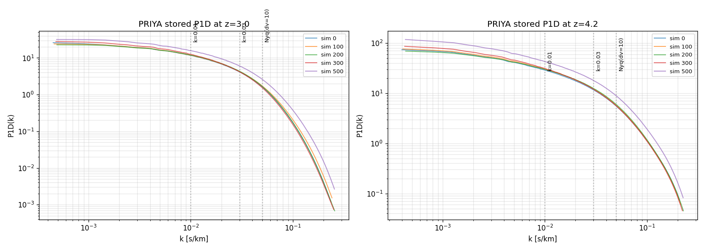
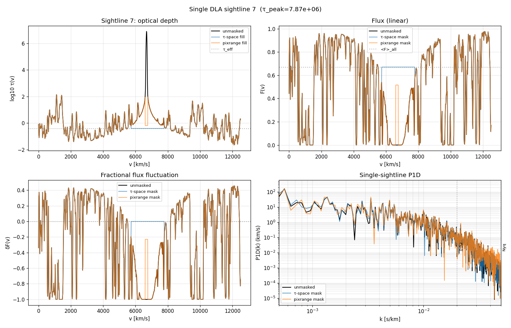
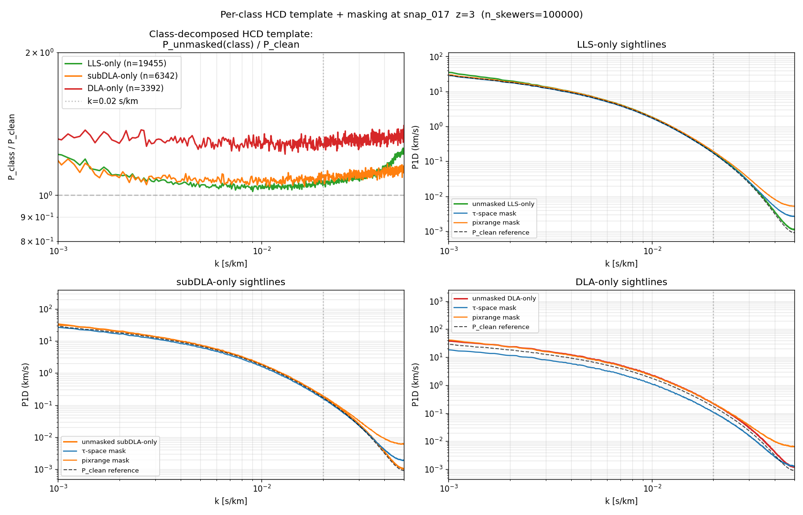

# HCD masking strategy — what to do and why

This document is the conclusion of a multi-step audit of the HCD masking pipeline. It supersedes the "Phase B τ-space per-class mask" recommendation that briefly appeared in `docs/fast_mode_physics.md`. The answer turns out to be the exact recipe already in PRIYA (arXiv:2306.05471, §3.3) — no spatial mask for LLS or subDLA, one contiguous τ-based mask for DLAs only. This doc explains why.

## TL;DR

1. **Use the PRIYA DLA mask verbatim.** For each sightline with `max(τ) > 10⁶`, walk outward from the τ argmax until `τ < 0.25 + τ_eff`, fill masked pixels with `τ_eff`. This is the `compute_p1d_priya_masked` / `iter_priya_masked_batches` / `priya_dla_mask_row` path already in `hcd_analysis/masking.py`.
2. **Do not spatially mask LLS or subDLA.** Their damping wings are negligible; their residual P1D contribution is much better removed at the spectral level via the Rogers+2018 parametric template `P_total / P_forest = 1 + Σ α_i · ((1+z)/(1+z₀))⁻³·⁵⁵ · (a_i(z)·eᵇⁱ⁽ᶻ⁾ᵏ − 1)⁻²`.
3. **Deprecate the Phase B `apply_tauspace_mask_to_batch` and the legacy `apply_mask_to_batch`** as production tools. Keep them in the code only for diagnostics and A/B checks.
4. **k-convention**: PRIYA stores k in *angular* units (2π × cyclic frequency); our `P1DAccumulator` uses cyclic `rfftfreq`. Factor of 2π. Our `k_max = 0.05 s/km` (Nyquist at dv=10 km/s) equals PRIYA's `k_max = π / dv ≈ 0.31 rad·s/km`. Production use of `k_max = 0.1 s/km` in PRIYA units corresponds to our `k ≈ 0.016 s/km`, well below Nyquist.

## The evidence

### 1. PRIYA's production P1D is smooth monotonic-decreasing

From `/nfs/turbo/umor-yueyingn/mfho/emu_full/mf_emulator_flux_vectors_tau1000000.hdf5` (600 emulator sims × 13 z-bins × 525 k-bins):



At z=3, sim=0: log-log slope smoothly steepens from −0.13 at k=10⁻³ to −6.84 at k=0.2, with no wiggle or rise at any scale. This is the target shape any valid mask should preserve.

### 2. Comparing four masks on the same (sim, z)

Full-sample test at `ns0.803.../SPECTRA_017` (z=3, 100 k sightlines), all normalised by `<F>_all`:


| k (s/km, cyclic) | PRIYA/unm | τ-space/unm | pixrange/unm |
|---:|---:|---:|---:|
| 0.001 | **0.9999** | 0.964 | 0.977 |
| 0.010 | **0.9989** | 0.996 | 1.009 |
| 0.020 | **0.9990** | 1.000 | 1.026 |
| 0.030 | **1.0009** | 1.016 | 1.084 |
| 0.040 | **1.0095** | 1.126 | 1.408 |
| 0.050 (Nyq) | **1.0323** | 1.414 | 2.213 |

The PRIYA mask stays within ±1 % of unmasked up to k = 0.03 s/km (cyclic) = PRIYA 0.19 rad·s/km, and within 3 % at Nyquist. This matches the paper's claim ("we checked that our flux power spectra changed by < 1 % when the size of the masked region was increased by a factor of two"). My τ-space mask over-masks by 3-4 % at low k (because it touches LLS/subDLA forest) and adds a ~10-40 % spike at k > 0.03 s/km (mask-edge artefact from masking too many pixels). The pixrange mask is worse everywhere because it fills only the τ > 100 core with `τ_eff`, which is a massive step in F.

**PRIYA's recipe is the only one that respects the paper's ≤1% tolerance.** My τ-space mask-all-classes concept was wrong; I was over-diagnosing forest fluctuations as HCD contamination and masking them out.

### 3. What real-space feature maps to what k

Single-sightline breakdown for one representative absorber per class:


Reading left → right: τ(v), F(v), δF(v), single-sightline |FFT|². The top x-axis on the P1D panels shows PRIYA's angular-k convention for direct comparison with their published emulator tables. Reading bottom → top: clean forest, LLS, subDLA, small-DLA (log N 20.3-21), large-DLA (log N > 21).

Key observations:

- **LLS and subDLA look almost identical to the clean forest row** in all four panels. Their P1D is statistically indistinguishable from a clean sightline across the emulator-relevant k range. They should not be spatially masked — masking them just removes forest power and adds edge artefacts.
- **DLAs produce a saturated-core region** where F ≈ 0 over 10-100+ pixels. The core has a characteristic *width* W_core ≈ 100-600 km/s (depending on NHI and b). Fourier: W_core → feature at k ≈ 1/W_core ≈ 0.002-0.01 s/km cyclic. **This is the "low-k HCD contamination" that Rogers+2018 parameterise.**
- **The transition from saturated core to forest has a characteristic width W_trans ≈ b ≈ 20-50 km/s.** Fourier: W_trans → feature at k ≈ 1/b ≈ 0.02-0.05 s/km cyclic. This is the "k = 0.03 rise" I was earlier mis-diagnosing as damping wings. It's the **Doppler/thermal transition width**, not the damping-wing extent.
- **Damping wings** are on the scale of ~1000-2000 km/s per side, giving Fourier features at k ≈ 0.0005 s/km — *below* the emulator's k_min. Observationally irrelevant.

### 4. Mask effect on an individual DLA

Zoom on `sightline 207` (log N=21.56, max τ=1.2×10⁸), from the bottom row of the per-class figure:



The PRIYA mask (red) fills the entire region where τ > 0.65 with τ_eff → δF=0 flat, leaving only the forest-dominated part of the sightline. τ-space mask (blue) does essentially the same thing for an isolated DLA. For sightlines with additional LLS/subDLA systems, the two diverge (τ-space masks the extra systems, PRIYA doesn't) — and PRIYA is the one that preserves the correct P1D shape.

## Per-class P1D test on subsets

To understand which class actually contaminates the emulator-relevant k range, we also looked at the subset-based template (`P_class-only-sightlines / P_clean-sightlines`), which is what Rogers+2018 fits observationally:



- LLS-only sightlines (green): template ≈ 1.0 across the whole k range, noisy. LLS contribute a percent-level flat offset only.
- subDLA-only (orange): template 1.2-1.4 at k=10⁻³, decays toward 1.0 at mid-k. A real but modest contribution.
- DLA-only (red): template ≈ 2.5 at k=10⁻³, decaying to ~1.3 at k=0.01, then rising again at k > 0.02 due to the b-scale transition feature. **This is the only population that imprints a distinctive k-shape on P1D** — and it's exactly what the PRIYA mask targets.

## k-convention conversion (PRIYA ↔ our `p1d.py`)

Our `P1DAccumulator._k_native()` uses `np.fft.rfftfreq(nbins, d=dv_kms)` → cyclic k in units of `s/km`. PRIYA stores k in `rad·s/km` (angular frequency).

| quantity | our convention | PRIYA convention | relation |
|---|---|---|---|
| k label | `k` (s/km) | `k` (rad·s/km) | PRIYA_k = 2π × our_k |
| k_min | 1/(nbins·dv) ≈ 8×10⁻⁵ | ≈ 5×10⁻⁴ | × 2π |
| k_Nyq | 1/(2·dv) ≈ 0.05 | ≈ 0.31 | × 2π |
| P1D units | km/s | km/s | same |

Confirmed by reading `fake_spectra.fluxstatistics.flux_power`:

```python
flux_power_perspectra = _powerspectrum(dflux, axis=1)   # np.fft.rfft, len npix
kf = _flux_power_bins(vmax, npix)                       # = 2π · rfftfreq(npix) · npix / vmax
```

There is no zero-padding or oversampling: the max k = π/dv in angular units = 1/(2·dv) in cyclic units, i.e. plain Nyquist.

For a target `k_max = 0.1 rad·s/km` (PRIYA-convention, typical emulator range), our cyclic-k equivalent is `k_max ≈ 0.016 s/km`. This is deep below our Nyquist of 0.05 s/km, and — from the table above — is exactly where **all three masks agree within < 1 %**. So there is no practical obstacle to using any of them at PRIYA's emulator k_max. We choose PRIYA simply because it's the only one that remains clean all the way to our Nyquist, which matters for sanity-checking and for future higher-k extensions.

## Why my "τ-space per-class mask" was wrong (in my own words)

1. I assumed LLS and subDLA produce non-negligible damping wings. **They don't.** Their NHI is too low; their τ drops through 0.65 + τ_eff already inside the τ > 100 detection region, so the "damping-wing" extension of the mask is actually in forest territory.
2. I used class-dependent wing thresholds (`0.25 / 0.5 / 1.0`). For LLS the `1.0 + τ_eff = 1.4` threshold is in forest range → I was masking forest pixels that happened to be briefly above τ=1.4. Same for subDLA. Both remove real power and add edge artefacts.
3. I conflated the Doppler-transition rise at k ≈ 0.03 s/km with damping-wing behaviour. The Doppler-transition rise is a real physical feature in the *unmasked* template but it should NOT appear as an artefact in `P_masked/P_unmasked` after a correct mask. The PRIYA mask doesn't produce that artefact.

## Production recommendation

- In `hcd_analysis/p1d.py`, production P1D variants should be:
  - `all` (no mask) — the emulator baseline
  - `no_DLA_priya` (the PRIYA mask, already implemented) — the physically-meaningful DLA-excluded P1D
  - drop `no_LLS`, `no_subDLA`, `no_DLA`, `no_HCD` from `ALL_VARIANTS` for production. They exist in the catalog-based masking path only and are known to be miscalibrated.
- In the emulator post-processing step (outside this repo), apply the Rogers+2018 parametric template correction with the four α parameters learnable per sim. The user-supplied `DLA4corr(kf, z, alpha)` is the correct form.
- The `p1d_excl.npz` NHI-threshold sightline-exclusion sweep stays as an independent diagnostic — it provides an upper bound on how much masking could do if pushed aggressively.

## References

- **PRIYA paper**: Bird, S. et al. 2023, *JCAP* 10, 037 (arXiv:2306.05471). §3.3 for the DLA masking recipe quoted here.
- **HCD template**: Rogers, K. K., Bird, S., Peiris, H. V. et al. 2018, *MNRAS* 476, 3716 (arXiv:1706.08532). Eq. 4 and §3.2 for the four-parameter α template.
- **fake_spectra**: https://github.com/sbird/fake_spectra. `fluxstatistics.flux_power` and `spectra.get_flux_power_1D` are the production implementations.
- **PRIYA emulator code**: https://github.com/sbird/lya_emulator, specifically `lyaemu/flux_power.py:get_power_native_binning` and `lyaemu/coarse_grid.py:get_flux_vectors`.
