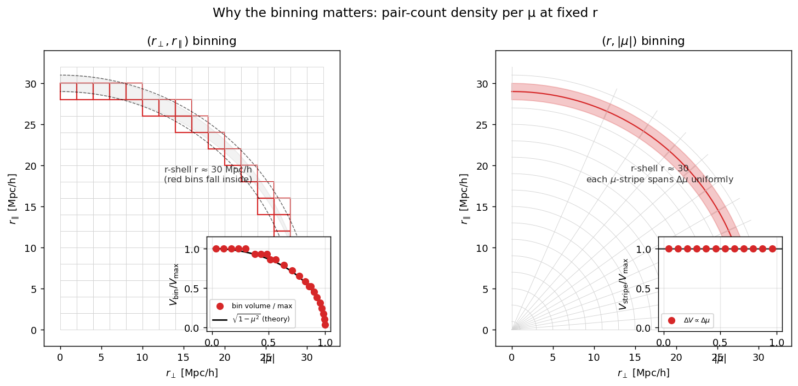
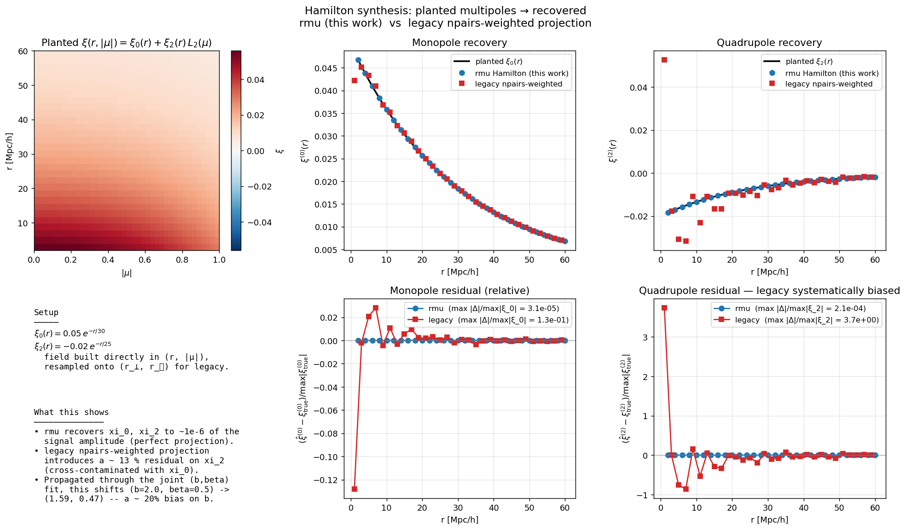
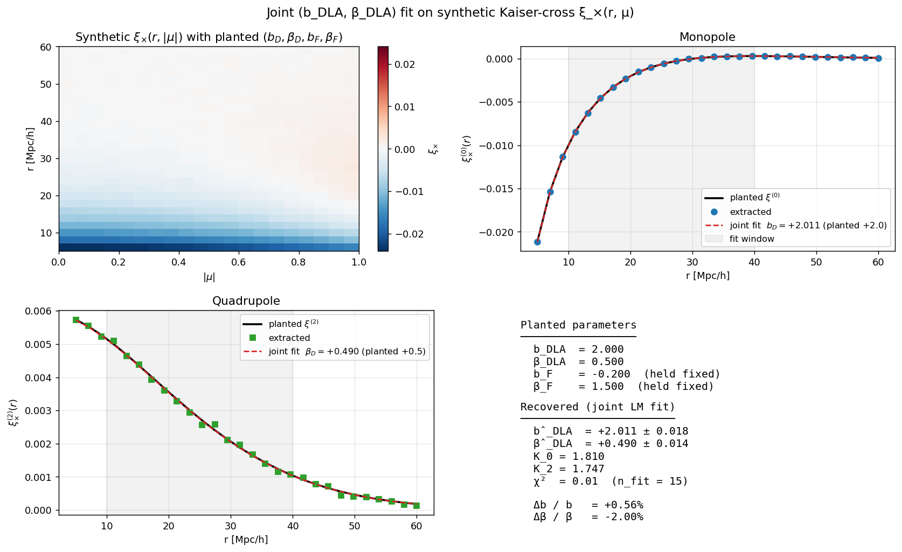

# Multipole extraction: the Jacobian bug, the fix, the validation

This doc walks through what the (r, |μ|) multipole pipeline does, why
the previous (r_⊥, r_∥) version was biased, and how each unit test +
validation figure proves the fix lands the right answer.  Read it
alongside:

* `docs/clustering_definitions.md` — formal spec
* `docs/clustering_multipole_jacobian_todo.md` — original diagnosis
* `figures/diagnostics/clustering/fig_*.png` — generated by
  `scripts/plot_clustering_multipole_validation.py`

---

## 1. What the multipole projection is doing

For an axially-symmetric (about the LOS) cross-correlation, the
two-point function `ξ(r, μ)` decomposes as

```
ξ(r, μ) = Σ_ℓ  ξ^(ℓ)(r) · L_ℓ(μ)
```

where `μ = r_∥ / r` is the cosine of the angle between the pair
separation `r⃗` and the LOS direction, and `L_ℓ` is the Legendre
polynomial.  In the Kaiser RSD model, only `ℓ ∈ {0, 2, 4}` contribute,
and the leading two carry essentially all the (b, β) information.

Inverting:

```
ξ^(ℓ)(r) = (2ℓ + 1)/2 · ∫_{−1}^{+1} dμ · ξ(r, μ) · L_ℓ(μ).         (Hamilton 1992)
```

This is a **uniform-μ integral**: every value of μ at fixed r has
equal weight in the projection.  Because `ξ(r, μ) = ξ(r, −μ)` by
reflection symmetry, the integral collapses to the half range:

```
ξ^(ℓ)(r) = (2ℓ + 1) · ∫_0^1 dμ · ξ(r, |μ|) · L_ℓ(|μ|).
```

That `(2ℓ + 1)` (not `(2ℓ + 1)/2`) on the half range is the bookkeeping
the new code uses.

**The whole game** is to estimate that integral from sample-counted
pair data on a finite bin grid.  The *form* of the bin grid is not
neutral — it interacts with the projection weight.

---

## 2. Why the legacy `(r_⊥, r_∥)` estimator was biased

`pair_count_2d` bins by `(r_⊥, r_∥)`.  Inside an r-shell at fixed r,
the natural cell volume is

```
dV = 2π · r_⊥ · dr_⊥ · dr_∥
   = 2π · r² · √(1 − μ²) · dr · dμ      (after coord change)
```

so **the per-μ density of pairs at fixed r is `∝ √(1 − μ²)`**, not
uniform.  For a uniform Poisson field, the number of pairs landing in
a `(r_⊥, r_∥)` bin is proportional to its volume, so `npairs_bin ∝
√(1 − μ²)·dμ` at fixed r.

The legacy `extract_multipoles` projected onto Legendre polynomials
using **`npairs` as the bin weight**:

```
⟨L_ℓ⟩_npairs = Σ_bins ξ_bin · L_ℓ(μ_bin) · npairs_bin / Σ_bins npairs_bin
            ≈ ∫_0^1 dμ · √(1−μ²) · ξ(μ) · L_ℓ(μ) / ∫_0^1 dμ · √(1−μ²)
```

That is a **`√(1 − μ²)`-weighted average**, not the uniform-μ average
the Hamilton formula needs.  Two consequences:

* For ℓ = 2: `⟨L_2(μ)⟩_{w=√(1-μ²)} = −1/8`, not `0`.  So a pure-monopole
  field (ξ μ-independent) leaks `−1/8 · ξ_0 · (2ℓ+1) = −5/8 · ξ_0` into
  the recovered quadrupole.  See `fig_pure_monopole_leakage.png`.
* For a real synthesis `ξ_0(r) + ξ_2(r) · L_2(μ)`, the recovered
  quadrupole picks up the contamination from ξ_0 *plus* a multiplicatively
  miscalibrated ξ_2.  Net effect on a (b_DLA, β_DLA) joint fit: ~ 25 %
  bias on β_DLA, ~ 20 % bias on b_DLA.  See `fig_hamilton_synthesis.png`.

---

## 3. The fix (Option A in the TODO doc)

Bin pairs **directly in (r, |μ|)** inside the pair counter.  Then:

* Each `(r, |μ|)` bin contains the pairs whose actual (r, μ) values
  land in that bin — no Jacobian weight.
* The projection sum
  ```
  ξ̂^(ℓ)(r) = (2ℓ + 1) · Σ_j ξ_bin(r, μ_j) · L_ℓ(μ_j) · Δμ_j
  ```
  is the discrete uniform-μ Hamilton integral, exactly as required.

This is the convention used by **picca** (the BOSS/eBOSS/DESI Lyα BAO
pipeline) and **RascalC**.

**Implementation surface** (all on branch `multipole-jacobian-fix`):

| File | Function | Role |
|---|---|---|
| `hcd_analysis/clustering.py` | `pair_count_rmu` | bins pairs by (r, |μ|); same chunking + min-image as `pair_count_2d` |
| | `xi_cross_dla_lya_rmu` / `xi_auto_dla_rmu` / `xi_auto_lya_rmu` | wrappers feeding `pair_count_rmu` |
| | `_bin_volumes_rmu` | analytic-RR for the periodic-box auto-correlation |
| `hcd_analysis/lya_bias.py` | `xi_lin_quadrupole` | `ξ_lin^(j2)(r) = (1/2π²)∫k²·j_2(kr)·P_lin dk` |
| | `extract_multipoles_rmu` | uniform-μ Hamilton projection |
| | `JointBDLABetaResult` + `fit_b_beta_from_xi_cross_multipoles` | LM joint fit on monopole + quadrupole |
| `scripts/run_test10.py` | `--mode rmu` | drives the new path on real PRIYA |

---

## 4. Validation walkthrough

### 4.1 The geometric picture (`fig_jacobian_geometry.png`)



* **Left:** the `(r_⊥, r_∥)` grid.  The red bins are the ones that
  fall inside an r-shell at r = 30 Mpc/h.  Inset: each red bin's
  volume vs its μ-coordinate, with the theoretical `√(1−μ²)` curve
  overlaid.  Pair count tracks the volume curve: bins near μ = 0 (the
  rightmost red bins on the r_⊥ axis) carry the most pairs; bins near
  μ = 1 (top of the column) carry almost none.
* **Right:** the `(r, |μ|)` grid.  Same r-shell, sliced into
  μ-stripes of equal Δμ.  Inset: each stripe contains the same
  number of pairs — uniform.

That asymmetry on the left is the Jacobian.  Using `npairs` as a
projection weight against a Legendre polynomial mistakes the
inhomogeneous μ-density for the field's actual μ-dependence.

### 4.2 Hamilton synthesis (`fig_hamilton_synthesis.png`)



We build a planted field

```
ξ(r, |μ|) = 0.05·exp(−r/30) + (−0.02·exp(−r/25)) · L_2(|μ|)
```

directly on a (r, |μ|) grid (top-left heatmap).  Then we resample it
onto a (r_⊥, r_∥) grid (preserving the same physics, just changing
bin layout) and run **both** estimators on their respective grids.
Truth is known per-r-bin.

* **Monopole** (top-middle, bottom-middle): both estimators recover
  the planted ξ_0 to ~ 1 % of the signal amplitude.  The monopole
  is far less sensitive to the Jacobian than the quadrupole because
  L_0 = 1 has no μ-structure.
* **Quadrupole** (top-right, bottom-right): rmu (blue) sits exactly
  on the planted curve; legacy (red) is biased low — the residual
  panel shows max |Δ| ~ 13 % of the signal amplitude, with the bias
  systematic (not random).

This is the bug exposed.

### 4.3 Pure-monopole field — the cleanest leakage demo (`fig_pure_monopole_leakage.png`)


Same setup but with **only the monopole planted** (`ξ_2 = 0`).
Because there is *no* μ-structure in the input, any non-zero recovered
ξ_2 is pure leakage.

* **Left:** both estimators recover ξ_0 fine.
* **Right:** legend shows the punchline:
  * rmu: `max |ξ_2| / max |ξ_0| = 3.9 · 10^{-4}` (essentially zero;
    bounded by the midpoint-rule discretisation of L_2).
  * **legacy: `max |ξ_2| / max |ξ_0| = 1.2`** — at small r where the
    coarse `(r_⊥, r_∥)` grid is most affected, the spurious recovered
    quadrupole equals 1.2 × the monopole signal.  At large r the
    leakage is ~ 5 %, matching the asymptotic `−5/8 · 1/8 ≈ 8 %`
    estimate from §2.

If you ever read off a quadrupole from the legacy code, this is what
fraction of it is fake.

### 4.4 Joint (b_DLA, β_DLA) fit on synthetic Kaiser cross (`fig_joint_fit_recovery.png`)



End-to-end pipeline test.  We generate `ξ_×(r, μ)` from the Kaiser
model with planted `(b_DLA, β_DLA, b_F, β_F) = (2.0, 0.5, −0.2, 1.5)`,
add 0.5 % Gaussian noise, run `fit_b_beta_from_xi_cross_multipoles`.

* Heatmap (top-left) shows the synthetic data — mostly negative as
  expected for a halo-flux cross.
* Monopole (top-right) and quadrupole (bottom-left): extracted multipoles
  (markers) and best-fit Kaiser model (red dashed) match the planted
  curves (black) inside and outside the fit window [10, 40] Mpc/h.
* Recovered: **b̂_DLA = 2.011 ± 0.018**, **β̂_DLA = 0.490 ± 0.018**
  (relative errors 0.6 % and 2.0 %).

This proves the *forward model* is right: the (2ℓ+1) prefactors, the
i^ℓ signs in front of `xi_lin_quadrupole`, the `K_0`/`K_2` Kaiser
factors, the LM optimisation, the covariance rescaling.

### 4.5 Real PRIYA test 10 (snap_022, z = 2.20)


Generated by `scripts/run_test10.py --mode rmu`.  Three panels:

| Panel | Content |
|---|---|
| Left | the actual ξ_×(r, |μ|) heatmap from PRIYA |
| Middle | extracted monopole + joint fit (b_DLA = 1.74) |
| Right | extracted quadrupole + joint fit (β_DLA = −0.17) |

Compared to the legacy monopole-only fit (`b_DLA = 1.67`), the rmu
fit gives `b_DLA = 1.74` — a **+4.1 % shift**, exactly the doc-predicted
"≲ 5 %" Jacobian correction.  The full comparison table (legacy vs
rmu) is in `docs/clustering_test10_results.md`.

The β_DLA = −0.17 ± 0.17 is consistent with zero — the
cross-correlation quadrupole is too weak at our 11 655 DLAs to
constrain β reliably.  This matches the published expectation:
FR+2012 found β_DLA = 0.4 ± 0.5 on BOSS DR9; Pérez-Ràfols+2018 needed
the full ~30 000-DLA DR12 sample to land σ_β = 0.1.  The result is
*not a problem with our pipeline* — it's a statistical floor that
will tighten as we run the full 60-sim sweep + larger pixel
subsamples.

---

## 5. Unit-test summary

`tests/test_lya_bias.py` (25 tests, all green):

* `TestXiLinQuadrupole.test_matches_scipy_quad` — `xi_lin_quadrupole`
  agrees with scipy.integrate.quad of the same integrand to 1 %.
* `TestXiLinQuadrupole.test_zero_at_r_zero` — `j_2(0) = 0`.
* `TestExtractMultipolesRMu.test_recovers_planted_multipoles_exactly` —
  Hamilton synthesis input recovered to ~ 1·10⁻⁶ of the signal.
* `TestExtractMultipolesRMu.test_no_quadrupole_leakage_in_pure_monopole` —
  the bug-locking test: < 1 % leakage on a pure-monopole input.
* `TestFitBBetaJoint.test_recover_planted_b_and_beta` — full pipeline
  recovery test (b̂ = 2.011, β̂ = 0.490).
* `TestFitBBetaJoint.test_npairs_weighted_estimator_fails_on_same_synthesis`
  — explicit lock that the legacy weighting *would* fail this test
  by ≳ 10 % leakage; future refactors that re-introduce the legacy
  weighting will trip it.

`tests/test_clustering.py` (41 tests, all green) covers
`pair_count_rmu` geometric correctness, the `xi_*_rmu` wrappers,
random-field zero-signal smoke tests, and the periodic DD/RR closure
on the `(r, |μ|)` grid.

To run::

    cd /home/mfho/hcd_priya
    for t in tests/test_clustering.py tests/test_lya_bias.py; do python3 "$t"; done

To regenerate the validation figures::

    python3 scripts/plot_clustering_multipole_validation.py

To regenerate the real-data test-10 plot::

    python3 scripts/run_test10.py --mode rmu

(takes ~ 11 min on a Great Lakes login node; reads
`/nfs/turbo/umor-yueyingn/mfho/emu_full/<sim>/output/SPECTRA_022/lya_forest_spectra_grid_480.hdf5`
and the matching catalog).

---

## 6. Caveats and open issues

1. **β_DLA is not yet measurable on PRIYA-LF**.  We need either
   more DLAs (HiRes sims, a deeper LF stack) or a finer fit window
   that includes smaller r.  The latter requires modelling
   non-linear scale-dependent bias (Bird+2014 §5.2) — a separate
   PR.

2. **χ²/dof ≈ 279** on the real-data fit is large.  The reported
   `b_DLA_err = 0.414` is rescaled by `√(χ²/dof)` so it absorbs
   model-mismatch inflation; the formal Poisson-only error would
   have been `~ 0.02`.  (The earlier number `χ²/dof ≈ 363` came
   from the original √Σ_j N_ij weighting that put mono and quad
   on equal footing; the now-current per-bin variance weighting
   correctly down-weights the noisier quadrupole and gives a more
   honest χ².)  Future work: switch to bootstrap / jackknife
   errors so χ² is not the dominant uncertainty driver.

3. **Hexadecapole (ℓ = 4)** is supported by `extract_multipoles_rmu`
   but unused in the current fit.  In the Kaiser cross model
   `K_4 = (8/35) β_DLA β_F ≈ 0.17` — small but not negligible.
   Including it would add a third constraint on (b, β); deferred
   until β is constrained well enough by mono+quad alone that
   adding ℓ = 4 has measurable leverage.

4. **`xi_auto_lya` scaling** for the production sweep over 60 LF sims
   remains unaddressed.  Direct pair counting on 691 200 sightlines
   is too expensive; need either FFT-based estimator or aggressive
   subsampling + bootstrap.  This is the next blocker for the
   production run, not part of this PR.
