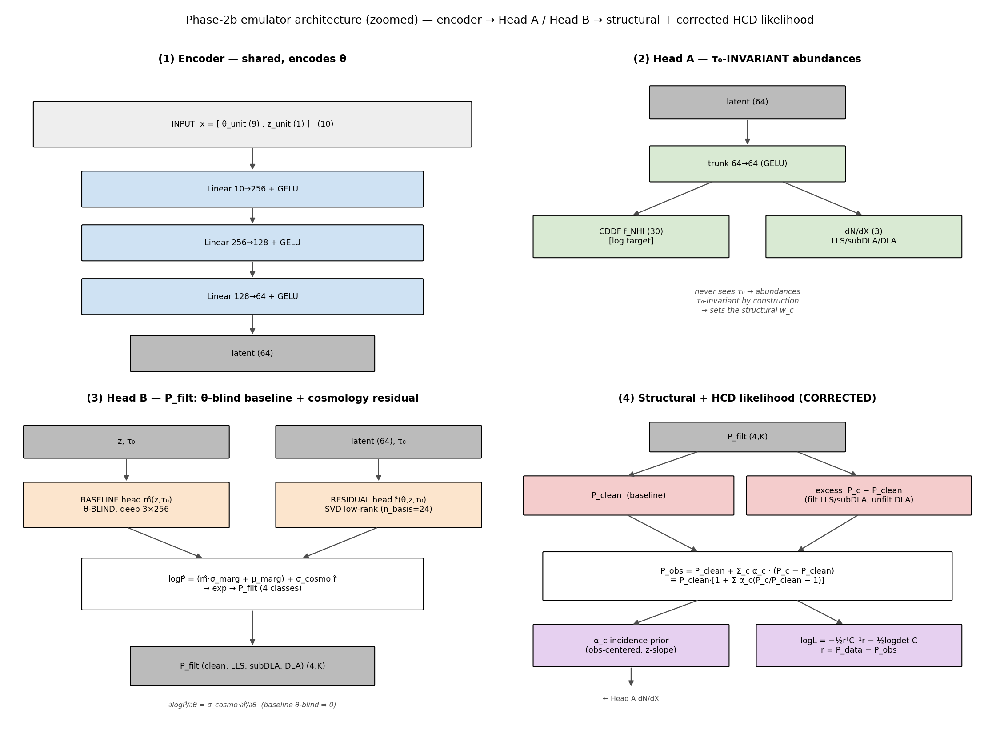

# Phase-2 emulator + Phase-C likelihood — comprehensive walkthrough

> **For:** M.-F. Ho · **Date:** 2026-06-04 · **Branch:** `phase2c-likelihood`
> **Purpose:** an explained, figure-by-figure tour of the *whole* emulator (both heads,
> the HCD Δ template, multi-fidelity) and the new Phase-C inference layer, so you can
> give feedback. Every figure path is relative to the repo root. Open questions /
> decisions are collected in §9. **The Δ-HCD design discussion you flagged is §6.**

Image links are relative to this file (`docs/superpowers/`), i.e. `../../figures/analysis/...`.

---

## 1. What we are building (the forward model)

The end goal is a **differentiable** forward model `P_obs(θ, τ₀, α)` for the Lyα-forest
1D flux power spectrum, that an HMC/NUTS sampler (and a Cobaya likelihood) can call to
infer cosmology. The model is assembled in three layers:

```
   P_filt_c(k; θ, z, τ₀)          ← the emulator (per HCD class c: clean/LLS/subDLA/DLA)
   P_tier_p(k)   = Σ_c w_c · P_filt_c            ← structural baseline (w_c from dN/dX)
   P_obs(k)      = P_tier_p + Σ_{c∈HCD} α_c · Δ_c ← HCD add-back (α_c = residual incidence)
```

- **θ** = 9 cosmology/IGM params (PRIYA order: ns, Ap, herei, heref, alphaq, hub,
  omegamh2, hireionz, bhfeedback).
- **τ₀(z) = −ln⟨F⟩(z)** = the mean-flux nuisance, sampled per z.
- **α_c** = the per-class effective HCD incidence *after* masking (LLS, subDLA, DLA).

Architecture as 4 zoomed sub-panels (encoder → Head A / Head B → structural + the corrected
HCD likelihood):



One **shared encoder** (10→256→128→64) feeds three heads: **Head A** (τ₀-invariant
abundances: CDDF + dN/dX), a **θ-blind baseline head** (the z,τ₀ mean of P_filt), and a
**residual head** (the cosmology signal). The "normalization redesign" (§5) combines them
into per-class linear `P_filt`; the structural + **corrected HCD** layers (panel 4, §6)
finish the forward model. (The older single-diagram view is
`emulator_architecture.png`.)

---

## 2. The data / cache (what the emulator learns from)

The cache (`observables_tau0_lf.h5`, 21 440 rows) stores, per (sim, z, τ₀-rung):
per-class `P_filt` (PRIYA-filtered P1D, 4 classes × 172 k), the HCD add-back `delta`
(3×172), the abundances `snap_dNdX` + `snap_f_nhi` (CDDF), and the per-class counts (from
which the structural weights w_c are derived in `load_cache`).

- **Classes** (by max-N_HI absorber): clean (<17.2), LLS [17.2,19.0), subDLA [19.0,20.3),
  DLA (≥20.3) — the physical HCD boundaries are exact bin edges.
- **τ₀ ladder**: a z-independent factor α ∈ [0.656, 1.331] × the Kim2013 central curve
  τ_eff = 2.3e-3·(1+z)^3.65 (20 rungs). This brackets the observed mean flux with margin
  (`../../figures/analysis/04_emulator/tau0_ladder_vs_obs_meanflux.png`).

| | |
|---|---|
|  |  |

The targets are transformed before training (`../../figures/analysis/04_emulator/data_output_transforms.png`):
`f_nhi`, `dN/dX`, `P_filt` → `log` (strictly positive); **`delta` → arcsinh** (sign-safe —
Δ_c flips sign at low k, see §6).

---

## 3. The encoder + the two-head split

The encoder turns `x = [θ_unit(9), z_unit(1)]` into a 64-d latent. From there:

- **Head A** sees *only* the latent → it is **τ₀-invariant by construction** (abundances
  don't depend on the mean-flux rescaling). §4.
- **Head B** (baseline + residual) sees the latent **and** τ₀ → it carries the
  mean-flux-dependent P1D shape. §5.

This split is the spine of the design: it lets Head A be a clean abundance predictor
while Head B handles P_filt — its **baseline sub-part** (θ-blind) carrying the much larger
z/τ₀ *mean*, and its **residual sub-part** carrying the small cosmology signal (§5).

---

## 4. Head A — abundances (CDDF + dN/dX) — *you asked how this is covered*

**Head A** (`model.py:HeadA`) is a small MLP off the latent: `trunk(64→64, gelu) →
{cddf: 64→30, dndx: 64→3}`. It emits:
- **f_nhi** (30 bins): the column-density distribution f(N_HI) (CDDF).
- **dN/dX** (3): per-class incidence (LLS, subDLA, DLA).

**Why Head A matters for cosmology:** dN/dX sets the **structural weights w_c** that build
P_tier_p. The map dN/dX → w_c is the analytic telescoping-Poisson **M₀** model + a frozen
per-class δ_c(z) polynomial correction (`dndx_wc.py`); its analytic inverse
`alpha_to_dndx` reads the fitted α_c back out as an effective dN/dX. So Head A is *not* a
side-show — it is how the HCD abundance enters the P1D baseline.

**Validation (deployed, 8-fold LOSO):**

| dN/dX pred vs true | CDDF pred vs true |
|---|---|
|  |  |

| w_c → P_tier_p coupling | Head A error heatmap (class × z × LOSO-fold) |
|---|---|
|  |  |

Headline: dN/dX recovered to **1.25–1.65%** (DLA 1.25%) — this is the **fractional error in
LOG space** (the emulator trains on `safe_log(dN/dX)`; the % is `RMS(Δ ln dN/dX)`), the
w_c→P_tier_p coupling (Head A's predicted dN/dX → w_c via M₀ → the structural sum `P_tier_p
= Σ_c w_c·P_c` reconstructs the true total to **0.04%**, i.e. the abundances assemble the
baseline correctly). So *no* — not all plots are the cosmology/MF head; Head A is fully
validated, it just wasn't in the recent Phase-C gradient round (Head-B/likelihood-facing).

**vs the literature (physical units — does PRIYA match the data?):** the pred-vs-true above
shows the emulator tracks the *sim*; this shows whether the *sim* tracks the *observations*
(it informs the incidence prior, §6.5). dN/dX(z) per class (A6) and the CDDF f(N_HI) (A7):

| dN/dX(z) vs literature | CDDF f(N_HI) vs literature |
|---|---|
|  |  |

PRIYA reproduces the LLS incidence (~0.98) but **over-predicts subDLA (×1.31) and
under-predicts DLA (×0.70)**; the CDDF shows the same — PRIYA's DLA f(N_HI) is low near the
20.3 edge (×0.59 vs Noterdaeme) and high at the 10^21.5 break. This sim-vs-data offset is
what the §6.5 incidence prior centers on (NOT α=1), with the z-slope.

---

## 5. Head B — the P1D cosmology signal (the "normalization redesign")

The problem: per-k, ~99.5% of the log-variance of P_filt is z/τ₀ variation and only ~0.4%
is cosmology. A naive emulator buries the cosmology. The fix:

```
   logP̂_c(k) = [ m̂_c(z,τ₀)·σ_marg + μ_marg ]   ← θ-BLIND baseline (the z,τ₀ mean)
             + σ_cosmo,c(k) · r̂_c(θ,z,τ₀)        ← cosmology residual, whitened by σ_cosmo
   P_filt_c  = exp(logP̂_c)
```

- The **baseline head** is θ-blind (∂m̂/∂θ ≡ 0) and deep (3×w256) — it absorbs the mean.
- The **residual head** carries cosmology in **conditional σ_cosmo units** (the within-cell
  cosmology scale — a few-percent-of-P amplitude). It uses a learned **SVD low-rank basis
  (n_basis=24)**.
- The split is *exactly* identifiable (the cross-term ∂²logP/∂θ∂τ₀ is fully representable;
  the baseline contributes 0 to it). This is the Kennedy–O'Hagan structured-mean form.

| Deployed P1D pred vs true (per class) | Fractional error vs k (LOSO) |
|---|---|
|  |  |

| Within-cell θ-tracking | Variance decomposition (cosmology ≈0.4% of per-k log-var) |
|---|---|
|  |  |

These show the redesign un-buries the cosmology. Deployed median |P̂/P−1|: clean 0.58% /
LLS 0.59% / subDLA 0.67% / DLA 0.97%; A_p Fisher-bias RMS 0.067σ, 0/8 gate failures.

---

## 6. The HCD template — **REDESIGNED 2026-06-04** (your concern was a real bug)

> **Status:** the bug you flagged was real; the redesign below is **implemented + tested**
> (commit `86eda00`, reusing the trained checkpoints — no retrain). Decided with a
> Lyα-cosmology agent + a CS/numerics agent (which disagreed; physics won — see §6.4).

### 6.1 The bug: the old Δ_c was the *filter residual*, not the contamination

The old cache template (`data.py:128`) was `Δ_c = P_c^unfiltered − P_c^filtered` (the power
the internal τ=1e6 filter removes). That is **wrong**: the data has DLA **masking**, not a
τ-filter, so the contamination you marginalize is the **excess over the clean forest**.
Worse, the filter never touches LLS, so (measured at z=3):

| class | OLD `P_c^unf − P_c^filt` | CORRECT `P_c − P_clean` |
|---|---|---|
| LLS | **0.0000** (α_LLS inert!) | 0.066 |
| subDLA | 0.185 | 0.143 (filt) / 0.272 (unf) |
| DLA | 0.858 | 0.447 (filt) / 0.942 (unf) |

**Δ_LLS was identically zero → α_LLS did nothing in the likelihood.** Your call.

### 6.2 The corrected forward model (implemented)

```
   P_obs = P_clean + Σ_{c∈HCD} α_c·(P_c − P_clean)   ≡   P_clean·[1 + Σ_c α_c·(P_c/P_clean − 1)]
```
- **Template = `P_c − P_clean`** (excess over the clean forest — Rogers&Bird 2018 / DESI DR1
  / PRIYA), **filtered for LLS/subDLA**, **unfiltered for DLA** (the data's residual unmasked
  DLAs are *full* systems; `P_DLA^unf = P_filt[DLA] + dla_core`). Fixes Δ_LLS≡0; ∂P_obs/∂α_c
  = (P_c − P_clean) ≠ 0 for LLS now.
- **`P_c`, `P_clean` are LIVE-emulated** each step (from the existing P_filt head) → the
  template carries the θ,τ₀ sensitivity Rogers lacked **and** preserves the normalization
  Rogers stripped (your two objections, both fixed).
- **α_c = effective post-masking per-class incidence**; α_c = w_c reproduces the sim's
  contaminated P_tier_p **up to the DLA-core add-back** (the unfiltered-DLA path adds
  `w_DLA·dla_core`, ~0.34% of P — exact for the filtered classes); α_c → dN/dX via the M₀-inverse.

The per-class templates (B7) + the raw Tier-C τ₀ response (the input to the excess):

| Δ_c templates (per class, vs k) | Raw Tier-C P_c^unfilt vs τ₀ at z≈3 |
|---|---|
|  |  |

### 6.3 "Δ-template vs reweight" and "additive vs multiplicative" are *non-forks*

The Lyα agent proved they're algebraically the same model: `P_clean + Σ α_c(P_c − P_clean)`
*is* a reweighting of the class mix, and with the clean-forest baseline the additive and
multiplicative forms are identical. So the design question reduced to the template
*definition* (fixed above) + the filtered/unfiltered split (fixed above). The dense
**learned Δ head is dropped** (it was 516/1575 unused DOF, an over-fit risk like the MF δ);
the excess now comes for free from the emulated P_filt — exactly your "reweight the P_c"
instinct, lowest-DOF.

### 6.4 Why physics won over the CS agent (and the DLA caveat)

The CS agent argued (numerically, soundly) to *keep* `P_c^unf − P_c^filt` and "drop α_LLS."
But it optimized the **wrong object** — it treated the sim's internal filter residual as the
physical contamination. The Lyα agent (verified vs Rogers/DESI/PRIYA) is right: the
contamination is `P_c − P_clean`, and once you use it, α_LLS is identifiable (no need to
drop it). Two valid CS findings were kept: don't float the structural w_c *and* α_c on the
same direction (α rides on the fixed w_c), and reuse the trap-#29 interp guard.

The Rogers low-order-kernel cross-check (`fit_rogers_alpha.py`, `r_c ≈ 1+α_c K_c`) fits the
measured excess to **RMSE ≈ 0.03–0.11 (LLS), 0.06–0.13 (subDLA), 0.26–0.33 (DLA)** — good
for LLS/subDLA, **worse for DLA** (~30%, the noisiest class). So the exact emulated excess
(not a smooth kernel) earns its keep for DLA:


### 6.5 The incidence priors (literature-calibrated, implemented)

`α_c` gets a TIGHT informative Gaussian incidence prior (`inference.hcd_incidence_prior`),
**centered on the OBSERVED incidence, not PRIYA's sim** — because PRIYA does *not* match the
data (you flagged this): plotting PRIYA's sim dN/dX vs the literature
(`scripts/plot_dndx_vs_literature.py`):


| class | PRIYA/obs | prior center | σ/μ | rationale |
|---|---|---|---|---|
| **LLS** | 0.98 | (lit/sim)·w_LLS ≈ w_LLS | **0.15 (tight)** | cosmology-degenerate (DESI DR1) → tight |
| **subDLA** | **1.31** | **0.76·w_subDLA** | 0.40 | PRIYA *over*-predicts subDLA → shift center down; broad (Zafar-vs-O'Meara ×2) |
| **DLA** | **0.70** | **0.30·1.34·w_DLA** (residual) | 0.10, one-sided | masking ~70% complete; PRIYA *under*-predicts DLA |

So the prior center = `(lit/sim)(z)·w_c` (× the 0.30 masking residual for DLA). **The
lit/sim ratio is a z-SLOPE power-law** (implemented, mirroring the τ₀ Kim-curve+slope model —
your call): `r_c(z) = r_c(z_p)·((1+z)/(1+z_p))^s_c`. The observed dN/dX evolves *faster* with
z than PRIYA (γ_lit > γ_sim), so a single z-independent ratio mis-centers the prior at the
z-edges. Fit (`plot_dndx_vs_literature.py`, pivot z=3):

| class | (lit/sim)@z=3 | z-slope s_c = γ_lit−γ_sim |
|---|---|---|
| LLS | 1.06 | **+0.95** (γ_sim 1.36, γ_lit 2.31) |
| subDLA | 0.76 | +0.15 |
| DLA | 1.34 | **+1.08** (γ_sim 0.43, γ_lit 1.50) |

`inference.hcd_incidence_prior(w_c, z)` evaluates this at the data z. (Production can
additionally *sample* a small (amp, slope) deviation per class — the τ₀-analog — to
marginalize the incidence-evolution uncertainty.)

---

## 7. Multi-fidelity (LF→HR high-k)

The MF layer corrects the LF resolution at high k using HR sims, in **log space**:
`log P_MF = log f_LF + ρ(k,z) + log res_corr`, where ρ is the per-k *mean log-ratio*
(an additive log-space correction) and "ρ-only" drops the learned θ-dependent δ. That δ
over-fit the 6 HF sims, so the production default is **ρ-only** — the same low-DOF lesson
as §6. High-k behavior:
`../../figures/analysis/06_performance_walkthrough/B6_mf_high_k.png`. With **KODIAQ-SQUAD
(KS)** capped at k<0.06 (your decision), the whole analysis sits inside the validated band.

---

## 8. Phase-C — the differentiable likelihood (the recent work)

Built + reviewed (JAX + Bayesian agents) this session:

- **T1 — gradient gate**: ∂P_obs/∂θ autodiff vs finite-diff, median **7e-8** (exact),
  finite everywhere. `../../figures/analysis/05_likelihood/grad_fidelity.png`,
  `grad_physics.png`, `grad_physics_extra.png`.
- **T2 — τ₀-aware error vector**: `C_emu`'s σ is now banded in τ₀ (outer bands isolate the
  ladder extremes); σ is elevated at the edges, as the τ₀×cosmology interaction predicts.
- **T3 — logdet likelihood driver**: `logL = −½rᵀC⁻¹r − ½logdet C`, C = C_cosmic +
  C_emu(θ,τ₀), all JAX-pure. The logdet is load-bearing (pinned by a negative-control
  test). PRIYA-mirrored param names; smooth/bijector prior for NUTS. Two review fixes
  applied: a Critical NaN-gradient (interp over NaN ydata) and an SPD Cholesky jitter.

The gradient physics was checked against an independent physics agent + your PRIYA covmat:
ns pivots at k≈0.005 s/km, Ap is a low-k boost declining at high k, τ₀ dominates, herei is
z-localized, hub is the (degenerate) k-rescaling — all physically sane. The weak directions
(bhfeedback, hireionz) show mild SVD-basis ringing — neutralized by the informative priors
PRIYA uses.

---

## 9. Open questions / decisions for you

1. **Δ-HCD template (§6)** — my recommendation: replace the dense learned Δ head with the
   **Rogers low-order kernel** (default) + the fixed cache Δ_c (cross-check). Do you agree,
   or prefer the fixed cache template directly? Either reduces DOF substantially.
2. **Mean-flux prior source** — the per-z τ₀ Gaussian needs ⟨F⟩(z) ± σ from a compilation
   (Becker13 / Turner24). Which compilation do you want as the production prior?
3. **Sampler** — default numpyro NUTS (gradient) + a Cobaya adapter mirroring PRIYA (for
   the community / gradient-free cross-check). Confirmed?
4. **C_emu conservatism** — closure will bracket coverage between the diagonal C_emu and
   PRIYA's rank-1 fully-correlated form; the k×k shrinkage upgrade is gated on that χ².
5. **Δ-channel emulator error** (σ_δ) and the cross-z covariance are flagged for *before
   real data* (fine for the closure).

---

*Figures referenced live under `figures/analysis/{03_templates_and_p1d,04_emulator,05_likelihood,06_performance_walkthrough}/`.*
