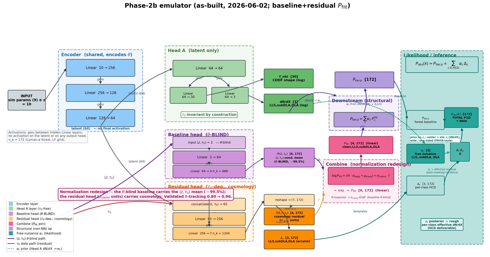
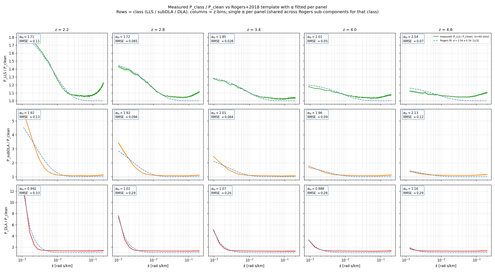
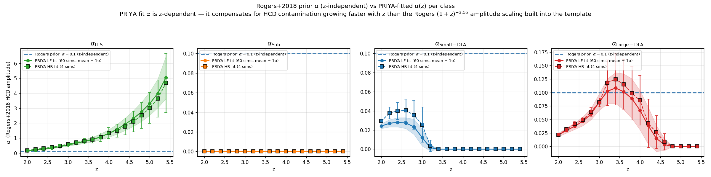
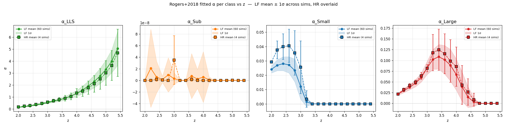

# Phase-2 emulator + Phase-C likelihood — comprehensive walkthrough

> **For:** M.-F. Ho · **Date:** 2026-06-04 · **Branch:** `phase2c-likelihood`
> **Purpose:** an explained, figure-by-figure tour of the *whole* emulator (both heads,
> the HCD Δ template, multi-fidelity) and the new Phase-C inference layer, so you can
> give feedback. Every figure path is relative to the repo root. Open questions /
> decisions are collected in §9. **The Δ-HCD design discussion you flagged is §6.**

Image links are relative to this file (`docs/superpowers/`), i.e. `../../figures/analysis/...`.

---

## 1. What we are building (the forward model)

The end goal is a **differentiable** forward model `P_obs(θ, τ₀, α)` for the Lyα-forest
1D flux power spectrum, that an HMC/NUTS sampler (and a Cobaya likelihood) can call to
infer cosmology. The model is assembled in three layers:

```
   P_filt_c(k; θ, z, τ₀)          ← the emulator (per HCD class c: clean/LLS/subDLA/DLA)
   P_tier_p(k)   = Σ_c w_c · P_filt_c            ← structural baseline (w_c from dN/dX)
   P_obs(k)      = P_tier_p + Σ_{c∈HCD} α_c · Δ_c ← HCD add-back (α_c = residual incidence)
```

- **θ** = 9 cosmology/IGM params (PRIYA order: ns, Ap, herei, heref, alphaq, hub,
  omegamh2, hireionz, bhfeedback).
- **τ₀(z) = −ln⟨F⟩(z)** = the mean-flux nuisance, sampled per z.
- **α_c** = the per-class effective HCD incidence *after* masking (LLS, subDLA, DLA).

Architecture at a glance (`../../figures/analysis/04_emulator/emulator_architecture.png`):



One **shared encoder** (10→256→128→64) feeds three heads: **Head A** (τ₀-invariant
abundances: CDDF + dN/dX), a **θ-blind baseline head** (the z,τ₀ mean of P_filt), and a
**residual head** (the cosmology signal + the Δ channel). The "normalization redesign"
(§5) combines them into per-class linear `P_filt`; the structural + HCD layers finish the
forward model.

---

## 2. The data / cache (what the emulator learns from)

The cache (`observables_tau0_lf.h5`, 21 440 rows) stores, per (sim, z, τ₀-rung):
per-class `P_filt` (PRIYA-filtered P1D, 4 classes × 172 k), the HCD add-back `delta`
(3×172), the abundances `snap_dNdX` + `snap_f_nhi` (CDDF), and the per-class counts (from
which the structural weights w_c are derived in `load_cache`).

- **Classes** (by max-N_HI absorber): clean (<17.2), LLS [17.2,19.0), subDLA [19.0,20.3),
  DLA (≥20.3) — the physical HCD boundaries are exact bin edges.
- **τ₀ ladder**: a z-independent factor α ∈ [0.656, 1.331] × the Kim2013 central curve
  τ_eff = 2.3e-3·(1+z)^3.65 (20 rungs). This brackets the observed mean flux with margin
  (`../../figures/analysis/04_emulator/tau0_ladder_vs_obs_meanflux.png`).

| | |
|---|---|
|  |  |

The targets are transformed before training (`../../figures/analysis/04_emulator/data_output_transforms.png`):
`f_nhi`, `dN/dX`, `P_filt` → `log` (strictly positive); **`delta` → arcsinh** (sign-safe —
Δ_c flips sign at low k, see §6).

---

## 3. The encoder + the two-head split

The encoder turns `x = [θ_unit(9), z_unit(1)]` into a 64-d latent. From there:

- **Head A** sees *only* the latent → it is **τ₀-invariant by construction** (abundances
  don't depend on the mean-flux rescaling). §4.
- **Head B** (baseline + residual) sees the latent **and** τ₀ → it carries the
  mean-flux-dependent P1D shape. §5.

This split is the spine of the design: it lets Head A be a clean abundance predictor
while Head B handles P_filt — its **baseline sub-part** (θ-blind) carrying the much larger
z/τ₀ *mean*, and its **residual sub-part** carrying the small cosmology signal (§5).

---

## 4. Head A — abundances (CDDF + dN/dX) — *you asked how this is covered*

**Head A** (`model.py:HeadA`) is a small MLP off the latent: `trunk(64→64, gelu) →
{cddf: 64→30, dndx: 64→3}`. It emits:
- **f_nhi** (30 bins): the column-density distribution f(N_HI) (CDDF).
- **dN/dX** (3): per-class incidence (LLS, subDLA, DLA).

**Why Head A matters for cosmology:** dN/dX sets the **structural weights w_c** that build
P_tier_p. The map dN/dX → w_c is the analytic telescoping-Poisson **M₀** model + a frozen
per-class δ_c(z) polynomial correction (`dndx_wc.py`); its analytic inverse
`alpha_to_dndx` reads the fitted α_c back out as an effective dN/dX. So Head A is *not* a
side-show — it is how the HCD abundance enters the P1D baseline.

**Validation (deployed, 8-fold LOSO):**

| dN/dX pred vs true | CDDF pred vs true |
|---|---|
|  |  |

| w_c → P_tier_p coupling | Head A error heatmap (class × z × LOSO-fold) |
|---|---|
|  |  |

Headline: dN/dX recovered to **1.25–1.65%** (DLA 1.25%), the w_c→P_tier_p coupling faithful to **0.04%**
(≤2.5% target met ~10×). The α_c prior is centered on Head A's w_c
(`../../figures/analysis/06_performance_walkthrough/A5_alpha_prior_sanity.png`). So *no* —
not all the plots are the cosmology/MF head; Head A is fully validated, it just wasn't in
the recent Phase-C gradient round (which is Head-B/likelihood-facing).

---

## 5. Head B — the P1D cosmology signal (the "normalization redesign")

The problem: per-k, ~99.5% of the log-variance of P_filt is z/τ₀ variation and only ~0.4%
is cosmology. A naive emulator buries the cosmology. The fix:

```
   logP̂_c(k) = [ m̂_c(z,τ₀)·σ_marg + μ_marg ]   ← θ-BLIND baseline (the z,τ₀ mean)
             + σ_cosmo,c(k) · r̂_c(θ,z,τ₀)        ← cosmology residual, whitened by σ_cosmo
   P_filt_c  = exp(logP̂_c)
```

- The **baseline head** is θ-blind (∂m̂/∂θ ≡ 0) and deep (3×w256) — it absorbs the mean.
- The **residual head** carries cosmology in **conditional σ_cosmo units** (the within-cell
  cosmology scale — a few-percent-of-P amplitude). It uses a learned **SVD low-rank basis
  (n_basis=24)**.
- The split is *exactly* identifiable (the cross-term ∂²logP/∂θ∂τ₀ is fully representable;
  the baseline contributes 0 to it). This is the Kennedy–O'Hagan structured-mean form.

| Deployed P1D pred vs true (per class) | Fractional error vs k (LOSO) |
|---|---|
|  |  |

| Within-cell θ-tracking | Variance decomposition (cosmology ≈0.4% of per-k log-var) |
|---|---|
|  |  |

These show the redesign un-buries the cosmology. Deployed median |P̂/P−1|: clean 0.58% /
LLS 0.59% / subDLA 0.67% / DLA 0.97%; A_p Fisher-bias RMS 0.067σ, 0/8 gate failures.

---

## 6. The HCD Δ template — *your main concern: is this overcomplicated?*

### 6.1 How Δ_c is actually built (you were unsure — here it is, exactly)

Δ_c is **built directly from the P1D classes** — your instinct is right, that's already
what it is. In the cache builder, for each (sim, z, τ₀-rung):

```
   P_c^filt  = per-class P1D on PRIYA-FILTERED τ (τ_thresh = 1e6 removes DLA cores)
   P_c^unfilt= per-class P1D on UNFILTERED τ   (same scale & target_F as Tier-P)
   Δ_c(k,z,τ₀) = P_c^unfilt − P_c^filt          (3 HCD classes: LLS, subDLA, DLA)
```

So Δ_c is the **power the HCD masking removes** — a transparent geometric difference of
two P1D class spectra, not a fitted object. It flips sign at low k (the unfiltered DLA
sits *below* the filtered there), which is why the cache stores it in **arcsinh** space.

The per-class templates + their τ₀ response:

| Δ_c templates (per class, vs k) | Raw Tier-C P_c^unfilt vs τ₀ at z≈3 (the *input* to Δ_c) |
|---|---|
|  |  |

### 6.2 How Δ_c is *used* (the forward model) — already the simple, field-standard form

In the likelihood (`likelihood.total_p1d_difference`, `predict.predict_P_obs`):

```
   P_obs = P_tier_p + Σ_{c∈HCD} α_c · Δ_c ,    ∂P_obs/∂α_c = Δ_c
```

**Δ_c is a FIXED template; α_c is a single free amplitude per class** (the effective
residual incidence after masking). This is exactly the Rogers & Bird 2018 / DESI DR1 /
PRIYA "fixed-shape, free-abundance" convention — the *simple* form. Good news: at the
inference layer we are already doing the low-DOF thing.

### 6.3 Where the complexity actually is — and why your concern is valid

The complication is **not** the template or the forward model — it's that the **model also
carries a *learned* Δ_c head** (`HeadB`'s `delta` output): a **dense 3×172** prediction
(NOT low-rank-compressed, because the sign flip breaks a positive-log basis), in arcsinh
space. That's **516 (LF) / 1575 (HR) free outputs** for the Δ channel — the highest-DOF,
least-constrained part of the network, and it is **not even wired into the current
likelihood** (which uses the fixed cache Δ_c). So we are paying the training cost + the
over-fit risk of a high-DOF learned Δ head that inference doesn't use.

This is the **same pattern as the MF head**: the learned δ(θ,z,k) over-fit 6 HF sims and we
replaced it with the low-DOF ρ-only form. Your instinct — *decrease the DOF, prefer a
simple template* — applies here too.

### 6.4 The Rogers-style low-DOF alternative — already prototyped, and it fits well

The repo already has `fit_rogers_alpha.py`: fit the measured ratio
`r_c(k) = P_c/P_clean ≈ 1 + α_c·K_c(k)` with a **fixed low-order kernel K_c(k)** and a
**single amplitude α_c** per (class, z). The comparison:



Rows = LLS / subDLA / DLA; columns = z = 2.2…4.6. The dashed Rogers template tracks the
measured ratio with a *single* amplitude per panel to **RMSE ≈ 0.03–0.11 (LLS),
0.06–0.13 (subDLA), but 0.26–0.33 (DLA)** (the annotations in each panel). So a low-DOF
kernel captures **LLS/subDLA well** (few-to-~13%) but is a **noticeably worse fit for DLA**
(~30% RMSE on a ratio that runs 1→12 — a real low-k misfit, since DLA is the noisiest,
lowest-count class). **Takeaway:** we do *not* need a 516-DOF learned Δ head — but the DLA
class is exactly where the *exact* fixed cache Δ_c earns its keep over a smooth kernel.

α(z) per class + the fit χ²:
| α_c vs PRIYA fit | α_c(z) + reduced χ² |
|---|---|
|  |  |

### 6.5 The three options for the Δ template (a decision for you — §9)

| Option | DOF | Pros | Cons |
|---|---|---|---|
| **(a) Fixed cache Δ_c** (interp in z,τ₀) | 0 learned | exact measured shape; no fit | carries sim noise; needs z,τ₀ interpolation of a 3×172 array |
| **(b) Rogers low-order kernel** `1+α_c K_c(k)` | ~1 α_c/class (+a fixed kernel) | lowest DOF; smooth; field-standard; already prototyped; fits to few % | a kernel-shape approximation; needs the kernel's mild z-dependence |
| **(c) Dense learned Δ head** (current model) | 516/1575 | flexible | over-fit risk (cf. MF δ); not wired to inference; opaque |

**My recommendation (adjusted for the DLA misfit):** **drop (c)** — the dense learned Δ
head is unused at inference and an over-fit risk (cf. the MF δ). The likelihood **already
uses (a) the fixed cache Δ_c**, which is exact for *all* classes (incl. DLA) at **zero
learned DOF** — so the practical change is just to formally remove the unused learned head
from the model. Adopt **(b) the Rogers low-order kernel** as a smooth, even-lower-DOF
option for **LLS/subDLA** (where it fits to ≲13%), but **keep the exact cache Δ_c for DLA**
(where the kernel misfits ~30%). Net: reduce DOF without sacrificing the DLA shape — your
instinct, with the one DLA caveat the corrected RMSE numbers surface.

---

## 7. Multi-fidelity (LF→HR high-k)

The MF layer corrects the LF resolution at high k using HR sims, in **log space**:
`log P_MF = log f_LF + ρ(k,z) + log res_corr`, where ρ is the per-k *mean log-ratio*
(an additive log-space correction) and "ρ-only" drops the learned θ-dependent δ. That δ
over-fit the 6 HF sims, so the production default is **ρ-only** — the same low-DOF lesson
as §6. High-k behavior:
`../../figures/analysis/06_performance_walkthrough/B6_mf_high_k.png`. With **KODIAQ-SQUAD
(KS)** capped at k<0.06 (your decision), the whole analysis sits inside the validated band.

---

## 8. Phase-C — the differentiable likelihood (the recent work)

Built + reviewed (JAX + Bayesian agents) this session:

- **T1 — gradient gate**: ∂P_obs/∂θ autodiff vs finite-diff, median **7e-8** (exact),
  finite everywhere. `../../figures/analysis/05_likelihood/grad_fidelity.png`,
  `grad_physics.png`, `grad_physics_extra.png`.
- **T2 — τ₀-aware error vector**: `C_emu`'s σ is now banded in τ₀ (outer bands isolate the
  ladder extremes); σ is elevated at the edges, as the τ₀×cosmology interaction predicts.
- **T3 — logdet likelihood driver**: `logL = −½rᵀC⁻¹r − ½logdet C`, C = C_cosmic +
  C_emu(θ,τ₀), all JAX-pure. The logdet is load-bearing (pinned by a negative-control
  test). PRIYA-mirrored param names; smooth/bijector prior for NUTS. Two review fixes
  applied: a Critical NaN-gradient (interp over NaN ydata) and an SPD Cholesky jitter.

The gradient physics was checked against an independent physics agent + your PRIYA covmat:
ns pivots at k≈0.005 s/km, Ap is a low-k boost declining at high k, τ₀ dominates, herei is
z-localized, hub is the (degenerate) k-rescaling — all physically sane. The weak directions
(bhfeedback, hireionz) show mild SVD-basis ringing — neutralized by the informative priors
PRIYA uses.

---

## 9. Open questions / decisions for you

1. **Δ-HCD template (§6)** — my recommendation: replace the dense learned Δ head with the
   **Rogers low-order kernel** (default) + the fixed cache Δ_c (cross-check). Do you agree,
   or prefer the fixed cache template directly? Either reduces DOF substantially.
2. **Mean-flux prior source** — the per-z τ₀ Gaussian needs ⟨F⟩(z) ± σ from a compilation
   (Becker13 / Turner24). Which compilation do you want as the production prior?
3. **Sampler** — default numpyro NUTS (gradient) + a Cobaya adapter mirroring PRIYA (for
   the community / gradient-free cross-check). Confirmed?
4. **C_emu conservatism** — closure will bracket coverage between the diagonal C_emu and
   PRIYA's rank-1 fully-correlated form; the k×k shrinkage upgrade is gated on that χ².
5. **Δ-channel emulator error** (σ_δ) and the cross-z covariance are flagged for *before
   real data* (fine for the closure).

---

*Figures referenced live under `figures/analysis/{03_templates_and_p1d,04_emulator,05_likelihood,06_performance_walkthrough}/`.*
