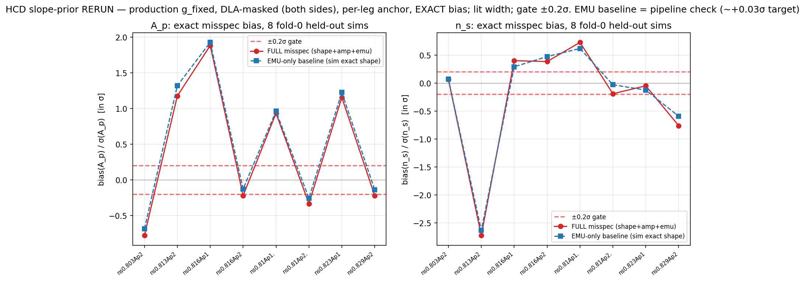
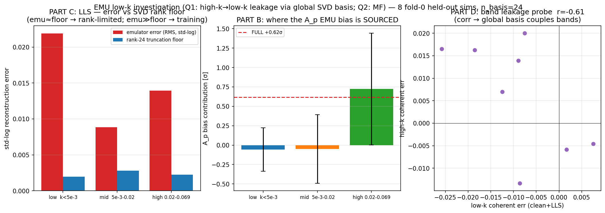

# Slope-prior tradeoff + the low-k A_p emulator-bias investigation — 2026-06-06

Branch `phase2c-likelihood`. Image links are relative to this file (`docs/superpowers/`),
i.e. `../../figures/analysis/...`. This documents (a) the HCD-incidence z-slope prior decision
and its forward-only gating measurement, and (b) the follow-on investigation — prompted by the
PI — into a coherent low-k A_p bias that the slope prior is **not** responsible for.

Companion artifacts: spec `docs/superpowers/specs/2026-06-06-hcd-slope-prior-spec.md` (locked
decisions + the two checkpoint-corrected errors), the 4-lens onboarding + checkpoint reports in
`docs/superpowers/onboarding/2026-06-06-*.md`, scripts `scripts/diag_legb_slope_prior_rerun.py`
and `scripts/diag_emu_lowk_investigation.py`, golden guard `tests/test_legb_golden.py`.

> **⚠️ CHECKPOINT-2 CORRECTIONS (2026-06-06, `wf_959680e8`, 4/4 lenses GO-WITH-CHANGES — read
> `onboarding/2026-06-06-checkpoint2-meta.md`).** All NUMBERS below reproduced bit-for-bit, but three
> framings in §2–§3 were overstated and are corrected here:
> 1. **"z-COHERENT, same sign at every z" is WRONG.** The per-z A_p contribution is **z-LOCALIZED**
>    (~53% from z≈2.0–2.3, ~25% from z≈3.5–3.7/HeII, mixed-sign between); the raw P_filt error
>    sign-flips in z (|mean_z|/std_z≈0.45). The ×18.6 is **force-summation across z-bins** (a diagonal
>    cov can't tell summed structure from noise), NOT physical coherence, and NOT √N. The conclusion
>    "diagonal-in-k/z C_emu can't whiten it → need a structured C_emu" SURVIVES, but the C_emu must be
>    **z-resolved/edge-weighted**, not a global rank-1 z-coherent mode.
> 2. **+0.62σ and r=−0.61 are n=8 POINT ESTIMATES, not settled facts.** A_p: t≈1.58, 4 pos/4 neg
>    signs, 95% CI ≈ [−0.26,+1.32]. r=−0.61: p≈0.11, CI crosses 0. The **n_s EMU mean −0.24σ is a
>    single-outlier artifact** (drop ns0.813's −2.6σ → +0.10σ; no coherent n_s EMU bias). The high-k
>    +0.72σ is the one ~3σ-real piece (t≈2.9).
> 3. **§3 reconciliation has NO committed script** (only this prose) and the "1.26× ruler / 3%-diagonal"
>    legs were verified by no lens. The z=3↔full-z ×18.6 leg DID reproduce on all four. Also: the rerun
>    KS keep extends to k=0.0627 (violates the locked KS k<0.06 cap) — re-run KS-capped before quoting
>    as production; and the all-8 fold-0 sims are low-n_s box-edge (interior checks are emulator in-sample).
>
> **What stands unchanged:** the slope-prior settlement (FULL−EMU <0.17σ, ×1.04, golden guard) — the
> part that gates the refactor — is the most robust result (4/4 re-derived it). The slope-prior refactor
> PROCEEDS; the C_emu-vs-retrain fork is NOT decided here (see checkpoint2-meta §Fork + Open items).

---

## 0. TL;DR

1. **Slope-prior width is settled and SAFE.** Marginalizing the HCD-incidence z-slope nuisance
   costs ×1.04 on σ(A_p); the slope's own bias contribution is **< 0.17σ on every held-out sim**
   (A_p and n_s), width-insensitive. The literature width + z-edge inflation passes the 0.2σ gate.
   The per-leg amplitude anchor (not the slope) is the real absorber.
2. **A separate, larger issue surfaced: a coherent +0.6σ low-k A_p bias from PURE emulator error.**
   It is NOT the slope's job and NOT fixed by the slope prior.
3. **The PI's hypotheses (Q1, Q2) were largely RIGHT.** The bias is **sourced from high-k emulator
   error (+0.72σ from k>0.02), routed to the A_p/low-k direction through the GLOBAL SVD output
   basis** (low-k and high-k residuals correlate r=−0.61 across sims). It is **training-limited, not
   rank-limited** (emulator error is 6–18× the irreducible rank-24 floor in every band). MF is
   **structurally not the cause** (closure is LF-vs-LF) but, because it acts at high-k through the
   same basis, MF wiring will perturb the same channel → must re-measure after MF.
4. **The "10× discrepancy" (this +0.6σ vs Phase-2's 0.067σ) is fully reconciled: it is
   z-ACCUMULATION.** At a single z=3 slice (the Phase-2 ruler) the bias is **+0.033σ** — consistent
   with 0.067σ. The per-z error is small but **z-COHERENT**, so it sums over the ~13 z-bins of the
   real fit (×18.6) instead of averaging down. The 0.067σ was never wrong; it was a single-z number.

**Consequence:** the load-bearing risk has moved off the slope prior (settled) and onto the
**correlated-in-k C_emu** (plan §0b-2, not yet built) — which must marginalize a *z-coherent,
high-k-sourced* mode, and is the right tool for exactly this.

---

## 1. The slope-prior tradeoff (the question the PI asked first)

The closure forward models HCD contamination as
`α_c(z) = α_pivot,c · exp(δ_{c,leg}) · g_fixed,c(z) · ((1+z)/(1+z_p))^{s_c}`, factorizing the
z-shape into a KNOWN literature-derived shape `g_fixed` × a SAMPLED literature-correction slope
`s_c`. The decision was the prior WIDTH on `s_c`: tight (constraining, risks bias if the true
shape differs) vs wide (robust, inflates σ(A_p)).

**The gating measurement** (`scripts/diag_legb_slope_prior_rerun.py`, forward-only Fisher over 8
fold-0 held-out sims; production lit-derived `g_fixed`, DLA-masked both sides, per-leg amplitude
anchor, EXACT non-linearized bias for A_p AND n_s):

*FULL = (shape+amplitude+emulator) misspecification bias; EMU-only baseline = forward at the sim's
EXACT per-z w_c (pure emulator error). The slope/anchor's own contribution is FULL−EMU.*

**Result (the slope/anchor contribution, FULL−EMU — normalization + shared emulator error cancel):**

| quantity | A_p | n_s |
|---|---|---|
| slope/anchor bias, mean over 8 sims | −0.079σ | −0.027σ |
| slope/anchor bias, **max** over 8 sims | **0.143σ** | **0.168σ** |
| width sensitivity (lit → edge → 2×lit) | none | none |

→ **width-insensitive and < 0.2σ everywhere.** The slope is not the driver; the **per-leg amplitude
anchor** absorbs the incidence mismatch. The locked width (literature dN/dX-slope 1σ =
0.52/0.53/0.33 for LLS/subDLA/DLA, with z-edge inflation ×1.25 for the z<2.5 / z>3.5 untrusted
regime) is SAFE. Slope center is 0 in the production framing (the lit shape is already in
`g_fixed`); fixed constant, no hyper-prior.

> **A correction worth recording.** The FIRST version of this sweep
> (`scripts/diag_legb_slope_prior_tradeoff.py`) was found by the checkpoint to (E-A) use
> `g_fixed` = the SIM's own w_c(z), the closure-only framing, and (E-B) report only the A_p bias
> while the n_s bias was −0.22σ (over gate). Both were artifacts of the wrong framing + a missing
> per-leg anchor + a lit-DLA term in the forward that the masked truth didn't have. The corrected
> rerun above resolves all three. The earlier figure
> (`../../figures/analysis/05_likelihood/legb_slope_prior_tradeoff.png`) is retained only for the
> ×1.04 VARIANCE result, which is framing-robust.

---

## 2. The low-k A_p emulator bias (the PI's Q1/Q2)

The EMU-only baseline above is **not** small: A_p mean **+0.62σ**, per-sim scatter 0.89σ. The
scatter is coverage-consistent (random per-mock), but the **mean** is a possible coherent
emulator residual sitting in the A_p regime. The PI asked two sharp questions:

> **Q1:** Are we sure it's not an emulator-not-trained-well issue — specifically, the large-k
> modes (few bins, noisy) having a weird cosmology response that we never checked, because every
> accuracy test was full-k-range?
>
> **Q2:** How likely is this correlated with MF (multi-fidelity) not yet being implemented?

`scripts/diag_emu_lowk_investigation.py` answers both, per-k-band, over 8 held-out sims:

### Q1 — the bias is high-k-sourced and leaks to A_p through the global SVD basis. PI was right.

The emulator output is **one shared `(n_basis=24, n_k=172)` SVD basis over the full k-range**
(`model.py:135`); there is no k-localization, so a high-k mode with low-k support is a leakage
channel. Three measurements (middle/right panels above + the band table in
`emu_lowk_investigation.txt`):

- **PART B — where the A_p bias is SOURCED (mask ΔP by leg-k band):** FULL +0.62σ decomposes into
  **high-k (k>0.02) +0.72σ**, mid −0.05σ, low-k (k<5e-3) −0.06σ. The bias originates almost
  entirely in the **high-k band** — exactly the few-bin, shot-noise-noisy regime the PI flagged.
- **PART D — leakage probe:** across the 8 sims, the low-k coherent residual and the high-k
  coherent residual **correlate at r = −0.61**. A z/k-independent emulator would give ~0; the
  strong correlation is the **global basis coupling the bands** — the leakage channel is real.
- **PART C — is it rank or training?** Compared to a fresh rank-24 SVD of the TRUTH ensemble
  (the irreducible floor the basis could achieve), the emulator error is **6–18× the floor in
  every band** (e.g. LLS low-k 0.022 vs floor 0.002). So the basis CAN represent low-k to ~0.002
  std-log; the trained model only reaches ~0.02. **This is training-limited, not rank/architecture
  limited.** (Note: the trained basis has drifted far from orthonormal, `||BBᵀ−I||≈2.7` — a
  contributing factor to the high-k→low-k coupling, and a concrete lead for a retrain.)

**So the answer to Q1 is: yes, it is partly an emulator-fidelity issue we had not caught, because
every prior metric (sub-%, 0.067σ, grad 7e-8) was full-k POOLED.** The per-z, per-k-band view shows
the high-k response carries a coherent error that the global basis routes into A_p. It is
*retrainable in principle* (it's above the rank floor), but until/unless retrained it must be
carried as a correlated C_emu term.

### Q2 — MF is not the cause, but it acts on the same channel. Re-measure after wiring.

The closure is **LF-cache-truth vs LF-emulated**: `ΔP_emu = P_LF,measured − P_LF,emulated`. The
multi-fidelity LF→HF resolution correction is in **neither** side, so it **cannot be causing** this
residual (structural). BUT: MF's correction is multiplicative and concentrated at high-k (k>0.02) —
the same band that PART B shows is the source and PART D shows is coupled to low-k. So **wiring MF
will perturb exactly this channel**, and the A_p bias must be **re-measured after MF wiring** — the
LF-only number does not transfer. (This reinforces the standing "MF cert is separate" flag.)

---

## 3. The reconciliation: +0.6σ vs Phase-2's 0.067σ is z-ACCUMULATION

The Phase-2 LOSO gate reported "A_p Fisher-bias RMS 0.067σ" (`scripts/diag_ap_fisher_bias.py`,
walkthrough §8). This investigation finds +0.62σ on the real legs. I tested two candidate
"ruler" explanations and the z-accumulation hypothesis:

| ruler factor | finding |
|---|---|
| correlated vs diagonal C_data | only **1.26×** (−0.44σ vs −0.35σ, same ΔP) — NOT the explanation |
| diagonal 3%-fractional (Phase-2-like) cov | −0.60σ — same ballpark, NOT the explanation |
| **single-z (z=3) vs full ~13-z range** | **z=3 alone: +0.033σ; full-z: +0.62σ → ×18.6** |

**The gap is z-accumulation.** At the single z=3 slice the Phase-2 ruler used, the A_p bias is
**+0.033σ — consistent with the 0.067σ RMS.** The per-z emulator error is small, but it is
**z-COHERENT** (the high-k response is biased the same way at every z), so it **sums** across the
real fit's z-bins instead of averaging down. The Phase-2 number was never wrong; it was a per-z
number, and "RMS over folds at one z" cannot see z-coherent accumulation.

This is the sharpest finding: it identifies the bias as a **z-coherent, high-k-sourced mode** — and
that is precisely the object the planned **low-rank correlated-in-k (and z) C_emu** (plan §0b-2)
exists to marginalize. A diagonal-in-k (or k-diagonal cross-class) C_emu cannot whiten it.

---

## 4. What this changes

- **Slope prior: DONE.** Width = literature + z-edge inflation; per-leg amplitude anchor; slope
  center 0, fixed. Passes the 0.2σ gate on both A_p and n_s. No PI call needed on the width.
- **The real risk relocated** from the slope prior to the **correlated-in-k/z C_emu** (§0b-2, not
  built). It must marginalize a z-coherent, high-k-sourced low-k mode of ~0.6σ.
- **Two routes for that mode, to weigh at the next checkpoint:** (a) build the correlated C_emu to
  marginalize it (the planned path; robust, no retrain); (b) a targeted emulator retrain to reduce
  the high-k coherent error and the basis non-orthonormality (it is above the rank floor, so
  reducible) — more work, uncertain payoff. Likely (a) now, (b) as a later improvement.
- **MF:** re-measure the A_p bias after MF wiring; the LF-only number does not transfer.

## 5. Caveats (verified-vs-assumed)

- VERIFIED forward-only: all bias numbers are Fisher MAP-shift projections with the EXACT ΔP (no
  shape linearization); the z=3↔full-z, band-attribution, and rank-floor comparisons are direct
  measurements over 8 held-out sims. Figures regenerate from the two scripts.
- ASSUMED / not yet done: the numbers are **Fisher, not NUTS** — the eventual coverage run is the
  arbiter. The interior-n_s spot-checks use folds 3–5 (emulator IN-SAMPLE; the shape-gap bias is
  still valid since the truth is cache-measured, but the emulator-error component is understated
  there). σ_anchor magnitudes (KS 0.27, DESI 0.12) are defensible expectations, not measured. The
  correlated C_emu that must carry the +0.6σ mode is **not yet built**.
