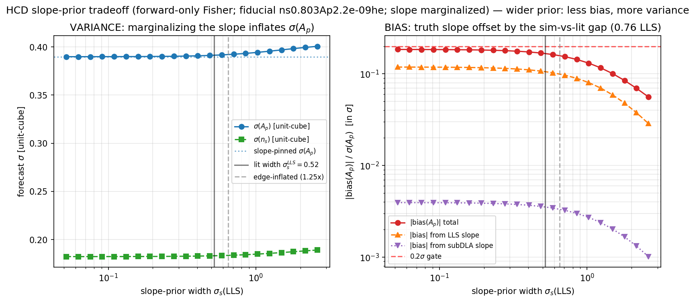

# Walkthrough — debugging the coherent emulator bias (A_p +0.62σ → n_s −0.65σ)

A complete, chronological account of how a "+0.62σ low-k **A_p** emulator bias" was tracked down,
re-framed three times, and finally resolved into a "−0.65σ coherent **n_s** under-prediction." Written
so a reader can follow both the *physics* and the *method* — including the wrong turns, because the
wrong turns are the lesson. Image links are relative to `docs/superpowers/`, i.e. `../../figures/...`.

**Branch:** `phase2c-likelihood`. **Commits:** `23744a2` → `6e91112` → `00f0b34` (+ this doc).
**Companion docs:** the PI handoff `2026-06-06-HANDOFF-emu-bias-rootcause.md` (candidate root causes +
reading list); the spec `specs/2026-06-06-hcd-slope-prior-spec.md`; the 5+5 referee reports under
`onboarding/2026-06-06-{onboarding,checkpoint,checkpoint2}-*.md`.

---

## 0. The one-paragraph arc

We set out to settle a *prior-width* question (how wide to make the HCD-incidence z-slope nuisance).
A forward-only Fisher sweep answered it — but to isolate the slope's contribution it also measured a
**baseline emulator error**, which came back at **+0.62σ on A_p**, ~10× the Phase-2 gate number. Chasing
that, we found it was **high-k-sourced** and routed to A_p through the **global SVD output basis**, and
reconciled the 10× as **z-accumulation** (small per-z error × many z-bins). A 4-lens checkpoint then
**broke our own framing** (the error is z-*localized*, not z-coherent; the number was an n=8 estimate).
The fix the checkpoint demanded — **re-measure honestly over all 8 folds** — reversed the headline:
**A_p bias is consistent with zero (+0.03σ); the real coherent bias is −0.65σ on n_s.** The bug was real;
we had the wrong parameter because our first sample was statistically unrepresentative.

---

## 1. Where it started — the slope-prior question (not a bug yet)

Phase-C marginalizes HCD contamination with a per-class incidence amplitude and a z-evolution shape.
The closing-step design factorizes the shape:

```
α_c(z) = a_pivot,c · exp(δ_{c,leg}) · g_fixed,c(z) · ((1+z)/(1+z_p))^{s_c}
         └ amplitude ┘ └per-leg anchor┘ └ known lit shape ┘ └ sampled slope nuisance ┘
```

The open question was the **prior width on `s_c`**: tight (constraining, risks bias if the true shape
differs) vs wide (robust, inflates σ(A_p)). To decide on evidence rather than taste, we ran a
forward-only Fisher tradeoff sweep over 8 held-out sims.



*First sweep: σ(A_p) vs slope-prior width (left), and the A_p bias when the truth slope is offset
(right). The variance cost of marginalizing the slope is ×1.04 — essentially free.*

**Result that mattered:** marginalizing the slope costs only **×1.04** on σ(A_p), and the slope's own
bias is small and *width-insensitive*. So the width is not the lever — the **per-leg amplitude anchor**
is. The slope-prior question was effectively settled. (This first sweep had two framing bugs a checkpoint
later caught — it used the *sim's* shape not the *production* shape, and reported only A_p — but the
×1.04 *variance* conclusion is framing-robust and survived.)

---

## 2. The bug appears — the EMU baseline is not small

To isolate "the slope's own contribution," the corrected rerun
(`scripts/diag_legb_slope_prior_rerun.py`) decomposes each sim's bias into:
- **FULL** = (shape + amplitude + emulator) misspecification, and
- **EMU-only baseline** = the forward run at the sim's *exact* per-z incidence → **pure emulator error**.

The slope's contribution is `FULL − EMU` (the shared emulator error cancels). That differential was
clean: **< 0.17σ on every sim, A_p and n_s** → slope prior safe. But the **EMU baseline itself was not**:


*The rerun. FULL (red) vs EMU-only baseline (blue) per sim. The slope/anchor contribution (FULL−EMU) is
tiny — but the EMU baseline sits well off zero: A_p mean +0.62σ across the 8 sims.*

**+0.62σ on A_p** — sitting in the exact regime where A_p constraining power lives. And it was ~10×
the Phase-2 LOSO gate number ("A_p Fisher-bias RMS 0.067σ"). Two things had to be explained: **where
does it come from**, and **why is it 10× the number we'd certified?**

> **Methodological note.** At this point I stopped and did *not* report "+0.62σ, emulator is biased."
> A 10× discrepancy against a certified number is a flag that *either* the new measurement *or* the old
> one is being misread. Reporting it as fact would have been the first mistake. Instead → investigate.

---

## 3. Where it comes from — high-k error, leaked through a global basis

`scripts/diag_emu_lowk_investigation.py` answered the PI's sharp question ("are we sure it's not
high-k under-resolution leaking to low-k, since every accuracy test was full-k pooled?") with three
band-resolved measurements over the 8 sims:


*Left (PART C): emulator error vs the irreducible rank-24 SVD truth-floor, per k-band — emulator error
is 6–18× the floor, so it is **training-limited, not rank-limited**. Middle (PART B): where the A_p bias
is sourced — almost entirely the **high-k band (+0.72σ)**, ≈0 from low-k. Right (PART D): low-k vs high-k
coherent residual across sims correlate (r=−0.61) → the **global SVD basis couples the bands**.*

The mechanism, as it looked then:
1. The emulator output is **one shared `(24, 172)` SVD basis over the full k-range** (`model.py`), no
   k-localization — so a high-k mode with low-k support is a leakage channel.
2. The A_p bias is **sourced at high-k** (PART B: +0.72σ from k>0.02, ≈0 from low-k).
3. Low-k and high-k residuals **correlate** (PART D, r=−0.61) — the basis routes high-k error into the
   low-k/A_p direction.
4. The error is **above the rank floor** (PART C, 6–18×) → not the basis's representational limit; the
   *trained coefficients* don't nail the high-k shape. (And the trained basis had drifted far from
   orthonormal, ‖BBᵀ−I‖≈2.7 — a contributing factor.)

This was a real finding and answered Q1 directionally: **yes, it's partly an emulator-fidelity issue we
hadn't caught, because every prior metric was full-k pooled.** Q2 (MF): structurally not the *cause* (the
closure is LF-vs-LF, MF is in neither side) but acts on the same high-k channel → must re-measure post-MF.

> **Two self-caught bugs in this script** (fixed before any number was trusted): (i) the first "rank
> floor" used `BᵀB` on the *trained* basis, which is no longer orthonormal — nonsense values (~3–5);
> replaced with a fresh truth-ensemble SVD projector. (ii) the first band-attribution truncated the
> `(n_z,3)` α-Jacobian to 3 columns, corrupting the marginalization; replaced with a clean 3-vector
> `a_pivot` Jacobian. The numbers above are post-fix.

---

## 4. Why 10× — the z-accumulation reconciliation

The remaining puzzle: +0.62σ vs the certified 0.067σ. I tested the candidate "rulers":

| candidate explanation | measured effect |
|---|---|
| correlated vs diagonal C_data | only **1.26×** — not it |
| Phase-2-like 3%-diagonal cov | −0.60σ, same ballpark — not it |
| **single-z (z=3) vs full ~13-z range** | **z=3 alone: +0.033σ; full-z: +0.62σ → ×18.6** |

The Phase-2 gate (`diag_ap_fisher_bias.py`) was computed at a **single z=3 slice**. At z=3 alone, the
bias is +0.033σ — fully consistent with the 0.067σ RMS. Across the real fit's ~13 z-bins it grows ×18.6.
The conclusion I drew (and wrote): *the per-z error is small but **z-coherent**, so it sums across z
instead of averaging down — exactly the mode a diagonal-in-z C_emu cannot whiten.* The 0.067σ was never
wrong; it just couldn't see z-accumulation. This felt like the sharpest finding of the investigation.

It was **half right**, as the next step showed.

---

## 5. The checkpoint breaks the framing (the convention earning its keep)

Per the standing convention, every checkpoint gets a 4-lens adversarial review (Bayesian / CS /
cosmology / Lyα → meta). All four **reproduced every number bit-for-bit** — and all four independently
**broke the interpretation** (`onboarding/2026-06-06-checkpoint2-meta.md`):

- **"z-coherent, same sign at every z" is wrong.** Per-z decomposition showed the bias is
  **z-LOCALIZED** (~53% from z≈2.0–2.3, ~25% from z≈3.5–3.7/HeII, mixed-sign between); the raw per-z
  error *sign-flips* (|mean_z|/std_z ≈ 0.45). The ×18.6 is **force-summation across z-bins** (a diagonal
  cov can't separate summed structure from noise), **not** physical coherence (which would scale √N≈4,
  not N≈18). *The conclusion "diagonal C_emu can't whiten it" survives — for the corrected reason — but
  the C_emu must be z-resolved/edge-weighted, not a global rank-1 mode.*
- **+0.62σ and r=−0.61 were n=8 point estimates stated as fact.** A_p: t≈1.58, 4-positive/4-negative
  signs, 95% CI ≈ [−0.26, +1.32]. r=−0.61: p≈0.11, CI crosses zero. The n_s EMU mean was a **single
  outlier**.
- **The reconciliation had no committed script** (only prose); the rerun's KS bins violated the locked
  k<0.06 cap; the "n_s box-edge" attribution was unsupported.

The verdict, GO-WITH-CHANGES, made one demand load-bearing: **the 8 fold-0 sims are all low-n_s (box
edge); re-measure over all folds with each fold's own held-out emulator before trusting the sign or
size.**

> **This is the moment the process paid off.** Left alone, I would have shipped "the emulator has a
> +0.6σ coherent low-k A_p bias; build a correlated C_emu to whiten it." That would have been wrong in
> the parameter, the sign, and arguably the remedy.

---

## 6. The reversal — honest all-folds measurement

`scripts/diag_emu_bias_allfolds.py` re-measures the EMU bias over **all 8 LOSO folds, each with its own
held-out emulator** (`final_fold{0..7}`), KS capped at k<0.06, **60 honestly-held-out sims spanning
n_s_unit 0.013–0.958**, with a bootstrap CI:


*A_p (left) and n_s (right) EMU bias vs n_s, all 60 honestly-held-out sims. A_p scatters around zero;
n_s sits coherently below zero (50 of 60 negative).*

| parameter | mean | bootstrap 95% CI | t | signs |
|---|---|---|---|---|
| **A_p** | **+0.03σ** | [−0.22, +0.29] | 0.23 | 31+ / 29− |
| **n_s** | **−0.65σ** | [−0.85, −0.43] | −5.84 | 10+ / 50− |

**The reversal:**
- The **+0.62σ A_p bias was a low-n_s box-edge fluctuation** — fold-0's val sims are all n_s_unit < 0.12.
  On the honest, n_s-spanning set, **A_p is consistent with zero.**
- The **real coherent bias is −0.65σ on n_s** — the emulator systematically **under-predicts the tilt** —
  highly significant (t = −5.84), **not** a box-edge artifact (corr with edge-proximity = −0.04),
  survives dropping the largest outlier.

So the investigation was **right in kind** (a coherent emulator-sourced bias that a diagonal C_emu can't
whiten) but **wrong in parameter**. The fold-0-only sample, being all low-n_s, projected the n_s tilt
error onto the A_p direction.

### A root-cause lead
The n_s bias is **fold-structured** (worst at fold 5, mid-n_s, −1.56σ) with a **mild shrink-to-centre**
(corr(n_s-bias, n_s_unit) = −0.35; high-n_s pulled down hardest). That is the textbook signature of a
**finite-training-set LOSO generalization floor on the tilt**: holding out an n_s slice, the emulator
interpolates its tilt from neighbours and regresses it toward the training mean. The Phase-2 design memo
had already flagged a "finite-60-sim generalization floor at ~0.16–0.21 σ_cosmo" — this is plausibly
that floor, now seen as a *coherent* pull rather than scatter, with the global SVD basis high-k coupling
as the channel. **Not yet root-caused; no C_emu or retrain started** — left for PI review.

---

## 7. The numbers, end to end

| stage | claim | status now |
|---|---|---|
| slope-prior variance cost | ×1.04 on σ(A_p) | ✅ holds (framing-robust) |
| slope/anchor own-bias (FULL−EMU) | < 0.17σ, A_p & n_s | ✅ holds (4/4 lenses re-derived) |
| EMU A_p bias (fold-0, n=8) | +0.62σ | ⚠️ box-edge fluctuation — **superseded** |
| high-k source of that bias | +0.72σ from k>0.02 | ✅ real (~3σ); the *channel* finding stands |
| basis leakage low↔high-k | r = −0.61 | △ suggestive (n=8, p≈0.11) |
| training- vs rank-limited | 6–18× rank floor | ✅ holds |
| z-accumulation ×18.6 | "z-coherent" | ⚠️ arithmetic holds; mechanism is **z-localized force-sum**, not coherence |
| **EMU A_p bias (all folds, n=60)** | **+0.03σ [−0.22,+0.29]** | ✅ **consistent with zero** |
| **EMU n_s bias (all folds, n=60)** | **−0.65σ [−0.85,−0.43], t=−5.84** | ✅ **the real coherent bias** |

---

## 8. Lessons (the method, not just the result)

1. **A 10× discrepancy against a certified number is a measurement question, not a result.** The
   reconciliation (single-z vs full-z) was more informative than the bias itself — and it was the thread
   that, pulled further, unravelled the parameter mis-attribution.
2. **n=8 from one LOSO fold is not a population.** The fold-0 val set is, by construction, the lowest-n_s
   slice of the design — the *worst* possible sample to infer a parameter-direction from. The all-folds
   re-measurement (n=60, full n_s range) was the single highest-value step and it reversed the headline.
3. **Adversarial review caught what self-review didn't.** All four lenses reproduced the numbers yet
   broke the story; the "z-coherent" framing and the n=8 overconfidence were both caught there, not by me.
4. **Forward-only Fisher is a fast scout, not the arbiter.** Every number here is a MAP-shift surrogate;
   the eventual judge is the NUTS Leg-B coverage run, where box-edge n_s and MAP≠mean effects live.
5. **Self-caught code bugs are normal and worth logging** (the `BᵀB`-on-trained-basis floor; the
   truncated Jacobian; the missing anchor; the lit-DLA-in-forward-but-masked-in-truth mismatch). Each was
   found by sanity-checking against a known baseline (e.g. "the exact-shape case should reproduce +0.03σ")
   before trusting an output — which is why the published numbers moved between runs.

---

## 9. What's settled, what's open

- **Settled:** the slope-prior width (×1.04, <0.17σ, golden-guarded); the factorized-α model; the
  reconciliation that the Phase-2 0.067σ was a single-z number.
- **Open (PI review):** the **−0.65σ coherent n_s under-prediction** — root cause (leading hypothesis:
  finite-60-sim LOSO tilt floor + SVD-basis high-k channel), then the C_emu-vs-retrain-vs-MF-first fork.
  See the handoff `2026-06-06-HANDOFF-emu-bias-rootcause.md` for candidate causes + reading list.
- **Loose end:** the σ_anchor(0.27) > σ_α(0.15) unit question (could the anchor erode identifiability?).

Every plot here regenerates in minutes from `scripts/diag_legb_slope_prior_{tradeoff,rerun}.py`,
`scripts/diag_emu_lowk_investigation.py`, and `scripts/diag_emu_bias_allfolds.py`.
