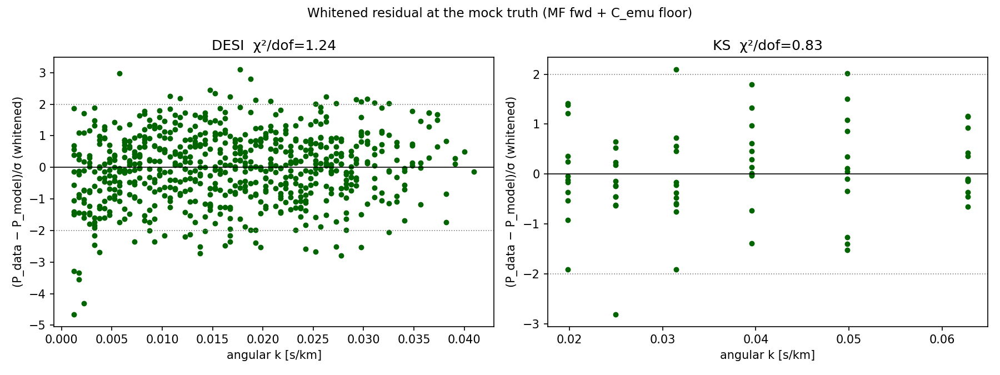
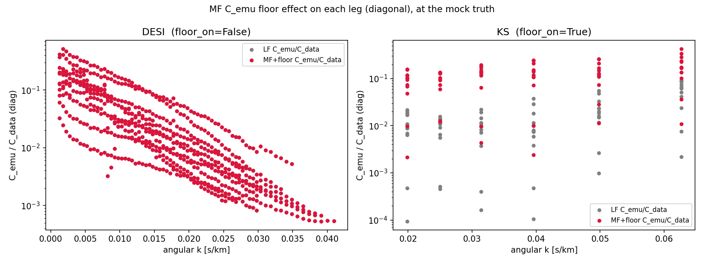
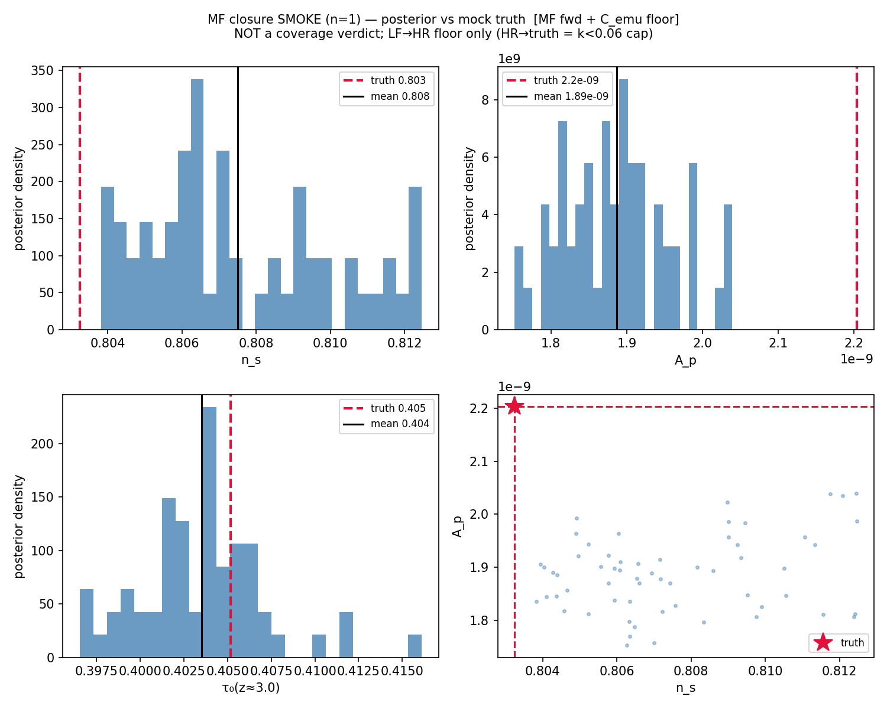

# MF closure experiments — running reference log

**Purpose:** a tracked, figure-rich log of the multi-fidelity (MF) Leg-B closure experiments, so each run
(setup, cost, recovery, verdict) is reproducible and comparable later. Append new runs to §Log.
Image paths are relative to `docs/superpowers/` (i.e. `../../figures/...`).

**Branch:** `phase2c-likelihood`. **Env:**
`PYTHONNOUSERSITE=1 PYTHONPATH=/home/mfho/hcd_priya JAX_PLATFORMS=cpu CUDA_VISIBLE_DEVICES="" /home/mfho/.conda/envs/emu-jax/bin/python3`

---

## 0. What "MF closure" means here

The Leg-B closure fits a held-out **sim** (truth) on the real DESI+KS grids and asks whether NUTS recovers
(A_p, n_s, τ₀) with **coverage ≥ nominal + |bias| < 0.2σ**. "MF closure" = the same, but the forward goes
through the **multi-fidelity correction** (`MultiFidelity.logP_mf`: frozen LF backbone + the τ₀+z-resolved
`g(z,τ₀,k)` + `res_corr`) instead of the bare LF emulator, with the **small-scale C_emu floor** added to
`C_total`. This is the real arbiter that supersedes all the forward-only Fisher scouting.

**Wiring (committed):**
- `data_likelihood.predict_P_obs_on_leg(..., mf=, mf_floor=)` — opt-in MF forward + floor; `mf=None` is
  byte-identical to the LF path (golden/closure unperturbed).
- `data_likelihood`: `MFFloor` + `load_mf_floor()` + `_mf_floor_var_on_k` — adds `(σ_floor·P_obs)² +
  (σ_edge·P_obs)²` to the C_emu diagonal. **Applied on the small-scale leg only** (KS `mf_floor_on=True`,
  DESI `False`). **PI invariant:** the legs only reach z=4.6 (DESI 4.2, KS 4.6), so the floor is indexed
  only on z≤4.6 — the z>4.6 floor cells (incl. the flagged single-sim z=5.4 spike) are **never read**
  (a runtime `assert leg.z.max() ≤ 4.6` guards it). The n_s-edge term's `ns` is `stop_gradient`'d.
- `closure_legb`: `LegBCtx.mf/mf_floor`, `build_mf_correction(fold)` (reuses the certified gate
  construction; `final_fold0` model verified byte-identical to `load_lf_backbone(0)`), MF applied to the
  mock **truth** as well as the forward (the gate invariant, so the correction cancels in the closure ΔP).
  CLI: `--mf` / `--no-floor`.

---

## 1. Run MF-SMOKE-01 — profiling mock (2026-06-09)

**Goal:** profile one MF closure mock to (a) confirm the MF+floor closure path runs end-to-end and is
NUTS-healthy, and (b) extrapolate the cost of a full coverage run before requesting compute. **SMOKE scale**
(few warmup/samples, max_tree_depth capped) — explicitly **not** a coverage verdict.

**Config:** fold 0, held-out sim n_s=0.803; 1 chain, ~60 warmup + 60 samples, dense mass (dim 25 =
θ9 + τ₀-ladder(13) + α(3)), mtd=5 (smoke). Script: `scripts/profile_mf_closure_smoke.py`.

### 1.1 Sampler health + cost

| metric | value |
|---|---|
| NUTS wall (smoke, compile-dominated) | 83.5 s |
| divergences | **0 / 60 (0.0%)** |
| mean accept_prob | 0.986 |
| dense-mass dim | 25 |
| ESS / sample | n_s 0.30, A_p 0.35, τ₀(z≈3) 0.99 |
| leapfrogs/sample | 31 (≈22.5 ms/leapfrog) |

**Cost extrapolation (smoke, optimistic — SUPERSEDED by MF-REPROFILE-02 §1.5):** ≈2.4 CPU-h/mock. The smoke
ran at mtd=5 (trees capped); the firm mtd=10 re-profile (§1.5) gives **~6 CPU-h/mock**. 0 divergences + 0.99
accept ⇒ the 25-dim dense-mass geometry is healthy through the MF forward.

## 1.5 Run MF-REPROFILE-02 — firm cost at production mtd=10 + KS klow=0.0055 (2026-06-09)

Two changes since MF-SMOKE-01: (a) **KS now keeps its full native k-range from klow=0.0055** (`drop_first4=
False`, PI/KS-author decision — the Fig-11 caution is misleading); the all-folds n_s bias **stays in-gate**
(+0.035σ vs +0.030σ old-KS; the added low-k bins are emulator-clean,
`emu_bias_allfolds_zlo24_kslow.txt`). KS leg = 12 z × 11 k = **132 rows**, k∈[0.0055, 0.063]; golden
regenerated; 70 tests green; mf=False byte-identical. (b) The **`get_samples` postprocess waste is fixed**
(`closure_legb._legb_reconstruct_deterministics` host-side; `fast_postprocess=True` default; byte-identical
to the replay, max|Δ|=0; removes the 237.6 s/mock).

**Firm profile** (mtd=10, dense-mass 25-dim, 813 data rows = DESI 681 + KS 132; `scripts/profile_legb_mtd10.py`,
`figures/analysis/05_likelihood/legb_mtd10_profile.txt`): per-leapfrog 235 ms; leapfrogs/sample 88.6
(**0/60 max-depth hits** at mtd=10 — trees do NOT saturate, unlike the mtd=5 smoke); ESS/sample n_s 0.444,
A_p 0.446, τ₀ 0.630; **0 divergences**, accept 0.974 (the new low-k KS bins did not degrade the geometry).

**FIRM cost** (target ESS≥400 on n_s → ~902 samples; per-sample 20.8 s; 1 chain ≈ 1 core ⇒ wall≈CPU-h):
**~6 CPU-h/mock.**

| warmup | per-mock | N=99 | N=300 | N=600 |
|---|---|---|---|---|
| 40 (measured) | 5.45 CPU-h | 540 | 1635 | 3271 |
| 150 (realistic) | 6.1 CPU-h | 602 | 1825 | 3651 |
| 250 (conservative) | 6.7 CPU-h | 660 | 2010 | 3999 |

**N=99 ≈ 600 CPU-h (safe), N≈300 ≈ 1.6–2.0k CPU-h (comfortable), N=600 ≈ 3.65–4.0k CPU-h (AT the ~4000
cavestru0 ceiling — not safely affordable without levers** — fewer warmup, lower ESS target, or fewer mocks).
(Note: a first 100+100 mtd=10 run was killed after ~19 CPU-h on a pathological deep-tree warmup; the firm
numbers are from a budget-respecting 40+60 re-run.)

> **Efficiency flag for the production run:** numpyro `mcmc.get_samples()` JIT-replays the full MF
> likelihood to recover the `deterministic` sites (`tau0_vec`, `alpha_hcd_z`, `alpha_dla`) — **237.6 s/mock**,
> ~3% of the production per-mock cost but pure waste at smoke scale. Fix before the big run: drop the
> `numpyro.deterministic` sites and reconstruct host-side (`tau0_vec = alpha_ladder·Kim(z)`), or cache
> `postprocess_fn`. The likelihood/floor code is unaffected.

### 1.2 Whitened residual at truth — C_total is correctly sized

DESI χ²/dof = **1.24**, KS χ²/dof = **0.83**. Both ≈1 ⇒ the C_total (incl. the MF floor on KS) fits the
data-vs-model residual within the covariance at the truth. KS slightly <1 ⇒ the floor is mildly
conservative (acceptable). No coherent k-trend ⇒ the MF correction left no structured residual at truth.

### 1.3 The C_emu floor lifts only the KS small-scale leg

DESI (left, `floor_on=False`): MF+floor (red) overlies LF (grey) — **no floor on DESI**, as intended. KS
(right, `floor_on=True`): the floor raises C_emu/C_data to the spec'd ~1.2% (LF-resolvable) → few-% level
across the KS k-band — the small-scale generalization budget, only where it belongs.

### 1.4 Recovery (n=1, ESS≈20 — NOT a verdict)

n_s 0.808±0.003 (truth 0.803), A_p 1.89e-9±7e-11 (truth 2.20e-9), τ₀(z≈3) 0.404±0.004 (truth 0.405). The
posteriors are visibly **multimodal/unconverged** (ESS≈18–21 from 60 samples) — the σ is under-estimated,
so the apparent A_p −4.5σ / n_s +1.7σ are **low-ESS artifacts, not bias**. This run is a path + cost check
only; the bias/coverage verdict requires the full run below.

**MF-SMOKE-01 verdict:** ✅ path healthy (0 divergences), ✅ floor + C_total sane at truth (χ²/dof≈1), ✅
affordable (~245 CPU-h @ N=99). Recovery is not interpretable at n=1/ESS≈20.

---

## 2. Planned: Run MF-COVERAGE-01 — the actual verdict (NEEDS PI compute sign-off)

The certification run. **Gates:** coverage ≥ nominal (per-param rank-uniformity is diagnostic-only for
Leg-B) **and** |bias| < 0.2σ on **A_p AND n_s**, through the MF forward + floor, KS z_lo=2.4.
- **Scale (FIRM, §1.5):** N ≥ 99 (L_FLOOR=99 for the ECDF diagnostic). **N=99 ≈ 600 CPU-h (safe); N≈300 ≈
  1.6–2.0k (comfortable); N=600 ≈ 3.65–4.0k (at the ~4000 ceiling — needs levers).** SLURM-only, sharded
  per-mock (`fold_in` seeding); `fast_postprocess=True` now default (postprocess waste removed).
- **Pre-launch:** (i) the get_samples postprocess fix (§1.1); (ii) confirm SLURM account + N with the PI;
  (iii) bump n_samples so the thinned L ≥ 99 given ESS≈0.3/sample (so ~1300+ samples/param → profile the
  real per-mock wall at production mtd before the full fan-out).
- Compare the MF coverage to the LF closure (the LF Leg-B bias the z-cut already fixed) to show MF does not
  regress coverage while removing the high-k real-fit systematic (gate G3).

**Status:** awaiting PI sign-off on scale + account (per `cavestru0-compute-budget`: profile [done] + ask).

---

## 3. VALIDATION-PLAN REVIEW VERDICT (2026-06-09, wf_3c2812d7; reports `onboarding/2026-06-09-valreview-{bayesian,cs,lya,meta}.md`)

3-lens review (Bayesian + CS + Lyα) of "convergence-first vs SBC coverage ensemble." **All 3 =
ENDORSE_WITH_CHANGES; coverage ensemble = CONDITIONAL (Bayesian/CS) / NOT-NEEDED (Lyα).** §2's original
single-fold N≥99–600 ensemble is **SUPERSEDED** by this.

- **Subfield standard (read from the PDFs):** Lyα-P1D cosmology analyses do NOT run SBC/coverage ensembles.
  The paper we reproduce (Fernandez+2024, 2309.03943): R-1<0.01 + one MAP HF recovery + one seed-varied LF
  mock + LOSO — "coverage/SBC/blind" appear 0× in 41 pages. DESI-DR1 (2601.21432, 2026): 30 LOSO +
  cross-suite recovery + blinding, still no SBC. SBC is for amortized SBI (opposite regime). **Our
  convergence-first plan already meets/exceeds the field bar.**
- **The big single-fold ensemble is REJECTED on a verified code fact:** `closure_legb.py:688`
  `sim=sims[m%len(sims)]` cycles only the ~8 held-out sims of `final_fold0`, and the 8 LOSO folds are
  **n_s-ORDERED** → fold-0's held-out set is the **lowest-n_s octant (n_s∈[0.803,0.829])**. So N≥99 reuses
  8 fixed truths with fresh noise (NOT prior-drawn truths) → **saturates by N~30–40** (N=300–600 = pure
  waste), AND those truths sit **tens of σ from the real fit at n_s~1.009** — a fold-0 coverage run
  certifies width at the wrong cosmology. The Leg-B null is also NOT rank-uniform → the L_FLOOR=99/rank-ECDF
  is a Leg-A object, never gates Leg-B.
- **THE BAR (meta, anchored to the subfield):** Gelman-Rubin **R-1<0.01 across ≥4 DISPERSED-INIT chains**
  per fiducial (ESS≥400 bulk+tail, 0 divergences post-ladder, E-BFMI>0.3, no funnel) **AND per-mock
  |bias z|<0.2σ on (A_p,n_s)** — R-hat is BLIND to a coherent bias, so both are required — across fiducials
  that **SPAN the real-fit cosmology incl. a high-n_s mock at n_s~0.96–1.0 (from a HIGH fold; final_fold0
  maxes at 0.829)**, with the **HCD z-slope MARGINALIZED in ≥1 mock** (anti-circularity), + the existing
  LOSO/C_emu/floor/blinding.
- **CRITICAL harness fixes before STEP A:** (0) golden-assert `fast_postprocess` rtol=0 (no guard on disk);
  (1) replace `init_to_median` (closure_legb.py:612) with **dispersed inits** — else split-R-hat is
  meaningless; warmup≥150 (40 killed a run); separate seed axis `fold_in(k_nuts,chain_id)`; 1 chain/SLURM-task.
- **Decision rule:** run STEP A (~130 CPU-h); **if clean → bar MET, SKIP the ensemble.** Only a
  calibrated-interval headline OR truth-dependent edge bias justifies a **SMALL MULTI-FOLD** (N~48–99,
  pooled across folds to span n_s) cross-check — never single-fold big-N, never gate on the ECDF.

## Log
- **MF-SMOKE-01** (2026-06-09): profiling mock, fold 0. Healthy, floor sane (χ²/dof≈1). Not a verdict (n=1).
  Cost (mtd=5, optimistic) superseded by MF-REPROFILE-02. Artifacts:
  `figures/analysis/05_likelihood/mf_closure_smoke.{txt,npz}` + the 3 figures above; `scripts/profile_mf_closure_smoke.py`.
- **MF-REPROFILE-02** (2026-06-09): KS klow=0.0055 (full range; bias stays in-gate +0.035σ), `get_samples`
  postprocess fixed, firm mtd=10 profile → **~6 CPU-h/mock** (N=99 ≈600, N=600 ≈3.65–4.0k = at ceiling).
  0 divergences, accept 0.974. Artifacts: `figures/analysis/05_likelihood/legb_mtd10_profile.{txt,npz}`,
  `figures/analysis/04_emulator/emu_bias_allfolds_zlo24_kslow.{txt,png}`; `scripts/profile_legb_mtd10.py`,
  `scripts/diag_emu_bias_allfolds_zlo24_kslow.py`.
