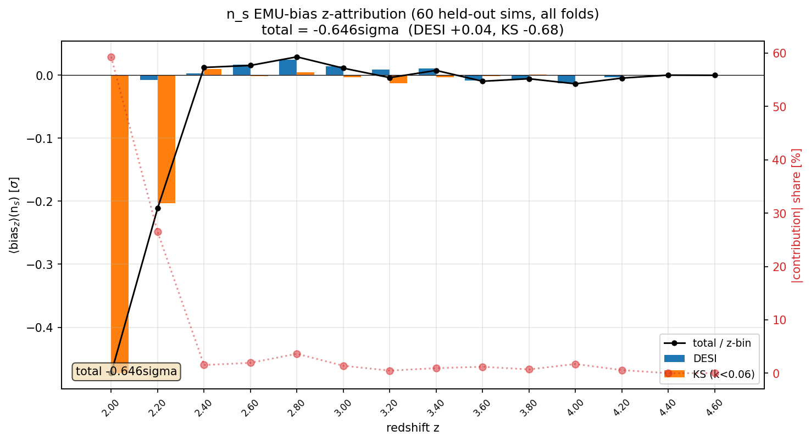
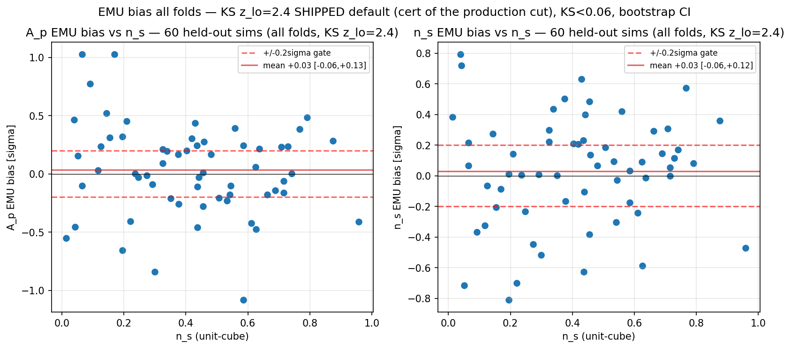
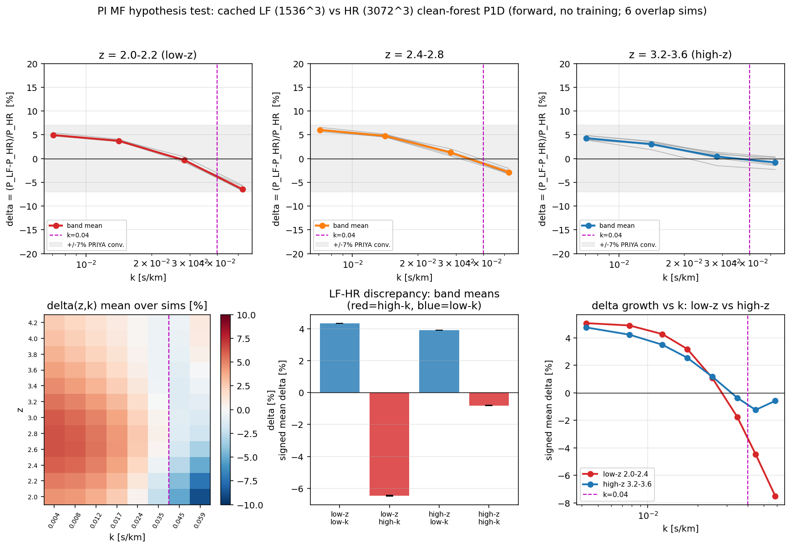
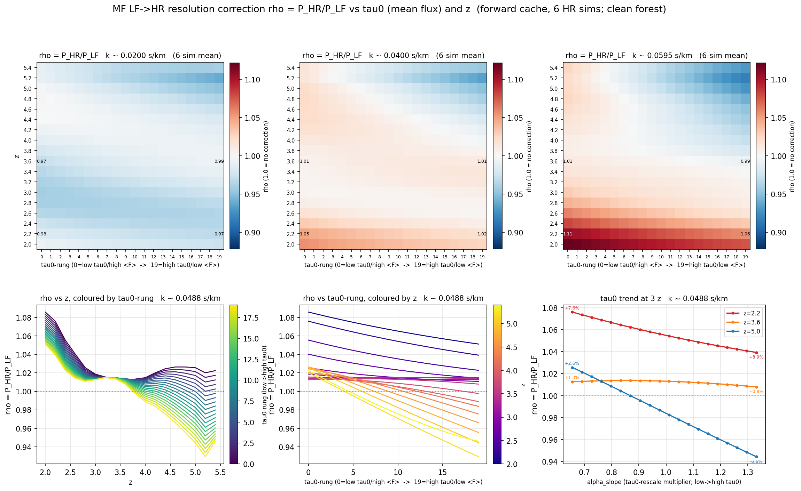

# Session walkthrough — from the −0.65σ n_s bias to the wired MF correction (2026-06-08/09)

A narrative of ~5 hours of work: the open thread we inherited, how the four PI feedback points were turned
into diagnostics, the reversal chain that root-caused the bias, the fix, the multi-fidelity (MF) correction
we built + adopted + wired, and where we stand. Image paths are relative to `docs/superpowers/`.
Commits: `0dd6e0e → 417cb24` (8 commits, all pushed to `origin/phase2c-likelihood`); 70 tests green.

---

## 0. Where we started

The prior session left one open thread: a **coherent −0.65σ under-prediction of n_s** by the emulator,
measured over all 8 LOSO folds (60 honestly-held-out sims). It was *not* root-caused; the leading guess was
a "finite-60-sim generalization floor." The PI asked for thinking time and gave **four feedback points**:
(1) the τ₀–n_s degeneracy through the heads; (2) the extended-prior n_s>1.0 region (not Latin-hypercube);
(3) the log-P1D normalization maybe disfavouring the tilt; (4) whether there's a loss on the (τ₀,z)
conditional mean.

*The inherited result: A_p ≈ 0, but n_s sits coherently below zero (50/60 sims negative, −0.65σ).*

---

## 1. Review + diagnostics (the four feedback points)

A 4-lens review (Bayesian / CS / cosmology / Lyα) + reference agents (PRIYA orig 2306.05471, extended
2024JCAP, LaCE 2305.19064, local code+chains) scored each feedback point. The first diagnostic
(`diag_ns_slope_attenuation.py`) **overturned the leading hypothesis**: the emulator's n_s *response* is
faithful — slope-attenuation **β ≈ 0.98** (emu-vs-truth ∂logP/∂n_s shape corr +0.997). So #3/#4 as
"tilt-response attenuation" were ruled out: the bias is a coherent *residual*, not a broken response.

---

## 2. The reversal — where the bias actually lives

`diag_nsbias_z_attribution.py` decomposed the −0.646σ exactly (Σ_z bias_z = total to 2e-13):

*86% of the bias is **two KS bins, z=2.0 + z=2.2**. DESI (the primary cosmology leg) is +0.04σ — clean.
It is not a C_emu artifact (toggle 0→×2 moves ±0.01σ).*

So the −0.65σ was **not** a cosmology-emulator defect at all — it was concentrated in the **low-z KS
(KODIAQ-SQUAD) leg**. Two converging causes, both in the low-z/small-scale corner:

**(a) Closure side — low-z KS data quality.** KS z=2.0/2.2 are exactly the low-z P1D the PI's KS paper
excludes (DLA-finder incompleteness). Cutting KS z<2.4 collapses the bias:

*All-folds bias at the shipped `z_lo=2.4`: n_s **+0.030σ** (later +0.035σ with full-range KS), A_p +0.03σ —
the coherent pull is gone, both inside ±0.2σ. Sign balance flips 10+/50− → 37+/23−.*

**(b) Real-fit side — LF resolution (the PI's MF hypothesis, confirmed).** Comparing the LF (1536³) and
HR (3072³) caches on the 6 overlap sims:

*The LF P1D is **−6% power-deficient at low-z high-k** (tilt-shaped, coherent 6/6 sims, mean-flux matched to
<0.15% so it's genuine resolution), matching PRIYA's ~7% convergence. The LF-only emulator carries this vs
reality → a real n_s systematic the MF correction must fix.*

This is **distinct** from the closure bias: closure = LF-emu-vs-LF-truth (fixed by the z-cut); MF systematic
= LF-vs-HR/reality (fixed by MF wiring). Same regime, different objects.

---

## 3. The fixes

- **KS `z_lo=2.4`** (PI decision): removes the low-z closure bias; all-folds **+0.030σ** certified.
- **KS `klow=0.0055`** (`drop_first4=False`, PI/KS-author decision — the Karaçaylı Fig-11 first-4-bins
  caution is misleading): keeps KS's full native range; bias **stays in-gate (+0.035σ)** — the added low-k
  bins are emulator-clean. (Low-k is still primarily DESI's; KS's value is the small scales.)

---

## 4. The MF correction (built + ADOPTED)

A τ₀+z-resolved LF→HR resolution correction (`multifidelity.py`):

*The correction ρ=P_HR/P_LF must be resolved in BOTH z (primary) and τ₀ (secondary; the τ₀-slope flips sign
with z). Form (review-locked): separable `gbar_z+gbar_tau` + one rank-1 (z×τ₀) interaction — enough to
capture the sign-flip, too few DOF to alias the n_s tilt. Single clean ρ across HCD classes (per-class
agree to ≤1.1pp). dN/dX + CDDF get a fixed-slope correction too.*

**Adoption gate (through the production forward) PASSED:** n_s +0.026σ, A_p +0.055σ (in-gate, no
regression); **the z=2.8–3.4 high-k systematic collapses from +0.43 to ~0** (G3); aliasing clean
(∂g/∂n_s=0, rank-1 ON−OFF Δn_s=−0.0003σ). The τ₀–n_s flag (a ~0.13 correlation rotation) is a benign
**tightening** from real added information, carried as a coverage note.

**Wired** into `data_loglik` (opt-in `mf=`; `mf=False` byte-identical) + the closure driver; the
small-scale **C_emu floor** (KS-only, z≤4.6) assembled.

---

## 5. The closure profiling

*MF closure mock, whitened residual at truth: χ²/dof = 1.24 (DESI) / 0.83 (KS) — C_total (incl. the floor)
is correctly sized, no structured residual.*

*The C_emu floor lifts only the KS small-scale leg (DESI untouched).*

Firm re-profile at production tree-depth (mtd=10), with the `get_samples` postprocess waste removed:
**~6 CPU-h/mock**, 0 divergences, accept 0.974, ESS/sample ≈ 0.44.

---

## 6. Where we stand + the open question

Everything above is committed + pushed + green. The remaining step is the **Leg-B closure coverage run**
(`MF-COVERAGE-01`) — but see the methodological note below: **convergence vs coverage** is worth settling
before committing the compute. Experiment log: `2026-06-09-mf-closure-experiments.md`.

**Stage ledger:**
| stage | status |
|---|---|
| −0.65σ root cause (low-z KS + LF resolution) | ✅ settled, 4-lens-reviewed |
| z_lo=2.4 + KS klow=0.0055 | ✅ certified all-folds (+0.035σ) |
| MF τ₀+z correction + dN/dX/CDDF | ✅ adopted (gate passed) |
| MF wired + C_emu floor | ✅ done, opt-in, byte-identical off |
| closure coverage/convergence | ⏳ design decision pending (see note) |
