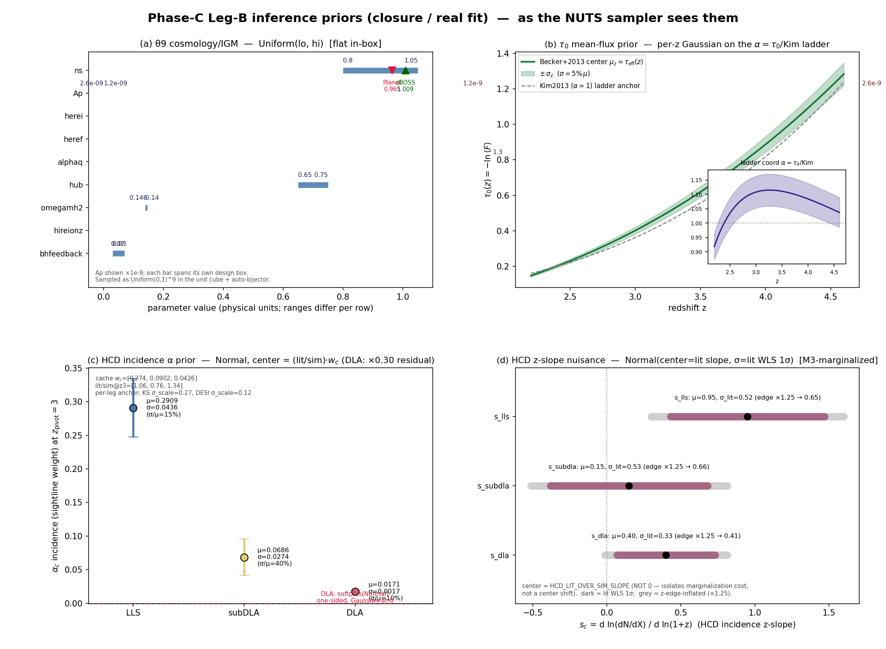
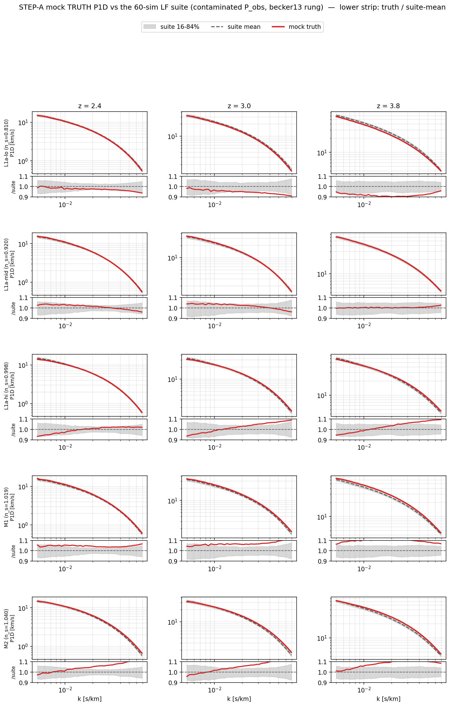
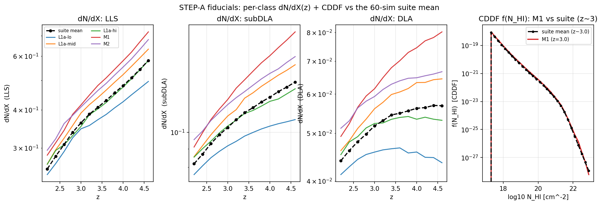
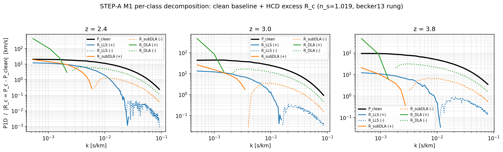
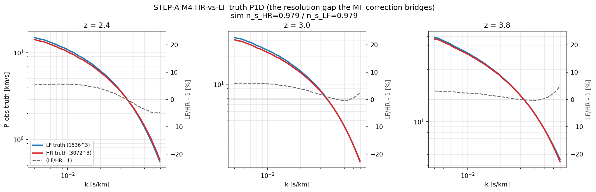

# STEP-A closure walkthrough — mocks, model, priors, and diagnostics

A single tracking doc for the STEP-A convergence+unbiasedness validation of the Phase-C MF likelihood:
**what the model + priors are, what each mock is and why, what the raw mock data looks like (now), and the
NUTS diagnostics (filled in when the chains finish).** Image paths are relative to `docs/superpowers/`.

**Run:** launched 2026-06-09 ~18:13, this node (16 cores, acct `yueyingn0`), `mode (A)` background,
`scripts/run_stepA.py --run --workers 14`. Live log: `checkpoints/stepA/run_stepA.out`; health:
`checkpoints/stepA/health.{json,txt}`; per-chain checkpoints: `checkpoints/stepA/<chain_id>.npz`. Restartable
(skips done chains). Status: **RUNNING** (diagnostics §6 pending).

---

## 1. The emulator (what produces the model P1D)

A JAX/Equinox emulator of the per-class Lyα P1D, trained on PRIYA (60 LF + 6 HR sims). Forward graph:

- **Encoder**: `[θ9, z] → latent(64)`.
- **Head A** (τ₀-invariant): `latent → f_nhi (CDDF, 30 bins), dN/dX (per class)`. Consumes only the latent →
  HCD incidence is τ₀-independent by construction.
- **Baseline head** (θ-BLIND): `(z, τ₀) → m̂ (4, n_k)` — the σ_marg-standardized (z,τ₀)-conditional MEAN
  log-P_filt, low-rank through its own SVD basis. Carries NO cosmology (∂m̂/∂θ ≡ 0, verified).
- **Head B** (τ₀-dependent): `concat(latent, τ₀) → r̂ (4, n_k)` σ_cosmo-whitened P_filt RESIDUAL + 3 HCD
  template deltas.
- **Reconstruction**: `logP_filt = (m̂·σ_marg + μ_marg) + σ_cosmo·r̂`. **All cosmology flows through r̂** —
  the identifiability move that un-buries the ~0.4% cosmology signal from the ~99.5% z/τ₀ variance.
- **Multi-fidelity (MF) correction** (`mf=True`): `log P_MF = log P̂_LF + g(z,τ₀,k) + log res_corr`, LF
  backbone frozen (`stop_gradient`). `g` = **separable `gbar_z(z,k) + gbar_tau(τ₀,k)` + one rank-1 (z×τ₀)**
  LF→HR resolution correction (u_τ on the physical mean-flux axis); dN/dX + CDDF get a fixed θ-independent
  z-resolved correction. Adopted after the gate (removes the z=2.8–3.4 high-k systematic, no n_s aliasing).

## 2. The likelihood (how the model meets the data)

**Forward (per z):** `P_obs(k) = P_clean + Σ_{c∈HCD} α_c · (P_c − P_clean)` — clean forest + per-class HCD
**excess templates** `R_c = P_c − P_clean` (LLS/subDLA/DLA), scaled by the effective post-masking incidence
`α_c` (z-resolved: `α_c(z) = a_pivot·exp(δ_leg)·g_fixed,c(z)·((1+z)/(1+z_p))^{s_c}`). Per-class P_filt comes
from the emulator (MF-corrected when `mf=True`).

**Per leg:** interpolate cache-k → the leg's k-grid, × (metals SiIII/SiII) × (resolution) [default: DESI
metals on / KS off], assemble `C_emu` on the leg grid.

**Two legs, block-diagonal** (independent surveys): DESI (681 bins, z 2.2–4.2, k 0.0013–0.041) + KS (132
bins, z 2.4–4.6, k 0.0055–0.063). `C_total = C_data (cosmic + diag-inflation) + C_emu (cross-class) + MF
small-scale floor (KS-only, z≤4.6)`.

**Gaussian likelihood:** `logL = Σ_leg gaussian_loglik(P_data − P_model, C_total)` — jittered Cholesky with a
carried logdet (NaN-safe). τ₀ is sampled on the ladder coordinate α=τ₀/Kim(z) (Jacobian-free); all of
(θ9, τ₀_vec, α_hcd, a_metal, b_res, s_c) are differentiable for NUTS (25-dim dense-mass block, +3 when the
HCD z-slope is marginalized).

## 3. The priors

- **Cosmology/IGM θ9 (9d) — Uniform, flat in-box** (PRIYA design box): n_s [0.8,1.05] (brackets Planck 0.965
  & eBOSS ~1.009), A_p [1.2,2.6]e-9, herei [3.5,4.5], heref [2.2,3.2], α_q [1.3,3.0], h [0.65,0.75],
  Ωmh² [0.14,0.146], z_HI [6.5,8.0], ε_AGN [0.03,0.07].
- **τ₀ mean-flux ladder (13d) — per-z Gaussian** on α=τ₀/Kim(z): center = Becker+2013 τ_eff(z); width
  σ=0.05·μ (MVP 5%). ⚠️ *flagged*: the 5% is a placeholder (Becker reports z-dependent ~3–8%) and is the
  single most load-bearing width for A_p/n_s via the τ₀–cosmology degeneracy.
- **HCD incidence α (3d) — per-class Normal**, centered on (lit/sim)·w_c (PRIYA mis-predicts dN/dX, so
  centered on the literature ratio): @z=3 LLS μ=0.29 σ/μ=0.15 (tight, cosmology-degenerate), subDLA σ/μ=0.40
  (broad), DLA one-sided softplus Gaussian-at-0, σ/μ=0.10 (tight; depends on the 0.30 residual-masking
  assumption — *flagged*). Per-leg amplitude anchor: KS σ=0.27, DESI σ=0.12.
- **HCD z-slope s_c (3d, M3 only) — Normal**, center = lit slope [0.95,0.15,0.40], σ = lit dN/dX-slope 1σ
  [0.52,0.53,0.33] ×1.25 z-edge inflation.
- **Metals/resolution:** fixed 0 in the closure (sim-truth has no metals).

**Sampled dim = 25** (9+13+3), **+3** when the z-slope is marginalized (M3).

## 4. The mocks (23 mocks / 44 chains)

Truth = the sim's own τ=1e6-filtered Tier-P (clean+LLS+subDLA+DLA, w_c-weighted, DLA-masked); forward = the
additive-excess model above with α marginalized; each mock = the joint DESI+KS data vector; ≥4 dispersed-init
chains (mtd=10, warmup 250) for fiducials, 1 chain for the L1b bias scan.

**Tier 1 — LF inference (`mf=False`), the dense unbiasedness foundation:**
| ID | fold / n_s | chains | reason |
|---|---|---|---|
| L1a-lo | 0 / 0.810 | 4 | converge+recover at low n_s (original closure regime) |
| L1a-mid | 4 / 0.920 | 4 | bulk |
| L1a-hi | 7 / 0.998 | 4 | converge+recover at the real-fit n_s — hardest geometry |
| L1b | 2 sims/fold × 8 | 1×16 | **bias across the full n_s range** (LF density) |

**Tier 2 — MF correction (`mf=True`), gated on Tier 1:**
| ID | fold / n_s | chains | reason |
|---|---|---|---|
| M1 | 7 / 1.019 | 4 | recover *through the MF forward* at the real-fit regime |
| M2 | 7 / 1.040 + τ₀-extreme | 4 | n_s>0.98 σ_edge corner + A_p–τ₀ funnel stress |
| M3 | = M1, **z-slope marginalized** | 4 | anti-circularity (real-fit HCD config) |
| M4 | HR-truth, n_s=0.979 | 4 | the MF **correction itself** vs data-like (HR) resolution |

**Gate (per fiducial):** split-R-hat<1.01 (all params) + bulk&tail ESS≥400 + 0 divergences + E-BFMI>0.3 +
no funnel, AND **|bias z|<0.2σ on (A_p, n_s)**. Tier 1 must pass before Tier 2 is trusted.

## 5. Raw mock data — truth vs the simulation suite (now)

**Mock P1D truth vs the suite mean** (the fiducials sit close to the ensemble in absolute P1D — z dominates
— but the ratio strips show the high-n_s mocks ride above the 16–84% band at high-k/high-z, the "redder
tilt at small scales" the real fit must measure):

**Mock dN/dX + CDDF truth vs the suite mean** (per-class incidence spreads ~factor-few around the suite,
DLA most variable, rising ~3–4× over z):

**Per-class decomposition (M1)** — the clean forest + the HCD excess R_c the forward marginalizes:

**M4 — HR vs LF truth** (what the MF correction must bridge: LF/HR −1 is ~+5% low-k → −3.7% high-k at z=2.4,
shrinking with z — the low-z high-k resolution crossover behind the whole n_s-bias thread):

*Exact truth sims:* L1a-lo n_s=0.810 (fold0), L1a-mid 0.920 (fold4), L1a-hi 0.998 (fold7), M1 1.019, M2 1.040
(fold7), M4 HR n_s=0.979 (fold6 LF pool).

## 6. NUTS diagnostics (filled in when the chains finish)

*Pending — RUNNING.* On completion this section gets: per-fiducial **R-hat / bulk&tail-ESS / E-BFMI /
divergences / tree-depth**, the **per-mock (A_p,n_s) bias z** (Tier-1b across the n_s range), posterior
corner/1D vs truth, and the whitened-residual χ²/dof per leg. The gate verdict (pass/fail per fiducial) +
the Tier-1→Tier-2 decision land here.

<!-- DIAGNOSTICS_PLACEHOLDER: figures + the gate table inserted here when checkpoints/stepA completes -->
