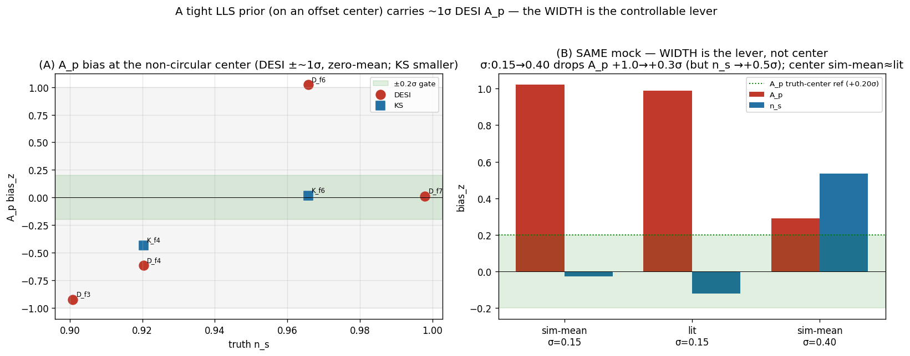

# Headline — a tight LLS prior carries ~1σ of the DESI A_p (the width is the lever)

*2026-06-10, updated 2026-06-11 with the clean same-mock isolation. A focused finding doc. The closure
machinery is unbiased when the prior is right, but a **tight LLS-incidence prior whose center is offset
from the data's true LLS abundance** moves the DESI cosmology amplitude A_p by **~1σ**. The controllable
lever is the prior **width**; the source is the **center offset**. This is the dominant real-fit A_p risk,
and it is a prior/data problem, not a likelihood bug.*

> **Note on a mid-investigation correction:** an earlier version of this doc headlined "the prior
> *center* carries ~1σ," based on a truth-center-vs-offset-center comparison that used *different* mock
> noise. The clean same-mock arms (below) show the *width* is the demonstrated lever and that two offset
> centers (sim-mean vs literature) give the *same* A_p — so the accurate statement is "a *tight* prior
> *enforcing* an offset center." Kept here as the record.

---

## The claim, in one line

In the separate-inference closure, at the current LLS-prior width (σ/μ=0.15, fairly **tight**), **DESI A_p
is biased ~1σ** whenever the prior center is offset from the sim's true LLS abundance — and across
fiducials it scatters ±~1σ (zero-mean). **Loosening the prior (σ/μ→0.40) cuts the A_p bias to +0.29σ** —
but trades it into n_s (+0.54σ) and widens A_p. KS is much less sensitive. So the LLS prior is a ~1σ
DESI-A_p lever, controlled by its **width** and sourced by its **center offset**.

- **(A)** At a non-circular (sim-population-mean) LLS center, **DESI A_p scatters ±~1σ, zero-mean**
  (D_f3 −0.92, D_f4 −0.62, D_f6 +1.02, D_f7 +0.01σ; RMS 0.75σ); **KS stays within ±0.4σ** (survey-specific
  — DESI biases A_p, KS biases n_s).
- **(B)** The clean cut — **same mock** (same noise), only the prior knob changes:
  - **center sim-mean vs literature, both σ=0.15: A_p +1.02σ vs +0.99σ** — the center (within this offset
    range) **barely matters**.
  - **width σ=0.15 → 0.40 (same center): A_p +1.02σ → +0.29σ** — the **width is the strong lever**.
  - the truth-center reference (+0.20σ, dotted) is much smaller but used different noise, so it only
    *suggests* the offset is the source — it isn't a clean cut.

## Why this happens (the mechanism)

LLS absorption adds low-k power **interchangeable with the clustering amplitude**, so A_p ↔ α_LLS are
degenerate, and the data **cannot pin α_LLS on its own** (the LLS/subDLA templates are collinear over the
measured k-range) — so α_LLS is effectively **set by its prior**. Then:
- A **tight** prior **enforces** the prior center. If that center is offset from the sim's true LLS
  abundance (both sim-mean and literature are ~+11–17% high for D_f6's sim), α_LLS is pinned high and
  **A_p compensates ~1σ**.
- A **looser** prior lets the **data pull α_LLS back toward truth**, so the center offset bites less →
  A_p bias drops. The cost: A_p widens, and the residual offset **redistributes into n_s**.

DESI is more exposed than KS because its low-k modes are where the LLS damping wings and the clustering
amplitude overlap; KS's bias surfaces in n_s instead.

## Why it matters + the fix

- The machinery is **unbiased** (truth-centered → in-gate), so this is **not a likelihood bug**.
- In the real fit we don't know the truth; the prior center comes from literature and the sample's true
  LLS abundance can differ (selection bias — the PRIYA-KS published α_LLS≈2 case). So the LLS prior is a
  **~1σ A_p error budget**.
- **The fix needs BOTH knobs:** (1) a **correct center** — an external, per-survey LLS-abundance
  measurement of the specific sample (not an assumed/shared center); (2) a **moderate width** — not tight
  (σ=0.15 enforces a wrong center) and not flat (which only reshuffles A_p↔n_s and widens A_p). Loosening
  alone is *not* a fix.

## The flatter-prior question — ANSWERED (your future-check)

The σ_LLS=0.40 arm (`D_f6_sig40`, same mock as D_f6) directly tested it:

| same mock, sim-mean center | bias A_p | bias n_s | A_p width | ESS-tail |
|---|---|---|---|---|
| σ_LLS=0.15 (tight) | +1.02σ | −0.03σ | 0.072 | 155 |
| σ_LLS=0.40 (flatter) | **+0.29σ** | **+0.54σ** | 0.090 | 102 |

**Verdict:** a flatter prior **does** reduce the A_p sensitivity (your hypothesis holds for A_p), **but it
is not a clean fix** — the cosmology bias **redistributes from A_p into n_s** (−0.03→+0.54σ), A_p widens
(+25%), and the geometry gets harder (ESS 155→102). So *flattening alone reshuffles the bias rather than
removing it.* The clean removal requires the **center** to be right (external pin); the width should be
**moderate**, chosen to keep the center-mismatch bias acceptable on *both* A_p and n_s without over-widening.

**Still open (future):** a fuller σ_LLS scan at a fixed *non-circular* center, mapping the A_p↔n_s
trade-off, to pick the moderate width; and — most important — settling the **external LLS-abundance pin
per survey** so the center is right in the first place.

## Phase-4 full result (36/36 complete)

| mock | survey | n_s | center | σ_LLS | τ₀-ext | R-hat | div | bias A_p | bias n_s |
|---|---|---|---|---|---|---|---|---|---|
| D_f3 | DESI | 0.901 | sim-mean | 0.15 | | 1.006 | 0 | −0.92 | +0.10 |
| D_f4 | DESI | 0.920 | sim-mean | 0.15 | | 1.008 | 0 | −0.62 | +0.36 |
| D_f6 | DESI | 0.966 | sim-mean | 0.15 | | 1.010 | 0 | +1.02 | −0.03 |
| D_f7 | DESI | 0.998 | sim-mean | 0.15 | | 1.009 | 0 | +0.01 | −0.44 |
| K_f4 | KS | 0.920 | sim-mean | 0.15 | | 1.022 | 0 | −0.43 | −0.35 |
| K_f6 | KS | 0.966 | sim-mean | 0.15 | | 1.011 | 0 | +0.02 | +0.39 |
| **D_f6_lit** | DESI | 0.966 | **lit** | 0.15 | | 1.006 | 0 | **+0.99** | −0.12 |
| **D_f6_sig40** | DESI | 0.966 | sim-mean | **0.40** | | 1.004 | 0 | **+0.29** | **+0.54** |
| **D_f6_tau0x** | DESI | 0.966 | sim-mean | 0.15 | **Y** | 1.009 | 0 | +1.16 | +0.87 |

**Convergence: clean** — every fiducial R-hat ≤ 1.022 (K_f4 the only one >1.01), **0 divergences everywhere**.
**The τ₀-funnel is RESOLVED:** the τ₀-extreme arm (`D_f6_tau0x`, truth at the upper PRIYA corner) has 0
divergences and R-hat 1.009 — the smooth 2-param τ₀ handles the extreme with no funnel (the old 13-rung M2
had R-hat 1.019 + a funnel). It *does* still bias cosmology (A_p +1.16, n_s +0.87σ) — but via the same
tight-LLS-prior×offset interaction, not a sampling pathology.

## Caveats

- Several arms are ESS-short (102–413 tail vs the 400 target); the cert proper wants longer chains — the
  bias *directions* are robust, the exact σ values less so.
- The cross-fiducial ±1σ scatter (panel A) is center-offset + per-sim emulator-LOSO + noise combined; the
  same-mock arms (panel B) isolate the prior knobs cleanly, the cross-fiducial scatter does not.
