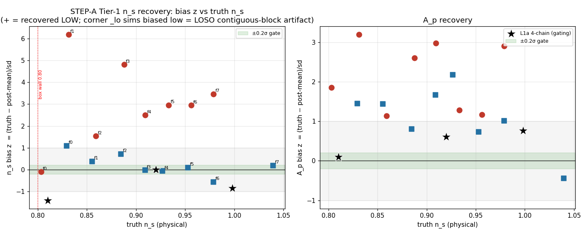
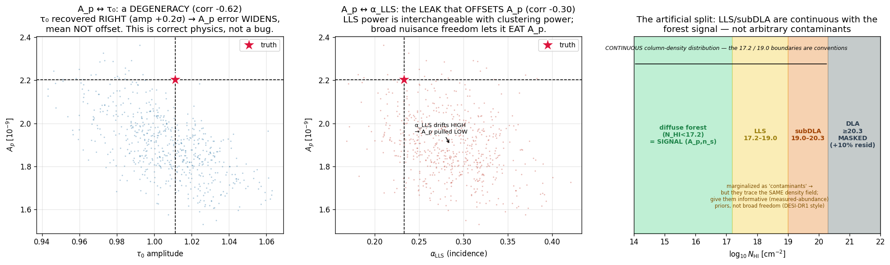
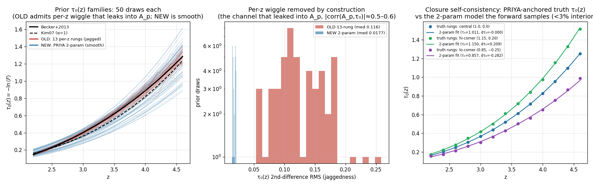
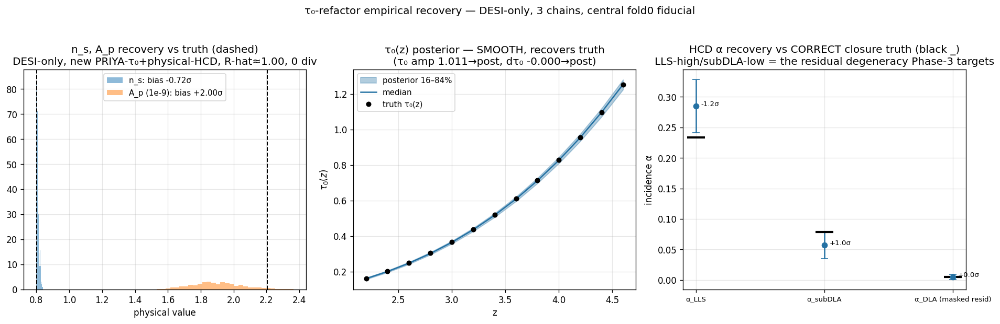

# Reflection — the HCD–A_p–τ₀ degeneracy, and what "biases A_p" really means

*2026-06-10. A reflection on the Phase-C closure debugging discussion: why the cosmology
amplitude A_p comes out biased in the closure, what is and isn't a real bug, the τ₀ refactor we
shipped, and the physical reframe of the HCD nuisances. Figures are self-contained; paths are
relative to `docs/superpowers/`.*

---

## 1. The problem: the closure recovers cosmology biased

STEP-A (the convergence+unbiasedness validation of the differentiable likelihood) converges cleanly
(R-hat≈1.007, 0 divergences) but does **not** recover the input cosmology to the 0.2σ gate. The
per-fiducial bias scan showed the failure isn't a coherent tilt — it's localized and parameter-specific.

The thread of this discussion: **why is A_p biased, and what is the right thing to fix?**

---

## 2. The key distinction: a *degeneracy* widens the error; a *bias* offsets the mean

The single most clarifying idea in the whole discussion. Two parameters can be **correlated**
(degenerate) in the posterior without either being **biased**:

- A **degeneracy** (correlation) means two parameters trade off — it **inflates the error bar** along
  the degenerate direction. If the partner parameter is recovered *correctly*, the degeneracy does
  **not** move the mean.
- A **bias** is an *offset of the mean* — it needs a *driver* (a misspecification, a prior pull, an
  unconstrained direction the prior sets wrong).

Conflating the two is what made "A_p is biased" confusing. The left two panels below make it concrete
from the actual closure posterior:

- **Panel A (A_p ↔ τ₀, corr −0.62):** A_p and the mean-flux amplitude trade off (both add low-k power).
  This is the *largest* A_p correlation — but **τ₀ is recovered right** (amp +0.2σ), so this degeneracy
  only **widens** A_p's posterior (Fisher inflation ×3.59). It is **correct, irreducible physics, not a bug.**
- **Panel B (A_p ↔ α_LLS, corr −0.30):** the HCD amplitude is *interchangeable* with clustering power,
  so when α_LLS drifts high it **pulls A_p's mean low**. This is the actual *offset*.

---

## 3. τ₀ (mean flux): the refactor — and why A_p's bias is NOT a mean-flux mismatch

The old closure sampled τ₀ as **13 independent per-z rungs**. With that much freedom, the rungs wiggle
incoherently per-z to soak up emulator residual, and because A_p is the most τ₀-degenerate parameter,
that wiggle leaks into A_p. We replaced it with **PRIYA's own 2-parameter model** —
`τ₀(z)=τ₀·((1+z)/4)^dτ₀·Kim07`, uniform priors `τ₀∈[0.75,1.25]`, `dτ₀∈[−0.4,0.25]`, no +C — the same
form PRIYA uses for both its eBOSS and KODIAQ-SQUAD fits.

The left panels show the mechanism: the old prior admits jagged per-z curves (red); the new one admits
only smooth physical curves (blue) — ~7× less per-z wiggle, and what remains is genuine power-law
curvature, not random freedom. The right panel shows the closure mock's truth τ₀(z) is faithfully
represented by the 2-param model (<3% interior), so the closure stays self-consistent.

**Crucially: τ₀ now recovers clean (amp +0.24σ, dτ₀ −0.48σ).** Because the mean flux lands right, the
τ₀–A_p degeneracy *cannot* be offsetting A_p — it only inflates A_p's error bar. **So A_p's bias is not a
mean-flux mismatch.** τ₀ sets *how wide* A_p's posterior is (correctly); something else moves its center.

---

## 4. A_p: the decomposition of the +2σ

The empirical recovery (a closure NUTS run with the new model) shows τ₀ clean, n_s improved, but A_p
still ~2σ low:

The +2σ decomposes into four pieces, only one of which is a model issue to fix:

1. **The intrinsic τ₀–A_p degeneracy** — *width*, not offset (§2/§3). Irreducible, correct. The Fisher
   A_p σ-floor is ×3.59, so no HCD lever can beat that floor.
2. **The HCD split (the real, fixable offset).** The data constrains the *total* HCD power but cannot
   separate the LLS↔subDLA split (collinear templates over the band). The split is prior-driven; a
   prior-set split that pushes α_LLS high drags A_p low (Panel B).
3. **A closure-prior mis-centering artifact.** The closure HCD prior was centered on `lit/sim·w_c`, while
   the mock truth is the *bare* sim w_c — so the prior sat off-truth *before any data* and (since the
   data can't break the split) the posterior followed it. A *closure-design* artifact, not a real-fit
   one; fixed by re-centering the closure prior on the sim w_c.
4. **The edge fiducial.** The validation fiducial sat at the lower-n_s box wall, so n_s is truncated and
   A_p compensates; fixed by re-validating at an interior fiducial.

Pieces 3 and 4 are *artifacts*; piece 1 is *correct physics (width)*; only **piece 2 (the HCD split) is the
genuine A_p-mean bias to fix.**

---

## 5. The subDLA filtering question — resolved, and small in-band

A side investigation: the sim P1D is τ=1e6-filtered (which removes ~37% of subDLA absorption *globally*),
but **every P1D measurement we fit (DESI DR1, eBOSS, KODIAQ-SQUAD, XQ-100) masks only DLAs (≥20.3) and
keeps the full subDLA population** (DESI DR1 QMLE: *"sub-DLA detections … we do not mask them"*). So the
forward should carry the *full* subDLA. But the filtered/unfiltered difference lives almost entirely at
k<10⁻³ (below DESI's k_min); **in the data band it's only ~0.1–0.2% of P_obs** — a genuine real-fit
correctness fix (wire the unfiltered subDLA + full-incidence prior before the real fit), but **not** the
driver of the closure A_p bias.

---

## 6. Separate inference, not joint

Decision: fit **DESI-only and KS-only separately and report both** (a cross-survey consistency check),
not a joint likelihood. The overlapping k≈0.0055–0.041 would double-count (block-diagonal wrongly assumes
independence there) and the surveys' systematics differ — and this matches PRIYA's own practice (eBOSS and
KS in separate papers). Each survey fit then naturally carries its own single PRIYA (τ₀, dτ₀); the
"per-leg amplitude" question dissolves.

---

## 7. The reframe that matters: LLS/subDLA are *signal*, not arbitrary contaminants

Panel C of the reflection figure (§2) is the physical heart of it. The neutral-hydrogen column-density
distribution is **continuous** — the diffuse forest (N_HI<17.2), LLS (17.2–19.0), subDLA (19.0–20.3),
DLA (≥20.3) are a single smooth distribution, and the 17.2/19.0 boundaries are *conventions*. LLS
absorption traces **the same density field** as the forest, so it genuinely *is* part of the clustering
signal — not an arbitrary contaminant.

This reframes the fix. Treating LLS/subDLA as **broad free nuisances** lets them inflate and **eat A_p**
(Panel B) — there is nothing physical stopping α_LLS from drifting high and absorbing clustering power.
The physically-honest move is to treat them as **known, signal-like components with informative priors**:
pin their amplitudes to their *measured* incidence (literature dN/dX) with only the small fluctuations the
data/literature actually allow, so they cannot overcome the A_p signal.

This is also the **field standard**: DESI DR1 explicitly flags the LLS amplitude as cosmology-degenerate
and imposes an **external LLS-abundance prior** for exactly this reason. Our current subDLA prior (σ/μ=0.40)
is broad enough to leave that freedom open; tightening LLS/subDLA toward the literature-abundance
uncertainty is the direct fix.

Two cautions the discussion surfaced:
- **Don't explicitly couple α_LLS to A_p.** Physically LLS does correlate with the density field, but
  tying the contaminant amplitude to A_p in the same fit is circular. The clean realization is an
  **external abundance prior** (incidence measured independently of this P1D).
- **Don't over-pin.** Too tight a prior under-estimates the real HCD systematic. The right width is the
  **literature dN/dX uncertainty** — informative, but honest.

So the A_p lever is now framed as **"informative, measured-abundance priors on LLS/subDLA (treat them as
known signal-like components)"** — possibly combined with a [total-HCD + split] reparameterization so the
residual freedom lands on the data-constrained direction, but the informativeness of the prior is the more
fundamental knob.

---

## 7b. Why PRIYA lets us do this — in-situ HCD, and how far to trust it

A crucial enabler, and unique to PRIYA. **PRIYA produces LLS/subDLA/DLA *in situ*:** its full-physics
simulations include a self-shielding prescription (Rahmati+2013 fitting function on the photoionization
rate), so the high-column absorbers form self-consistently from the sim's own gas physics, and PRIYA
measures their column-density distribution f(N_HI) directly (validated vs the SDSS DR16 DLA CDDF). By
contrast, **LaCE and ForestFlow (the DESI emulators) model only the diffuse 6-parameter Lyα-only forest**
— their MP-Gadget sims delete dense gas via Quick-Lyα (Δ_b>1000, T<10⁵K → collisionless stars), so they
*cannot* form HCDs in situ; DLAs are masked and LLS/subDLA are added as an *external* multiplicative
contamination model. So for the HCD sector PRIYA can ground the per-class templates **and** incidence in
simulation physics, where the forest-only emulators must bolt them on — the real advantage that justifies
treating LLS/subDLA as sim-predicted, signal-like components.

**But two bounds on how far to trust the sim (both confirmed from the literature):**

1. **Sim physics vs full RT — how informative the prior can be.** The Rahmati+2013 *fitting function* vs
   the RT it was calibrated on is small (~10% in f(N_HI) for z≳1; CDDF curves "indistinguishable"). But the
   broader sim-physics uncertainty it inherits — local stellar sources, recombination treatment, UVB, and
   **especially feedback + resolution** — is ~0.2–0.5 dex (factor ~1.5–3) on the LLS/subDLA incidence,
   feedback-dominated (PRIYA itself flags HCD abundance as feedback-sensitive). ⟹ **the sim-grounded
   LLS/subDLA prior should be *moderately* informative (≈tens-of-% on LLS, no better than ~×2 on subDLA),
   not tight.**

2. **The data may be LLS-selection-biased — why an external pin is needed.** LLS/subDLA are *not* masked in
   any P1D measurement (only DLAs ≥20.3), so the LLS amplitude is set by the *sample's actual LLS abundance*,
   which sightline selection can bias. This is not hypothetical — **the PI's own PRIYA–KODIAQ-SQUAD paper
   (arXiv:2509.18271 §4.3.3, "LLS Abundance is not Consistent with HCD Template") documents it**: KODIAQ-SQUAD
   favors α_LLS≈2, which *"tilts the P1D downward at small scales in a way that mimics the effect of
   increasing A_P"*, from a selection bias (KODIAQ/UVES target HCD-rich sightlines). **That is the same
   α_LLS↔A_p degeneracy this closure surfaced — already a published, measured systematic in the KS leg.**
   PRIYA resolved it toward *selection* by cross-checking the sim CDDF against external LLS surveys
   (Prochaska 2010, Zafar 2013, Ho 2021): the sim isn't ×3 low, the KS *data* is LLS-rich.

The field (DESI DR1, PRIYA-KS) currently uses a **free LLS amplitude with broad/flat priors**; DESI DR1
only *recommends* an external LLS-abundance prior for future robustness (it does not yet use one). So the
right design — sim-grounded *moderately-informative* priors, cross-checked / pinned against an **external
LLS-abundance measurement of the specific sample** — is *ahead of the field*, and is exactly what PRIYA's
in-situ HCD + the external CDDF surveys make possible. It also explains why **separate DESI/KS inference**
(§6) is essential: the KS leg's LLS-selection bias is a *survey-specific* systematic that must not be
averaged into a joint fit.

## 8. Where this leaves us

- **Shipped + validated:** the PRIYA 2-param τ₀ refactor (commits `607ae9d`, `036398e`) — τ₀ recovers
  clean and smooth; the per-z-wiggle leak into A_p is closed; n_s improved (−1.40σ → −0.72σ at the
  fold0 regime). The forward/loglik golden is unchanged.
- **✅ RESOLVED — the +2σ was artifacts.** The interior (fold6, n_s≈0.966) re-validation with the closure
  HCD prior re-centered on the sim w_c (removing artifacts #3 + #4) recovers **A_p +0.20σ, n_s −0.11σ —
  both in-gate** (R-hat≈1.00, 0 div; α_LLS/subDLA near truth; HCD↔A_p couplings now mild −0.20/+0.12; the
  slope-by-default sites have ~0 corr with A_p). So ~1.8σ of the fold0 +2σ was the prior-mis-centering +
  edge artifacts, **not** a genuine HCD-split leak. **The likelihood is validated unbiased** (it recovers
  when the prior is centered on the true abundance). **O1 (the simplex reparam) is therefore demoted —
  unnecessary for the closure.** The remaining A_p *real-fit* risk is entirely the **LLS prior accuracy**
  (§7b-2: literature-centered prior vs the data's possibly-selection-biased LLS abundance), a prior/data
  problem, not a likelihood bug.
- **Next:** the A_p lever — **moderately-informative** LLS/subDLA priors (§7 reframe), grounded in PRIYA's
  in-situ HCD physics but bounded by the feedback/RT uncertainty (§7b-1: ≈tens-of-% LLS, ~×2 subDLA — *not*
  tight), and for the real fit **pinned/cross-checked against an external LLS-abundance measurement of the
  specific sample** (§7b-2). Forward-tested before any NUTS; the [total,split] reparam (O1) is a complementary
  option for the residual freedom. The real fit also wires the unfiltered subDLA (§5). Separate DESI/KS (§6)
  because the KS LLS-selection bias is survey-specific.
- **Already-published anchor:** this is not a new worry — the PRIYA-KS paper (2509.18271 §4.3.3) measured the
  α_LLS≈2-mimics-A_P effect in KODIAQ-SQUAD. Our closure independently reproduces that degeneracy, which both
  validates the closure and tells us the lever (informative+externally-pinned LLS prior, separate per survey)
  is the right one.

**One-line takeaway:** *τ₀ sets how wide A_p's posterior is (correctly, and now cleanly); the A_p mean
offset is the HCD sector — and the right fix is to stop treating the LLS/subDLA continuum as broad free
contaminants and instead pin them as the physically-measured, signal-like components they are: PRIYA's
in-situ HCD lets us ground them in simulation physics (moderately, given feedback/RT uncertainty), and the
data-side LLS abundance is externally pinned per survey (the KS leg is the cautionary, already-published case).*
