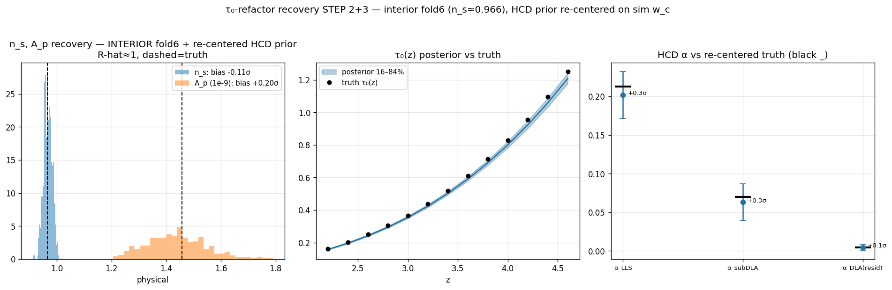
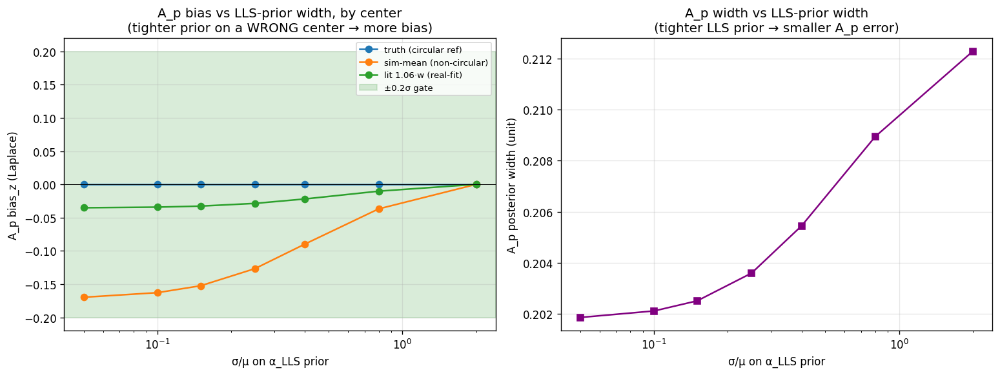

# Walkthrough — debugging the Lyα-P1D closure: the HCD–A_p–τ₀ story

*2026-06-10. A plain-language walkthrough of the whole debugging arc — what was biased, why, what we
changed, and the open questions. Written to be read top-to-bottom by a colleague with no prior context.
Figures are inline (paths relative to `docs/superpowers/`). This supersedes the terser
`2026-06-10-reflection-hcd-ap-tau0-degeneracy.md` for readability; the physics is the same.*

---

## How to read this / where your feedback helps most

If you only look at three figures:
1. **§3 Fig** (`reflection_ap_hcd_tau0.png`) — the conceptual core: *degeneracy vs bias*, and the *N_HI
   continuity* that says LLS/subDLA are part of the signal. **→ is that framing physically right?**
2. **§4–§5 Figs** (`tau0_refactor_recovery.png` then `..._interior.png`) — A_p went +2σ → +0.20σ once we
   moved off the box edge and stopped centering the prior on the truth. **→ is "the +2σ was artifacts"
   convincing?**
3. **§5 Fig** (`lls_prior_sensitivity.png`) — how A_p bias/width depend on the LLS-prior center & width.
   **→ how informative should the LLS prior be, and what external measurement should pin it per survey?**

The decisions already locked in are in §8; the live run is §9; open questions in §10.

---

## 1. The starting point: the closure recovered cosmology biased

We turned the PRIYA emulator into a differentiable numpyro likelihood and ran a closure: feed it mock
data made from a known simulation, check it recovers the input cosmology (A_p, n_s). The sampler
**converged beautifully** (R-hat≈1.007, no divergences) but the recovered cosmology was **off** — and not
in a simple way: some fiducials fine, others biased by 1–3σ, A_p and n_s both involved.

The question that drove everything below: **why is the cosmology biased, and what is the right thing to
fix?**

---

## 2. First lever — the mean flux (τ₀)

The mean transmitted flux (encoded as the effective optical depth τ₀) is the single biggest "nuisance"
in a Lyα-P1D fit. Our closure had been sampling τ₀ as **13 independent per-redshift values** — one free
knob per z-bin. With that much freedom, those knobs wiggle incoherently from bin to bin to soak up tiny
emulator imperfections, and because A_p is strongly degenerate with τ₀, that **per-z wiggle leaks into
A_p**.

The fix was to use **PRIYA's own mean-flux model**: a smooth 2-parameter power law,
`τ_eff(z) = τ₀·((1+z)/4)^dτ₀ · τ_Kim(z)` — an amplitude τ₀ and a slope dτ₀, with wide uniform priors, no
additive offset. This is exactly what PRIYA uses for both its eBOSS and KODIAQ-SQUAD fits (and what
DESI/eBOSS use in spirit). Two free parameters instead of thirteen.

Left: the old prior allows jagged per-z curves (red); the new one only smooth physical curves (blue) —
~7× less per-z wiggle. Right: the smooth model still represents the simulation's true τ₀(z) faithfully
(<3% interior), so the closure stays self-consistent.

**Result: τ₀ now recovers cleanly** (amplitude +0.24σ, slope −0.48σ). And this is the first important
subtlety: because the mean flux lands *right*, **A_p's bias is NOT a mean-flux mismatch.**

---

## 3. The key idea: a *degeneracy* is not a *bias*

This distinction unlocked the whole problem. Two parameters can be **correlated** in the posterior
(degenerate — they trade off) without either being **biased** (mean shifted away from truth):

- A **degeneracy widens** the error bar along the trade-off direction. If the partner is recovered
  correctly, it does *not* move the mean.
- A **bias offsets** the mean — it needs a *driver* (a misspecification, or a prior that pulls an
  unconstrained direction the wrong way).

- **Left (A_p ↔ τ₀, corr −0.62):** the *biggest* A_p correlation. But τ₀ is recovered right, so this only
  **widens** A_p's error — it's correct, irreducible physics, not a bug.
- **Middle (A_p ↔ α_LLS):** LLS absorption adds the same kind of low-k power that the clustering amplitude
  sets, so they're interchangeable to the fit. If the LLS amplitude drifts high, **A_p is pushed low** —
  this *offsets* A_p. This is the real bias channel.
- **Right (the N_HI continuity):** more on this in §6 — it's why LLS/subDLA should be treated as signal.

In one line: **τ₀ controls how *wide* A_p's posterior is (correctly); the HCD sector controls where its
*center* sits (fixably).**

---

## 4. The A_p +2σ, decomposed

At the original fiducial — `fold0`, one of the 8 leave-one-out cross-validation hold-out points, and the
one sitting at the *lowest* n_s — A_p came out **+2σ low** (this is the fold0 number; at an interior
fiducial it turns out to be ~0, see §5). A parallel clue: the **subDLA incidence (α_subDLA) was recovering
2–4σ *low* in every fiducial** — the original anomaly that sent us down the HCD path. A 4-lens referee
review (Bayesian, CS, cosmology, Lyα) + our own checks decomposed the A_p +2σ into four pieces — only one
of which is a model issue:

1. **Intrinsic τ₀–A_p degeneracy** — *width*, not offset (§3). Irreducible.
2. **The HCD split** — the data measures the *total* HCD contamination well but cannot separate the
   LLS↔subDLA *split* (their templates are nearly identical over the measured k-range). The split is set
   by the prior; a wrong split pushes α_LLS high → A_p low.
3. **A closure-prior mis-centering** — we'd centered the HCD prior on `literature/sim · w_c` (where `w_c`
   is the simulation's own per-class HCD incidence), but the closure's truth *is* the bare `w_c`. So the
   prior sat off-truth before any data; since the data can't break the split, the posterior followed the
   wrong center.
4. **The edge fiducial** — fold0 sits at the lower-n_s *box wall* (the emulator's n_s training-prior
   boundary), so n_s is truncated there and A_p compensates. (n_s and A_p move together at the wall
   because both tilt/raise the small-scale P1D — so truncating n_s forces A_p to absorb the difference.)

Pieces 3 and 4 are *artifacts*; piece 1 is correct physics (width); only piece 2 is a genuine A_p-mean
bias. The α_subDLA-low anomaly is the same piece-2 split degeneracy, and it too is near-truth after the
§5 fixes (α_subDLA +1.0σ at fold0 → +0.3σ interior).

---

## 5. The interior re-validation — and the circularity catch

We removed the two artifacts: re-validate at an **interior** fiducial (fold6, n_s=0.966 ≈ Planck), and
re-center the closure prior on the simulation's own `w_c`.

**A_p +0.20σ, n_s −0.11σ — both in-gate**, clean convergence. So **~1.8σ of the +2σ was the two
artifacts, not a fundamental bias.** The likelihood machinery is sound: it recovers cosmology when the
prior is centered on the truth.

**The catch (a sharp critique):** *centering the prior on the truth is circular* — of course it recovers.
That tests "the machinery works if the prior is right," not the real situation, where we *don't* know the
truth. So we ran a forward-only scan of A_p bias vs the **prior center** (truth / sim-population-mean /
literature) and **width**:

Two lessons (with the caveat that this Laplace scan is directional, not exact):
- **Left:** with the truth center, bias is zero at any width (circular). With a *non-circular* center
  (sim-mean), a *tighter* prior gives a *larger* A_p bias — "a strong prior on a slightly-wrong center
  pulls A_p." So the in-gate interior result was partly circular; the real bias depends on how well the
  prior center matches the data.
- **Right:** tightening the LLS prior barely shrinks A_p (~5%) — because A_p's width is τ₀-dominated, not
  LLS-limited. So **tightening the LLS prior is not a good way to shrink A_p; it mostly just risks bias.**

---

## 6. The deeper physics: LLS/subDLA are *signal*, not arbitrary contaminants

This is the conceptual heart (Fig §3, right panel). The neutral-hydrogen column-density distribution is
**continuous**: diffuse forest (N_HI<17.2) → LLS (17.2–19.0) → subDLA (19.0–20.3) → DLA (≥20.3), and the
17.2/19.0 boundaries are *conventions*. LLS absorption traces the *same density field* as the forest, so
it genuinely **is part of the clustering signal**. Treating it as a broad free "contaminant" lets it
inflate and eat A_p. The honest move is to treat LLS/subDLA as **known, signal-like components with
informative priors** — pinned to their *measured* abundance, not free to swing.

**Why PRIYA lets us do this when DESI's emulators can't.** PRIYA's full-physics simulations produce
LLS/subDLA/DLA *in situ* (via the Rahmati+2013 self-shielding prescription) and **validate** their
column-density distribution against observations (O'Meara/Zafar/Ho). LaCE / ForestFlow (the DESI
emulators) model **only the diffuse forest** — their simulations even delete dense gas (the Quick-Lyα
criterion) — and bolt HCDs on as an *external* template. **Important nuance:** the *published* PRIYA-KS
fit *also* uses an **external Illustris-based HCD template** (Rogers+2018) with a free amplitude — so
grounding the HCD *template itself* in PRIYA's own in-situ absorbers (the live-emulated per-class P1D in
our forward model) is **this project's methodological advance**, not existing PRIYA practice. The
*simulation* forms the HCDs in-situ and their *abundance* is validated; using those in-situ absorbers for
the *template* is the new step.

**And to be balanced:** "treat LLS as signal with an informative prior" is a **proposed advance**, not the
status quo. The published field — including PRIYA-KS — currently floats a **broad, free** LLS amplitude and
treats the residual LLS as a *systematic to bound*; PRIYA-KS explicitly notes that small-scale (k≳0.045
s/km) reliability "fully depends on how accurately one can forward-model LLSs." So §6 is a direction we're
arguing for, not current practice.

**Two bounds on how far to trust the sim-grounded prior:**
1. **Sim physics vs full radiative transfer.** From the *self-shielding literature* (Rahmati+2013 and
   later feedback/RT studies — *not* PRIYA-KS, which doesn't quantify this): the fitting-function-vs-RT
   step is ~10%, but the broader abundance uncertainty (local sources, feedback, resolution) is ~0.2–0.5
   dex (a factor ~1.5–3). So a sim-grounded LLS prior should be **moderately** informative, not tight.
2. **The data may be LLS-selection-biased.** LLS are *not* masked in any P1D measurement, so the LLS
   amplitude is set by the *sample's* abundance — which selection can bias. This is not hypothetical:
   **the PRIYA–KODIAQ-SQUAD paper (arXiv:2509.18271 §4.3.3, "LLS Abundance is not Consistent with HCD
   Template") found KODIAQ favors α_LLS≈2, which "mimics the effect of increasing A_P"** — the *same*
   degeneracy this closure surfaced, from a measured selection bias (KODIAQ targets HCD-rich sightlines).
   The fix is an **external LLS-abundance measurement of the specific sample** to pin the prior center.

---

## 7. A side-quest: the subDLA τ=1e6 filtering

We checked whether PRIYA's τ=1e6 filtering (which removes ~37% of subDLA absorption *globally*) mismatches
the data. Finding: **every P1D measurement keeps the full subDLA population** (only DLAs are masked), so
the forward should carry full subDLAs — but the filtered/unfiltered difference lives almost entirely
*below* the measured k-range, so in-band it's only ~0.1–0.2% of the power. It's a genuine real-fit
correctness fix (wire the unfiltered subDLA before the real fit), but **not** a driver of the closure A_p
bias.

---

## 8. Decisions locked in

- **Separate DESI and KS inference** (report both), *not* a joint fit — the overlapping k-range would
  double-count and the survey systematics differ (matches PRIYA's separate-paper practice). It also
  matters because the KS LLS-selection bias is *survey-specific*.
- **PRIYA 2-param τ₀ (amplitude+slope) + the HCD per-class z-slope marginalized by default** — both
  evolve on physically-informed amplitude+slope, no per-z free wiggle.
- **Moderately-informative LLS/subDLA priors, centered on a sim+external measured abundance** — not broad
  free nuisances, not tightly pinned to a possibly-wrong center.
- **A considered HCD reparameterization — "O1": sample one *total* HCD amplitude + a separate
  LLS/subDLA *split*, so cosmology couples only to the well-measured total — is demoted.** The bias was
  artifacts + the prior center, not a degeneracy that needed re-parameterizing.

---

## 9. The Phase-4 closure result (36/36 complete)

A 36-chain closure ran with the new model, **non-circularly**: DESI-only and KS-only at the
**sim-population-mean** prior center (not the truth), spanning n_s 0.90–1.0, plus three fold6 arms
(literature-center, looser-LLS-width, τ₀-extreme). Outcome:

- **Convergence clean** — all R-hat ≤ 1.022, **0 divergences everywhere**, and the **τ₀-funnel is gone**
  (the τ₀-extreme arm runs cleanly, vs the old 13-rung M2 funnel — the τ₀ refactor worked).
- **The non-circular bias is real and survey-specific** — at the tight (σ=0.15) LLS prior, **DESI A_p
  scatters ±~1σ** (zero-mean), **KS biases n_s ~±0.4σ** instead. So the in-gate interior result *was*
  partly circular; with a realistic prior the LLS sector carries a ~1σ DESI-A_p budget.
- **The width is the lever** — loosening σ_LLS 0.15→0.40 cuts the A_p bias (+1.0→+0.29σ) but trades it
  into n_s (+0.54σ); the center (sim-mean vs literature) barely moves it.

**This is the central result** — written up with the table + figure in
`2026-06-10-headline-lls-prior-center-Ap.md`. The fix is a **correct external per-survey LLS-abundance
center + a moderate width**; flattening alone reshuffles A_p↔n_s. Open: the σ_LLS scan to pick the width,
and the external LLS pin (§10).

---

## 10. Open questions for your feedback

1. **How informative should the LLS/subDLA prior be?** The scan says tightening barely helps A_p but risks
   bias — argues for *moderate* width (the literature/RT bound, ~tens-of-% LLS). Agree?
2. **What external LLS-abundance reference pins each survey?** (O'Meara/Prochaska, Fumagalli, Ribaudo for
   the field; the PRIYA CDDF cross-check for the sim — but the *sample-specific* selection is the worry,
   esp. for KS.)
3. **Is the sim-mean center the right non-circular closure choice**, or would you prefer a different
   generic center?
4. **Is the Phase-4 fiducial list adequate** (n_s span, the τ₀-extreme, DESI+KS), or should it include
   more (e.g. a KS τ₀-extreme, or MF-path fiducials)?
5. **The continuity argument (§6):** is treating LLS as signal-with-informative-prior the right call, or
   do you want a stricter "mask-and-marginalize" stance for robustness?
