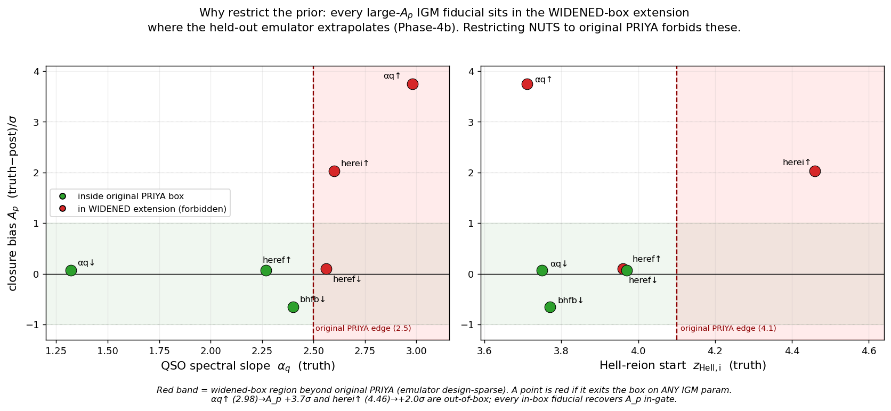
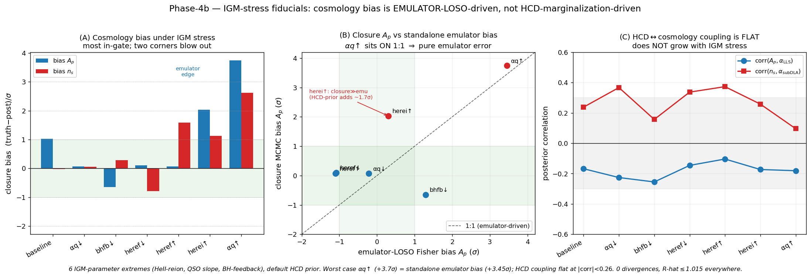
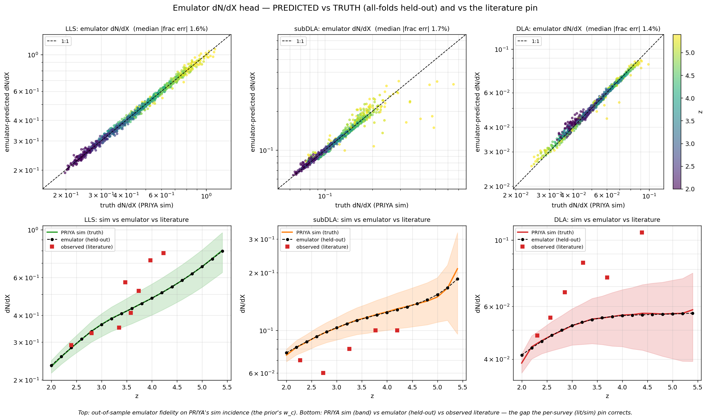
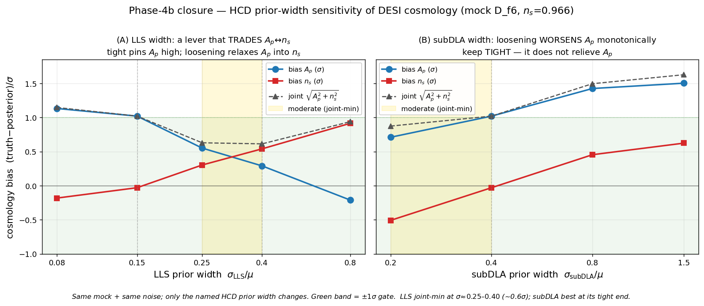
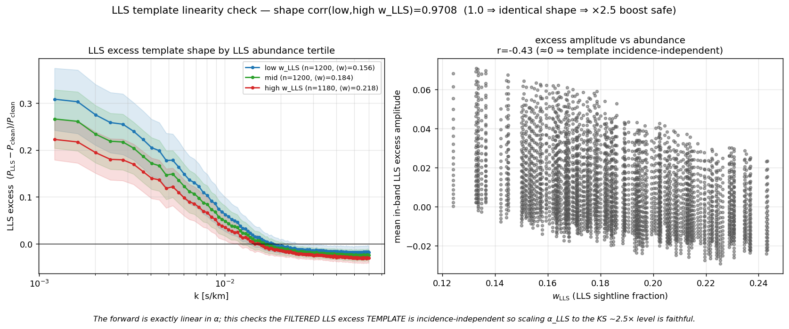
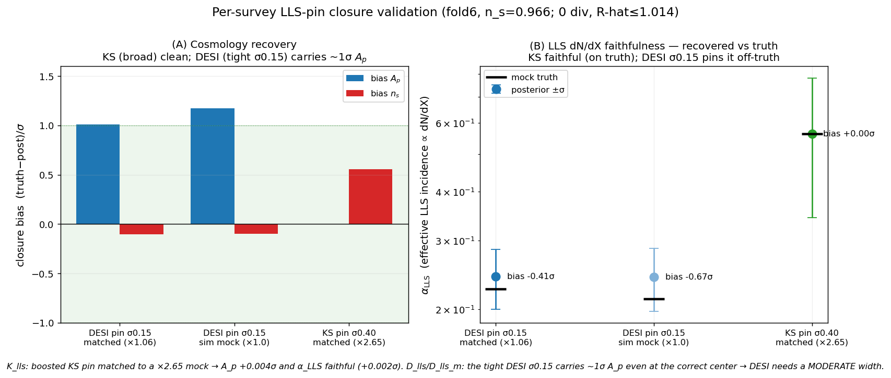

# Decision record — real-fit prior choices (HCD + IGM box), 2026-06-11

*A compact "why we chose this" record for the prior decisions made this session, each with the
evidence figure and the alternative we rejected. Narrative detail lives in the companion docs
([IGM box restriction](2026-06-11-reflection-igm-prior-restriction.md),
[HCD referee audit](2026-06-11-hcd-referee-audit.md),
[LLS-prior headline](2026-06-10-headline-lls-prior-center-Ap.md)). These are the choices that go
into the **real DESI/KS fit**; the closure cert (sim-mean center) is deliberately left untouched.*

---

## D1 — Restrict the IGM sampling prior to the original PRIYA box (keep n_s extended)

**Choice.** NUTS samples **herei ≤ 4.1, heref ≥ 2.6, alphaq ≤ 2.5** (original Bird+2023
`coarse_grid.py` ranges), while **n_s stays extended to 1.05** with the C_emu step-inflation above
0.995. Implemented as `data.SAMPLING_LIMITS` → `sampling_unit_bounds()` → `theta_unit ~ Uniform(lo,hi)`
in `_legb_model`/`_legb_priors_only`. **No retrain.**

**Why.** Phase-4b stress-tested the IGM extremes: every fiducial that blew the A_p gate sits in the
*widened-box extension* (alphaq=2.98 → A_p +3.7σ; herei=4.46 → +2.0σ), and the bias equals the
*standalone* emulator-LOSO Fisher bias — i.e. pure emulator extrapolation at design-sparse corners,
not a likelihood/HCD effect. The PRIYA LHS only densely fills the original box.

**Rejected.** (a) Hard-cap n_s at 0.995 too — would clip the real posterior (eBOSS ~1.009); instead
keep n_s extended + inflate C_emu on the ridge (PI 2026-06-08). (b) Retrain on a denser extended
grid — expensive and unnecessary; the real data sit in the interior.

---

## D2 — Per-survey LLS-abundance pin: DESI cosmic-average, KODIAQ-SQUAD ×2.5 broad

**Choice.** `HCD_LLS_SURVEY_BOOST = {DESI: 1.0, KS: 2.5}`, `HCD_LLS_SURVEY_FRAC_SIGMA = {DESI: 0.15,
KS: 0.40}`, applied via `hcd_incidence_prior(..., survey=)` on the real-fit ("lit") path.

**Why.** DESI DR1 is a large, homogeneous forest sample → the cosmic-average literature dN/dX, kept
**tight** (the LLS prior is the dominant DESI-A_p risk). KODIAQ-SQUAD is archival echelle deliberately
enriched in absorber-rich sightlines → arXiv:2509.18271 §4.3.3 finds α_LLS≈2 (≈3× the PRIYA LLS),
a **selection** excess that mimics ↑A_p — so a **high center but broad σ** lets the KS data set it
within an informative window rather than imposing a possibly-wrong tight number ("high center, broad
σ", PI 2026-06-11). The dN/dX-predicted-vs-truth check confirms the emulator reproduces PRIYA's *own*
incidence to 1.4–1.7% — so the per-survey offset is a prior/data matter, not an emulator one.

**Rejected.** (a) Pin KS tight at 2.5× — if the number is off it biases A_p hard (the failure we're
guarding against). (b) Float KS free — discards a real, measured selection effect and widens A_p
needlessly. (c) One shared LLS prior across surveys — under-estimating KS LLS pushes its A_p high.

---

## D3 — Width policy: moderate σ_LLS, tight σ_subDLA

**Choice.** σ_LLS moderate (≈0.25–0.40 on a correct center); σ_subDLA kept **tight** (≤0.40).

**Why.** The Phase-4b width scans: σ_LLS is a monotonic A_p↔n_s lever with a joint-bias minimum at
σ≈0.25–0.40; σ_subDLA behaves *oppositely* — loosening it *worsens* A_p monotonically (it is the
least data-constrained class, so a loose prior just hands the misfit a free low-k knob).

**Rejected.** "Loosen everything" — flattening σ_LLS only reshuffles A_p→n_s, and loosening σ_subDLA
makes A_p worse.

---

## D4 — subDLA prior center 0.76 → 1.00 (trust PRIYA's in-situ subDLA)

**Choice.** `HCD_LIT_OVER_SIM[1]: 0.76 → 1.00` (center subDLA on the sim, broad σ/μ=0.40 unchanged).

**Why.** The HCD referee audit showed the subDLA "recovered 1–3σ low" was **prior mis-centering**, not
a power deficit (the subDLA excess is *negative*; the filter removes only ~0.8% of subDLA power
in-band). The old 0.76 (Zafar+2013, factor-2 uncertain) sat −0.8σ below the sim incidence → pulled
α_subDLA low and leaked into n_s (corr≈+0.3). PRIYA produces subDLAs **in-situ** (Rahmati+2013
self-shielding), so the sim is the faithful center; the broad width marginalizes the residual.

**Rejected.** Keep 0.76 (imposes an offset literature center on a poorly-measured class).

---

## D5 — Bound α_LLS, α_subDLA ≥ 0 (TruncatedNormal)

**Choice.** `Normal → TruncatedNormal(low=0)` for α_LLS and α_subDLA (DLA already softplus).

**Why.** α is an incidence weight (physically ≥0). At the KS-boosted center `N(0.727, 0.291)` a plain
Normal put ~6% mass at α<0 and a tail at Σα>1 → a *negative clean fraction* (unphysical P_obs).
Truncation keeps the (μ,σ) interpretation and removes that tail; the KS smoke confirmed α_LLS ≥ 0
throughout with 0 divergences.

**Rejected.** Leave Normal (admits unphysical draws at the KS center); full Dirichlet Σα≤1 redesign
(overkill — truncation suffices).

---

## D6 — Keep the HCD z-slope literature-pinned (not free)

**Choice.** The per-class z-slope s_c stays **marginalized on the literature dN/dX slope**
(`HCD_LIT_OVER_SIM_SLOPE`, WLS widths 0.52/0.53/0.33), consistent with the literature γ
(LLS≈1.2±0.3, subDLA≈0.5±0.5 wide, DLA≈1.0±0.4). The ×2.5 LLS center-boost is the correct *lever*
(scale incidence, not template power), and the linearity check confirms it is shape-safe.

**Rejected.** Let the z-slope float free (it would re-absorb the amplitude pin and re-open the
HCD↔cosmology degeneracy).

---

## Validation — per-survey LLS-pin closure (D_lls / K_lls / D_lls_m)

Three real-fit-prior closures at fold6 (Planck n_s; 0 divergences, R-hat ≤ 1.014). The mock carries
each survey's effective LLS level; we check cosmology recovery + **α_LLS → dN/dX faithfulness**
(α_LLS is the effective LLS incidence ∝ dN/dX, so "recovered α_LLS = truth" = the LLS dN/dX recovered).

| closure | pin σ_LLS | mock | bias A_p | bias n_s | **bias α_LLS** |
|---|---|---|---|---|---|
| **K_lls** | 0.40 (KS) | ×2.65 matched | **+0.004σ** | +0.56σ | **+0.002σ (faithful)** |
| D_lls_m | 0.15 (DESI) | ×1.06 matched | **+1.01σ** | −0.11σ | −0.41σ |
| D_lls | 0.15 (DESI) | ×1.0 (6% below) | +1.17σ | −0.10σ | −0.67σ |

**What it shows:**
- **The per-survey pin machinery is correct.** K_lls — the boosted KS pin matched to a ×2.65 mock —
  recovers **A_p to +0.004σ and the LLS dN/dX faithfully (+0.002σ)**, with an honest wide α_LLS
  posterior (the broad σ0.40) centered on truth. The ×2.65 LLS extreme runs 0-div with α_LLS ≥ 0
  (the new TruncatedNormal).
- **⚠️ DESI σ0.15 is too tight — it carries ~1σ A_p even at the correct center.** D_lls_m (matched,
  boost 1.06) still gives **A_p +1.01σ** and pins α_LLS off-truth (−0.41σ); the 6% offset (D_lls) only
  adds ~0.16σ on top. So the DESI A_p is the **tight-width** effect (re-confirming the width-scan
  headline), not the center — and the LLS dN/dX is *not* faithful at σ0.15 (the tight prior sets it).

**Decision-revision (flagged): set the DESI per-survey LLS width to MODERATE (~0.30), not 0.15.**
D2 set `HCD_LLS_SURVEY_FRAC_SIGMA[DESI]=0.15` on a "tight because cosmology-degenerate" rationale, but
this closure + the width scan (D3) show σ0.15 → ~1σ A_p. The width scan's joint-bias minimum is
σ≈0.25–0.40; KS already sits at 0.40 and recovers cleanly. The cost of moderating DESI is the
A_p↔n_s redistribution (width scan: A_p +1.0→+0.3σ but n_s 0→+0.5σ) — a real-fit tradeoff to settle
(then re-validate with a D_lls_m at σ0.30). The closure has done its job: it caught that the DESI
width, not the center, is the live A_p lever.
