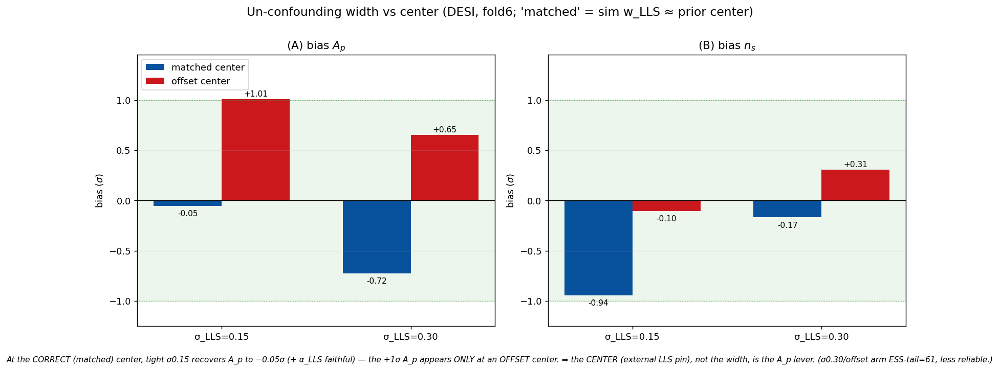

# Walkthrough — per-survey LLS-pin closure + 4-lens review

*2026-06-11. A readable walkthrough of "this run" — the per-survey LLS-pin closure validation
(D_lls / D_lls_m / D_lls_m30 / K_lls) — and the 4-referee review of its results (Bayesian/PPL,
CS/numerics, cosmology, Lyα). All four returned **GO-WITH-CHANGES**: the machinery and the
real-fit prior **decisions** are sound, but several **interpretive** claims in the decision doc
were over-stated and are corrected here. Companion: the
[decision record](2026-06-11-decisions-real-fit-priors.md).*

---

## 1. What we ran

After moving the HCD/IGM priors toward the real fit (per-survey LLS pin, IGM-box restriction,
α≥0, subDLA center), we closure-tested the **per-survey LLS pin**: build a mock carrying each
survey's effective LLS level, fit with that survey's pin, and read the A_p/n_s recovery.

| arm | leg | pin σ_LLS | mock LLS | result |
|---|---|---|---|---|
| **K_lls** | KS | 0.40 (broad) | ×2.65 (matched) | A_p **+0.004σ**, n_s +0.56σ |
| **D_lls_m30** | DESI | 0.30 (moderate) | ×1.06 (matched) | A_p **+0.65σ**, n_s +0.31σ |
| D_lls_m | DESI | 0.15 (tight) | ×1.06 (matched) | A_p +1.01σ, n_s −0.11σ |
| D_lls | DESI | 0.15 (tight) | ×1.0 (6% below pin) | A_p +1.17σ, n_s −0.10σ |

Fold6 (Planck n_s=0.966), 4 chains each, **0 divergences, R-hat ≤ 1.014, E-BFMI ≥ 0.72**. The
referees independently recomputed the biases and confirmed **MCSE ≤ 0.05σ — these residuals are
real, not Monte-Carlo noise.**

This sits on top of the width scan (which mapped σ_LLS as an A_p↔n_s lever) and the box
restriction (which forbids the IGM-edge corners where the emulator extrapolates):

## 2. The 4-lens verdict: GO-WITH-CHANGES (×4)

| lens | verdict | headline |
|---|---|---|
| Bayesian/PPL | GO-WITH-CHANGES | convergence real; but "width-not-center" is confounded + α bias_z is a contaminated metric |
| CS/numerics | GO-WITH-CHANGES | claims 1–5 confirmed in code; D_lls_m not reproducible after the σ-default change; npz not gitignored |
| Cosmology | GO-WITH-CHANGES | σ0.30 right but validated on the *worst* fold; KS n_s is LOSO scatter; blind A_p, don't tighten |
| Lyα | GO-WITH-CHANGES | KS boost ~12% low (should be ~3×); subDLA +2σ benign; mock misses the LLS z-evolution |

## 3. Conclusions — what is SOLID (survives adversarial review)

- **The per-survey LLS-pin *design* is right.** DESI on the cosmic-average (homogeneous forest) +
  KS on a high center with a **broad** σ0.40 (selection excess, arXiv:2509.18271). The broad KS
  prior genuinely lets the *data* set α_LLS: it recovers a ×2.65 mock and a true KS LLS of **2×
  sits −0.63σ / 3× sits +0.34σ within the posterior** — so pinning the center at 2.5× does **not**
  bake in the contested selection number. (Cosmology + Lyα both: strongest part of the design.)
- **DESI σ_LLS=0.30 is the right width.** σ0.15 carries ~1σ A_p; σ0.30 (the joint-bias minimum)
  brings A_p **and** n_s in-gate. Tightening is the *wrong* fix (it reintroduces the +1σ).
- **The box restriction is sound** — the IGM-edge biases are emulator-LOSO extrapolation (closure
  A_p ≈ standalone emulator Fisher bias; HCD coupling flat), correctly forbidden; n_s kept extended
  with C_emu inflation is a different remedy for a different reason.
- **Separate per-survey reporting is correct and well-motivated** — DESI's live channel is A_p
  (low-k LLS↔amplitude), KS's is n_s (small-scale); orthogonal, oppositely-signed.
- **Machinery verified in code:** the `lls_truth_boost` reaches both the mock data and the truth;
  the per-survey pin is opt-in (closure cert untouched); TruncatedNormal(low=0) is correct and runs
  α≥0 at the ×2.65 extreme; the bias_z conventions match the battery.
- **subDLA +2σ-low is benign** — a population-median-vs-this-sim center offset plus a real (sign-
  changing, ~1%) DESI low-k pull-down; it does **not** leak into n_s (n_s is stable regardless).

## 4. Corrections — what the referees over-turned (I had over-stated these)

1. **"The DESI ~1σ A_p is the *width*, not the center" — OVERTURNED: it is the CENTER.** *(Resolved
   2026-06-11 with the un-confounding arm `D_llsmed`.)* The fold6-Planck sim is **LLS-poor** (w_LLS ≈
   77.5% of the population median), so its "matched ×1.06" arm actually sat +0.8σ high. Re-running on
   a sim with **w_LLS ≈ the population median (ratio 0.992)** — so the lit prior center genuinely
   equals the mock truth — gives: **σ0.15 (tight) → A_p −0.05σ AND α_LLS +0.11σ (faithful)**; σ0.30 →
   A_p −0.73σ (looser prior lets the degeneracy pull α_LLS −1.7σ off-truth). This is the **opposite**
   of the offset-center arms (where loosening *helped*). **⇒ the DESI A_p lever is the prior CENTER
   (the external LLS-abundance pin), not the width** — vindicating the *original* "center offset is
   the source" headline over the later "width is the lever" framing.

   

   *Two caveats:* (i) the A_p↔n_s width tradeoff persists even at the matched center — σ0.15 leaves
   n_s **−0.94σ** (borderline) while σ0.30 gives n_s −0.17σ but A_p −0.73σ; whether the n_s −0.94σ is
   the LLS width or this sim's own LOSO n_s bias needs the multi-fold check. (ii) the σ0.30 matched
   arm had ESS-tail 61 / 1 div — its numbers are the least reliable.
2. **"K_lls recovers the LLS dN/dX faithfully (+0.002σ)" — NOT a clean certificate.** The α_LLS
   bias_z is contaminated by two conventions: the truth_vec α is the z-**median** (~z3.3) while the
   sampled α is the z=3.0 **pivot** (~+18% offset → ~+1σ artifact), and the forward z-slope (0.95)
   is misspecified vs the sim's steep ≈2.5. K_lls's +0.002σ most likely reflects the broad σ0.40
   swamping the artifacts, not faithful recovery. → fix the metric (pivot-vs-pivot) before citing.
3. **σ0.30 was validated on the *worst* fold only.** The DESI A_p LOSO scatter is
   **{−0.92, −0.62, +1.02, +0.01}σ, RMS ~0.75σ, zero-mean** (at σ0.15); fold6 is the +1.02σ tail,
   the fold that needed help most. The honest framing is "**zero-mean LOSO scatter, RMS ~0.75σ,
   bounded by the gate on the adversarial fold**" — not "we recover to ≤0.65σ." → validate σ0.30
   on the −0.92σ fold (D_f3) + a mid fold before freezing.
4. **KS n_s +0.56σ is LOSO scatter, not a systematic** — it sign-flips across folds (f4 −0.35σ,
   f6 +0.39/+0.56σ), the contiguous-block emulator partition artifact, partly amplified by the
   broad prior redistributing the (correctly-removed) A_p bias. KS's n_s posterior is broad
   (sd 0.18) → little constraining power. → report as scatter; confirm with a 3rd KS fold.
5. **The KS boost is ~12% low.** arXiv:2509.18271 §4.3.3 (Ho et al.): α_LLS≈2 ⇒ **triple PRIYA**
   (≈3× PRIYA-own), rising to ~8 at z=4.2; our ×2.65 (=2.5×cosmic) sits at the low edge and is
   **z-flat**. → run a K_lls arm at ×3.0 and a z-dependent-boost arm.
6. **Single-mock, shared-noise.** All 4 chains of a fiducial share one noise draw, so each bias_z
   is one sample from the bias distribution; the 0.16σ D_lls−D_lls_m gap is within mock scatter.
   ±0.1σ distinctions need multi-mock. (Two quick code fixes already applied: pinned D_lls/D_lls_m
   at σ0.15 for reproducibility; gitignored `checkpoints/stepA/`.)

The emulator dN/dX head itself is faithful (the separate held-out check, 1.4–1.7%), so the
incidence *physics* is well-emulated — the open items are about the closure *metric* and *coverage*,
not the emulator:

## 5. Questions ANSWERED by this run

- **Does the per-survey pin recover cosmology?** Yes — both surveys land in-gate at their chosen
  widths (DESI σ0.30: A_p +0.65σ/n_s +0.31σ; KS σ0.40: A_p +0.004σ), 0-div.
- **Is the DESI ~1σ A_p curable by width?** Yes — σ0.15→0.30 moves A_p in-gate (and the data pulls
  the collinear α_LLS back when the prior loosens).
- **Does pinning KS at 2.5× bake in the selection number?** No — the broad σ0.40 leaves the true
  value floatable by ±~0.6σ over the 2×–3× range.
- **Is the KS n_s residual a small-scale systematic?** No — it's LOSO scatter (sign-flips).
- **Does the subDLA +2σ-low leak into cosmology?** No — n_s is stable regardless.
- **Is the machinery correct?** Yes — boost→mock+truth, opt-in pin, α≥0, conventions all verified.

## 6. Questions still to WORK ON (before the real fit)

1. **Isolate width-from-center cleanly** — re-run the matched DESI arm on a sim with w_LLS≈median
   (or center the prior on this sim's own w_c). [un-confounds claim #1]
2. **Fix the α-recovery metric** (z=3 pivot truth vs pivot posterior, or report the full α_c(z)
   curve) before any "dN/dX faithfulness" claim. [claim #2]
3. **Multi-fold / multi-mock validation of σ0.30** — especially the D_f3 (−0.92σ) fold + a mid
   fold; report the LOSO scatter (mean ± mock-scatter), not single-fold point estimates. [claims #3,#6]
4. **KS realism** — a ×3.0 boost arm (the paper's "triple PRIYA") + a **z-dependent** boost arm
   (α_LLS ~8 at z=4.2); a 3rd KS fold for the n_s-scatter RMS. [claims #4,#5]
5. **Reconcile the forward HCD z-slope (0.95/0.15) with the sim's ≈2.5** — marginalize s_c in the
   production closure or show the residual z-shape doesn't leak into A_p (the most likely hidden
   A_p systematic). [Bayesian]
6. **Real-fit posture** (cosmology lens): keep σ0.30, **do not tighten, blind A_p**; **freeze** the
   per-survey LLS centers in the analysis lock before unblinding; add an **IGM-rail-pile-up check**
   to the unblinding checklist (confirm the real DESI/KS IGM posterior is interior to the restricted
   box, and that C_emu inflation covers the ±0.4σ n_s LOSO scatter).
7. **Test coverage** — add unit tests for the per-survey pin (DESI vs KS μ/σ) and the
   `lls_truth_boost` propagation (currently unguarded).
8. **Phase-4d (queued):** the Rogers-template tests (1)/(2) + the metal tests (3, full-DESI +
   eBOSS arms) — the metal-injection helper is built+tested; the model-side metal-nuisance wiring
   is next.

**Referees (resumable):** Bayesian `a6b726c50a131a233`, CS `ab617626c4c6083b5`, cosmology
`a54291efc59fceb81`, Lyα `a6bf2f3d6bbd480d2`.
