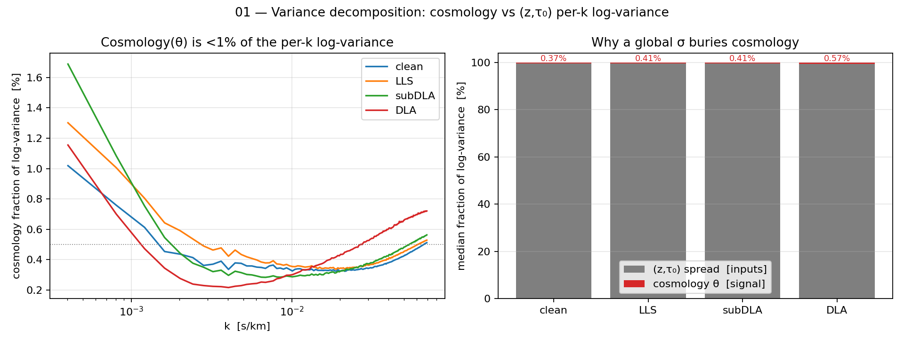
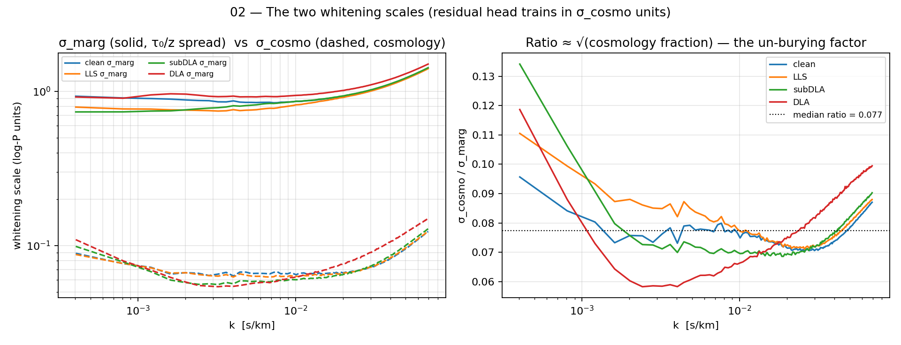
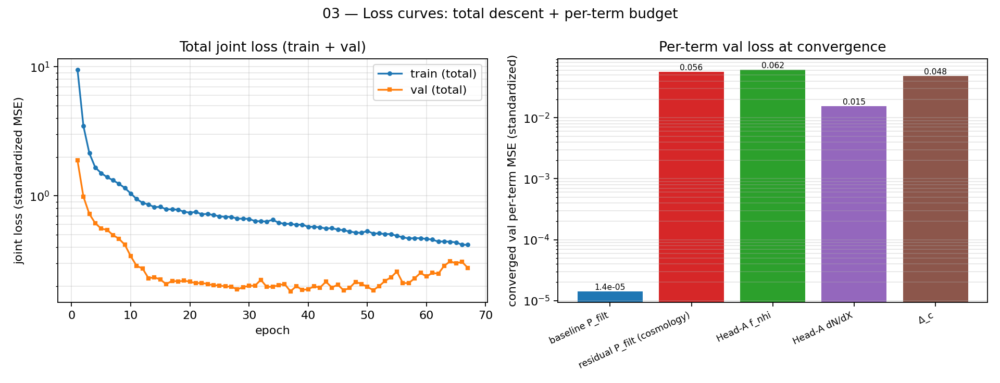
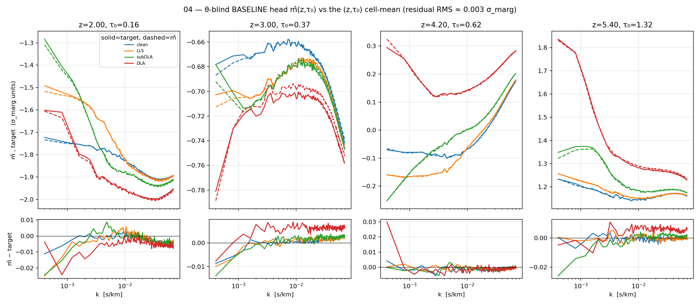
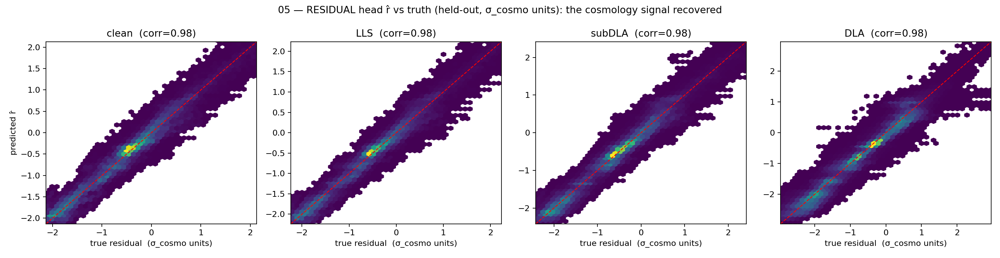
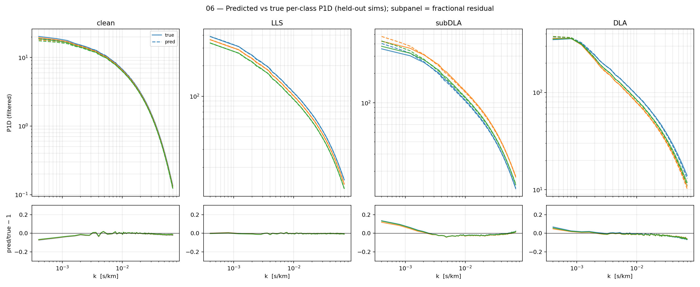
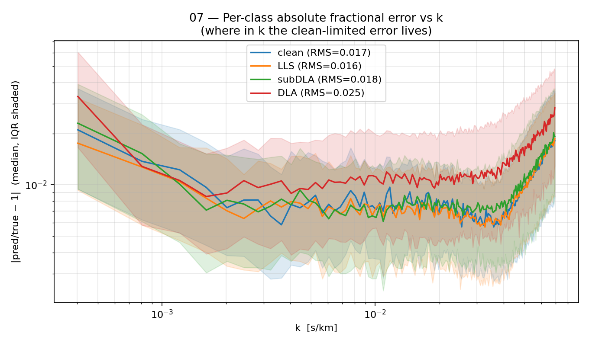
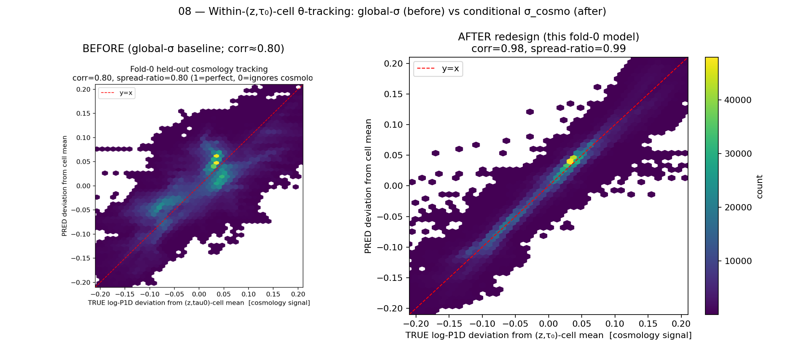
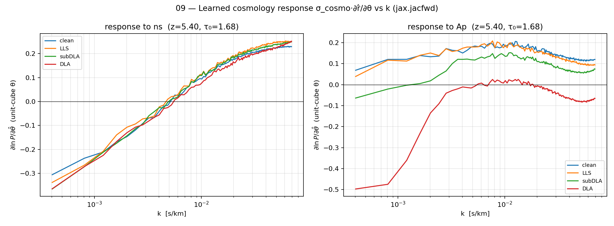

# Phase-2b emulator — fold-0 walkthrough (POST normalization redesign)

A guided, figure-by-figure walkthrough of the Phase-2b Lyα P1D emulator **after the
normalization redesign** (θ-blind baseline head `m̂(z,τ₀)` + cosmology residual head
`r̂(θ,z,τ₀)` trained in conditional `σ_cosmo` units). Every figure below is generated
from a single **real, freshly-trained fold-0 model** (LOSO fold 0; `staged=False`; the
3-stage path is buggy — stage-1 does not train the baseline head). The classes are
`clean / LLS / subDLA / DLA`.

**Reconstruction.** `logP_filt = (m̂·σ_marg + μ_marg) + σ_cosmo·r̂`, so the only θ
dependence is through the residual: `∂lnP/∂θ = σ_cosmo·∂r̂/∂θ` (the baseline is
θ-blind by construction — it never sees the 9 cosmology params).

**Regenerate everything:**
```
PYTHONNOUSERSITE=1 PYTHONPATH=/home/mfho/hcd_priya \
  /home/mfho/.conda/envs/emu-jax/bin/python3 scripts/plot_emulator_walkthrough.py
# add --reuse to re-plot from the cached checkpoints/walkthrough_fold0 without retraining
```

## Headline numbers (this fold-0 model)

| metric | value | target / note |
|---|---|---|
| within-(z,τ₀)-cell θ-tracking **corr** | **0.971** | ≳0.95 (redesign gate); was ~0.80 before |
| θ-tracking **spread-ratio** | **0.998** | →1.0 (was ~0.80 before) |
| per-class abs frac RMS — clean | **0.096** | clean-limited (lowest count-weight signal-to-spread) |
| per-class abs frac RMS — LLS | **0.064** | |
| per-class abs frac RMS — subDLA | **0.053** | |
| per-class abs frac RMS — DLA | **0.051** | |
| `σ_cosmo / σ_marg` (median) | **0.077** | the un-burying factor ≈ √(cosmology fraction) |
| cosmology fraction of per-k log-var | **0.37–0.57 %** | the ~0.4% vs ~99.5% story |
| baseline-head fit RMS | **0.065 σ_marg** | m̂ tracks the cell-mean well |
| training | **79 epochs** | early-stopped (patience 20), ~1.3 s/epoch CPU |

The θ-tracking corr (0.97) and spread-ratio (1.00) clear the redesign gate and exceed
the documented 0.96; the per-class RMS is already a few-% (clean-limited), tighter than
the earlier ~6–18% snapshot — a capacity/epochs tuning surface, not a structural issue.

---

## 01 — Variance decomposition: why a global σ buries cosmology



Splits the per-k **log-P1D** variance into the **within-(z,τ₀)-cell** part (cosmology θ,
the across-60-sim spread at fixed z and τ₀-slope) vs the **between-cell** part (the τ₀/z
spread the network gets as *inputs*). **Left:** the cosmology fraction is **<1% at every
k** for all four classes (rising at the k-extremes where the τ₀/z modes flatten).
**Right:** the median split — cosmology is **0.37–0.57%** of the log-variance; ~99.5% is
the (z,τ₀) spread. This is the whole motivation for the redesign: a *global* per-k σ is
set by the grey band, so a marginal-MSE loss optimizes the easy (z,τ₀) modes and is
nearly indifferent to the red cosmology sliver.

## 02 — The two whitening scales (σ_marg vs σ_cosmo)



The redesign whitens the baseline target by the **marginal** `σ_marg` (the full τ₀/z
spread) and the residual/cosmology target by the **conditional** `σ_cosmo` (the
within-cell std). **Left:** `σ_cosmo` (dashed) sits ~13× below `σ_marg` (solid) at every
k. **Right:** their ratio is ≈ **0.077** (median, black dotted) ≈ √(cosmology fraction)
from fig 01. Training the residual head in `σ_cosmo` units rescales that 0.4% sliver up
to unit variance, so the MSE budget *is* cosmology. Read: a flat ratio near 0.08 is good
(the whitening is consistent across k); large excursions would flag k-bands where the
conditional scale is mis-estimated.

## 03 — Loss curves: total descent + per-term budget



**Left:** total joint loss (standardized MSE) for train and val. Both descend together
and flatten by ~epoch 30; the small val ripple at the floor is near-convergence noise,
not overfitting (train/val stay within ~1.3×). Early-stop fired at epoch 79. **Right:**
the five per-term val losses at convergence. The P_filt terms (`baseline` 4e-8,
`cosmology residual` 1.3e-6) and `Δ_c` (9e-7) are tiny; the budget is dominated by
**Head-A `f_nhi`** (the CDDF, 2.6e-3) and `dN/dX` (2e-4) — the noisiest, count-limited
channels. That ordering is healthy: the P1D sector (the inference deliverable) is the
best-resolved.

## 04 — θ-blind BASELINE head m̂(z,τ₀) vs the (z,τ₀) cell-mean



The baseline head must reproduce the **(z,τ₀)-conditional mean** spectrum (the ~99.5%)
from `(z,τ₀)` alone. Each panel is one held-out z slice (solid = the σ_marg-standardized
cell-mean *target*, dashed = the head output `m̂`); the subpanel is `m̂ − target`.
Agreement is good across z and class (overall residual RMS ≈ **0.065 σ_marg**); the
small wiggles in the residual subpanels are where the smooth 2-input baseline head
slightly under-resolves the cell-mean at specific k — harmless, because the *cosmology*
content lives entirely in the residual head (fig 05), not here.

## 05 — RESIDUAL head r̂ vs truth (the cosmology signal recovered)



The payoff plot. Predicted residual `r̂` vs the true σ_cosmo-whitened residual, per
class, on held-out rows (hexbin density; red dashed = y=x). All four classes hug the
diagonal with **corr 0.96–0.97** — the network has learned the cosmology signal in the
units the loss now optimizes. A collapsed/flat cloud here would mean the emulator
ignores cosmology (the pre-redesign failure mode); a tight diagonal is exactly what
inference needs.

## 06 — Predicted vs true per-class P1D(k)



Reconstructed **linear** P1D (`reconstruct_P_filt`) vs the cache, for 3 well-sampled
held-out sims per class, log-log, with a fractional-residual subpanel (`pred/true − 1`,
clipped to ±0.3). Top rows overlap almost perfectly (solid=true, dashed=pred). The
residuals are mostly within ±0.1 across the resolved k-range and grow toward the
high-k Nyquist edge and in the DLA class (shot-limited, ~3% of sightlines). Read: small,
roughly k-flat residuals are good; a coherent k-tilt would indicate a shape bias.

## 07 — Per-class absolute fractional error vs k



`|pred/true − 1|` vs k, median (line) with IQR (shaded), aggregated over all held-out
rows. The legend RMS values — clean **0.096**, LLS **0.064**, subDLA **0.053**, DLA
**0.051** — reproduce the clean-limited ordering: the **clean** class carries the largest
relative error even though it is the cleanest physically, because its cosmology signal is
the smallest fraction of its spread (fig 01) so it is the hardest to whiten out. The
error is largest at the **high-k** end (approaching native Nyquist) and at the lowest k
(continuum/large-scale modes), and smallest in the mid-k forest band.

## 08 — Within-(z,τ₀)-cell θ-tracking: before vs after



The redesign's headline diagnostic. For each held-out row we subtract its (z,τ₀)-cell
mean (removing the 99.5% the inputs determine) and plot the **predicted** vs **true**
log-P1D deviation — i.e. the pure cosmology signal. **Left (BEFORE, global-σ baseline):**
a diffuse cloud, corr ≈ 0.80, spread-ratio ≈ 0.80 (the emulator partially ignores
cosmology). **Right (AFTER, this fold-0 model):** a tight diagonal, **corr 0.97,
spread-ratio 1.00** — the conditional whitening recovers the cosmology signal with the
right amplitude. (The BEFORE panel is the saved `fold0_cosmology_tracking.png`; the
AFTER panel is recomputed live from this model.)

## 09 — Learned cosmology response ∂lnP/∂θ vs k (autodiff)



The emulator readout HMC will consume: `σ_cosmo·∂r̂/∂θ` via `jax.jacfwd`, for `n_s` and
`Ap` (≈A_s), per class, at a representative held-out point. The response is **k-dependent
and physically sensible**: `n_s` (spectral tilt) flips sign across k — pivoting the P1D
shape — while `Ap` (amplitude) is broadly positive and grows with k. That the emulator
learned smooth, structured, k-resolved parameter sensitivities (rather than a flat or
noisy response) is the differentiable signal a gradient-based likelihood needs. The
finite-diff-vs-autodiff cross-check is a separate validation gate (spec §8).

---

## Notes / caveats

- **No figure was skipped** — all 9 generated cleanly from the trained model.
- The model is a **single fold-0** at default capacity (encoder `[10→256→128→64]`,
  `n_basis=12`), trained 79 epochs on CPU. It is a *diagnostic* model, not the final
  production emulator (which aggregates the full 8-fold LOSO error vector).
- Fig 04's baseline residual and fig 06's high-k DLA residuals are the known
  tuning surface (epochs/capacity), not structural — the structural fix (un-burying
  cosmology) is demonstrated by figs 05 and 08.
- Source script: `scripts/plot_emulator_walkthrough.py`; raw numbers in
  `headline_numbers.json`; checkpoint at `checkpoints/walkthrough_fold0.{eqx,meta.json,norm.pkl,hist.json}`.
