# Phase-2b emulator — performance walkthrough (both heads)

Figure-by-figure accuracy and response of the Phase-2b emulator, both heads:

- **Head B** — the Lyα **P1D / cosmology** channel: the θ-blind baseline `m̂(z,τ₀)` plus
  the σ_cosmo-whitened cosmology residual `r̂(θ,z,τ₀)`, the **multi-fidelity** LF→HF high-k
  correction, and the `R_c` HCD excess templates.
- **Head A** — the τ₀-invariant **CDDF `f_NHI`** and **`dN/dX`** incidence channel, which
  sets the structural class weights `w_c` (→ `P_tier_p`) and the `α_c` prior center.

## Two emulator objects — the honest framing (`--emulator {loso,ensemble}`)

Two regimes, selected by `--emulator`:

- **`loso` (default)** — every panel on the **8 finalized LOSO checkpoints**
  `checkpoints/final_fold{0..7}.eqx` (the `FINAL_RECIPE`, via `train.load_checkpoint`),
  evaluated on **each fold's held-out sims**. This is the honest **out-of-sample
  generalization** accuracy. Byte-identical to the original LOSO walkthrough.

- **`ensemble`** — the **deployed production ensemble**
  `checkpoints/final_prod_seed{0..4}.eqx`, 5 members trained on **all sims** (no holdout) —
  the object the real fit uses. The deployed prediction is the **mean over members of the
  reconstructed (post-exp) linear `P_filt`** (mean taken after `exp` because `P_filt` is
  exp-nonlinear; all members share one norm), mirroring `predict.predict_P_filt` /
  `ensemble.EnsembleEmulator` exactly as `run_prod_sbc_shard.py` /
  `build_legb_ctx(ensemble_ckpts=…)` invoke it. For Head-A (`f_NHI`/`dN/dX`) the deployed
  prediction is the **mean of the per-member physical outputs**.

**The load-bearing point.** The production ensemble **saw every sim**, so its pred-vs-true
is **in-sample** — a fit-quality / convergence check, **not generalization**. Each figure is
classified and treated accordingly; in-sample accuracy is never relabelled as a
generalization claim:

| class | figures | `ensemble` treatment |
|---|---|---|
| **Deployed-object PROPERTY** (responses/templates the real fit literally uses) | B3 cosmology_response · B4 theta_tracking · B6 mf_high_k · B7 delta_c_templates · A5 alpha_prior_sanity | Regenerated **from the production ensemble** — these legitimately *become* the deployed responses. Labelled "deployed production ensemble (all-sims)". |
| **ACCURACY / pred-vs-true** | B1 · B2 · A1 · A2 · A3 | **Overlay both**: solid/dashed = LOSO **held-out** (the real accuracy claim), dotted = **in-sample** ensemble on the **same rows** (the deployed-fit reference). The held-out curve is never dropped. |
| **Inherently-LOSO generalization** | B5 fisher_bias_perfold · A4 head_a_error_heatmap | **Kept as LOSO held-out** (companion validation — the ensemble has no held-out by construction; we do not fake an ensemble version). |
| **Literature comparison** (emulator-object-independent) | A6 dndx_vs_literature · A7 cddf_vs_literature | Independent of the checkpoint; generated by sibling scripts (`plot_dndx_vs_literature.py`, `plot_cddf_vs_literature.py`). |

`headline_numbers.json` is **dual-keyed**: `loso_held_out` (generalization accuracy) and,
in ensemble mode, `ensemble_in_sample` (the deployed all-sims fit) — never conflated.

**Reconstruction.** `logP_filt = (m̂·σ_marg + μ_marg) + σ_cosmo·r̂`. For a single LOSO net
`∂lnP/∂θ = σ_cosmo·∂r̂/∂θ`; for the ensemble the deployed response is `∂ln(mean_m P_filt)/∂θ`.

**Regenerate:**
```
# DEPLOYED production ensemble (the object the real fit uses) — with retained LOSO overlays:
PYTHONNOUSERSITE=1 PYTHONPATH=/home/mfho/hcd_priya JAX_PLATFORMS=cpu CUDA_VISIBLE_DEVICES="" \
  /home/mfho/.conda/envs/emu-jax/bin/python3 scripts/plot_performance_walkthrough.py --emulator ensemble

# LOSO held-out only (byte-identical to the original walkthrough):
PYTHONNOUSERSITE=1 PYTHONPATH=/home/mfho/hcd_priya JAX_PLATFORMS=cpu CUDA_VISIBLE_DEVICES="" \
  /home/mfho/.conda/envs/emu-jax/bin/python3 scripts/plot_performance_walkthrough.py --emulator loso
# --no-mf skips the multi-fidelity figure B6 (needs the HR cache + res_corr table)
```

## Headline numbers (`--emulator ensemble`)

In-sample is ≤ held-out — as it must be, since the ensemble saw these sims in training
(the lone exception is B1-LLS, where 3 hand-picked fold-0 rows make the in-sample 0.44%
vs held-out 0.38% a small-sample fluctuation; the robust full-population B2 has LLS
in-sample 0.57% < held-out 1.16%). The **held-out** column is the accuracy claim; the
**in-sample** column is the deployed all-sims fit (a convergence reference, not generalization).

| head | metric (regime) | LOSO held-out | in-sample ensemble |
|---|---|---|---|
| **B** | deployed in-range frac-P1D RMS — clean / LLS / subDLA / DLA (B2) | **1.1 / 1.2 / 1.3 / 2.5 %** | **0.5 / 0.6 / 0.7 / 1.6 %** |
| **B** | honest within-cell θ-tracking corr / spread-ratio (B4) | 0.98 / 1.02 *(loso)* | **0.996 / 1.001** *(deployed)* |
| **A** | `dN/dX` median \|frac err\| — LLS / subDLA / DLA (A1) | **1.6 / 1.6 / 1.3 %** | **0.5 / 0.5 / 0.6 %** |
| **A** | CDDF `f_NHI` median / p95 \|frac err\| (A2) | **2.3 % / 34 %** | **1.1 % / 30 %** |
| **A** | structural `P_tier_p` faithfulness median / p95 (A3) | **0.04 % / 0.22 %** | **0.01 % / 0.05 %** |

Deployed-object properties (ensemble) — these *are* what the real fit uses:

| metric | value |
|---|---|
| **B3** cosmology-response \|∂lnP/∂θ\|_rms: n_s / A_p / hub | 0.199 / 0.104 / 0.214 |
| **B6** MF KODIAQ-band frac err: MF vs LF-extrapolated (clean) | **0.18 vs 0.77** (~4× cut) |

LOSO companion (always the held-out folds, regardless of `--emulator`):

| metric | value |
|---|---|
| **B5** per-fold A_p Fisher-bias RMS / max | **0.067 / 0.131 σ** (gate \|bias\|<0.2σ — all 8 pass) |
| **B5** per-fold n_s Fisher-bias RMS / max | **0.071 / 0.131 σ** (all 8 pass) |

Raw numbers: `headline_numbers.json` (dual-keyed). Source:
`scripts/plot_performance_walkthrough.py`.

---

# HEAD B — P1D / cosmology

## B1 — Predicted vs true per-class P1D — *ACCURACY (overlay)*

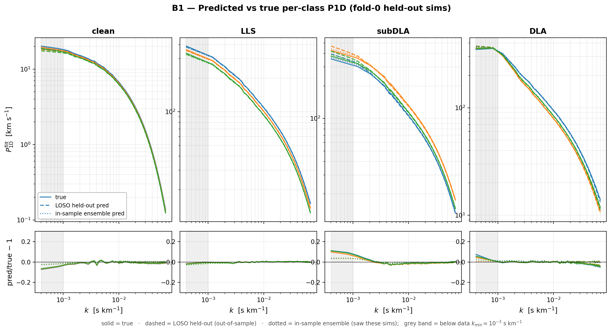

Reconstructed **linear** P1D vs the cache for the 3 best-sampled fold-0 sims per class,
log-log with a `pred/true − 1` subpanel. **solid = true · dashed = LOSO held-out
(out-of-sample) · dotted = in-sample ensemble (saw these sims)**; grey = below the DESI
`k_min`. The held-out residual RMS is the accuracy claim; the in-sample ensemble RMS is the
deployed-fit reference. Both hug zero across the resolved range and turn over only at the
per-row Nyquist edge.

## B2 — Deployed per-class fractional P1D error vs k — *ACCURACY (overlay)*

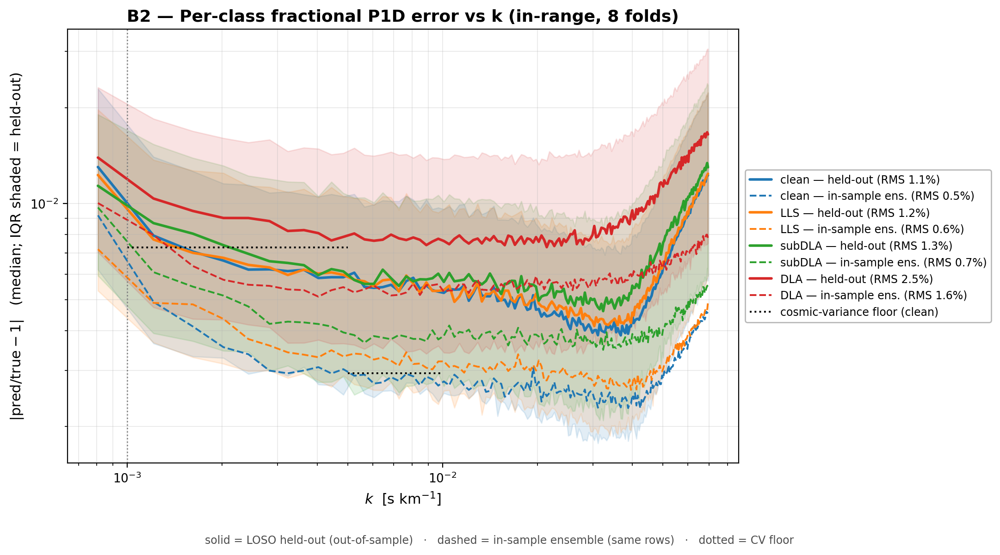

`|pred/true − 1|` over **all 8 folds'** val rows, in the DESI range. **solid + IQR = LOSO
held-out (out-of-sample); dashed = in-sample ensemble on the same rows; dotted black =
cosmic-variance floor.** Held-out in-range RMS: clean **1.1%** / LLS **1.2%** / subDLA
**1.3%** / DLA **2.5%**; the in-sample ensemble sits ~2× lower (clean **0.5%** … DLA
**1.6%**) — the expected in-sample gain, not a generalization improvement. Clean held-out
error sits essentially at the CV floor.

## B3 — Deployed cosmology response ∂lnP/∂θ vs k — *DEPLOYED-OBJECT PROPERTY*

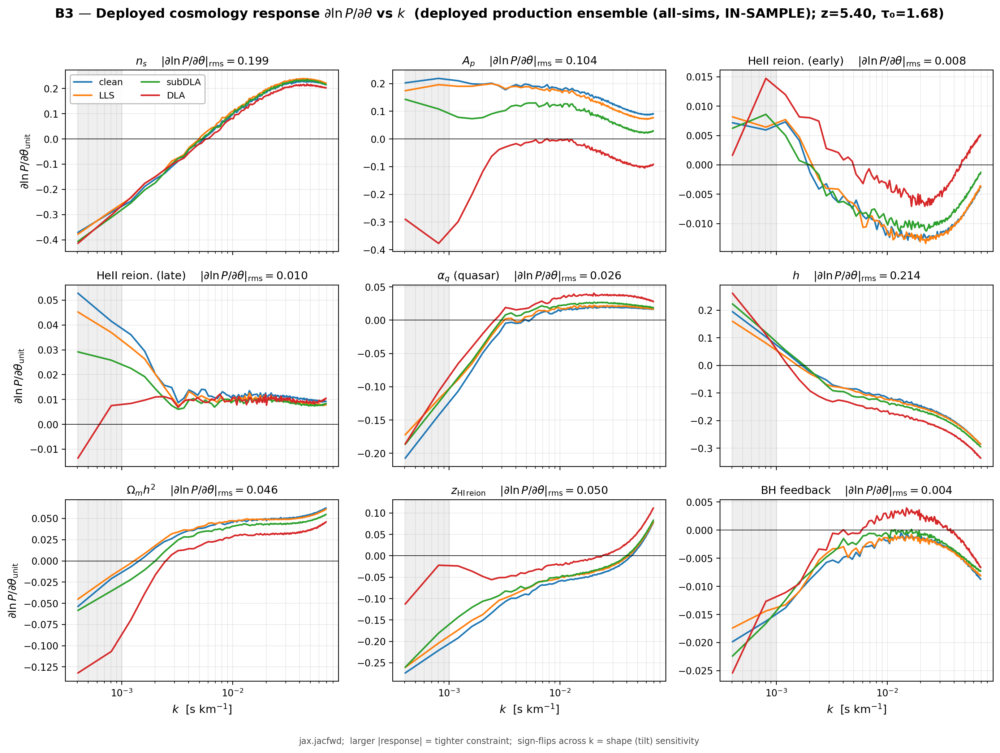

The differentiable readout the real fit's HMC consumes, from the **production ensemble** via
`jax.jacfwd` of `ln(mean_m P_filt)`, per class, at a representative point; each panel title
gives the in-range RMS response amplitude. `n_s` (tilt) flips sign across k; `A_p` and `h`
carry the largest broadly-coherent amplitudes; the reionization and feedback params are
small and smooth. Smooth, k-resolved sensitivities are what a gradient likelihood needs.

## B4 — θ-tracking + honest (a)/(b) decomposition — *DEPLOYED-OBJECT PROPERTY*

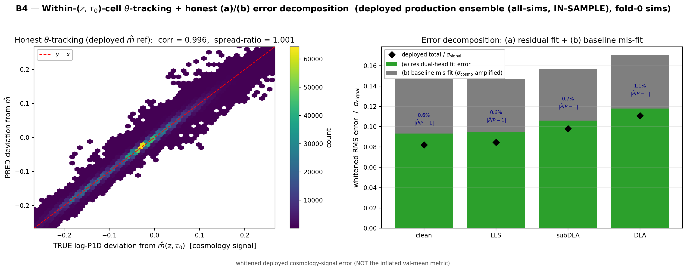

**Left:** within-cell θ-tracking of the **deployed ensemble** (in-sample on fold-0 sims),
predicted vs true log-P1D deviation referenced to the baseline `m̂`; corr **0.996**,
spread-ratio **1.001**. **Right:** the deployed whitened cosmology-signal error split into
**(a)** residual-head fit and **(b)** σ_cosmo-amplified baseline mis-fit. For the ensemble
`m̂` is the mean-of-member baseline and the prediction is `log(mean post-exp P_filt)`, so the
(a)/(b) algebra stays exact for the deployed object.

## B5 — Per-fold A_p & n_s Fisher-bias — *INHERENTLY-LOSO companion*


The inference gate, on the **8 LOSO held-out folds** (the ensemble has no held-out by
construction, so this stays LOSO regardless of `--emulator`). DESI-DR1-like diagonal
per-mode covariance, fiducial z=3. **All 8 folds pass** both params: A_p RMS **0.067σ** (max
0.131σ), n_s RMS **0.071σ** (max 0.131σ). A small, sign-mixed spread with no systematic
offset.

## B6 — Multi-fidelity high-k — *DEPLOYED-OBJECT PROPERTY*

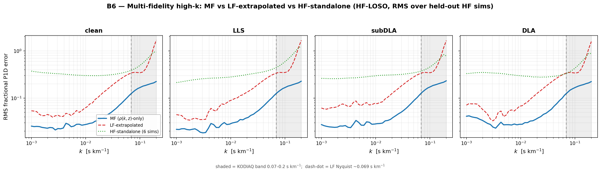

The multi-fidelity gain at high k (independent of the main-emulator checkpoint: LF backbone
+ the `ρ(k,z)`-only `FixedMeanHead`, the production default). HF-LOSO RMS fractional error
vs k for **MF** (blue) vs the **LF backbone extrapolated** (red dashed) and a
**HF-standalone** 6-sim surrogate (green dotted); shaded = KODIAQ reach 0.07–0.2 s/km,
dash-dot = LF Nyquist ~0.069. In the KODIAQ band MF ≈ **0.18** vs LF-extrapolated **0.77** —
a ~4× reduction.

## B7 — HCD class excess templates R_c — *DEPLOYED-OBJECT PROPERTY*

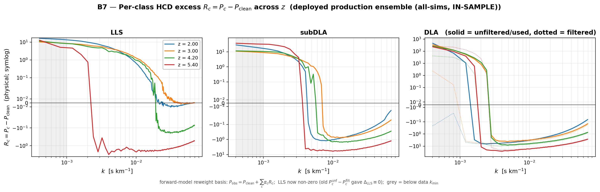

The per-HCD-class excess `R_c = P_c − P_clean` the forward model re-weights
(`P_obs = P_clean + Σ_c α_c·R_c`), emulated **from the production ensemble** (predict_excess
is ensemble-aware) over 4 z slices, symlog-y. LLS is now non-zero (the old `P_c^unf −
P_c^filt` template gave Δ_LLS≡0); DLA overlays filtered (dotted) vs the unfiltered excess
actually used. Smooth, z-ordered templates concentrated at low (out-of-range) k.

---

# HEAD A — dN/dX + CDDF

## A1 — dN/dX predicted vs true, per class vs z — *ACCURACY (overlay)*

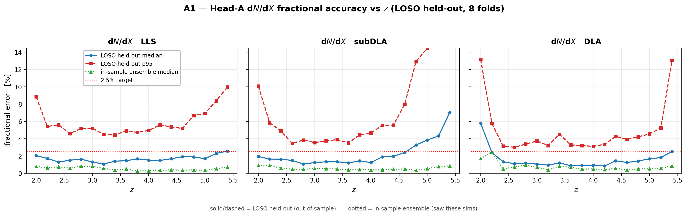

Head-A `dN/dX` fractional accuracy vs z. **solid/dashed = LOSO held-out median/p95
(out-of-sample); dotted = in-sample ensemble median**; 2.5% target marked. Held-out median
≈ **1.3–1.7%** in-range; in-sample ensemble ≈ **0.5–0.6%**. Error rises only at the off-DESI
z extremes (count-limited).

## A2 — f_NHI / CDDF predicted vs true vs logN_HI — *ACCURACY (overlay)*

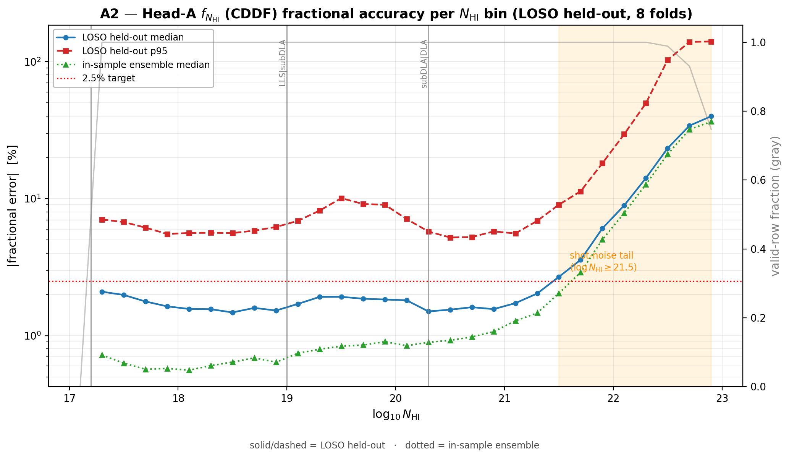

Head-A `f_NHI` accuracy per log-N_HI bin. **solid/dashed = LOSO held-out median/p95; dotted
= in-sample ensemble median**; class boundaries marked, shot-noise tail (≥21.5) shaded,
valid-row fraction on the right axis. Held-out median **2.3%** (p95 **34%**, set entirely by
the shaded tail); in-sample ensemble median **1.1%**.

## A3 — w_c → P_tier_p coupling + faithfulness — *ACCURACY (overlay)*

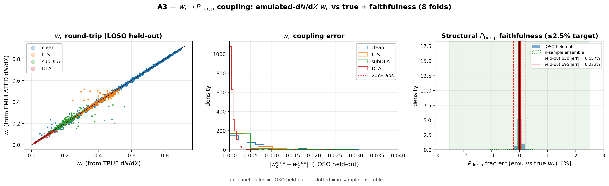

**Left/middle:** the `w_c` round-trip (emulated vs true `dN/dX`) and `|Δw_c|` per class,
LOSO held-out. **Right:** structural `P_tier_p` faithfulness — filled = LOSO held-out,
dotted outline = in-sample ensemble. Held-out median **0.04%** / p95 **0.22%** (~10× inside
the ≤2.5% target); in-sample ensemble **0.01% / 0.05%**.

## A4 — Head-A error heatmap: class × z × fold — *INHERENTLY-LOSO companion*

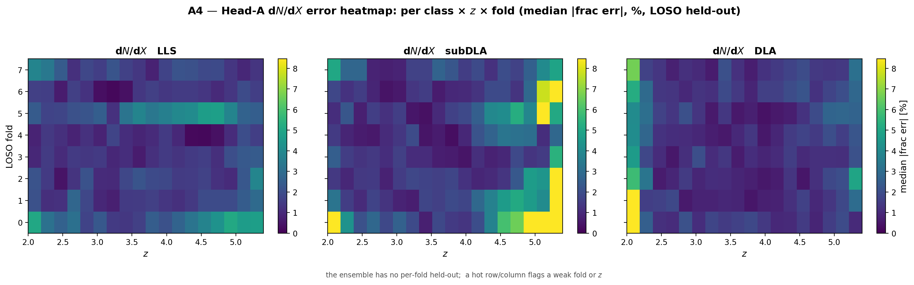

Per-(class, z, fold) `dN/dX` median \|frac err\| (%) — one panel per HCD class, fold on y,
z on x. **LOSO held-out** (the per-fold held-out spread only exists for the LOSO nets;
always LOSO regardless of `--emulator`). Mostly cool (~1–2%), with hot cells only at the
off-DESI z extremes and a few count-limited low-z subDLA/DLA cells — no systematically bad
fold.

## A5 — dN/dX → α_c prior-center sanity — *DEPLOYED-OBJECT PROPERTY*

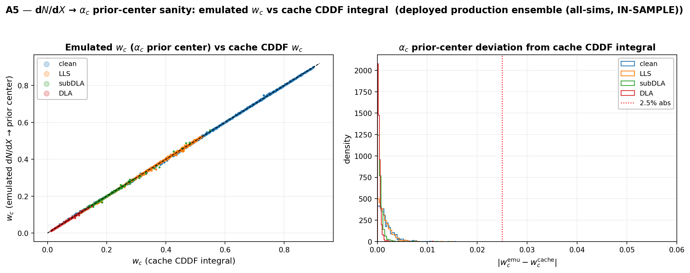

Is the emulated `dN/dX` (→ the deployed `α_c` **prior center** via `w_c_corrected`)
sensible? In ensemble mode the emulated `w_c` is the **deployed production ensemble**'s,
against the cache's empirical **CDDF-integral** `w_c` (a fixed, emulator-independent
reference). The scatter tracks the diagonal; per-class deviations are well under 2.5% — the
prior center is anchored to the data, not to the model's own bias.

---

# Literature comparison (emulator-object-independent)

## A6 — dN/dX vs literature · A7 — CDDF vs literature

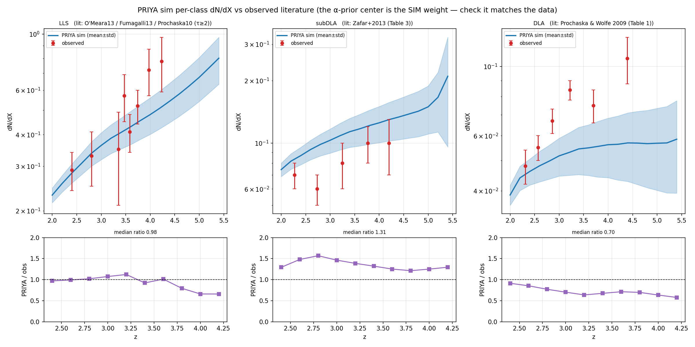
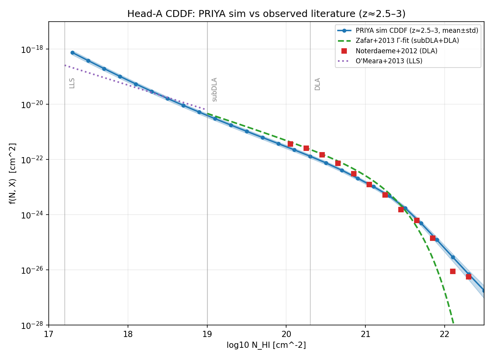

These compare the **PRIYA-sim** `dN/dX` / CDDF to published incidence measurements and do
**not** depend on which emulator checkpoint is used. Generated by the sibling scripts
`plot_dndx_vs_literature.py` and `plot_cddf_vs_literature.py` (not by this walkthrough
script), and unchanged by `--emulator`.

---

## Notes / caveats / framing judgment calls

- **In-sample is not a generalization claim.** Everywhere the ensemble's pred-vs-true
  appears it is labelled IN-SAMPLE; the LOSO held-out curve is the accuracy claim and is
  always retained on the accuracy panels.
- **Head-A ensemble convention (judgment call):** the deployed likelihood only consumes
  `P_filt` through the ensemble, so Head-A (`f_NHI`/`dN/dX`) has no likelihood-fixed
  ensemble combination. For the in-sample accuracy figures we take the natural **mean of the
  per-member physical Head-A outputs** — the same averaging spirit as the deployed `P_filt`
  mean. (Documented in `predict_headA_ens`.)
- **B4 ensemble decomposition (judgment call):** the (a)/(b) split is a single-model concept;
  for the ensemble we define the deployed prediction as `log(mean post-exp P_filt)` and the
  baseline `m̂` as the mean-of-member baseline, keeping the algebra exact for the deployed
  object.
- **B3/B5 covariance:** Fisher bias (B5) and the cosmology response (B3) assume a
  DESI-DR1-like diagonal per-mode covariance (clean 3%, HCD 15%) — a deployment sanity gate,
  not the final survey-covariance inference.
- **Count-limited regions:** the Head-A high-N_HI tail (A2 ≥21.5) and the off-DESI z extremes
  (A1/A4) are flagged, not structural.
- Source: `scripts/plot_performance_walkthrough.py`; raw numbers `headline_numbers.json`;
  deployed ensemble `checkpoints/final_prod_seed{0..4}.{eqx,meta.json,norm.pkl}`; LOSO
  checkpoints `checkpoints/final_fold{0..7}.{eqx,meta.json,norm.pkl}`.
