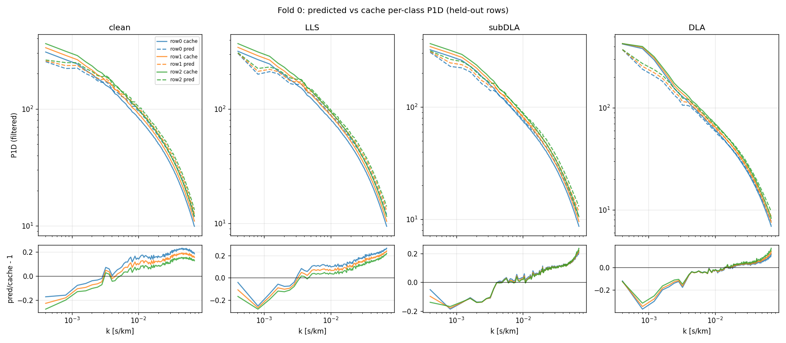

# HCD-marginalized Lyα P1D emulator (`hcd_analysis.emulator`)

A differentiable JAX/Equinox emulator of the **per-class 1D Lyα flux power spectrum**
`P_filt(θ, z, τ₀)` for HCD-marginalized cosmological inference. It mirrors the **PRIYA**
simulation suite's parameter contract (Bird, Fernandez, Ho et al. 2023, JCAP 10 037,
[arXiv:2306.05471](https://arxiv.org/abs/2306.05471); extended box from Fernandez, Bird & Ho
2024, JCAP 07 029, [arXiv:2309.03943](https://arxiv.org/abs/2309.03943)) so the cosmology
community can drive it the way they drive PRIYA. It is end-to-end autodiff, so the likelihood
(`inference.log_lik_multiz` / `log_posterior_single_z`) is ready to wrap in a gradient-based
sampler (NUTS/numpyro, blackjax) or a PRIYA-style Cobaya adapter.

> **The sampler / Cobaya wrappers are forthcoming (Phase-C T4) — not yet shipped.** Today you
> call the differentiable likelihood directly.

This README is a **reproduction / install / quickstart** guide. Read it top to bottom and you
can build the cache, train an emulator, and call the forward model. Validation results
(held-out LOSO error, coverage, the A_p/n_s Fisher gate) live in the private notes repo:
`docs/superpowers/2026-06-14-validation-loso-emulator-lf-mf.md`.

The path:

1. [Environment](#1-environment-mandatory) — the env string you must run with
2. [The τ₀ cache](#2-the-τ₀-cache) — what the training data is + how to build/load it
3. [Architecture](#3-architecture) — what the network is
4. [Training](#4-training) — how to run it + what to expect
5. [Forward model / prediction](#5-forward-model--prediction) — `predict_P_filt` → `predict_P_obs`, the HCD excess
6. [Quickstart](#6-quickstart) — a copy-paste snippet
7. [Conventions & gotchas](#7-conventions--gotchas) — k is angular, x64, ranges
8. [Likelihood & inference](#8-likelihood--inference) — the differentiable log-likelihood + priors
9. [Module map](#9-module-map)

---

## 1. Environment (mandatory)

The emulator is float64 and lives in a dedicated conda env. **Always** run with this exact
env string:

```bash
PYTHONNOUSERSITE=1 PYTHONPATH=/home/mfho/hcd_priya JAX_PLATFORMS=cpu \
    /home/mfho/.conda/envs/emu-jax/bin/python3  <script>
```

- `import hcd_analysis.emulator` calls `jax.config.update("jax_enable_x64", True)` — **x64 is
  mandatory**. The structural identities (`P_tier_p = Σ_c w_c·P_filt`, telescoping `Σ w_c = 1`)
  are bit-level and break under JAX's default float32.
- `PYTHONNOUSERSITE=1` keeps stray user-site packages out; `JAX_PLATFORMS=cpu` runs on CPU.
- JAX/Equinox traps are logged in `docs/superpowers/jax-traps-log.md` (e.g. trap #29: sanitize
  `jnp.interp` ydata *before* the call, not after).

**What you get:** a working float64 JAX runtime that can import the package.

---

## 2. The τ₀ cache

The emulator trains on a cache of per-class P1D measured from the PRIYA low-fidelity (LF)
simulations, each re-sampled across a **τ₀ ladder** (a grid of mean-flux rescalings). τ₀ is the
mean-flux optical depth, `τ₀ = −ln(target_F)`; the cache rescales each sim's mean flux up and
down a ladder of rungs so the emulator learns the τ₀ dependence directly (PRIYA's
`mean_flux="per_z"` post-processing). The ladder is anchored on the **Kim et al. 2007**
mean-flux fit `τ_eff(z) = 0.0023·(1+z)^3.65` (MNRAS 382, 1657,
[arXiv:0711.1862](https://arxiv.org/abs/0711.1862)), and it is built wide enough to bracket the
observed mean flux across the analysis redshift range:


*The shaded band is the trained τ₀ ladder; the lines/points are observed-⟨F⟩ fits and data
(Kim+2007, Becker+2013, Turner+2024, XQ-100). The ladder brackets the data across z=2.2–4.6.*

**Cache file:** `hcd_analysis/_emulator_data/observables_tau0_lf.h5` — the v3.3 LF cache,
21440 rows, n_k=172, angular k, a 20-point τ₀ ladder (uniform rescale). Built by
`scripts/build_emulator_cache_tau0.py`.

**Load it:**

```python
from hcd_analysis.emulator.data import load_cache
d = load_cache("hcd_analysis/_emulator_data/observables_tau0_lf.h5")
```

`load_cache` returns a dict with (among others):

| key | shape | meaning |
|---|---|---|
| `params` / `params_unit` / `x` | `(R,9)` / `(R,9)` / `(R,10)` | physical / unit-cube params; `x` = `[θ9, z_unit]` |
| `kfkms` | `(K,)` | angular k-grid in s/km (`K=n_k=172`) |
| `P_filt` | `(R,4,K)` | per-class P1D: clean, LLS, subDLA, DLA |
| `delta` | `(R,3,K)` | per-class core add-back; `delta[:,2]` = `dla_core` |
| `coarse_counts` / `w_c_cache` | — | per-class sightline counts / incidence weights `w_c` |
| `target_F`, `tau0` | `(R,)` | global mean flux, `tau0 = −ln(target_F)` |
| `z_grid` | `(R,)` | redshift per row |

Coarse-class map: `COARSE_SLICES = (clean=tier0, LLS=1–7, subDLA=8–12, DLA=13–14)`. The fine
absorber tiers are count-collapsed into the 4 coarse classes.

The training inputs span very different physical scales, so input normalization is required
(the model maps everything to a unit cube — see §7):


*The 9 PRIYA design parameters + redshift across the cache rows. The wildly different scales
(A_p ~1e-9 vs n_s ~0.8) are why `data.normalize_params` maps to the unit cube before training.*

**What you get:** a dict of arrays — per-class P1D over `(θ, z, τ₀)` plus the structural
weights — that is the emulator's entire training set.

---

## 3. Architecture

`model.Emulator` (an `eqx.Module`) = **Encoder → {HeadA, BaselineHead, HeadB}**.


*Encoder shares a latent; HeadA emits the τ₀-invariant CDDF/incidence; the BaselineHead emits a
θ-blind P_filt baseline and HeadB the θ-dependent residual; the structured mean recombines them
and the downstream block assembles `P_tier_p` / `P_obs` for the likelihood.*

```
x = [θ9 (9), z_unit (1)]  ─► Encoder (MLP 256-128-64) ─► latent (64)
                                         │
   HeadA(latent)            ── τ₀-INVARIANT  ─► f_nhi, dN/dX (CDDF / incidence; n_k_cddf=30)
   BaselineHead(z, τ₀)      ── θ-BLIND       ─► m̂  : P_filt baseline   (4×n_basis coeffs)
   HeadB(latent, τ₀)        ── θ-DEPENDENT   ─► r̂  : P_filt residual    (4×n_basis coeffs)
```

**Kennedy–O'Hagan structured mean** (the core design; Kennedy & O'Hagan 2001, JRSS-B 63, 425 —
a θ-blind simulator term plus a learned discrepancy/residual): the per-class log-power is a
θ-blind baseline plus a whitened cosmology residual,

```
logP̂(θ,z,τ₀) = ( m̂·σ_marg + μ_marg )  +  σ_cosmo · r̂
P_filt        = exp(logP̂)                         # (4,K) LINEAR: clean, LLS, subDLA, DLA
```

- **θ enters ONLY through `r̂`** (the baseline is θ-blind), so `∂logP̂/∂θ = σ_cosmo·∂r̂/∂θ`.
  This is what makes the cosmology response cleanly identifiable; it is checked by the gradient
  gate (`scripts/diag_grad_fidelity.py`).
- `μ_marg, σ_marg, σ_cosmo` are per-`(class,k)` normalization stats fit on the **train split**
  and stored in the checkpoint's `norm["P_filt"]` dict (see §4 / §6).
- **Low-rank P_filt bottleneck** (`n_basis=24`): both heads emit `4×n_basis` coefficients that
  decode through a trainable SVD-warm-started basis `(n_basis, n_k)` — fewer DOF, smoother
  spectra, less over-fit than a dense `4×n_k` output.
- `K = n_k = 172` k-bins (LF cache); ANGULAR k convention (see §7).
- HeadB also carries a legacy dense `delta` head — **not used by the live forward model** (the
  HCD excess is computed from `P_filt` instead, see §5). Dead weight, harmless.

**Multi-fidelity** (`multifidelity.py`): the LF backbone above + a high-fidelity (HiRes /
KODIAQ-SQUAD) `ρ(k,z)` correction layer. The default deployed HiRes correction is the
ρ(k,z)-only `FixedMeanHead` — a mean-*correction* head (it returns `ḡ(z,k) − log ρ`), NOT a
mean-flux head; mean flux is handled structurally via τ₀.

**What you get:** a differentiable per-class P1D predictor whose cosmology response lives in a
single, isolatable residual term.

---

## 4. Training

Training is driven by the 8-fold LOSO sweep `scripts/run_loso_sweep.py` — it trains one emulator
per fold (`train.train_fold`), reuses the SVD warm-start, collects stratified fractional
residuals, and emits `error_vector.npz` + figures into `figures/analysis/04_emulator/`. The
frozen production recipe (`FINAL_RECIPE`):

```python
n_basis=24, p_resid_w=8.0, edge_gain=3.0, lowk_extra=2.0,    # low-rank + k-weighting
w_coh=80.0, weight_decay=3e-4, datarange=True,               # de-bias + soft data-range
epochs=180, patience=25, lr=1e-3, batch=512,                 # optax AdamW + cosine decay
```

Run it:

```bash
PYTHONNOUSERSITE=1 PYTHONPATH=/home/mfho/hcd_priya JAX_PLATFORMS=cpu \
  /home/mfho/.conda/envs/emu-jax/bin/python3 scripts/run_loso_sweep.py \
    --out checkpoints/final --histdir checkpoints     # (defaults == FINAL_RECIPE)
```

Add `--smoke` for a fast shape/finiteness check. A θ-blind baseline pre-fit
(`train._prefit_baseline`) runs before the joint fit so the baseline is structurally
identifiable.

**What to expect:** train and validation loss fall together and flatten with no train/val gap
(the residual head is regularized to avoid over-fitting):


*A clean joint-loss curve: train and val track each other and plateau — no over-fitting.*

> **Folds vs production.** The 8 LOSO folds exist for **closure validation + C_emu
> calibration**. The deployed point prediction uses a **single** fold's model — do NOT ensemble
> the folds at inference. The fold-to-fold LOSO spread is already captured as the σ budget in
> `error_vector.npz` and enters the likelihood through `C_emu`. Before the real fit, an
> all-sims production emulator (no hold-out) is trained; `final_fold0` is the canonical stand-in
> default.

**What you get:** a checkpoint bundle per fold (see §6) plus the LOSO error vector.

---

## 5. Forward model / prediction (`predict.py`)

The forward model (2026-06-04 redesign) is a **clean-forest baseline + free-amplitude per-class
HCD excess**:

```
R_c   = P_c − P_clean          # (3,K) excess; FILTERED for LLS/subDLA, UNFILTERED for DLA
P_obs = P_clean + Σ_{c∈HCD} α_c · R_c
      ≡ P_clean · [ 1 + Σ_c α_c (P_c/P_clean − 1) ]      # additive ≡ multiplicative
```

- `α_c` = effective **post-masking per-class incidence** (LLS, subDLA, DLA). `α_c = w_c`
  reproduces the sim's contaminated `P_tier_p` (up to the DLA-core add-back). The prior is
  centered on the **observed** dN/dX (not PRIYA's sim) — see `inference.hcd_incidence_prior`.
- DLA uses the **unfiltered** template: `P_DLA^unf = P_filt[DLA] + dla_core`, where `dla_core`
  (the DLA-core add-back, `= P_DLA^unf − P_DLA^filt`) is `cache["delta"][row, 2]`.
- `∂P_obs/∂α_c = (P_c − P_clean) ≠ 0` for LLS now (fixes the old `Δ_LLS≡0` filter-residual bug).
- This is the field-standard fixed-shape / free-amplitude HCD template (cf. Rogers, Bird,
  Peiris et al. 2018, MNRAS 474, 3032, [arXiv:1706.08532](https://arxiv.org/abs/1706.08532); the
  4-class form is also what PRIYA-on-KODIAQ-SQUAD uses,
  [arXiv:2509.18271](https://arxiv.org/abs/2509.18271)). Unlike the fixed Rogers kernel, ours
  carries the θ,τ₀ sensitivity and preserves the global-⟨F⟩ normalization. See
  `docs/superpowers/2026-06-04-phase-c-walkthrough.md` §6 and `[[hcd-template-rogers-normalization]]`.

The model predicts each class's P1D well across all four classes (example fold-0 prediction vs
the cache):



*Predicted (dashed) vs cache (solid) per-class P1D with fractional residuals below, for the four
classes (clean / LLS / subDLA / DLA). An illustration of what `predict_P_filt` returns.*

Key functions (all JAX-pure, differentiable in `θ9, τ₀, α`):

| function | returns |
|---|---|
| `predict_P_filt(model, θ9, z_unit, τ₀, pf)` | `(4,K)` per-class P_filt |
| `predict_excess(model, θ9, z_unit, τ₀, pf, dla_core)` | `(3,K)` excess R_c |
| `predict_P_obs(model, θ9, z_unit, τ₀, α_hcd, pf, dla_core)` | `(K,)` total P_obs |
| `predict_P_tier_p(model, θ9, z_unit, τ₀, w_c, pf)` | `(K,)` structural Σ w_c·P_filt (clean-path diagnostics only) |

`predict_P_obs` / `predict_excess` are differentiable in `(θ9, τ₀, α)`; `predict_P_filt` in
`(θ9, τ₀)`. `pf = norm["P_filt"]` (the structured norm dict, see §6).

**What you get:** the total contaminated P1D `P_obs(k)` (and its building blocks), differentiable
in cosmology, mean flux, and HCD incidence — ready to feed the likelihood.

---

## 6. Quickstart

Standalone-runnable; builds the inputs from a cache row.

```python
import hcd_analysis.emulator                        # enables JAX float64 on import
import jax.numpy as jnp
from hcd_analysis.emulator import train as T
from hcd_analysis.emulator.data import load_cache
from hcd_analysis.emulator.predict import predict_P_obs, predict_P_filt

model, meta, norm = T.load_checkpoint("checkpoints/final_fold0")
pf = norm["P_filt"]                                  # structured P_filt norm dict (mu/sig_marg, sig_cosmo)

d   = load_cache("hcd_analysis/_emulator_data/observables_tau0_lf.h5")
row = 0                                              # or construct your own inputs — see below
theta9 = jnp.asarray(d["params_unit"][row])          # (9,) UNIT cube; else (θ_phys−lo)/(hi−lo)
z_unit = float(d["x"][row, 9])                       # = (z − 2.0)/3.4
tau0   = float(d["tau0"][row])                       # = −ln(target_F)
alpha  = jnp.asarray(d["w_c_cache"][row, 1:])        # (3,) per-class incidence (LLS,subDLA,DLA)
dla_core = jnp.asarray(d["delta"][row, 2])           # (K,) DLA-core add-back

P_filt = predict_P_filt(model, theta9, z_unit, tau0, pf)                  # (4,K) clean,LLS,subDLA,DLA
P_obs  = predict_P_obs(model, theta9, z_unit, tau0, alpha, pf, dla_core)  # (K,)  total
```

All emulator inputs are UNIT-CUBE.

**Checkpoints** (`checkpoints/`): each fold is a 4-file bundle
`final_fold{0..7}.{eqx, meta.json, norm.pkl, hist.json}`:

- `.eqx` — Equinox leaves; `.meta.json` — `arch_cfg` + `seed`; `.norm.pkl` — train-split norm
  stats (the `P_filt` dict with `mu_marg / sig_marg / sig_cosmo`, + f_nhi/dndx/delta stats);
  `.hist.json` — per-epoch loss history.
- `T.load_checkpoint(path)` → `(model, meta, norm)`.

**Error vector** (`checkpoints/error_vector.npz`) — the emulator-error budget for the
likelihood: `sigma (4, K=172, Zb=3, Tb=4)` = per-(class, k, z-band, τ₀-band) RMS fractional
LOSO residual, plus `tau0_band_centres (4,)`, `z_band_edges`, `dla_shot_flag (K,)`. Consumed by
`likelihood.sigma_at_tau0` + the per-class `C_emu`.

**Building your own inputs** (instead of reading a cache row):

- **Parameters** (`data.PARAM_LIMITS`, identical order to PRIYA's `coarse_grid`):
  `[ns, Ap, herei, heref, alphaq, hub, omegamh2, hireionz, bhfeedback]`. Feed the emulator the
  **unit-cube** `θ9 ∈ [0,1]^9`: `θ9 = (θ_phys − lo)/(hi − lo)` (or use `data.normalize_params`).
- `z_unit = (z − 2.0)/(5.4 − 2.0)` — a linear map over `data.Z_LIMITS=(2.0, 5.4)` (e.g. z=3 →
  0.2941).
- `τ₀ = −ln(target_F)` (the per-z mean-flux optical depth).
- `α_hcd` = `(3,)` per-class incidence (LLS, subDLA, DLA).

---

## 7. Conventions & gotchas (don't get burned)

- **k is ANGULAR** `k = 2π/λ_v` in s/km — the community-wide convention (Croft et al.,
  McDonald et al., Palanque-Delabrouille et al., Rogers et al., PRIYA, DESI).
  `cache["kfkms"] = 2π·rfftfreq/dv`; pass it to Rogers templates DIRECTLY (no /2π). See
  `[[hcd-template-rogers-normalization]]`.
- **x64 is mandatory** (see §1) — the structural identities break under float32.
- **PRIYA n_s / A_p are FOREST-pivot quantities**, defined at `k = 0.78 Mpc⁻¹` (not the CMB
  pivot 0.05 Mpc⁻¹). Don't confuse `PARAM_LIMITS[ns/Ap]` with CMB `n_s, A_s`.
- **τ₀ ladder coordinate**: `α_factor = τ₀ / Kim2007(z)` is the z-INDEPENDENT ladder axis
  (`data.tau0_ladder_factor`, with `Kim2007(z) = 0.0023·(1+z)^3.65`) — the natural axis for the
  smooth `σ(τ₀)` interpolation. (NB: the code uses a `Kim2013` symbol name for this curve, but
  the underlying fit is Kim et al. 2007, [arXiv:0711.1862](https://arxiv.org/abs/0711.1862).)
- **Data range** (`data.DATA_RANGE`): z∈[2.2, 4.6], `k_min=1e-3`. The cache is wider
  (z∈{2.0..5.4}, angular k∈[3.5e-4, 0.098]); out-of-range bins are SOFT down-weighted in
  training and EXCLUDED from `C_emu`. Decision (2026-06-04): keep `k_min=1e-3`.
- **Per-class power uses a single shared global ⟨F⟩** (`target_F`), not per-subset — so class
  offsets are real physics, not a sightline-count artifact.

---

## 8. Likelihood & inference (`inference.py`, `likelihood.py`, `closure_diagnostics.py`)

- `inference.log_lik_single_z` / `log_lik_multiz` — the differentiable per-z / multi-z Gaussian
  log-likelihood. Per-class `C_emu`: `emu_var = Σ_c coef_c²·σ_c(k,z,τ₀)²·P_c²`,
  `coef = [1−Σα, α_LLS, α_subDLA, α_DLA]`; logdet-bearing (`likelihood.gaussian_loglik`, SPD
  jitter + Cholesky); τ₀-aware σ via `likelihood.sigma_at_tau0`.
- `inference.hcd_incidence_prior` — observed-centered, z-slope HCD incidence priors
  (`HCD_LIT_OVER_SIM`, `HCD_PRIOR_FRAC_SIGMA`, …). Smooth bounded θ prior (no `-inf` wall, so
  NUTS gets finite gradients).
- `closure_diagnostics.py` — the SBC / closure machinery: `ecdf_pit_bands` (Säilynoja, Bürkner
  & Vehtari 2022, Stat. Comput. 32, 32 — simultaneous ECDF bands, the primary calibration gate),
  `loglik_rank` (Modrák et al. 2023, Bayesian Analysis,
  [arXiv:2211.02383](https://arxiv.org/abs/2211.02383)), `whitening_test`, `empirical_coverage`,
  `calibrate_cemu_inflate`. NUTS-free, fast.

See `docs/superpowers/plans/2026-06-04-phase-c-t4-closure-plan.md` for the closure/SBC harness
(Phase-C T4, in progress) and `docs/superpowers/2026-06-04-phase-c-checkpoint-review.md` for the
latest 4-agent review status.

---

## 9. Module map

| file | role |
|---|---|
| `__init__.py` | enables x64; exports `CLASS_NAMES`, `HCD_CLASSES` |
| `data.py` | cache loader, `PARAM_LIMITS`, `DATA_RANGE`, coarse collapse, τ₀ bands, splits/batches, norm-stat fitting |
| `model.py` | `Emulator` = Encoder + HeadA + BaselineHead + HeadB; SVD basis; `structural_tier_p` |
| `multifidelity.py` | LF+HF combination, ρ(k,z) HiRes correction, `FixedMeanHead` |
| `train.py` | `train_fold`, optimizer/loss, baseline pre-fit, `save/load_checkpoint` |
| `predict.py` | differentiable forward: `predict_P_filt/excess/P_obs/P_tier_p` |
| `likelihood.py` | `sigma_at_tau0`, `gaussian_loglik`, covariance assembly |
| `inference.py` | per-z/multi-z log-likelihood + HCD incidence priors + θ/τ₀/α priors |
| `closure_diagnostics.py` | SBC/PIT-ECDF bands, whitening, coverage, cemu_inflate calibration |
| `dndx_wc.py` | dN/dX ↔ w_c ↔ α structural maps (M₀-inverse) |
