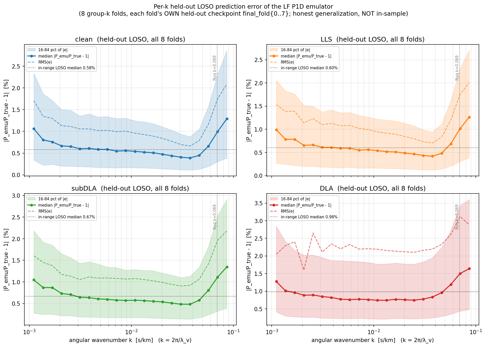

# HCD-marginalized Lyα P1D emulator (`hcd_analysis.emulator`)

A differentiable JAX/Equinox emulator of the **per-class 1D Lyα flux power spectrum**
`P_filt(θ, z, τ₀)` for HCD-marginalized cosmological inference. It mirrors the PRIYA
(Ho 2023/2024) parameter contract so the cosmology community drives it like PRIYA, and it
is end-to-end autodiff so its likelihood (`inference.log_lik_multiz` /
`log_posterior_single_z`) is ready to wrap in a gradient-based sampler (NUTS/numpyro,
blackjax) or a PRIYA-style Cobaya adapter. **The sampler/Cobaya wrappers are forthcoming
(Phase-C T4) — not yet shipped; today you call the differentiable likelihood directly.**

> **TL;DR usage** (standalone-runnable; builds the inputs from a cache row)
> ```python
> import hcd_analysis.emulator                        # enables JAX float64 on import
> import jax.numpy as jnp
> from hcd_analysis.emulator import train as T
> from hcd_analysis.emulator.data import load_cache
> from hcd_analysis.emulator.predict import predict_P_obs, predict_P_filt
>
> model, meta, norm = T.load_checkpoint("checkpoints/final_fold0")
> pf = norm["P_filt"]                                  # structured P_filt norm dict (mu/sig_marg, sig_cosmo)
>
> d   = load_cache("hcd_analysis/_emulator_data/observables_tau0_lf.h5")
> row = 0                                              # or construct your own inputs — see §4
> theta9 = jnp.asarray(d["params_unit"][row])          # (9,) UNIT cube; else (θ_phys−lo)/(hi−lo)
> z_unit = float(d["x"][row, 9])                       # = (z − 2.0)/3.4
> tau0   = float(d["tau0"][row])                       # = −ln(target_F)
> alpha  = jnp.asarray(d["w_c_cache"][row, 1:])        # (3,) per-class incidence (LLS,subDLA,DLA)
> dla_core = jnp.asarray(d["delta"][row, 2])           # (K,) DLA-core add-back
>
> P_filt = predict_P_filt(model, theta9, z_unit, tau0, pf)                  # (4,K) clean,LLS,subDLA,DLA
> P_obs  = predict_P_obs(model, theta9, z_unit, tau0, alpha, pf, dla_core)  # (K,)  total
> ```
> All emulator inputs are UNIT-CUBE. `predict_P_obs`/`predict_excess` are differentiable in
> `(θ9, τ₀, α)`; `predict_P_filt` in `(θ9, τ₀)`.

---

## 1. Environment (mandatory)

The emulator is float64 and lives in a dedicated conda env. **Always** run with:

```bash
PYTHONNOUSERSITE=1 PYTHONPATH=/home/mfho/hcd_priya JAX_PLATFORMS=cpu \
    /home/mfho/.conda/envs/emu-jax/bin/python3  <script>
```

- `import hcd_analysis.emulator` calls `jax.config.update("jax_enable_x64", True)` — **x64 is
  mandatory**: the structural identities (`P_tier_p = Σ_c w_c·P_filt`, telescoping `Σ w_c = 1`)
  are bit-level and break under JAX's default float32.
- `PYTHONNOUSERSITE=1` keeps stray user-site packages out; `JAX_PLATFORMS=cpu` for CPU runs.
- JAX/Equinox-specific traps are logged in `docs/superpowers/jax-traps-log.md` (e.g. trap #29:
  sanitize `jnp.interp` ydata *before* the call, not after).

---

## 2. Architecture

`model.Emulator` (an `eqx.Module`) = **Encoder → {HeadA, BaselineHead, HeadB}**.

```
x = [θ9 (9), z_unit (1)]  ─► Encoder (MLP 256-128-64) ─► latent (64)
                                         │
   HeadA(latent)            ── τ₀-INVARIANT  ─► f_nhi, dN/dX (CDDF / incidence; n_k_cddf=30)
   BaselineHead(z, τ₀)      ── θ-BLIND       ─► m̂  : P_filt baseline   (4×n_basis coeffs)
   HeadB(latent, τ₀)        ── θ-DEPENDENT   ─► r̂  : P_filt residual    (4×n_basis coeffs)
```

**Kennedy–O'Hagan structured mean** (the core design): the per-class log-power is a θ-blind
baseline plus a whitened cosmology residual,

```
logP̂(θ,z,τ₀) = ( m̂·σ_marg + μ_marg )  +  σ_cosmo · r̂
P_filt        = exp(logP̂)                         # (4,K) LINEAR: clean, LLS, subDLA, DLA
```

- **θ enters ONLY through `r̂`** (the baseline is θ-blind), so `∂logP̂/∂θ = σ_cosmo·∂r̂/∂θ`.
  This is what makes the cosmology response cleanly identifiable and is verified by the
  gradient gate (`scripts/diag_grad_fidelity.py`).
- `μ_marg, σ_marg, σ_cosmo` are per-`(class,k)` normalization stats fit on the **train split**
  and stored in the checkpoint's `norm["P_filt"]` dict (see §4).
- **Low-rank P_filt bottleneck** (`n_basis=24`): both heads emit `4×n_basis` coefficients that
  decode through a trainable SVD-warm-started basis `(n_basis, n_k)` — fewer DOF, smoother
  spectra, less over-fit than a dense `4×n_k` output.
- `K = n_k = 172` k-bins (LF cache); ANGULAR k convention (see §5).
- HeadB also carries a legacy dense `delta` head — **not used by the live forward model**
  (the HCD excess is computed from `P_filt` instead, see §3). Dead weight, harmless.

**Multi-fidelity** (`multifidelity.py`): the LF backbone above + a high-fidelity (HiRes /
KODIAQ-SQUAD) `ρ(k,z)` correction layer. The default deployed HiRes correction is the
ρ(k,z)-only `FixedMeanHead` — a mean-*correction* head (it returns `ḡ(z,k) − log ρ`), NOT a
mean-flux head; mean flux is handled structurally via τ₀.

---

## 3. The HCD forward model (`predict.py`)

The corrected (2026-06-04 redesign) HCD-marginalization forward model is a **clean-forest
baseline + free-amplitude per-class excess**:

```
R_c   = P_c − P_clean          # (3,K) excess; FILTERED for LLS/subDLA, UNFILTERED for DLA
P_obs = P_clean + Σ_{c∈HCD} α_c · R_c
      ≡ P_clean · [ 1 + Σ_c α_c (P_c/P_clean − 1) ]      # additive ≡ multiplicative
```

- `α_c` = effective **post-masking per-class incidence** (LLS, subDLA, DLA); `α_c = w_c`
  reproduces the sim's contaminated `P_tier_p` (up to the DLA-core add-back). Prior-centered
  on the **observed** dN/dX (not PRIYA's sim) — see `inference.hcd_incidence_prior`.
- DLA uses the **unfiltered** template: `P_DLA^unf = P_filt[DLA] + dla_core`, where
  `dla_core` (the DLA-core add-back, `= P_DLA^unf − P_DLA^filt`) is `cache["delta"][row, 2]`.
- `∂P_obs/∂α_c = (P_c − P_clean) ≠ 0` for LLS now (fixes the old `Δ_LLS≡0` filter-residual bug).
- This is the field-standard fixed-shape/free-amplitude HCD template (cf. Rogers&Bird 2018);
  unlike Rogers it carries the θ,τ₀ sensitivity and preserves the global-⟨F⟩ normalization.
  See `docs/superpowers/2026-06-04-phase-c-walkthrough.md` §6 and
  `[[hcd-template-rogers-normalization]]` for the physics.

Key functions (all JAX-pure, differentiable in `θ9, τ₀, α`):

| function | returns |
|---|---|
| `predict_P_filt(model, θ9, z_unit, τ₀, pf)` | `(4,K)` per-class P_filt |
| `predict_excess(model, θ9, z_unit, τ₀, pf, dla_core)` | `(3,K)` excess R_c |
| `predict_P_obs(model, θ9, z_unit, τ₀, α_hcd, pf, dla_core)` | `(K,)` total P_obs |
| `predict_P_tier_p(model, θ9, z_unit, τ₀, w_c, pf)` | `(K,)` structural Σ w_c·P_filt (clean-path diagnostics only) |

---

## 4. Inputs, normalization, checkpoints

**Parameters** (`data.PARAM_LIMITS`, identical order to PRIYA `coarse_grid`):

```
[ns, Ap, herei, heref, alphaq, hub, omegamh2, hireionz, bhfeedback]
```

- Feed the emulator **unit-cube** `θ9 ∈ [0,1]^9`. Map physical→unit with `PARAM_LIMITS`:
  `θ9 = (θ_phys − lo) / (hi − lo)`. `data.normalize_params` / the `params_unit` cache field do this.
- `z_unit = (z − 2.0)/(5.4 − 2.0)` — a linear map over `data.Z_LIMITS=(2.0, 5.4)` (e.g. z=3 →
  0.2941); `τ₀ = −ln(target_F)` (the per-z mean-flux optical depth — PRIYA's
  `mean_flux="per_z"`). `α_hcd` = `(3,)` per-class incidence (LLS, subDLA, DLA).

**Checkpoints** (`checkpoints/`): each fold is a 4-file bundle
`final_fold{0..7}.{eqx, meta.json, norm.pkl, hist.json}`:

- `.eqx` — Equinox leaves; `.meta.json` — `arch_cfg` + `seed`; `.norm.pkl` — train-split norm
  stats (the `P_filt` dict with `mu_marg/sig_marg/sig_cosmo`, + f_nhi/dndx/delta stats);
  `.hist.json` — per-epoch loss history.
- `T.load_checkpoint(path)` → `(model, meta, norm)`. Deployed production = 8-fold LOSO. Use a
  **single** fold's model for the point prediction (`final_fold0` is the canonical default) —
  do NOT ensemble the folds at inference; the fold-to-fold LOSO spread is already captured as
  the σ budget in `error_vector.npz` and enters the likelihood through `C_emu`.

**Error vector** (`checkpoints/error_vector.npz`) — the emulator-error budget for the
likelihood: `sigma (4, K=172, Zb=3, Tb=4)` = per-(class, k, z-band, τ₀-band) RMS fractional
LOSO residual, `tau0_band_centres (4,)`, `z_band_edges`, `dla_shot_flag (K,)`. Consumed by
`likelihood.sigma_at_tau0` + the per-class `C_emu`.

---

## 5. Conventions & key facts (don't get burned)

- **k is ANGULAR** `k = 2π/λ_v` in s/km (community-wide: Croft/McDonald/Palanque-Delabrouille/
  Rogers/PRIYA/DESI). `cache["kfkms"] = 2π·rfftfreq/dv`; pass it to Rogers templates DIRECTLY
  (no /2π). See `[[hcd-template-rogers-normalization]]`.
- **τ₀ ladder coordinate**: `α_factor = τ₀ / Kim2013(z)` is the z-INDEPENDENT ladder axis
  (`data.tau0_ladder_factor`) — the natural axis for the smooth `σ(τ₀)` interpolation.
- **Data range** (`data.DATA_RANGE`): z∈[2.2, 4.6], `k_min=1e-3`. The cache is wider
  (z∈{2.0..5.4}, angular k∈[3.5e-4, 0.098]); out-of-range bins are SOFT down-weighted in
  training and EXCLUDED from `C_emu`. Decision (2026-06-04): keep `k_min=1e-3`.
- **Per-class power uses a single shared global ⟨F⟩** (`target_F`), not per-subset — so class
  offsets are real physics, not a sightline-count artifact.

---

## 6. Cache (`hcd_analysis/_emulator_data/observables_tau0_lf.h5`)

v3.3 LF cache, 21440 rows, n_k=172, angular k, 20-point τ₀ ladder (uniform rescale). Built by
`scripts/build_emulator_cache_tau0.py`. `data.load_cache(path)` returns a dict with (among
others): `params`/`params_unit`/`x`, `kfkms`, `P_filt (R,4,K)` (count-collapsed coarse
classes: clean / LLS / subDLA / DLA), `delta (R,3,K)` (the per-class core add-back; `[:,2]` =
`dla_core`), `coarse_counts`/`w_c_cache`, `target_F`, `tau0 = −ln(target_F)`, `z_grid`.
Coarse-class map: `COARSE_SLICES = (clean=tier0, LLS=1–7, subDLA=8–12, DLA=13–14)`.

---

## 7. Training (`scripts/run_loso_sweep.py`)

The 8-fold LOSO sweep driver — trains one emulator per fold (`train.train_fold`), reuses the
SVD warm-start, collects stratified fractional residuals, and emits `error_vector.npz` + review
figures (`figures/analysis/04_emulator/`). The frozen production recipe (`FINAL_RECIPE`):

```python
n_basis=24, p_resid_w=8.0, edge_gain=3.0, lowk_extra=2.0,    # low-rank + k-weighting
w_coh=80.0, weight_decay=3e-4, datarange=True,               # de-bias + soft data-range
epochs=180, patience=25, lr=1e-3, batch=512,                 # optax AdamW + cosine decay
```

```bash
PYTHONNOUSERSITE=1 PYTHONPATH=/home/mfho/hcd_priya JAX_PLATFORMS=cpu \
  /home/mfho/.conda/envs/emu-jax/bin/python3 scripts/run_loso_sweep.py \
    --out checkpoints/final --histdir checkpoints     # (defaults == FINAL_RECIPE)
```

Add `--smoke` for a fast shape/finiteness check. A θ-blind baseline pre-fit
(`train._prefit_baseline`) runs before the joint fit so the baseline is structurally
identifiable.

### 7a. Held-out LOSO error vs wavenumber

The 8-fold group-k LOSO certifies generalization on *held-out cosmologies*. The per-fold
scalar val-RMS (clean 0.84–1.61 %, DLA worst 1.41–4.39 %, overall 1.0–2.4 %; A_p/n_s Fisher
bias **0/8** over the gate) is summarized in the notes' validation Doc A. The figure below
resolves that same held-out error **as a function of angular wavenumber k** (k = 2π/λ_v, fed
direct — no /2π), per HCD class. It pools `P_emu/P_true − 1` over **all 18 224 held-out rows
across all 8 folds**, each predicted by *that fold's own* held-out checkpoint
(`final_fold{0..7}`) — the honest LOSO generalization error, **not** the in-sample production
ensemble. (Rebuild with `scripts/diag_emu_loso_perk.py`; arrays in the sibling `.npz`.)



Median `|P_emu/P_true − 1|` is a shallow **U in k**: highest at the lowest, cosmic-variance-
sparse modes (~1.0–1.3 %), best near k≈0.02–0.04 s/km (**clean/LLS/subDLA 0.39–0.48 %, DLA
0.74 %**), then rising back to **clean 0.99 %, LLS 1.01 %, subDLA 1.11 %, DLA 1.50 %** at the
Nyquist k≈0.069 s/km (the n_k=172 grid top), with a thin above-Nyquist tail (some rows' physical
k reaches ~0.086) climbing to ~1.3–1.6 %. The class ordering is monotone clean < LLS < subDLA <
**DLA (worst at every k)**, matching the scalar table. The dotted line on each panel is the
in-range LOSO median for that class.

---

## 8. Likelihood & inference (`inference.py`, `likelihood.py`, `closure_diagnostics.py`)

- `inference.log_lik_single_z` / `log_lik_multiz` — the differentiable per-z / multi-z Gaussian
  log-likelihood. Per-class `C_emu`: `emu_var = Σ_c coef_c²·σ_c(k,z,τ₀)²·P_c²`,
  `coef = [1−Σα, α_LLS, α_subDLA, α_DLA]`; logdet-bearing (`likelihood.gaussian_loglik`, SPD
  jitter + Cholesky); τ₀-aware σ via `likelihood.sigma_at_tau0`.
- `inference.hcd_incidence_prior` — observed-centered, z-slope HCD incidence priors
  (`HCD_LIT_OVER_SIM`, `HCD_PRIOR_FRAC_SIGMA`, …). Smooth bounded θ prior (no `-inf` wall, so
  NUTS gets finite gradients).
- `closure_diagnostics.py` — the SBC/closure machinery: `ecdf_pit_bands` (Säilynoja+2022
  simultaneous bands — the primary calibration gate), `loglik_rank` (Modrak+2023),
  `whitening_test`, `empirical_coverage`, `calibrate_cemu_inflate`. NUTS-free, fast.

See `docs/superpowers/plans/2026-06-04-phase-c-t4-closure-plan.md` for the closure/SBC harness
(Phase-C T4, in progress) and `docs/superpowers/2026-06-04-phase-c-checkpoint-review.md` for the
latest 4-agent review status.

---

## 9. Module map

| file | role |
|---|---|
| `__init__.py` | enables x64; exports `CLASS_NAMES`, `HCD_CLASSES` |
| `data.py` | cache loader, `PARAM_LIMITS`, `DATA_RANGE`, coarse collapse, τ₀ bands, splits/batches, norm-stat fitting |
| `model.py` | `Emulator` = Encoder + HeadA + BaselineHead + HeadB; SVD basis; `structural_tier_p` |
| `multifidelity.py` | LF+HF combination, ρ(k,z) HiRes correction, `FixedMeanHead` |
| `train.py` | `train_fold`, optimizer/loss, baseline pre-fit, `save/load_checkpoint` |
| `predict.py` | differentiable forward: `predict_P_filt/excess/P_obs/P_tier_p` |
| `likelihood.py` | `sigma_at_tau0`, `gaussian_loglik`, covariance assembly |
| `inference.py` | per-z/multi-z log-likelihood + HCD incidence priors + θ/τ₀/α priors |
| `closure_diagnostics.py` | SBC/PIT-ECDF bands, whitening, coverage, cemu_inflate calibration |
| `dndx_wc.py` | dN/dX ↔ w_c ↔ α structural maps (M₀-inverse) |
