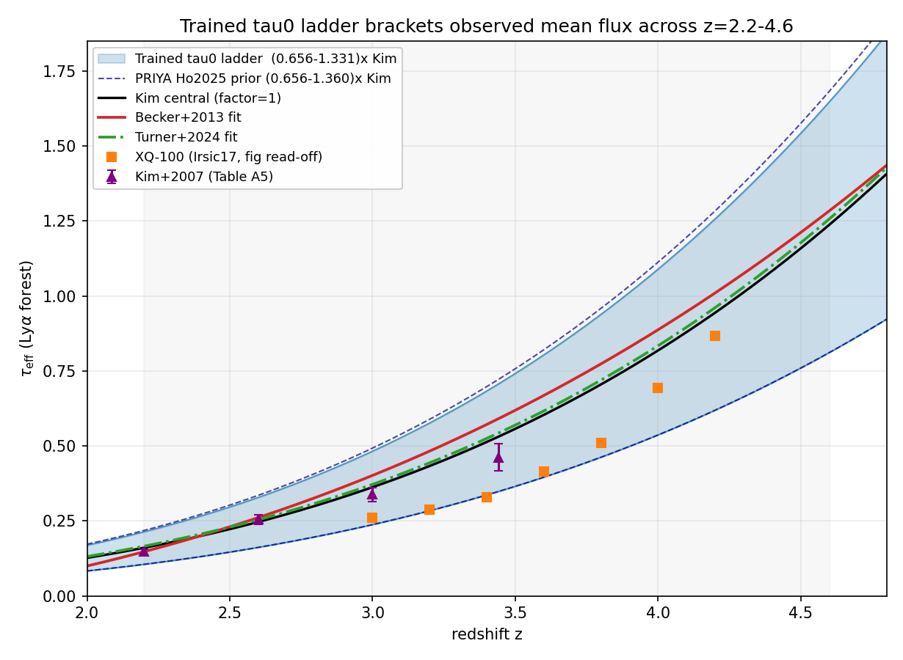
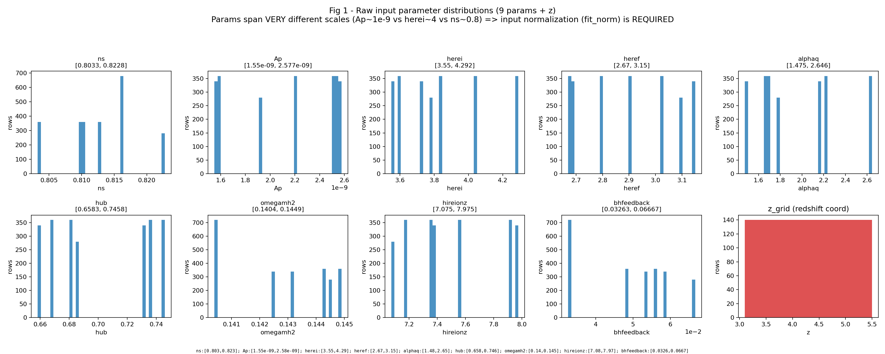
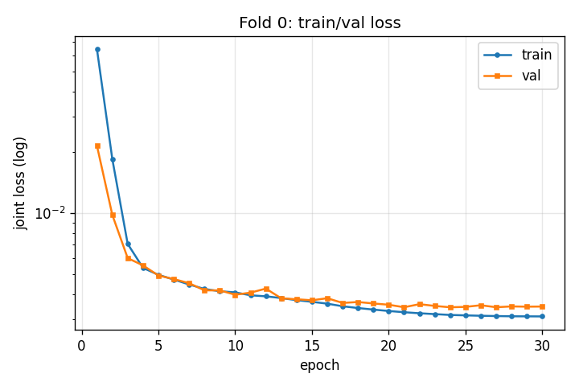
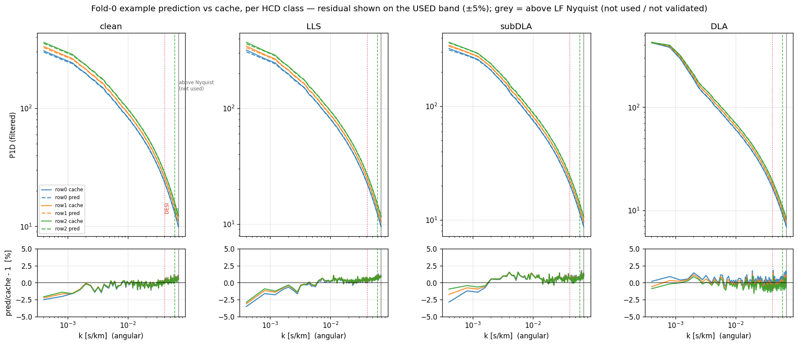
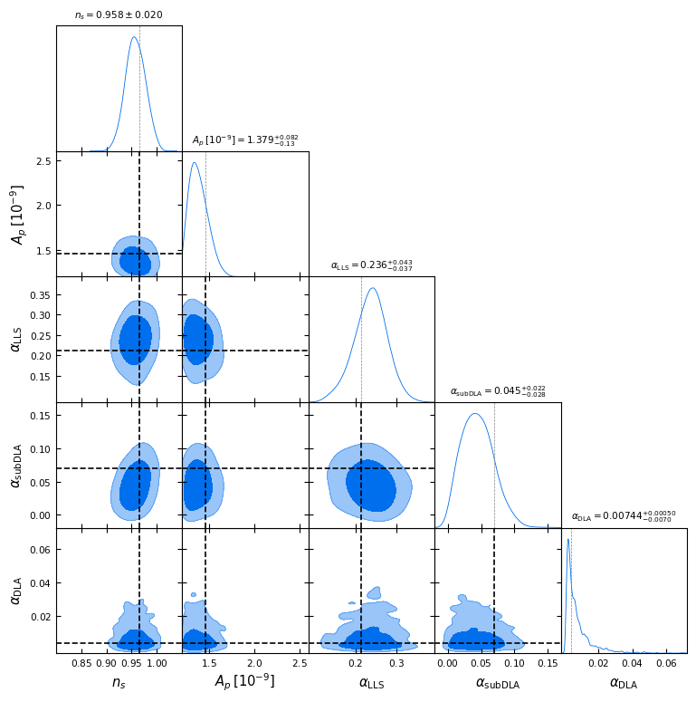
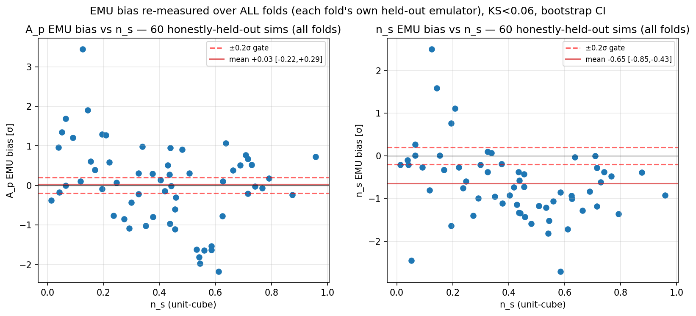
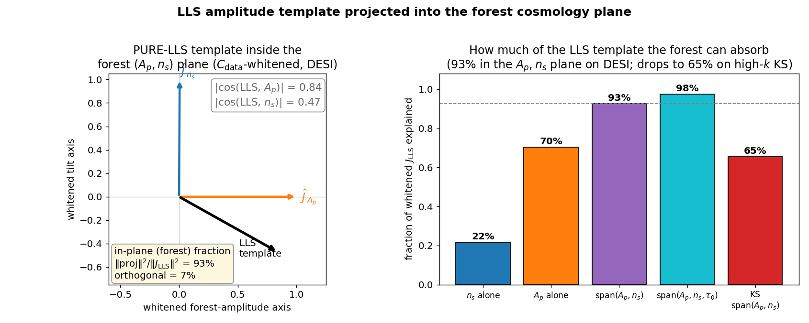

# HCD-marginalized Lyα P1D emulator (`hcd_analysis.emulator`)

Welcome! This is the emulator at the heart of our Lyman-α cosmology analysis. If you are a new
student on the project, you are in the right place — read this top to bottom and you will
understand **what it does, why it is built this way, and how to run it yourself.**

### The 30-second version

We want to measure cosmology from the **Lyα forest** — the thicket of absorption lines that
intervening hydrogen gas stamps onto the spectrum of a distant quasar. The summary statistic we
use is the **P1D** (the *one-dimensional flux power spectrum*: how much absorption variance lives
on each spatial scale along the line of sight). Cosmology lives in the shape of the P1D.

The problem: some of those absorption lines come from dense gas clumps — **HCDs** (*High Column
Density absorbers*: Lyman-limit systems, sub-DLAs, and damped Lyα systems). The three classes are
split by neutral-hydrogen column density N_HI (`hcd_analysis/catalog.py`): **LLS** 10^17.2–10^19,
**subDLA** 10^19–10^20.3, **DLA** ≥ 10^20.3 cm⁻². They contaminate the
P1D and, if ignored, bias the cosmology. So we need a model of the P1D that *separates* the clean
forest from the HCD contamination, and lets us marginalize the HCDs away.

A full hydrodynamic simulation of that is far too slow to run inside a sampler. So we train a fast
**emulator** — a neural network that learns the simulation's P1D as a smooth function of its
inputs — and we make it **differentiable** so a gradient-based sampler can explore it efficiently.

This package is that emulator. It predicts the **per-class P1D** `P_filt(θ, z, τ₀)` (one spectrum
each for *clean forest, LLS, sub-DLA, DLA*) as a function of:
- `θ` — the 9 cosmological / astrophysical parameters,
- `z` — redshift,
- `τ₀` — the mean-flux optical depth (how absorbed the forest is on average; defined below).

It mirrors the **PRIYA** simulation suite (our group's simulation suite; Bird, Fernandez, Ho et al. 2023, JCAP 10 037,
[arXiv:2306.05471](https://arxiv.org/abs/2306.05471); extended box from Fernandez, Bird & Ho 2024,
JCAP 07 029, [arXiv:2309.03943](https://arxiv.org/abs/2309.03943)), so anyone who knows how to
drive PRIYA can drive this. It is end-to-end autodiff, so the likelihood
(`inference.log_lik_multiz`) is ready to plug into a gradient sampler (**NUTS** — the *No-U-Turn
Sampler*, a Hamiltonian Monte Carlo variant — via numpyro/blackjax, or a PRIYA-style Cobaya
adapter).

> **Heads-up:** the sampler / Cobaya wrappers are forthcoming (Phase-C T4 — not yet shipped).
> Today you call the differentiable likelihood directly. That is enough to do real inference.

This README is a **reproduction / install / quickstart** guide *plus* a tour of the validation
evidence. The rigorous, peer-reviewed verdicts (held-out error, coverage, the cosmology-bias
gate) live in the private notes repo and are linked from each demo below; the headline
validation doc is
`hcd_priya_notes/docs/superpowers/2026-06-14-validation-loso-emulator-lf-mf.md`.

### Where to go

**Build & run it:**
1. [Environment](#1-environment-mandatory) — the one env string you must run with
2. [The τ₀ cache](#2-the-τ₀-cache) — the training data: what it is and how to load it
3. [Architecture](#3-architecture) — what the network looks like and why
4. [Training](#4-training) — how to run it and what a healthy run looks like
5. [Forward model / prediction](#5-forward-model--prediction) — turning the network into a P1D
6. [Quickstart](#6-quickstart) — a copy-paste snippet
7. [Conventions & gotchas](#7-conventions--gotchas) — the things that will bite you
8. [Likelihood & inference](#8-likelihood--inference) — the differentiable log-likelihood + priors
9. [Module map](#9-module-map)

**See that it works (the demos):**
- [Demo A — Mock inference (closure / SBC)](#demo-a--does-the-inference-recover-the-truth-closure--sbc)
- [Demo B — A corner plot, reproduced](#demo-b--a-posterior-corner-plot-and-how-to-make-one)
- [Demo C — Does emulator error bias the cosmology?](#demo-c--does-emulator-error-bias-the-cosmology-the-loso-fisher-gate)
- [Demo D — HCD statistics vs the literature](#demo-d--hcd-statistics-the-emulator-vs-the-literature)
- [Demo E — How HCDs nudge the cosmology](#demo-e--how-hcds-nudge-the-cosmology-the-llsforest-degeneracy)

---

## 1. Environment (mandatory)

**Why this matters:** the emulator runs in **float64** (double precision), and its math relies on
some *exact* identities that quietly break in the default float32. So it lives in a dedicated
conda env, and you must launch every script with the same env string.

```bash
PYTHONNOUSERSITE=1 PYTHONPATH=/home/mfho/hcd_priya JAX_PLATFORMS=cpu CUDA_VISIBLE_DEVICES="" \
    /home/mfho/.conda/envs/emu-jax/bin/python3  <script>
```

What each piece does:
- `import hcd_analysis.emulator` runs `jax.config.update("jax_enable_x64", True)` — **x64 is
  mandatory.** The structural identities (`P_tier_p = Σ_c w_c·P_filt`, the telescoping
  `Σ w_c = 1`) are bit-level and break under float32.
- `PYTHONNOUSERSITE=1` keeps stray packages in your home dir from leaking in.
- `JAX_PLATFORMS=cpu` and `CUDA_VISIBLE_DEVICES=""` pin it to CPU (deterministic, no GPU surprises).
- JAX/Equinox traps we have already hit are logged in `docs/superpowers/jax-traps-log.md` (e.g.
  trap #29: sanitize `jnp.interp` y-data *before* the call, not after).

**What you get:** a working float64 JAX runtime that can `import` the package.

---

## 2. The τ₀ cache

**What this is:** the emulator's entire training set, in one HDF5 file. It is a big table of P1D
spectra measured from the PRIYA low-fidelity (**LF** = the cheaper, larger-volume simulation box)
runs, with one extra trick we explain next.

**Why the τ₀ ladder.** `τ₀` is the *mean-flux optical depth* — `τ₀ = −ln(target_F)`, where
`target_F` is the average transmitted flux of the forest. It controls how absorbed the forest is
on average, and the observed value drifts with redshift. Rather than hope the simulation happened
to land on the right mean flux, we **re-sample each simulation's mean flux up and down a ladder of
rungs** (PRIYA's `mean_flux="per_z"` post-processing). That way the emulator *learns the τ₀
dependence directly* and can be evaluated at whatever mean flux the data demand.

The ladder is anchored on the **Kim et al. 2007** mean-flux fit `τ_eff(z) = 0.0023·(1+z)^3.65`
(MNRAS 382, 1657, [arXiv:0711.1862](https://arxiv.org/abs/0711.1862)) and built wide enough to
bracket the observed mean flux across the analysis redshift range.

**What you'll see** below: the trained ladder (shaded band) comfortably brackets every observed
mean-flux measurement across z = 2.2–4.6 — so the emulator never has to extrapolate in mean flux
inside the analysis.



*The shaded band is the trained τ₀ ladder; the lines/points are observed-⟨F⟩ fits and data
(Kim+2007, Becker+2013, Turner+2024, XQ-100). The ladder brackets the data across z = 2.2–4.6.*

**The cache file:** `hcd_analysis/_emulator_data/observables_tau0_lf.h5` — the v3.3 LF cache:
**21 440 rows**, **n_k = 172** k-bins, angular k, a **20-rung τ₀ ladder**, **60 LF sims**, 4 HCD
classes. Built by `scripts/build_emulator_cache_tau0.py`.

**Load it:**

```python
from hcd_analysis.emulator.data import load_cache
d = load_cache("hcd_analysis/_emulator_data/observables_tau0_lf.h5")
```

`load_cache` returns a dict; the keys you will reach for most:

| key | shape | meaning |
|---|---|---|
| `params` / `params_unit` / `x` | `(R,9)` / `(R,9)` / `(R,10)` | physical / unit-cube params; `x` = `[θ9, z_unit]` |
| `kfkms` | `(K,)` | angular k-grid in s/km (`K = n_k = 172`) |
| `P_filt` | `(R,4,K)` | per-class P1D: clean, LLS, subDLA, DLA |
| `delta` | `(R,3,K)` | per-class core add-back; `delta[:,2]` = `dla_core` |
| `coarse_counts` / `w_c_cache` | — | per-class sightline counts / incidence weights `w_c` |
| `target_F`, `tau0` | `(R,)` | global mean flux, `tau0 = −ln(target_F)` |
| `z_grid` | `(R,)` | redshift per row |

The four "classes" are absorber types, ordered by how much neutral hydrogen they contain:
**clean** (no HCD), **LLS** (Lyman-limit systems), **subDLA**, **DLA** (damped Lyα). Internally
PRIYA has many fine tiers; we collapse them into these 4 coarse classes
(`COARSE_SLICES = clean=tier0, LLS=1–7, subDLA=8–12, DLA=13–14`).

**Why normalization is needed.** The 9 input parameters live on wildly different scales (the
amplitude `A_p ≈ 1e-9` vs the tilt `n_s ≈ 0.9`). A network cannot learn well from raw inputs that
differ by 9 orders of magnitude, so we map everything to a **unit cube** before training (see §7).



*The 9 PRIYA design parameters + redshift across the cache rows. The mismatched scales are exactly
why `data.normalize_params` maps to the unit cube before training.*

**What you get:** a dict of arrays — per-class P1D over `(θ, z, τ₀)` plus the structural weights —
that is the emulator's complete training set.

---

## 3. Architecture

**The idea in one line:** share a feature extractor, then split into three small "heads," each
responsible for one well-defined physical job. `model.Emulator` (an `eqx.Module`) =
**Encoder → {HeadA, BaselineHead, HeadB}**.


*The Encoder builds a shared latent; HeadA emits the τ₀-invariant CDDF/incidence; the BaselineHead
emits a θ-blind P_filt baseline and HeadB the θ-dependent residual; the structured mean recombines
them and the downstream block assembles `P_tier_p` / `P_obs` for the likelihood.*

```
x = [θ9 (9), z_unit (1)]  ─► Encoder (MLP 256-128-64) ─► latent (64)
                                         │
   HeadA(latent)            ── τ₀-INVARIANT  ─► f_nhi, dN/dX (CDDF / incidence; n_k_cddf=30)
   BaselineHead(z, τ₀)      ── θ-BLIND       ─► m̂  : P_filt baseline   (4×n_basis coeffs)
   HeadB(latent, τ₀)        ── θ-DEPENDENT   ─► r̂  : P_filt residual    (4×n_basis coeffs)
```

**Why split it like this — the Kennedy–O'Hagan structured mean.** This is the key design choice
(Kennedy & O'Hagan 2001, JRSS-B 63, 425 — a θ-blind "simulator" term plus a learned discrepancy).
In plain English: rather than predicting the whole spectrum in one black box, we predict a fixed
**baseline that does not depend on cosmology** plus a small **learned correction that carries all
the cosmology dependence** — so the cosmology signal lives in one isolatable term we can check.
We write each per-class log-power as a **θ-blind baseline plus a whitened cosmology residual**:

```
logP̂(θ,z,τ₀) = ( m̂·σ_marg + μ_marg )  +  σ_cosmo · r̂
P_filt        = exp(logP̂)                         # (4,K) LINEAR: clean, LLS, subDLA, DLA
```

Why this is worth the trouble:
- **The cosmology enters ONLY through `r̂`** (the baseline is θ-blind), so
  `∂logP̂/∂θ = σ_cosmo·∂r̂/∂θ`. The entire cosmology response is concentrated in one isolatable
  term — which makes it both *easy to check* (the gradient gate `scripts/diag_grad_fidelity.py`)
  and *cleanly identifiable*.
- `μ_marg, σ_marg, σ_cosmo` are per-`(class, k)` normalization stats fit on the **train split** and
  stored in the checkpoint's `norm["P_filt"]` dict (see §4 / §6).
- **Low-rank P_filt bottleneck** (`n_basis = 24`): instead of predicting all 172 k-values
  directly, both heads emit just `4×n_basis` coefficients that decode through a trainable,
  SVD-warm-started basis `(n_basis, n_k)`. Fewer free parameters → smoother spectra → less
  over-fitting than a dense `4×n_k` output.
- `K = n_k = 172` k-bins (LF cache); ANGULAR k convention (see §7).
- HeadB also carries a legacy dense `delta` head — **not used by the live forward model** (the HCD
  excess is computed from `P_filt` instead, see §5). Dead weight, harmless.

**Multi-fidelity** (`multifidelity.py`): the LF backbone above is **LF-only** — it never sees the
expensive high-resolution (**HF / HiRes**) box. A separate, frozen `ρ(k,z)` correction layer lifts
each LF prediction to HR resolution. The default deployed correction is the ρ(k,z)-only
`FixedMeanHead` — a mean-*correction* head (it returns `ḡ(z,k) − log ρ`), **not** a mean-flux head;
mean flux is handled structurally via τ₀. (Why the LF→HR correction matters quantitatively is
demoed in the notes validation doc §3.)

**What you get:** a differentiable per-class P1D predictor whose cosmology response lives in a
single, isolatable residual term.

---

## 4. Training

**How a run works.** Training is driven by the 8-fold **LOSO** sweep `scripts/run_loso_sweep.py`.
LOSO = *Leave-One-Simulation-Out*: we partition the 60 sims into 8 groups, and for each fold we
*hold out a whole group of simulations*, train on the rest, and test on the held-out ones. Because
the held-out sims are entire *cosmologies the network never saw*, this is an honest test of
generalization (not just of memorization). Each fold trains one emulator (`train.train_fold`),
reuses the SVD warm-start, collects stratified fractional residuals, and writes
`error_vector.npz` + figures into `figures/analysis/04_emulator/`.

The frozen production recipe (`FINAL_RECIPE`):

```python
n_basis=24, p_resid_w=8.0, edge_gain=3.0, lowk_extra=2.0,    # low-rank + k-weighting
w_coh=80.0, weight_decay=3e-4, datarange=True,               # de-bias + soft data-range
epochs=180, patience=25, lr=1e-3, batch=512,                 # optax AdamW + cosine decay
```

Run it:

```bash
PYTHONNOUSERSITE=1 PYTHONPATH=/home/mfho/hcd_priya JAX_PLATFORMS=cpu CUDA_VISIBLE_DEVICES="" \
  /home/mfho/.conda/envs/emu-jax/bin/python3 scripts/run_loso_sweep.py \
    --out checkpoints/final --histdir checkpoints     # (defaults == FINAL_RECIPE)
```

Add `--smoke` for a fast shape/finiteness check. A θ-blind baseline pre-fit
(`train._prefit_baseline`) runs before the joint fit so the baseline is structurally identifiable.

**What a healthy run looks like:** the training loss and the validation loss fall together and
flatten *with no gap between them*. A gap would mean over-fitting (the network memorizing the
training sims); the regularized residual head is designed to prevent that.



*A clean joint-loss curve: train and val track each other and plateau — no over-fitting.*

> **Folds vs production — an important subtlety.** The 8 LOSO folds exist for **closure
> validation** and for **calibrating the emulator-error budget** (`C_emu`). The *deployed* point
> prediction uses a **single** model — do **not** ensemble the folds at inference. The fold-to-fold
> spread is already captured as the σ budget in `error_vector.npz` and enters the likelihood
> through `C_emu`. Before the real fit, we train an all-sims **production** emulator (no hold-out);
> `final_fold0` is the canonical stand-in default for now.

**What you get:** one checkpoint bundle per fold (see §6) plus the LOSO error vector.

---

## 5. Forward model / prediction

**The job here:** turn the network's per-class spectra into the *single contaminated P1D* the data
actually measure — and do it so that we can dial the HCD contamination up and down. The forward
model (2026-06-04 redesign) is a **clean-forest baseline plus a free-amplitude per-class HCD
excess**:

```
R_c   = P_c − P_clean          # (3,K) excess; FILTERED for LLS/subDLA, UNFILTERED for DLA
P_obs = P_clean + Σ_{c∈HCD} α_c · R_c
      ≡ P_clean · [ 1 + Σ_c α_c (P_c/P_clean − 1) ]      # additive ≡ multiplicative
```

Reading it:
- `α_c` is the effective **post-masking per-class incidence** (how often each HCD type survives
  into the data). Setting `α_c = w_c` reproduces the sim's contaminated `P_tier_p` (up to the
  DLA-core add-back). The prior on `α_c` is centered on the **observed** dN/dX (*not* PRIYA's sim
  value — sims and data differ) — see `inference.hcd_incidence_prior`.
- DLA uses the **unfiltered** template: `P_DLA^unf = P_filt[DLA] + dla_core`, where `dla_core`
  (`= P_DLA^unf − P_DLA^filt`) is `cache["delta"][row, 2]`.
- `∂P_obs/∂α_c = (P_c − P_clean) ≠ 0` for LLS now (this fixes an old `Δ_LLS ≡ 0` filter-residual
  bug).
- This is the field-standard **fixed-shape / free-amplitude HCD template** (cf. Rogers, Bird,
  Peiris et al. 2018, MNRAS 474, 3032, [arXiv:1706.08532](https://arxiv.org/abs/1706.08532); the
  4-class form is also what PRIYA-on-KODIAQ-SQUAD uses,
  [arXiv:2509.18271](https://arxiv.org/abs/2509.18271)). Unlike the fixed Rogers kernel, ours
  carries the θ, τ₀ sensitivity and preserves the global-⟨F⟩ normalization. See
  `docs/superpowers/2026-06-04-phase-c-walkthrough.md` §6 and
  `[[hcd-template-rogers-normalization]]`.

**What you'll see — and how to read it honestly.** Below is an example fold-0 prediction (dashed)
laid over the cache "truth" (solid), per class. The top panels are the spectra; the bottom panels
are the fractional residual `pred/cache − 1`, **restricted to the band we actually use**
(±5% axis). The grey shading marks **k above the LF Nyquist** (k ≈ 0.069 s/km) — the network is
neither *used* nor *validated* there, so we shade it out. The dotted/dashed vertical lines mark the
two analysis k-cuts: **DESI k ≤ 0.041** and **KODIAQ-SQUAD (KS) k ≤ 0.06** s/km.



***(a) What the figure shows.*** A fold-0 example prediction (dashed) vs the cache (solid), per HCD
class. Inside the analysis band the residual is ~1–2% (median ≈ 0.7%); the grey region (above the
Nyquist) is not used. The **rigorous** all-folds error lives in the notes validation doc
(`2026-06-14-validation-loso-emulator-lf-mf.md` §2), which resolves the held-out error per
wavenumber k — the rigorous "where in k does the error live" answer. Demo C below shows the
bottom line for cosmology: the per-fold A_p/n_s bias.

***(b) Why an older plot looked ±20% alarming.*** The previous version of this plot showed the
residual over the full raw k-grid and reached ±20% at the k-extremes. That ±20% is **entirely** at
the lowest, cosmic-variance-sparse modes (k < 0.005, where individual sims are noisy) and **above
the Nyquist** (k > 0.069, where the LF emulator is not used) — never in the analysis band. The
plot above restricts to the band we actually use, which is why it looks (correctly) calmer.

***(c) Reproduce.*** Diagnosis numbers and this figure are produced by
`scripts/diag_pred_vs_true_honest.py`.*

The functions you will call (all JAX-pure, differentiable in `θ9, τ₀, α`):

| function | returns |
|---|---|
| `predict_P_filt(model, θ9, z_unit, τ₀, pf)` | `(4,K)` per-class P_filt |
| `predict_excess(model, θ9, z_unit, τ₀, pf, dla_core)` | `(3,K)` excess R_c |
| `predict_P_obs(model, θ9, z_unit, τ₀, α_hcd, pf, dla_core)` | `(K,)` total P_obs |
| `predict_P_tier_p(model, θ9, z_unit, τ₀, w_c, pf)` | `(K,)` structural Σ w_c·P_filt (clean-path diagnostics only) |

`predict_P_obs` / `predict_excess` are differentiable in `(θ9, τ₀, α)`; `predict_P_filt` in
`(θ9, τ₀)`. `pf = norm["P_filt"]` (the structured norm dict, see §6).

**What you get:** the total contaminated P1D `P_obs(k)` (and its building blocks), differentiable
in cosmology, mean flux, and HCD incidence — ready to feed the likelihood.

---

## 6. Quickstart

This snippet is standalone-runnable; it builds the inputs from a cache row so you can see the
whole flow at once.

```python
import hcd_analysis.emulator                        # enables JAX float64 on import
import jax.numpy as jnp
from hcd_analysis.emulator import train as T
from hcd_analysis.emulator.data import load_cache
from hcd_analysis.emulator.predict import predict_P_obs, predict_P_filt

model, meta, norm = T.load_checkpoint("checkpoints/final_fold0")
pf = norm["P_filt"]                                  # structured P_filt norm dict (mu/sig_marg, sig_cosmo)

d   = load_cache("hcd_analysis/_emulator_data/observables_tau0_lf.h5")
row = 0                                              # or construct your own inputs — see below
theta9 = jnp.asarray(d["params_unit"][row])          # (9,) UNIT cube; else (θ_phys−lo)/(hi−lo)
z_unit = float(d["x"][row, 9])                       # = (z − 2.0)/3.4
tau0   = float(d["tau0"][row])                       # = −ln(target_F)
alpha  = jnp.asarray(d["w_c_cache"][row, 1:])        # (3,) per-class incidence (LLS,subDLA,DLA)
dla_core = jnp.asarray(d["delta"][row, 2])           # (K,) DLA-core add-back

P_filt = predict_P_filt(model, theta9, z_unit, tau0, pf)                  # (4,K) clean,LLS,subDLA,DLA
P_obs  = predict_P_obs(model, theta9, z_unit, tau0, alpha, pf, dla_core)  # (K,)  total
```

**Remember: all emulator inputs are UNIT-CUBE.**

**Checkpoints** (`checkpoints/`): each fold is a 4-file bundle
`final_fold{0..7}.{eqx, meta.json, norm.pkl, hist.json}`:

- `.eqx` — Equinox leaves; `.meta.json` — `arch_cfg` + `seed`; `.norm.pkl` — train-split norm stats
  (the `P_filt` dict with `mu_marg / sig_marg / sig_cosmo`, + f_nhi/dndx/delta stats);
  `.hist.json` — per-epoch loss history.
- `T.load_checkpoint(path)` → `(model, meta, norm)`.

**Error vector** (`checkpoints/error_vector.npz`) — the emulator-error budget for the likelihood:
`sigma (4, K=172, Zb=3, Tb=4)` = per-(class, k, z-band, τ₀-band) RMS fractional LOSO residual,
plus `tau0_band_centres (4,)`, `z_band_edges`, `dla_shot_flag (K,)`. Consumed by
`likelihood.sigma_at_tau0` + the per-class `C_emu`.

**Building your own inputs** (instead of reading a cache row):

- **Parameters** (`data.PARAM_LIMITS`, identical order to PRIYA's `coarse_grid`):
  `[ns, Ap, herei, heref, alphaq, hub, omegamh2, hireionz, bhfeedback]`. Feed the emulator the
  **unit-cube** `θ9 ∈ [0,1]^9`: `θ9 = (θ_phys − lo)/(hi − lo)` (or use `data.normalize_params`).
- `z_unit = (z − 2.0)/(5.4 − 2.0)` — a linear map over `data.Z_LIMITS = (2.0, 5.4)` (e.g. z = 3 →
  0.2941).
- `τ₀ = −ln(target_F)` (the per-z mean-flux optical depth).
- `α_hcd` = `(3,)` per-class incidence (LLS, subDLA, DLA).

---

## 7. Conventions & gotchas

These are the things that have actually cost people an afternoon. Read them before you debug.

- **k is ANGULAR** `k = 2π/λ_v` in s/km — the community-wide convention (Croft et al.,
  McDonald et al., Palanque-Delabrouille et al., Rogers et al., PRIYA, DESI). `cache["kfkms"] =
  2π·rfftfreq/dv`; pass it to Rogers templates DIRECTLY (no extra `/2π`). See
  `[[hcd-template-rogers-normalization]]`.
- **x64 is mandatory** (see §1) — the structural identities break under float32.
- **PRIYA n_s / A_p are FOREST-pivot quantities**, defined at `k = 0.78 Mpc⁻¹` (*not* the CMB pivot
  0.05 Mpc⁻¹). Don't confuse `PARAM_LIMITS[ns/Ap]` with CMB `n_s, A_s`.
- **τ₀ ladder coordinate**: `α_factor = τ₀ / Kim2007(z)` is the z-INDEPENDENT ladder axis
  (`data.tau0_ladder_factor`, with `Kim2007(z) = 0.0023·(1+z)^3.65`) — the natural axis for the
  smooth `σ(τ₀)` interpolation. (NB: the code uses a `Kim2013` symbol name for this curve, but the
  underlying fit is Kim et al. 2007, [arXiv:0711.1862](https://arxiv.org/abs/0711.1862).)
- **Data range** (`data.DATA_RANGE`): z ∈ [2.2, 4.6], `k_min = 1e-3`. The cache is wider
  (z ∈ {2.0..5.4}, angular k ∈ [3.5e-4, 0.098]); out-of-range bins are SOFT down-weighted in
  training and EXCLUDED from `C_emu`. Decision (2026-06-04): keep `k_min = 1e-3`.
- **The LF Nyquist is k ≈ 0.069 s/km.** Above it the LF emulator is not used (and not validated).
  Both analysis k-cuts sit safely below it: DESI k ≤ 0.041, KS k ≤ 0.06.
- **Per-class power uses a single shared global ⟨F⟩** (`target_F`), not per-subset — so class
  offsets are real physics, not a sightline-count artifact.

---

## Demo A — Does the inference recover the truth? (closure / SBC)

**What & why.** Before trusting an inference pipeline on real data, you run a **closure test** (and
its stricter cousin **SBC** — *Simulation-Based Calibration*): feed the pipeline mock data drawn
from a *known* truth and check it recovers that truth, within its stated error bars, without the
sampler misbehaving. A pipeline that fails closure has a bug or a mis-calibrated error model; a
pipeline that passes is trustworthy where it was tested. **The result:** on held-out-sim mocks the
pipeline recovers `n_s` in **8/8** cases within ±1σ, with **0 divergences** (a divergence is the
NUTS sampler's red flag for a pathological posterior geometry). For `A_p`, **6/8 land within ±1σ;
the two outside are a high-n_s box-corner LOSO outlier and one +1.1σ mock, not a likelihood bug**
(the corner is the sparse-design n_s ≳ 0.98 ridge where the held-out emulator extrapolates; the
production interior cosmology sits away from it).

**What this certifies (and what is still PENDING).** These closures validate the **architecture**
— forward model + covariance + sampler — that the production all-sims **N=5 ensemble** inherits.
The **ensemble-level production SBC** (rank-based Simulation-Based Calibration on the production
ensemble itself) is the final inference-calibration gate, and it is **still PENDING** before the
real fit (notes `2026-06-14-validation-likelihood-production.md` §6).


*The **per-mock closure-coverage detail** (distinct from the root README's Leg-B / closure coverage
headline, despite the similar filename). Left: the HCD DESI-only closure bias `z = (θ̂ − θ_true)/σ`
per mock — `n_s` is 8/8 inside ±1σ. Middle: the α_subDLA mean bias (a known subDLA↔DLA degeneracy
that is harmless to cosmology and covered by the error model). Right: the eBOSS DR14 low-k recovery.
0 divergences throughout.*

**Reproduce:** the closure/SBC machinery is `hcd_analysis/emulator/closure_diagnostics.py`
(PIT-ECDF bands, rank tests, coverage). The coverage figure is built by
`hcd_priya_notes/figures/analysis/06_validation_summary/make_coverage_summary.py` from the
closure-chain outputs (`checkpoints/stepA/`). **Full writeup:** notes
`docs/superpowers/2026-06-14-validation-loso-emulator-lf-mf.md` (validation summary) and the
closure plan `docs/superpowers/plans/2026-06-04-phase-c-t4-closure-plan.md`.

---

## Demo B — A posterior corner plot, and how to make one

**What & why.** A **corner plot** is the standard way to look at a posterior: every panel on the
diagonal is the 1D marginal of one parameter, and every off-diagonal panel is the 2D joint of a
pair — so you can read off both the constraints and the *correlations* between parameters at a
glance. Below is one of our eBOSS DR14 closure-cert posteriors (mock data, so the dashed lines mark
the known truth). It is a healthy result: every truth line sits inside its contour, and you can see
the cosmology (`n_s`, `A_p`) and the HCD incidences (`α_LLS`, `α_subDLA`, `α_DLA`) recovered
together.



*The cosmo+HCD corner for the eBOSS E_f6 (Planck-`n_s`) closure mock. Dashed lines = truth. `n_s =
0.958 ± 0.020` recovers the input; the HCD incidences are constrained and consistent with truth.*

**Reproduce — exact steps:**

```bash
# 1. Run the eBOSS closure-cert chains (writes checkpoints/stepA/E_f6_c*.npz).
#    (Concurrent-pool launcher; the fiducials E_f5/E_f6/E_f7 are defined in run_stepA.build_config.)
PYTHONNOUSERSITE=1 PYTHONPATH=/home/mfho/hcd_priya OMP_NUM_THREADS=1 \
  /home/mfho/.conda/envs/emu-jax/bin/python3 scripts/run_eboss_cert.py --workers 10

# 2. Make the corner from those chains (getdist env). FID defaults to E_f6.
PYTHONPATH=/home/mfho/hcd_priya \
  /home/mfho/.conda/envs/emu-3.9/bin/python3 scripts/plot_eboss_corners.py E_f6
```

`plot_eboss_corners.py` emits two corners per fiducial (cosmo+HCD and the IGM nuisances) with truth
markers, into the notes `05_truth_validation/` dir. **Full writeup:** the eBOSS-cert section of the
notes validation docs (`05_truth_validation/`).

---

## Demo C — Does emulator error bias the cosmology? (the LOSO Fisher gate)

**What & why.** A small *RMS* error is necessary but not sufficient. What we truly require is that
whatever residual error the emulator has **does not push the recovered cosmology in a consistent
direction** — a biased-but-precise emulator is worse than a noisy-but-unbiased one. So we project
each held-out fold's residual onto the (`A_p`, `n_s`) **Fisher directions** (the directions the
data actually constrain) and ask: how many σ of cosmology bias does the emulator error inject? This
is the *right* "how accurate for cosmology" answer — more meaningful than any raw per-row spectrum.

**The result:** per-fold cosmology bias is everywhere well inside the **±0.2σ** acceptance gate;
**0 of 8 folds fail** on either parameter, with RMS bias **0.067σ (A_p) / 0.071σ (n_s)**. The
emulator is validated *unbiased in the cosmology on held-out sims (the per-fold LOSO gate)*, not
merely small-RMS. (This is the held-out-sim cosmology gate, leaning on the production-SBC caveat in
Demo A: the per-fold LOSO result is what the production ensemble inherits; the ensemble-level SBC is
still pending.)



*Per-sim `A_p` and `n_s` Fisher bias (in σ) over all 60 honestly-held-out sims (each scored by its
own held-out emulator), with the ±0.2σ gate drawn — i.e. unbiased *on held-out sims* (the per-fold
LOSO gate). The deployed forward (with the MF correction) tightens the pooled mean bias to n_s
+0.026σ / A_p +0.055σ (see the `_mf` summary). The per-**fold** RMS is 0.067σ / 0.071σ, 0/8 fail.*

**Reproduce:**

```bash
PYTHONNOUSERSITE=1 PYTHONPATH=/home/mfho/hcd_priya JAX_PLATFORMS=cpu CUDA_VISIBLE_DEVICES="" \
  /home/mfho/.conda/envs/emu-jax/bin/python3 scripts/diag_emu_bias_allfolds.py
# the deployed forward (through the multi-fidelity layer):
#   scripts/diag_emu_bias_allfolds_mf.py   → figures/analysis/04_emulator/emu_bias_allfolds_mf.txt
```

**Full writeup (the acceptance gate, per-fold numbers, MF-forward G-gates):** notes
`docs/superpowers/2026-06-14-validation-loso-emulator-lf-mf.md` §2b.

---

## Demo D — HCD statistics: the emulator vs the literature

**What & why.** Besides the P1D, the emulator's HeadA predicts the **HCD statistics** themselves:
the **dN/dX** (incidence — how many absorbers of each class per unit absorption path) and the
**CDDF** (*Column Density Distribution Function* — `f(N_HI)`, how absorbers are distributed in
neutral-hydrogen column density). These are external, observable quantities, so they are a clean
sanity check: do the simulation's HCD populations actually match what surveys see? They should,
because the HCD-incidence prior in the real fit is *centered on these observed values* — so if the
sim were wildly off, the prior would be doing the work, not the data.

**The result:** the per-class dN/dX tracks the observed literature across redshift (median ratios
≈0.98 LLS, 1.31 subDLA, 0.70 DLA — the sim is in the right ballpark, which is exactly why the prior
center is the *observed* value, not the sim's), and the CDDF lies on top of the standard
literature fits across 5 decades of column density.


*Per-class dN/dX vs z against the observed literature (LLS: O'Meara+2013 / Fumagalli+2013 /
Prochaska+2010; subDLA: Zafar+2013; DLA: Prochaska & Wolfe 2009), with the PRIYA/obs ratio below.
The companion CDDF-vs-literature figure is `06_performance_walkthrough/A7_cddf_vs_literature.png`.*

**Reproduce:**

```bash
PYTHONNOUSERSITE=1 PYTHONPATH=/home/mfho/hcd_priya JAX_PLATFORMS=cpu CUDA_VISIBLE_DEVICES="" \
  /home/mfho/.conda/envs/emu-jax/bin/python3 scripts/plot_dndx_vs_literature.py
PYTHONNOUSERSITE=1 PYTHONPATH=/home/mfho/hcd_priya JAX_PLATFORMS=cpu CUDA_VISIBLE_DEVICES="" \
  /home/mfho/.conda/envs/emu-jax/bin/python3 scripts/plot_cddf_vs_literature.py
```

(HeadA's own pred-vs-truth accuracy is `figures/analysis/04_emulator/head_a_dndx_pred_vs_true.png`
and `head_a_fnhi_pred_vs_true.png`.) **Background on the dN/dX → w_c → α maps:** module
`dndx_wc.py` and `[[phase2c-hcd-redesign]]`.

---

## Demo E — How HCDs nudge the cosmology (the LLS↔forest degeneracy)

**What & why.** Here is the deep reason we go to all this trouble. An HCD's low-k power **excess**
(from its damping wing) looks, over the DESI band, almost exactly like a change in the forest
*amplitude* — that low-k confusion is the degeneracy. So the HCD contamination is **degenerate with
cosmology**: the data alone cannot fully tell "more LLS" apart from "more `A_p` / different `n_s`."
We measured this explicitly. The **panel headline** (the joint DESI+KS measurement): the pure-LLS
template sits **91% inside the forest (`A_p`, `n_s`) plane** on DESI, with **`cos(LLS, A_p) = 0.81`**;
only ~9% of it is orthogonal and therefore distinguishable, and on the high-k KS leg the degeneracy
drops to **64% in-plane**. The practical consequence: a ±1σ shift in where we *center* the
HCD-amplitude prior drags `n_s` by about **0.5σ** — a real, irreducible systematic that a tighter
prior *cannot* fix.

The degeneracy-breaker is **not** "the damping wing" in general but specifically its **high-k Voigt
deficit**: that high-k shape is what KS sees and what separates LLS from a pure amplitude change
(the cure), whereas the low-k excess is what mimics amplitude in the first place (the confusion).

A single-fiducial Fisher reference script (`scripts/diag_hcd_cosmo_degeneracy_ref.py`, DESI leg)
reproduces these numbers as **0.84 / 93% / 65%** — consistent with the joint-panel headline to ~2%;
the small offset is the single-fiducial-vs-joint method difference, not a disagreement.



*This figure shows the ref-script (single-fiducial Fisher, **DESI-leg**) values, consistent with the
joint-panel headline (91% DESI / 64% KS / cos 0.81). Left: the C_data-whitened pure-LLS template
lies 93% inside the forest (A_p, n_s) plane on DESI (only ~7% orthogonal). Right: how much of the
LLS template the forest can absorb — 93% on DESI's (A_p, n_s), 98% once the τ₀ nuisances are added,
dropping to 65% on the high-k KS leg (which is what breaks the degeneracy, via the high-k Voigt
deficit).*

**The takeaways for the real fit:** (1) accuracy of the *external* LLS-incidence prior center
matters — a wrong center is the 0.5σ-per-1σ systematic; (2) the genuine degeneracy-breaker is
high-k KS + the damping-wing **high-k Voigt deficit** (the low-k excess is the confusion, the high-k
deficit is the cure), not a tighter incidence prior. **Full derivation, the Fisher
correlation matrix, and the 0.5σ = corr × prior-dominance factorization:** notes
`docs/superpowers/2026-06-14-hcd-cosmology-degeneracy.md` (and the related figures
`degeneracy_fisher_corr_matrix.png`, `degeneracy_prior_center_law.png`,
`degeneracy_snr_amplitude_vs_ztilt.png` in the notes `04_emulator/`).

---

## 8. Likelihood & inference

This is the layer the demos above exercise. It is the differentiable Gaussian likelihood plus the
priors — everything a sampler needs.

- `inference.log_lik_single_z` / `log_lik_multiz` — the differentiable per-z / multi-z Gaussian
  log-likelihood. The per-class **emulator covariance** is
  `emu_var = Σ_c coef_c²·σ_c(k,z,τ₀)²·P_c²` with `coef = [1−Σα, α_LLS, α_subDLA, α_DLA]`;
  it is logdet-bearing (`likelihood.gaussian_loglik`, SPD jitter + Cholesky) and τ₀-aware
  (`likelihood.sigma_at_tau0`).
- `inference.hcd_incidence_prior` — the observed-centered, z-slope HCD incidence priors
  (`HCD_LIT_OVER_SIM`, `HCD_PRIOR_FRAC_SIGMA`, …). The θ prior is smooth and bounded (no `-inf`
  wall, so NUTS always gets finite gradients).
- `closure_diagnostics.py` — the SBC / closure machinery: `ecdf_pit_bands` (Säilynoja, Bürkner &
  Vehtari 2022, Stat. Comput. 32, 32 — simultaneous ECDF bands, our primary calibration gate),
  `loglik_rank` (Modrák et al. 2023, Bayesian Analysis,
  [arXiv:2211.02383](https://arxiv.org/abs/2211.02383)), `whitening_test`, `empirical_coverage`,
  `calibrate_cemu_inflate`. All NUTS-free and fast.

The closures these tools drive validate the **architecture** the production all-sims **N=5
ensemble** inherits; the **ensemble-level production SBC** is the final inference-calibration gate
and is **still PENDING** before the real fit (notes `2026-06-14-validation-likelihood-production.md`
§6).

See `docs/superpowers/plans/2026-06-04-phase-c-t4-closure-plan.md` for the closure/SBC harness
(Phase-C T4, in progress) and `docs/superpowers/2026-06-04-phase-c-checkpoint-review.md` for the
latest 4-agent review status.

---

## 9. Module map

| file | role |
|---|---|
| `__init__.py` | enables x64; exports `CLASS_NAMES`, `HCD_CLASSES` |
| `data.py` | cache loader, `PARAM_LIMITS`, `DATA_RANGE`, coarse collapse, τ₀ bands, splits/batches, norm-stat fitting |
| `model.py` | `Emulator` = Encoder + HeadA + BaselineHead + HeadB; SVD basis; `structural_tier_p` |
| `multifidelity.py` | LF+HF combination, ρ(k,z) HiRes correction, `FixedMeanHead` |
| `train.py` | `train_fold`, optimizer/loss, baseline pre-fit, `save/load_checkpoint` |
| `predict.py` | differentiable forward: `predict_P_filt/excess/P_obs/P_tier_p` |
| `likelihood.py` | `sigma_at_tau0`, `gaussian_loglik`, covariance assembly |
| `inference.py` | per-z/multi-z log-likelihood + HCD incidence priors + θ/τ₀/α priors |
| `closure_diagnostics.py` | SBC/PIT-ECDF bands, whitening, coverage, cemu_inflate calibration |
| `dndx_wc.py` | dN/dX ↔ w_c ↔ α structural maps (M₀-inverse) |
